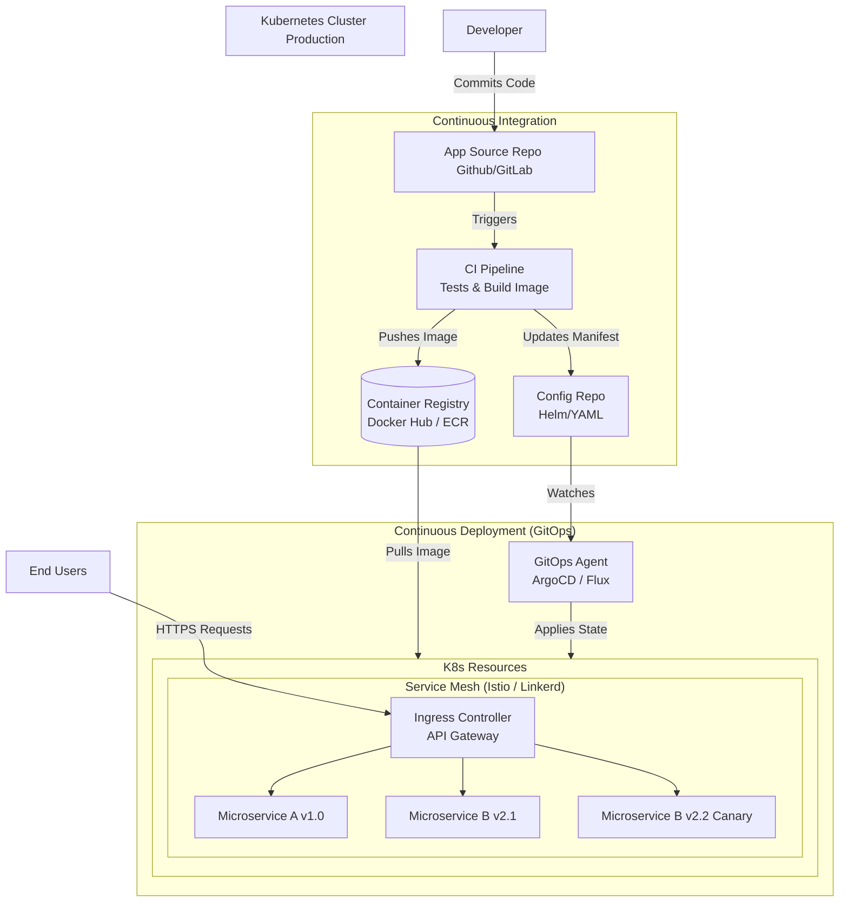
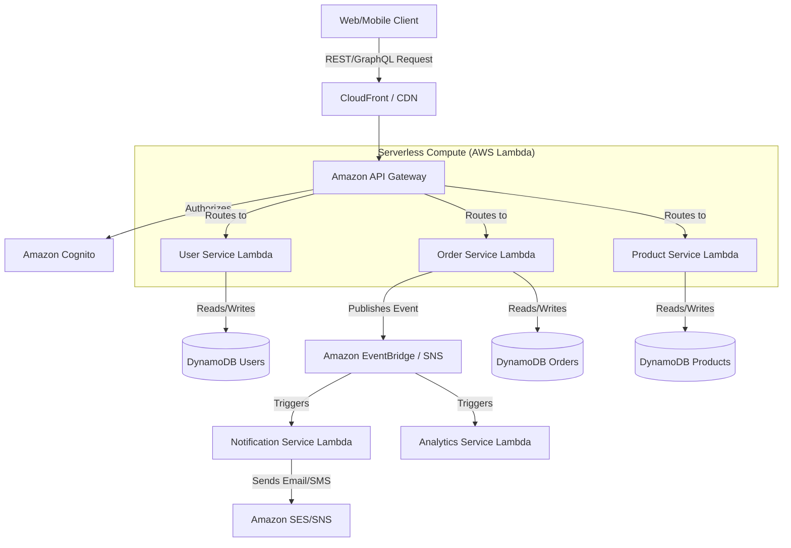

# Mastering Microservices Deployment: Strategies and Architecture

Managing the deployment of multiple microservices can be complex due to the distributed nature of the architecture. Below is a comprehensive guide on the best ways to manage microservices deployment, along with an architectural design.

## 1. Containerization (The Foundation)
The first step in modern microservices deployment is packaging your code into standardized units. 
- **Docker**: Package each microservice with its dependencies, runtime, and configuration into a lightweight container image. This ensures "it works on my machine" translates to all environments.
- **Container Registries**: Store these images in centralized registries (e.g., Docker Hub, AWS ECR, Google GCR, Azure ACR).

## 2. Container Orchestration (The Engine)
When you have dozens or hundreds of microservices, managing them manually is impossible. You need an orchestrator to handle scheduling, scaling, and self-healing.
- **Kubernetes (K8s)**: The de facto standard. It provides service discovery, load balancing, automated rollouts/rollbacks, and secret management.
- **Managed K8s Services**: Amazon EKS, Google GKE, and Azure AKS reduce the overhead of managing the Kubernetes control plane.
- **Alternatives**: Docker Swarm (simpler, less feature-rich) or Amazon ECS.

## 3. Automated CI/CD Pipelines (The Pipeline)
Manual deployments are risky and slow. Continuous Integration and Continuous Deployment are critical.
- **CI (Continuous Integration)**: Automates the building, testing, and linting of the code. Triggered on every commit/pull request (e.g., GitHub Actions, GitLab CI, Jenkins).
- **CD (Continuous Deployment)**: Automates the deployment of the generated container images to staging or production environments. 
- **Independent Pipelines**: Each microservice MUST have its own CI/CD pipeline and repository (or isolated monorepo paths) to allow independent deployments.

## 4. GitOps (The Modern Approach to CD)
GitOps treats your Git repository as the single source of truth for declarative infrastructure and applications.
- **Tools**: ArgoCD or Flux.
- **How it works**: Instead of your CI pushing changes to Kubernetes, a GitOps agent runs inside your cluster and watches a Git repository containing your environment definitions (YAML/Helm charts). When you update the Git repo, the agent pulls the changes and applies them, preventing configuration drift.

## 5. Deployment Strategies (Risk Mitigation)
How you roll out new versions matters to minimize downtime and risk.
- **Rolling Update**: Slowly replacing old instances with new ones. Built into Kubernetes.
- **Blue/Green Deployment**: Maintaining two identical environments. Deploy the new version to the idle environment, test it, and then switch the router traffic. Easy rollback, but requires double the resources.
- **Canary Release**: Routing a small percentage of user traffic (e.g., 5%) to the new version. If no errors occur, gradually increase the traffic.
- **A/B Testing**: Similar to Canary, but routing traffic based on specific user segments for business metrics testing.

## 6. Infrastructure as Code (IaC)
Provision your underlining infrastructure using code rather than manual clicks.
- **Tools**: Terraform, AWS CloudFormation, Pulumi.
- Defines exactly what your network, compute, and cluster resources should look like.

---

## Target Architecture Design

Below is an architectural diagram visualizing how these components interact in a robust microservices deployment pipeline using Kubernetes and GitOps.

## Key Architectural Components

> [!TIP]
> **Service Mesh:** As your microservices scale, use a Service Mesh (like Istio or Linkerd). It separates application logic from network logic, handling mTLS security, retries, and advanced routing (essential for Canary drops) without changing code.

> [!IMPORTANT]
> **Independent Databases:** Ensure each microservice has its own isolated database schema. Shared databases create tight coupling and defeat the purpose of independent microservices deployments.

> [!NOTE]
> **API Gateway:** An API gateway acts as the single entry point for all clients. It handles cross-cutting concerns like authentication, rate limiting, and SSL termination before routing to individual microservices.

## 7. Serverless Microservices Architecture (Alternative Approach)

Instead of managing container orchestrators like Kubernetes, you can offload server management entirely to cloud providers.

> [!TIP]
> **Event-Driven:** In serverless microservices, an event-driven pattern (like EventBridge) is heavily utilized. Services communicate asynchronously, leading to extreme scalability with near-zero idle compute costs.
