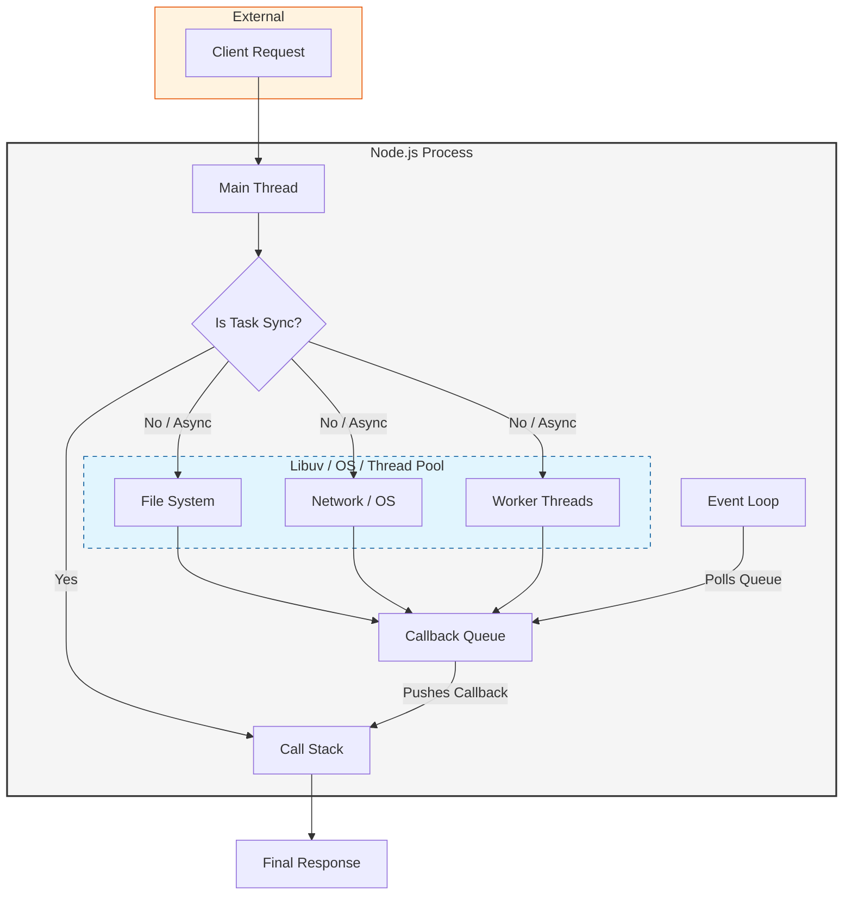
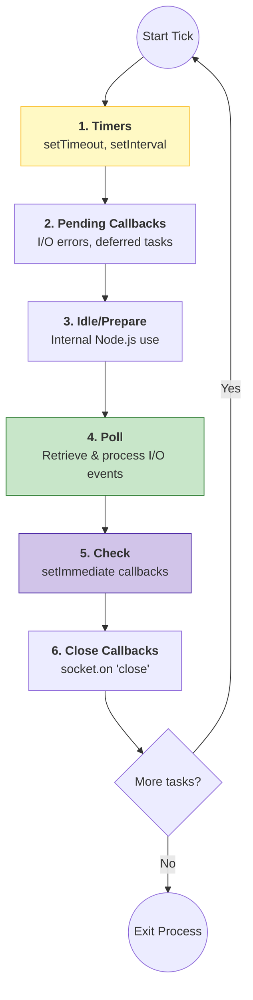

# Event Loop and Non-Blocking I/O in Node.js

Node.js is designed around a non-blocking, event-driven architecture. At the core of this design is the **event loop**, a mechanism that allows Node.js to perform non-blocking I/O operations, even though JavaScript itself is single-threaded.

---

## 🧠 How the Event Loop Works

Heart of Node.js and it handles all asynchronous operations.

### Step-by-Step Flow:

1. **Call Stack**: When a function is called, it’s pushed onto the call stack. JavaScript executes code in this stack synchronously.

2. **Web APIs / Node APIs**: Asynchronous operations like `setTimeout`, file I/O, or HTTP requests are offloaded to the Web APIs (in browsers) or libuv (in Node.js).

3. **Callback Queue**: Once those APIs complete their tasks, their corresponding callbacks are queued in the callback/task queue.

4. **Event Loop**: constantly checks if the call stack is empty. If it is, it dequeues a callback from the callback queue and pushes it onto the call stack for execution.

---

## 🔁 Phases of the Event Loop

1. **Timers Phase**: Executes callbacks scheduled by `setTimeout()` and `setInterval()`.

2. **Pending Callbacks**: Executes I/O callbacks deferred to the next loop iteration.

3. **Idle/Prepare**: Internal use only.

4. **Poll Phase**: Retrieves new I/O events and executes their callbacks.

5. **Check Phase**: Executes `setImmediate()` callbacks.

6. **Close Callbacks**: Executes close events like `socket.on('close', ...)`.

---

## 📦 Non-Blocking I/O Explained

Node.js uses the **libuv** library to handle asynchronous I/O in a thread pool. Operations such as disk access or network requests are passed off to libuv, which processes them in the background and returns the results via callbacks — allowing the main thread to remain unblocked.

### 🔄 Example:

```js
const fs = require("fs");

fs.readFile("file.txt", "utf8", (err, data) => {
  if (err) throw err;
  console.log(data);
});

console.log("Reading file...");
```

**Output Order:**

```
Reading file...
<File content displayed here>
```

This shows that the file read was initiated, and Node.js didn’t wait for it to complete before logging “Reading file...”.

---

# Node.js Flow Explained (Step-by-Step)

## 1. Client → Node.js Server

- A user (client) sends an HTTP request (e.g., API call, file read/write) to the Node.js Server.
- Node.js receives the request but does not process it immediately in a blocking way.

## 2. Event Loop Activation

- The core of Node.js is the **Event Loop**.
- The Event Loop checks if the task is:
  - **Synchronous**: Executes directly on the main thread.
  - **Asynchronous** (I/O, DB, etc.): Delegated to background systems.

## 3. Phases & Queues

- The Event Loop interacts with multiple queues:
  - **Timers Queue**: For `setTimeout` and `setInterval`.
  - **Pending I/O**: For file system or network operations.
  - **setImmediate Queue**: Tasks that should execute immediately after I/O.

## 4. Callbacks Registration

- Once the async operation is initiated (like a file read), Node.js registers a callback.
- These callbacks are stored and executed later once the operation is completed.

## 5. Worker Threads & libuv

- Node.js is single-threaded, but it uses **libuv**, which manages a thread pool for heavy async operations.
- Examples:
  - File I/O
  - DNS resolution
  - Compression/Encryption

## 6. Async Operation Completion

- Once an operation in the worker thread finishes, its result is pushed back to the appropriate queue.

## 7. Event Loop Executes Callback

- The Event Loop picks up callbacks from queues and pushes them to the call stack when it’s free.

## 8. Response Sent to Client

- Once execution is complete, the final response is returned to the client without blocking other requests.

---

## 📊 Visualizing the Node.js Architecture

This diagram shows how requests flow through Node.js, highlighting the separation between the synchronous Call Stack and asynchronous background operations.



## 🔄 The Event Loop Phases In Detail

The Event Loop moves through these specific phases in every "tick".



---

## 🚀 Easy-to-Memorize Flow (ASCII Style)

This box diagram summarizes the end-to-end execution flow in Node.js.

```text
┌───────────────────────────────────────────────┐
│              Client Request                   │
└───────────────────┬───────────────────────────┘
                    │
┌───────────────────▼───────────────────────────┐
│       Node.js Server (Main Thread)            │
│   (Synchronous tasks -> Execute on stack)     │
└───────────────────┬───────────────────────────┘
                    │
┌───────────────────▼───────────────────────────┐
│                Event Loop                     │
│    (Orchestrator for Async operations)        │
└───────────┬───────────────┬───────────┬───────┘
            │               │           │
┌───────────▼──────┐ ┌──────▼─────┐ ┌───▼───────┐
│   Timers Phase   │ │  Check /   │ │  Poll /   │
│ (setTimeout etc) │ │ Immediate  │ │ I/O Tasks │
└───────────┬──────┘ └──────┬─────┘ └───┬───────┘
            │               │           │
            └───────────┬───┴───────────┘
                        │
┌───────────────────────▼───────────────────────┐
│      Libuv Worker Threads (Background)        │
│        (Disk, DNS, Crypto, Network)           │
└───────────────────────┬───────────────────────┘
                        │
┌───────────────────────▼───────────────────────┐
│      Callback Queue (Task Completed)          │
└───────────────────────┬───────────────────────┘
                        │
┌───────────────────────▼───────────────────────┐
│           Event Loop Picks Up                 │
│        Callback -> Executed On Stack          │
└───────────────────────┬───────────────────────┘
                        │
┌───────────────────────▼───────────────────────┐
│              Response to Client               │
└───────────────────────────────────────────────┘
```


