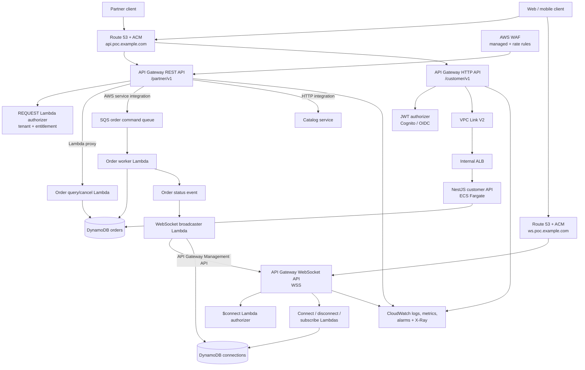
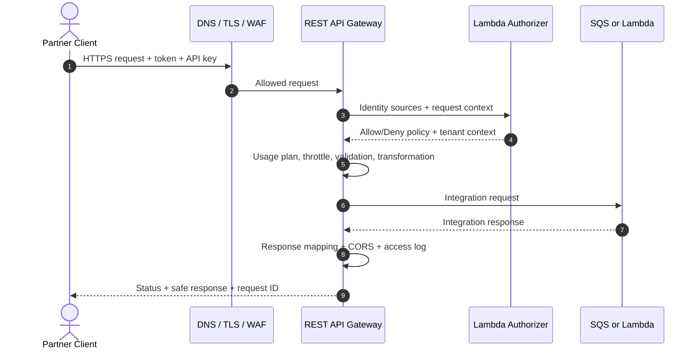
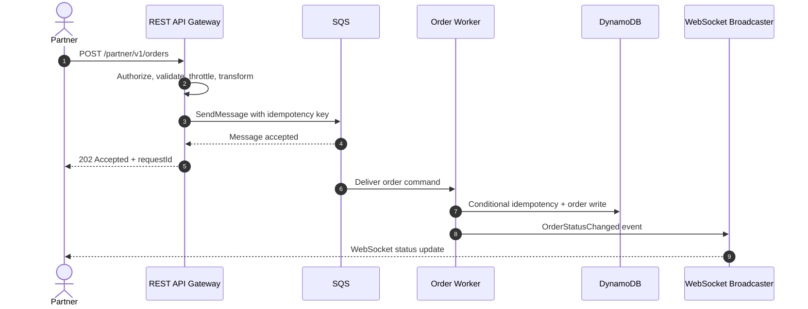
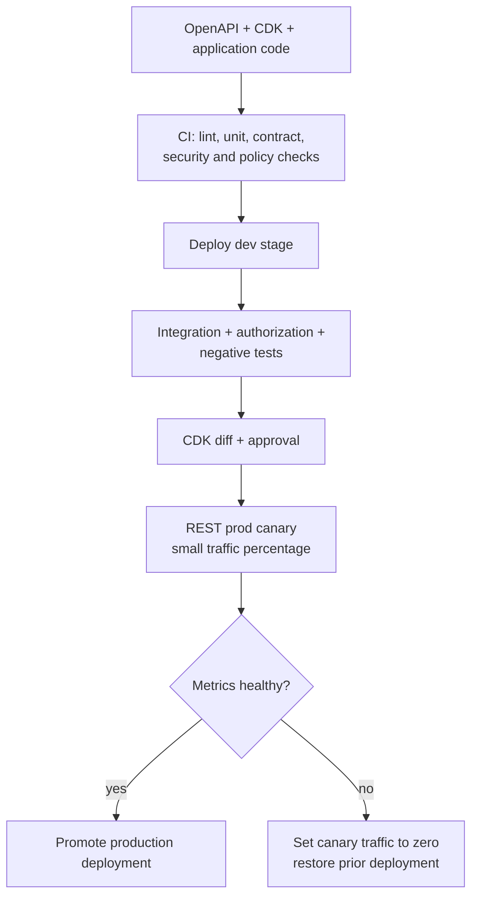
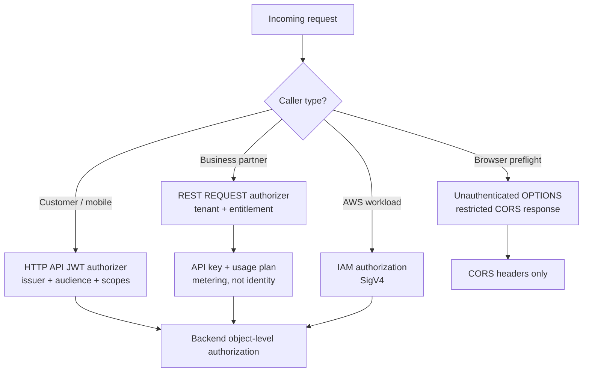
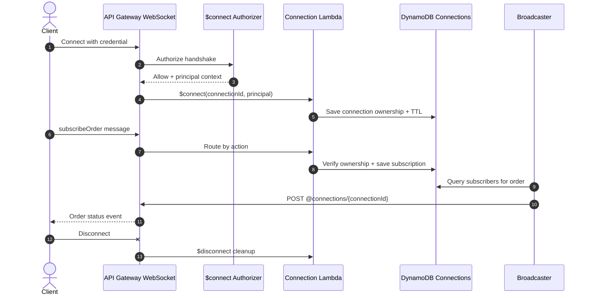
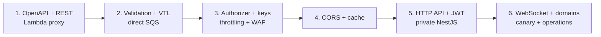

# AWS API Gateway End-to-End POC

## Secure Real-Time Order Management API Platform

> A hands-on project for learning Amazon API Gateway from API design and authorization through integrations, validation, transformation, throttling, caching, WebSockets, deployment, security, observability, and failure handling.

**Audience:** Senior developers, solution architects, and technical leads  
**Recommended implementation:** AWS CDK v2 with TypeScript, Node.js/TypeScript Lambda, NestJS on ECS Fargate, DynamoDB, SQS, and Amazon Cognito  
**POC duration:** 7–10 focused working days  
**Deployment:** Isolated AWS sandbox account  
**Last reviewed:** 31 August 2026

---

## 1. Executive Summary

Build a **Secure Real-Time Order Management API Platform** that exposes three API Gateway products as one coherent system:

1. A feature-rich **REST API** for business partners.
2. A lightweight **HTTP API** for customer and mobile clients.
3. A bidirectional **WebSocket API** for live order-status updates.

The partner REST API accepts asynchronous order submissions, validates requests, invokes a custom Lambda authorizer, meters clients with API keys and usage plans, applies throttling, transforms requests, and sends order commands directly to Amazon SQS through an AWS service integration. It also provides cached product-catalog reads and Lambda-backed order queries.

The customer HTTP API uses a native JWT authorizer and connects to a private NestJS service running on ECS Fargate through an API Gateway VPC Link and an internal Application Load Balancer.

The WebSocket API authenticates clients during `$connect`, stores connection ownership in DynamoDB, routes incoming messages by an `action` field, and sends asynchronous order-status updates through the API Gateway Management API.

This design demonstrates how API Gateway acts as a secure API façade while business processing remains in Lambda functions, queues, private services, and databases.

---

## 2. Why This POC Is Recommended

| API Gateway capability | How the project demonstrates it |
|---|---|
| REST APIs | Partner order submission, order lookup, catalog, cancellation |
| HTTP APIs | Customer/mobile routes with JWT authorization |
| WebSocket APIs | Real-time order updates and subscription management |
| API versioning | `/partner/v1`, `/customer/v1`, and explicit contract evolution |
| Lambda integration | Order query, cancellation, authorizer, WebSocket handlers |
| HTTP/private integration | VPC Link to a private ALB and NestJS/ECS service |
| AWS service integration | REST API sends a validated order command directly to SQS |
| Request validation | Required parameters and JSON-schema request models |
| Request/response transformation | Velocity Template Language and parameter mappings |
| Custom authorizer | Tenant and entitlement checks for partner routes |
| JWT authorizer | Cognito/OIDC access-token validation for HTTP API routes |
| IAM authorization | Machine-to-machine administrative endpoint |
| CORS | Browser-safe origin, method, header, and preflight configuration |
| Throttling | Account, stage, method, and per-client usage-plan controls |
| Caching | Safe REST API caching for read-only catalog data |
| API keys and usage plans | Partner identification for metering and plan-level throttling |
| Custom domains | Stable public names with API mappings and TLS certificates |
| Canary releases | Controlled REST API stage rollout |
| Observability | Access logs, execution logs, metrics, tracing, alarms, correlation IDs |

---

## 3. Alternative API Gateway Project Ideas

| Project | Main scenario | Best API Gateway lessons |
|---|---|---|
| **Secure Real-Time Order Platform — recommended** | Partner, customer, and real-time order APIs | Broadest coverage across REST, HTTP, and WebSocket |
| Multi-Tenant SaaS API Gateway | Tenant APIs with plan-based metering | Authorizers, API keys, usage plans, quotas, tenant isolation |
| Payment Webhook Ingestion Platform | Secure inbound provider webhooks | Validation, transformations, direct SQS integration, idempotency |
| IoT Device Control API | Commands plus live device state | IAM authorization, WebSocket, throttling, async workflows |
| Internal Microservice Gateway | Private ECS/EKS services behind one API | VPC Link, ALB/NLB, Cloud Map, JWT, private connectivity |
| AI Inference API | Synchronous and asynchronous model requests | Payload limits, timeout design, streaming trade-offs, throttling |

The remainder of this guide fully designs the recommended order platform.

---

## 4. Learning Objectives

After completing the POC, you should be able to explain and demonstrate:

1. When to choose REST, HTTP, or WebSocket APIs.
2. Regional, edge-optimized, and private endpoint trade-offs.
3. API resources, methods/routes, integrations, deployments, and stages.
4. Lambda proxy versus non-proxy integration.
5. Public HTTP versus private VPC Link integration.
6. Direct integration with an AWS service such as SQS.
7. JWT, Cognito, IAM, Lambda authorizer, resource policy, API key, and mTLS roles.
8. Why API keys are not an authentication mechanism.
9. Request validation at the gateway and business validation in the backend.
10. Request and response transformation.
11. CORS behavior for proxy and non-proxy integrations.
12. Throttling hierarchy and correct client retry behavior.
13. Safe cache keys, cache invalidation, and cache observability.
14. WebSocket connection lifecycle and backend callbacks.
15. URI versioning, stages, deployments, API mappings, and canaries.
16. Error normalization, logs, metrics, tracing, alarms, and runbooks.
17. Timeout, payload-size, concurrency, and quota design.
18. Infrastructure-as-code and contract-first API delivery.

---

## 5. Scope

### 5.1 POC scope

- Submit, query, list, and cancel synthetic orders.
- Retrieve a synthetic product catalog.
- Process order creation asynchronously through SQS.
- Push order-status changes to connected WebSocket clients.
- Implement REST, HTTP, and WebSocket APIs.
- Demonstrate Lambda proxy, private HTTP proxy, and AWS service integrations.
- Implement JWT, custom Lambda, and IAM authorization examples.
- Add request validation, transformations, CORS, throttling, usage plans, and caching.
- Configure custom domains and API mappings.
- Deploy through CDK with automated tests.
- Add access logs, metrics, tracing, dashboards, alarms, and security controls.

### 5.2 Out of scope

- Real payment-card processing.
- Production customer data.
- Full commerce UI.
- Production billing based solely on usage-plan quotas.
- Multi-region active/active APIs.
- Large-file transfer through API Gateway.
- Long-running synchronous business workflows.

Use fake customers, fake products, and synthetic tokens only.

---

## 6. Choosing the Correct API Type

### 6.1 Decision matrix

| Capability | REST API | HTTP API | WebSocket API |
|---|---:|---:|---:|
| Synchronous request/response | Yes | Yes | Message/route based |
| Bidirectional persistent connection | No | No | Yes |
| Regional endpoint | Yes | Yes | Yes |
| Edge-optimized endpoint | Yes | No | No |
| Private API endpoint | Yes | No | No |
| Lambda integration | Yes | Yes | Yes |
| Public HTTP integration | Yes | Yes | Yes |
| Private ALB/NLB integration | Yes | Yes | Through supported integration patterns |
| Native JWT authorizer | No | Yes | No |
| Lambda authorizer | Yes | Yes | Yes, applied at connection establishment |
| IAM authorization | Yes | Yes | Yes |
| API keys and usage plans | Yes | No | Supported for connection metering scenarios |
| REST request validation | Yes | No native equivalent | Route-specific backend validation |
| Request-body transformation | Yes | No | Integration templates where configured |
| Parameter mapping | Yes | Yes | Yes, integration-dependent |
| API Gateway response cache | Yes | No | No |
| Direct AWS WAF association | Yes | No | No |
| Canary deployment | Yes | No native equivalent | Stage/deployment strategy |
| Execution logs and X-Ray | Yes | More limited; use access/backend logs | Access and backend logs |

### 6.2 POC decisions

| API | Purpose | Reason |
|---|---|---|
| Partner REST API | External partner order API | Needs API keys, usage plans, request models, WAF, transformations, and caching |
| Customer HTTP API | Customer/mobile order view | Native JWT validation, simpler configuration, lower cost, low latency |
| Order WebSocket API | Live order status | Persistent two-way connection and backend-to-client callbacks |

Do not choose REST API automatically for every workload. Start with the required capabilities, security model, operational requirements, and cost profile.

---

## 7. High-Level Architecture

### 7.1 Complete architecture



### 7.2 Component responsibilities

| Component | Responsibility |
|---|---|
| Route 53 | DNS for stable API hostnames |
| ACM | TLS certificates for custom domains |
| AWS WAF | Managed protections and rate-based rules for the REST API |
| Partner REST API | Feature-rich partner contract and API-management controls |
| Customer HTTP API | JWT-protected lightweight customer routes |
| WebSocket API | Persistent connections and real-time client communication |
| Lambda authorizer | Custom tenant, subscription, and entitlement decision |
| Cognito/OIDC | Issues OAuth 2.0 access tokens for customer routes |
| API key and usage plan | Identifies partner client for metering and target throttling |
| SQS | Buffers asynchronous order commands and protects backend capacity |
| Order worker | Validates business rules, enforces idempotency, writes order state |
| VPC Link V2 | Private connectivity from API Gateway to VPC integration |
| Internal ALB | Routes private HTTP traffic to NestJS tasks |
| ECS Fargate | Hosts the private customer-facing NestJS service |
| DynamoDB orders | Order state and idempotency records |
| DynamoDB connections | WebSocket connection ownership and subscriptions |
| Broadcaster | Looks up authorized connections and posts status updates |
| CloudWatch/X-Ray | Access logs, execution visibility, metrics, traces, alarms |

---

## 8. API Route Catalog

### 8.1 Partner REST API

Base URL: `https://api.poc.example.com/partner/v1`

| Method and resource | Purpose | Authorization | Integration | Gateway feature |
|---|---|---|---|---|
| `POST /orders` | Submit an order asynchronously | Lambda authorizer + API key | Direct SQS AWS integration | Validation, VTL transformation, usage plan |
| `GET /orders/{orderId}` | Retrieve one order | Lambda authorizer + API key | Lambda proxy | Path validation, normalized errors |
| `GET /orders` | List partner orders | Lambda authorizer + API key | Lambda proxy | Pagination and query validation |
| `POST /orders/{orderId}/cancel` | Request cancellation | Lambda authorizer + API key | Lambda proxy | Idempotency and business authorization |
| `GET /catalog/{sku}` | Read public catalog item | Lambda authorizer or approved public policy | HTTP/private backend | REST cache and cache key |
| `POST /admin/replay` | Controlled POC operation | IAM/SigV4 only | Lambda proxy | Service-to-service authorization |
| `OPTIONS /{proxy+}` | Browser preflight | None | Mock integration | CORS |

### 8.2 Customer HTTP API

Base URL: `https://api.poc.example.com/customer/v1`

| Route | Purpose | Authorization | Integration |
|---|---|---|---|
| `GET /me/orders` | List signed-in customer's orders | JWT scope `orders:read` | Private NestJS through VPC Link |
| `GET /me/orders/{orderId}` | View owned order | JWT scope `orders:read` | Private NestJS through VPC Link |
| `POST /me/orders/{orderId}/cancel` | Cancel owned order | JWT scope `orders:write` | Private NestJS through VPC Link |
| `GET /health` | Shallow service status | None or restricted operational policy | Private ALB/ECS |

### 8.3 WebSocket API

Endpoint: `wss://ws.poc.example.com/v1`

Route selection expression: `$request.body.action`

| Route | Example message or trigger | Integration behavior |
|---|---|---|
| `$connect` | WebSocket handshake | Authenticate, derive tenant/customer, save connection |
| `$disconnect` | Connection closes | Delete connection record; handler must be idempotent |
| `$default` | Unknown/non-matching action | Return safe structured error |
| `subscribeOrder` | `{"action":"subscribeOrder","orderId":"ord-1001"}` | Verify ownership and save subscription |
| `unsubscribeOrder` | `{"action":"unsubscribeOrder","orderId":"ord-1001"}` | Remove subscription |
| `ping` | `{"action":"ping"}` | Return application heartbeat response |

---

## 9. Detailed Request Lifecycle

### 9.1 Partner REST request



### 9.2 Processing order submission



### 9.3 Why order creation is asynchronous

- It prevents the public request from waiting for a long business workflow.
- SQS absorbs traffic bursts and supports controlled worker concurrency.
- API Gateway returns `202 Accepted` after durable queue acceptance.
- The client uses `requestId`/`idempotencyKey` to query status.
- Failures after acceptance are visible through order state and operational queues.
- The API stays within synchronous integration timeouts.

---

## 10. API Design Standards

### 10.1 Resource design

- Use nouns for resources: `/orders`, `/catalog`, `/customers`.
- Use HTTP methods for operations rather than verbs in URLs.
- Use action subresources only for business transitions that do not map cleanly to CRUD, such as `/orders/{id}/cancel`.
- Return `202 Accepted` for accepted asynchronous commands.
- Return `201 Created` only when the resource has actually been created synchronously.
- Use `404` without revealing cross-tenant resource existence.
- Use `409 Conflict` for an invalid state transition or idempotency conflict.
- Use `422 Unprocessable Content` for syntactically valid but semantically invalid input if that convention is adopted consistently.
- Use opaque order identifiers; never expose database partition design.

### 10.2 Pagination

```http
GET /partner/v1/orders?limit=25&cursor=eyJwayI6Ii4uLiJ9
```

Response:

```json
{
  "items": [],
  "page": {
    "limit": 25,
    "nextCursor": "eyJwayI6Ii4uLiJ9"
  }
}
```

- Prefer opaque cursor pagination over page-number pagination for DynamoDB.
- Validate `limit` and cap it server-side.
- Bind the cursor cryptographically or validate that it belongs to the caller/tenant.
- Never expose raw internal keys without integrity protection.

### 10.3 Standard error contract

```json
{
  "error": {
    "code": "ORDER_VALIDATION_FAILED",
    "message": "The order request is invalid.",
    "details": [
      {
        "field": "items[0].quantity",
        "reason": "must be greater than zero"
      }
    ],
    "requestId": "apigw-request-id",
    "timestamp": "2026-08-31T12:00:00Z"
  }
}
```

Never return stack traces, IAM details, authorizer internals, SQL/DynamoDB expressions, or sensitive tokens.

### 10.4 Idempotency

Require `Idempotency-Key` on command endpoints such as `POST /orders`.

1. Scope the key to partner/tenant and operation.
2. Persist a hash of the canonical request with the key.
3. Repeated same key + same body returns the original accepted/result response.
4. Repeated same key + different body returns `409 Conflict`.
5. Apply a documented retention period.
6. Do not use API Gateway request ID as the only client idempotency key; a retry creates a new gateway request ID.

---

## 11. Versioning, Stages, and Custom Domains

### 11.1 Recommended versioning model

Use explicit URI major versions for public contracts:

```text
https://api.poc.example.com/partner/v1/orders
https://api.poc.example.com/partner/v2/orders
https://api.poc.example.com/customer/v1/me/orders
```

Use stages for environments, not as the only public contract version:

```text
dev, test, prod
```

The custom domain hides stage names from customers. API mappings connect paths to the correct API and stage.

### 11.2 Versioning rules

- Make backward-compatible additive changes within a major version.
- Create `v2` for breaking request, response, security, or semantic changes.
- Run v1 and v2 in parallel during migration.
- Publish an OpenAPI document for each supported major version.
- Document deprecation and sunset dates.
- Use response headers such as `Deprecation`, `Sunset`, and a documentation link when appropriate.
- Track usage by version before retirement.

### 11.3 Deployment model



For REST APIs, changes to resources, methods, integrations, authorizers, and policies must be deployed to a stage before callers receive them. Avoid manual console configuration that is absent from infrastructure as code.

---

## 12. Integration Types

### 12.1 Integration decision table

| Integration | Use when | POC route | Key concern |
|---|---|---|---|
| Lambda proxy | Backend owns request/response logic | `GET /orders/{id}` | Validate Lambda response shape; control cold starts and timeout |
| Lambda non-proxy | Gateway must transform input/output | Optional legacy adapter exercise | More VTL and dual contract surfaces |
| HTTP proxy | Existing public/private HTTP service owns contract | Catalog or NestJS API | Backend availability, TLS, timeout, connection path |
| Private integration | Backend must remain inside VPC | HTTP API → VPC Link → ALB → ECS | Security groups, stage-prefix mapping, health checks |
| AWS service | Remove simple adapter Lambda | `POST /orders` → SQS `SendMessage` | IAM role, escaping, transformations, response mapping |
| Mock | Respond without backend | REST `OPTIONS` or health fixture | Static behavior only |

### 12.2 Lambda proxy integration

API Gateway passes a standardized event containing request context, path, query strings, headers, body, and authorizer context. The Lambda must return a correctly shaped response.

```json
{
  "statusCode": 200,
  "headers": {
    "content-type": "application/json",
    "access-control-allow-origin": "https://portal.poc.example.com"
  },
  "body": "{\"orderId\":\"ord-1001\",\"status\":\"PROCESSING\"}"
}
```

Use a shared adapter to enforce error formatting, correlation IDs, security headers, and JSON serialization.

### 12.3 Direct SQS AWS service integration

The REST API method uses an IAM role that can call `sqs:SendMessage` only on the order command queue.

Conceptual request mapping:

```vtl
#set($tenantId = $util.escapeJavaScript($context.authorizer.tenantId))
#set($key = $util.escapeJavaScript($input.params('Idempotency-Key')))
#set($order = $input.json('$'))
Action=SendMessage&MessageBody=$util.urlEncode("{\"requestId\":\"$context.requestId\",\"tenantId\":\"$tenantId\",\"idempotencyKey\":\"$key\",\"submittedAt\":$context.requestTimeEpoch,\"order\":$order}")
```

Configure the integration request content type required by the SQS API, safely escape values, and map a successful SQS response to:

```json
{
  "requestId": "$context.requestId",
  "status": "ACCEPTED"
}
```

with HTTP `202`.

The mapping template is part of the security boundary. Test quote characters, Unicode, newlines, nested JSON, maximum allowed input, and injection-like strings.

### 12.4 Private HTTP integration

Flow:

```text
HTTP API → VPC Link V2 → internal ALB listener → ECS target group → NestJS
```

Architecture requirements:

- VPC Link, ALB/Cloud Map integration, and private resources must satisfy current ownership and regional constraints.
- Use security groups that allow only the intended path.
- Configure ALB health checks independently of deep database checks.
- Use TLS to the private integration when required and configure server-name verification correctly.
- HTTP private integrations can include the API stage in the backend path; overwrite the path to `$request.path` when the backend should not receive it.
- Pass a trusted caller/tenant context in controlled headers; remove or overwrite client-supplied versions of those headers.
- The backend must still enforce object ownership and business authorization.

### 12.5 Integration timeout strategy

- Keep synchronous handlers short.
- Set Lambda timeout slightly above the API integration timeout only when intentional; otherwise avoid compute continuing after the client has timed out.
- Move long work to SQS, Step Functions, or another asynchronous workflow.
- Return `202` and expose a status resource.
- Review current API-type and regional timeout quotas before selecting values.
- Never increase a timeout as the first response to an inefficient backend.

---

## 13. Authorization and Authentication Architecture

### 13.1 Security decision flow



### 13.2 Lambda REQUEST authorizer

The partner authorizer can use multiple identity sources, such as an authorization header and partner/tenant header.

Responsibilities:

- Validate token format, signature, issuer, audience, expiry, and intended use.
- Resolve tenant and partner application.
- Verify route entitlement.
- Return least-privilege allow/deny policy or simple response for the API type.
- Add small, non-sensitive context fields such as `tenantId`, `partnerId`, and plan.
- Fail closed on timeout, dependency error, or malformed credentials.
- Emit safe audit logs without tokens.

Example policy response for a REST API:

```json
{
  "principalId": "partner-app-42",
  "policyDocument": {
    "Version": "2012-10-17",
    "Statement": [
      {
        "Action": "execute-api:Invoke",
        "Effect": "Allow",
        "Resource": "arn:aws:execute-api:REGION:ACCOUNT:API_ID/prod/POST/orders"
      }
    ]
  },
  "context": {
    "tenantId": "tenant-100",
    "partnerId": "partner-app-42",
    "plan": "gold"
  }
}
```

### 13.3 Authorizer caching pitfalls

- Cache only when the identity sources form a safe cache key.
- Include every value that can change the decision, such as tenant and token identity.
- Ensure a cached policy applies correctly to every method it might cover.
- Avoid returning a policy so narrow that a cached allow for one method causes an unintended deny for other permitted routes.
- Avoid wildcard policies that grant more routes than the principal needs.
- Keep TTL consistent with revocation and entitlement-change requirements.
- Test cross-tenant and cross-method cache behavior explicitly.

### 13.4 HTTP API JWT authorizer

Configure:

- Trusted issuer.
- Intended audience/client IDs.
- Route scopes such as `orders:read` and `orders:write`.
- Access tokens rather than ID tokens for API authorization.
- Key-rotation overlap appropriate for the identity provider.

API Gateway validates the signature and standard claims and passes trusted claims to the integration. The NestJS service must still validate resource ownership: a valid `orders:read` token does not automatically authorize access to every order.

### 13.5 IAM authorization

Use `AWS_IAM` for AWS workload-to-API calls:

- Caller signs the request with Signature Version 4.
- IAM policy grants `execute-api:Invoke` only on required stage/method/resource ARNs.
- Use short-lived role credentials, not long-lived access keys.
- Combine identity policy with a REST API resource policy when cross-account restrictions are required.

### 13.6 API keys and usage plans

Use API keys for:

- Partner-client identification for metering.
- Associating a client with a usage plan.
- Per-client target throttle and quota configuration.

Do **not** use API keys as the only authentication or authorization control. API keys can appear in headers and logs, usage-plan limits are best effort, and possession of a key is not a trustworthy user identity.

---

## 14. Request Validation

### 14.1 Gateway validation

For `POST /orders`, configure a REST API request validator to verify:

- Required `Idempotency-Key` header exists and is nonblank.
- Required `Content-Type` is supported.
- Request body conforms to the configured JSON schema/model.
- Required path and query parameters exist.

Example request model:

```json
{
  "$schema": "http://json-schema.org/draft-04/schema#",
  "title": "CreateOrderRequest",
  "type": "object",
  "required": ["customerReference", "currency", "items"],
  "properties": {
    "customerReference": {
      "type": "string",
      "minLength": 1,
      "maxLength": 100
    },
    "currency": {
      "type": "string",
      "enum": ["USD", "EUR", "INR"]
    },
    "items": {
      "type": "array",
      "minItems": 1,
      "maxItems": 50,
      "items": {
        "type": "object",
        "required": ["sku", "quantity"],
        "properties": {
          "sku": { "type": "string", "minLength": 1, "maxLength": 64 },
          "quantity": { "type": "integer", "minimum": 1, "maximum": 100 }
        },
        "additionalProperties": false
      }
    }
  },
  "additionalProperties": false
}
```

### 14.2 Gateway validation is not enough

REST API parameter validation checks required parameters primarily for presence/nonblank values, while model validation handles the matching request payload. The backend must still validate:

- Tenant and object ownership.
- Product existence and current price.
- Business limits.
- Allowed state transitions.
- Idempotency semantics.
- Cross-field rules.
- Data freshness and concurrency.

For HTTP and WebSocket APIs, perform contract validation in the backend and maintain the same contract tests used for the REST API.

---

## 15. Request and Response Transformation

### 15.1 When transformation is appropriate

- Adapt a stable public contract to an existing backend format.
- Add trusted gateway context such as request ID or authorized tenant ID.
- Remove untrusted client headers before the integration.
- Convert an API request into an AWS service action.
- Normalize a non-proxy backend response.

### 15.2 When not to use transformation

- Complex business logic.
- Database lookups.
- Large templates that are hard to test.
- Security decisions better handled by an authorizer or backend.
- Transformations that hide an unstable, undocumented contract.

### 15.3 Trusted header pattern

For a private HTTP integration:

- Remove any client-supplied `x-tenant-id` or `x-principal-id`.
- Overwrite them using trusted authorizer claims/context.
- Pass the API Gateway request ID.
- Treat only overwritten gateway-generated headers as trusted in the backend.
- Prevent direct public access to the private backend.

### 15.4 Transformation testing

Keep fixtures for:

- Normal payload.
- Empty and missing fields.
- Quotes, backslashes, Unicode, and newlines.
- Nested arrays and objects.
- Maximum permitted body.
- Wrong content type.
- Injection-like strings.
- Backend 2xx, 4xx, 5xx, timeout, and malformed responses.

---

## 16. CORS Design

CORS is a browser enforcement mechanism, not authentication or authorization.

### 16.1 Allowed POC origin

```text
https://portal.poc.example.com
```

Recommended policy:

```text
Allowed origins: https://portal.poc.example.com
Allowed methods: GET, POST, OPTIONS
Allowed headers: Authorization, Content-Type, Idempotency-Key, X-Api-Key
Exposed headers: X-Request-Id
Credentials: only when required; never combine credentials with wildcard origin
Preflight max age: short and explicit during the POC
```

### 16.2 REST API CORS

- Add an `OPTIONS` method, commonly with a mock integration, for non-proxy resources.
- Configure `Access-Control-Allow-*` headers on preflight responses.
- For Lambda proxy integration, the Lambda response must include the required CORS headers.
- Configure gateway-generated 4xx/5xx responses to include safe CORS headers; otherwise browsers may hide the real error.
- Do not require the application authorizer on preflight.

### 16.3 HTTP API CORS

When CORS is configured on an HTTP API, API Gateway can automatically answer preflight requests and add configured CORS headers to integration responses. API Gateway uses its configured CORS headers rather than backend-provided CORS headers. If a `$default` route has an authorizer, ensure unauthenticated `OPTIONS` requests are routed correctly.

### 16.4 CORS tests

| Scenario | Expected result |
|---|---|
| Allowed origin preflight | Correct allow headers |
| Unapproved origin | No usable CORS permission |
| Allowed origin but unauthorized API call | 401/403 with safe CORS headers |
| Disallowed method | Preflight rejected/not allowed |
| Credentials with wildcard origin | Configuration test fails |
| Direct non-browser request | Authorization still enforced independently of CORS |

---

## 17. Throttling, Quotas, and Backpressure

API Gateway throttling uses a token-bucket model. Limits are targets and clients can receive `429 Too Many Requests` when rate or burst capacity is exceeded.

### 17.1 Throttling layers

| Layer | Scope | POC purpose |
|---|---|---|
| AWS service/regional limits | Service boundary | Protects platform capacity |
| Account per Region | All APIs in account/Region | Shared account capacity |
| Stage/method | Specific deployed API behavior | Protect expensive routes |
| Usage plan/client | API-key client | Partner plan targets |
| WAF rate-based rule | Matching source/criteria | Abuse reduction before integration |
| Backend concurrency | Lambda reserved concurrency, ECS capacity, SQS worker count | Protects downstream dependencies |

### 17.2 Example POC targets

| Route | Rate target | Burst target | Reason |
|---|---:|---:|---|
| `POST /orders` | 20 RPS per partner | 40 | Queue-backed write path |
| `GET /orders/{id}` | 50 RPS per partner | 100 | Read path |
| `GET /catalog/{sku}` | 100 RPS | 200 | Cached safe read |
| Admin operations | 1 RPS | 2 | High-risk operational action |

These values are illustrative, not production recommendations.

### 17.3 Correct client behavior

- Honor `429` responses.
- Retry only safe/idempotent operations.
- Use exponential backoff with jitter.
- Apply a maximum retry count and total retry budget.
- Reuse the same `Idempotency-Key` when retrying an order submission.
- Do not immediately retry in a tight loop.

### 17.4 Important limitation

Usage-plan throttling and quotas are best effort rather than guaranteed hard ceilings. Do not rely on them alone for authentication, strict financial controls, or absolute cost containment. Use budgets, alarms, WAF, backend safeguards, and business-level enforcement.

---

## 18. REST API Caching

Enable API Gateway caching only on the safe catalog read exercise:

```text
GET /partner/v1/catalog/{sku}?locale=en-US
```

### 18.1 Cache design

| Setting | POC value |
|---|---|
| Stage | `dev` initially; enable briefly for test |
| Method | `GET /catalog/{sku}` only |
| Cache key | `sku` path parameter + normalized `locale` query parameter |
| TTL | 60 seconds |
| Encryption | Enable if cached content is sensitive; catalog should be non-sensitive |
| Client invalidation | Deny by default; use controlled operator process |

### 18.2 Cache safety rules

- Never cache tenant-specific data without a proven tenant-aware cache key.
- Avoid caching authorization-dependent responses unless every security dimension is included safely.
- Never cache tokens or secrets.
- Cache only idempotent reads unless a thoroughly justified exception exists.
- Understand that changing cache capacity recreates the cache and removes cached data.
- Monitor `CacheHitCount`, `CacheMissCount`, latency, 4xx, and 5xx.
- Treat caching as best effort.
- Load test using realistic hit and miss distributions before sizing.

### 18.3 Cache experiment

1. Call one catalog SKU and record integration latency.
2. Repeat it and confirm cache-hit metrics increase.
3. Change `locale` and verify a separate cache entry.
4. Update the catalog source and observe TTL behavior.
5. Flush the stage cache and observe the temporary increase in backend calls.
6. Disable/delete the cache after the experiment to avoid hourly cost.

---

## 19. WebSocket Architecture

### 19.1 Connection lifecycle



### 19.2 Connection record

```json
{
  "pk": "CONNECTION#abc123",
  "connectionId": "abc123",
  "principalId": "customer-55",
  "tenantId": "tenant-100",
  "connectedAt": "2026-08-31T12:00:00Z",
  "expiresAtEpoch": 1788177600,
  "subscriptions": ["ORDER#ord-1001"]
}
```

For scalable access patterns, use separate subscription items or a secondary index rather than an unbounded array.

### 19.3 WebSocket security and reliability

- Authorize at `$connect`; connection establishment protects later routes.
- Record principal and tenant ownership with the connection.
- Reauthorize resource ownership when subscribing to an order.
- Validate every message schema and maximum application message size.
- Rate-limit messages per connection in application logic where necessary.
- Use TTL as cleanup assistance, not immediate deletion.
- Treat `$disconnect` as best effort and idempotent.
- When the Management API reports a stale/gone connection, delete its record.
- Never broadcast one tenant's order to another tenant's connection.
- Use a separate WebSocket custom domain from the REST/HTTP domain where required by API mapping restrictions.
- Design clients to reconnect because connections have finite lifetime and idle behavior.

---

## 20. Security Architecture

### 20.1 Layered controls

| Layer | Controls |
|---|---|
| DNS and TLS | Route 53 aliases, ACM-managed certificate, modern TLS policy |
| Network/edge | Regional endpoint, WAF for REST API, restrictive resource policy where applicable |
| Authentication | JWT, Lambda authorizer, or IAM depending on caller |
| Client metering | API key and usage plan for partner REST API |
| Input | Size limits, request model, required parameters, backend schema/business validation |
| Gateway | Route-specific authorization, throttling, CORS, trusted header overwrite |
| Integration | Least-privilege invoke role/resource policy, VPC Link, private ALB |
| Backend | Object-level authorization, tenant-scoped database access, idempotency |
| Data | DynamoDB encryption, TTL, backups as needed, no real PII in POC |
| Secrets | Secrets Manager/SSM for backend secrets; never stage variables or source code for secrets |
| Operations | Structured redacted logs, CloudTrail, alarms, deployment approvals |

### 20.2 Least-privilege examples

| Principal | Required permission |
|---|---|
| API Gateway order method role | `sqs:SendMessage` only on the order command queue |
| API Gateway | Invoke only named Lambda functions/authorizer through resource policies or roles |
| Order query Lambda | Read only required order-table indexes/items |
| Order worker Lambda | Receive/delete from named queue and update required table |
| WebSocket broadcaster | `execute-api:ManageConnections` only on the correct WebSocket API/stage |
| NestJS task role | Tenant-scoped application operations against required resources |
| CI/CD role | Deploy only approved stack/environment resources |
| Operator role | Narrow replay/cache/diagnostic permissions with auditing |

### 20.3 Threat model

| Threat | Control and test |
|---|---|
| Stolen API key | Key is not auth; token/authorizer still required; rotate and monitor |
| Cross-tenant order access | Authorizer tenant context + backend object ownership check |
| Token replay | Short-lived access token, TLS, correct audience/scope, anomaly monitoring |
| Request flood | WAF, gateway throttles, usage plans, SQS, reserved concurrency |
| Payload attack | Body-size policy, JSON schema, backend validation, safe parsers |
| Header spoofing | Gateway overwrites trusted internal identity headers |
| CORS misconfiguration | Explicit origin allowlist; no wildcard with credentials |
| Cache data leak | Cache only public catalog; tenant-aware key if ever expanded |
| Authorizer cache leak | Include all identity dimensions; cross-tenant negative tests |
| Direct backend access | Internal ALB, security groups, no public ECS address |
| Sensitive logs | Redaction, access-log field allowlist, no auth/API key/body logging |
| WebSocket subscription theft | Verify order ownership before saving subscription |
| Excessive admin capability | IAM-protected route, approvals, CloudTrail, safe limits |

### 20.4 mTLS optional exercise

For a controlled partner-to-partner scenario, configure mutual TLS on a custom domain and validate client certificate trust. Treat mTLS as strong client-channel authentication, not a replacement for tenant authorization and application identity. Plan certificate issuance, rotation, revocation, truststore versioning, and failure monitoring before production use.

---

## 21. Observability

### 21.1 Access-log fields

Use structured JSON and include:

```text
requestId, extendedRequestId where available, requestTime,
domainName, stage, route/method, resourcePath, status,
responseLength, responseLatency, integrationLatency,
sourceIp, userAgent, principalId, tenantId,
authorizerLatency, integrationStatus, errorType
```

Do not log authorization tokens, API key values, session cookies, sensitive request bodies, or full personal data.

### 21.2 Metrics

| Layer | Metrics/signals |
|---|---|
| REST API | Count, 4XXError, 5XXError, Latency, IntegrationLatency, CacheHitCount, CacheMissCount |
| HTTP API | Count, 4xx, 5xx, latency, integration latency, access-log outcomes |
| WebSocket | Connection count, connect errors, message count, integration errors, stale connections |
| Authorizer | Invocation, error, duration, timeout, cache behavior |
| Lambda | Errors, throttles, duration, concurrency, iterator/event age where relevant |
| SQS | Visible messages, oldest message age, in-flight messages, DLQ depth |
| ECS/ALB | Healthy tasks/targets, response time, 4xx/5xx, CPU, memory, task restarts |
| DynamoDB | Throttled requests, latency, conditional-check failures, consumed capacity |
| Business | Orders accepted, processed, rejected, duplicate-suppressed, status-update delivery |

### 21.3 Alarms

| Alarm | Example POC threshold | Action |
|---|---|---|
| API 5xx | Any sustained nonzero period | Inspect gateway/integration errors |
| Elevated 4xx | Rate above expected baseline | Check clients, auth, validation, abuse |
| Latency | p95 or average above route SLO | Compare total vs integration latency |
| Authorizer error/timeout | Any sustained error | Fail-closed impact investigation |
| SQS age | Oldest message > 120 seconds | Check worker/concurrency/dependency |
| Worker DLQ | Visible messages > 0 | Diagnose poison/business failure |
| ALB unhealthy targets | Healthy count below desired | Inspect ECS deployment/health check |
| WebSocket push failures | Failure rate above threshold | Remove stale connections and inspect IAM |
| WAF blocked spike | Abnormal increase | Review rule and source pattern |

### 21.4 Correlation

- Return an `X-Request-Id` header to callers.
- Pass `$context.requestId` to integrations.
- Preserve a client correlation ID only after length/format validation; do not trust it as unique.
- Add `traceId`, `requestId`, `tenantId`, and `orderId` to backend structured logs.
- Use X-Ray for supported REST API and backend paths; use application/OpenTelemetry traces where API-type support differs.

### 21.5 Access logs versus execution logs

- Access logs: one summarized record per request; enable for every stage.
- REST execution logs: useful for gateway/integration diagnosis but can expose request data; use controlled levels and avoid sensitive-data tracing.
- Backend logs: business and dependency detail.
- CloudTrail: control-plane changes such as deployments, authorizers, domain mappings, and policies—not normal data-plane API access logs.

---

## 22. Reliability and Failure Handling

### 22.1 Failure table

| Failure | Client response | Platform behavior | Investigation |
|---|---|---|---|
| WAF block | `403` | Integration not invoked | WAF logs/rule |
| Invalid/missing token | `401` or `403` | Authorizer/JWT denies | Authorizer and access logs |
| Invalid request model | `400` | Backend not invoked | Validation log and request fixture |
| Throttled request | `429` | Client retries with backoff | Throttle metrics and limits |
| Malformed Lambda proxy response | `502` | Gateway cannot form response | Lambda logs and contract test |
| Backend HTTP failure | Mapped 5xx/appropriate response | Request completes/fails synchronously | ALB/ECS and integration logs |
| Integration timeout | `504` typically | Client no longer waits; backend may still require attention | Latency and timeout configuration |
| SQS service integration failure | Mapped 5xx | Order not accepted; same idempotency key can be retried | API execution/access logs |
| SQS worker failure | Initial API already returned `202` | Queue retry then DLQ | Queue age, worker logs, DLQ |
| WebSocket stale connection | No delivery to that connection | Delete stale record | Broadcaster logs/metric |

### 22.2 Retry policy

| Operation | Client retry? | Requirement |
|---|---|---|
| `GET` | Yes | Backoff, jitter, bounded attempts |
| `POST /orders` | Yes | Same `Idempotency-Key` and identical body |
| Cancellation command | Yes if designed idempotently | Stable request ID/key and state-safe handler |
| Validation/auth failure | No blind retry | Fix request or credentials |
| `429` | Yes | Exponential backoff with jitter |
| `5xx`/network error | Conditional | Bounded retry and idempotency |

### 22.3 Async status model

After `POST /orders` returns `202`, expose:

```http
GET /partner/v1/orders/requests/{requestId}
```

Possible states:

```text
ACCEPTED → PROCESSING → COMPLETED
                    └→ REJECTED
                    └→ FAILED
```

Do not promise completion merely because the gateway successfully placed a command on SQS.

---

## 23. OpenAPI and Contract-First Design

Maintain OpenAPI as the public API source of truth and use API Gateway extensions for integrations, authorizers, validators, and gateway responses.

Illustrative fragment:

```yaml
openapi: 3.0.1
info:
  title: Partner Order API
  version: 1.0.0
paths:
  /orders:
    post:
      operationId: submitOrder
      security:
        - partnerAuthorizer: []
          partnerApiKey: []
      parameters:
        - name: Idempotency-Key
          in: header
          required: true
          schema:
            type: string
            minLength: 8
            maxLength: 128
      requestBody:
        required: true
        content:
          application/json:
            schema:
              $ref: '#/components/schemas/CreateOrderRequest'
      responses:
        '202':
          description: Accepted for asynchronous processing
        '400':
          $ref: '#/components/responses/BadRequest'
        '401':
          $ref: '#/components/responses/Unauthorized'
        '429':
          $ref: '#/components/responses/TooManyRequests'
components:
  securitySchemes:
    partnerAuthorizer:
      type: apiKey
      name: Authorization
      in: header
      x-amazon-apigateway-authtype: custom
    partnerApiKey:
      type: apiKey
      name: x-api-key
      in: header
```

Keep provider-specific integration extensions in a controlled overlay if the organization wants the business contract to remain portable.

### Contract pipeline

1. Lint OpenAPI.
2. Detect breaking changes.
3. Validate examples against schemas.
4. Generate typed client/server models where appropriate.
5. Run mapping-template fixtures.
6. Deploy ephemeral/test stage.
7. Run positive and negative contract tests.
8. Publish versioned documentation only after production promotion.

---

## 24. Infrastructure as Code and Repository Structure

### 24.1 Recommended stack

| Layer | Choice | Reason |
|---|---|---|
| IaC | AWS CDK v2, TypeScript | Reusable constructs and alignment with Node/NestJS |
| Contract | OpenAPI 3.x | Reviewable, testable public API definition |
| Functions | Node.js/TypeScript Lambda | Fast POC iteration and shared types |
| Container service | NestJS on ECS Fargate | Demonstrates private HTTP integration |
| Queue | SQS Standard + DLQ | Async buffering and failure isolation |
| Data | DynamoDB | Order/idempotency/connection access patterns |
| Identity | Cognito User Pool for POC | OAuth/OIDC/JWT exercise |
| Tests | Vitest/Jest, Pact or schema tests, Postman/Newman/k6 | Unit, contract, integration, performance |

### 24.2 Suggested repository

```text
api-gateway-order-poc/
├── README.md
├── package.json
├── cdk.json
├── docs/
│   ├── architecture.md
│   ├── api-design-standards.md
│   ├── security-threat-model.md
│   ├── operations-runbook.md
│   └── demo-script.md
├── openapi/
│   ├── partner-v1.yaml
│   ├── customer-v1.yaml
│   └── examples/
├── mapping-templates/
│   ├── order-to-sqs.vtl
│   ├── sqs-accepted-response.vtl
│   └── errors/
├── infra/
│   ├── app.ts
│   ├── stacks/
│   │   ├── edge-domain-stack.ts
│   │   ├── partner-rest-api-stack.ts
│   │   ├── customer-http-api-stack.ts
│   │   ├── websocket-api-stack.ts
│   │   ├── backend-stack.ts
│   │   └── observability-stack.ts
│   └── constructs/
│       ├── monitored-rest-api.ts
│       ├── lambda-integration.ts
│       └── secure-queue.ts
├── src/
│   ├── authorizer/
│   ├── order-query/
│   ├── order-worker/
│   ├── websocket-connect/
│   ├── websocket-disconnect/
│   ├── websocket-subscribe/
│   ├── websocket-broadcaster/
│   ├── customer-api-nestjs/
│   └── shared/
│       ├── errors/
│       ├── logging/
│       ├── validation/
│       └── idempotency/
├── test/
│   ├── unit/
│   ├── contract/
│   ├── integration/
│   ├── authorization/
│   ├── cors/
│   └── performance/
└── scripts/
    ├── create-test-token.ts
    ├── submit-order.ts
    ├── websocket-client.ts
    └── cleanup-test-data.ts
```

### 24.3 Resource naming and tags

```text
apigw-order-poc-partner-rest
apigw-order-poc-customer-http
apigw-order-poc-realtime-ws
apigw-order-poc-order-command-queue
apigw-order-poc-order-command-dlq
apigw-order-poc-orders
apigw-order-poc-connections
```

Tag supported resources with `Project=ApiGatewayOrderPOC`, `Environment`, `Owner`, `DataClassification`, and `ExpiresOn`.

---

## 25. Progressive Implementation Plan

### Phase 0 — Foundation and contract

**Build**

- CDK application and environment configuration.
- Partner REST API with `GET /health` mock or Lambda integration.
- OpenAPI linting and standard error model.
- Structured access log group.

**Learn**

- Resource, method, integration, deployment, and stage concepts.

**Exit criteria**

- API is reproducible from IaC.
- Access logs contain request ID, status, latency, route, and no secrets.

### Phase 1 — Lambda proxy REST API

**Build**

- DynamoDB orders table.
- `GET /orders/{orderId}` Lambda proxy integration.
- `POST /orders/{orderId}/cancel` idempotent Lambda integration.
- Standard backend response/error adapter.

**Learn**

- Proxy payload and response contracts, permissions, errors, latency.

**Exit criteria**

- Valid response, not-found response, malformed Lambda response, and timeout cases are demonstrated.

### Phase 2 — Validation, transformation, and direct SQS

**Build**

- `POST /orders` request model and validator.
- Required `Idempotency-Key`.
- VTL mapping template.
- Direct SQS `SendMessage` integration and `202` response mapping.
- Order worker, idempotency record, order write, and worker DLQ.

**Learn**

- Non-proxy transformations, AWS service integration, async API design.

**Exit criteria**

- Invalid payload does not reach SQS.
- Valid request returns `202` and is processed exactly once at the business-effect level.

### Phase 3 — Authorization and API management

**Build**

- REQUEST Lambda authorizer.
- Tenant/partner context propagation.
- API key and bronze/gold usage plans.
- Stage/method throttling.
- IAM-only admin route.
- WAF rules for the REST API.

**Learn**

- Authentication versus authorization versus metering.
- Authorizer caching and least-privilege policies.

**Exit criteria**

- Missing/invalid token is denied.
- Valid token with wrong tenant cannot read the order.
- API key alone cannot access the API.
- Throttle experiment returns controlled `429` responses.

### Phase 4 — CORS and caching

**Build**

- Explicit browser-origin allowlist.
- REST preflight and gateway error CORS headers.
- Cache `GET /catalog/{sku}` using safe cache keys.

**Learn**

- Browser preflight, proxy response headers, cache hits/misses, invalidation.

**Exit criteria**

- Approved browser origin succeeds.
- Unapproved origin is not granted CORS access.
- Cache metrics prove separate `sku` and `locale` entries.

### Phase 5 — HTTP API and private NestJS integration

**Build**

- Customer HTTP API.
- Cognito/OIDC JWT authorizer and route scopes.
- VPC Link V2, internal ALB, ECS Fargate NestJS service.
- Parameter mapping that removes the stage prefix and overwrites trusted headers.

**Learn**

- HTTP versus REST API features and private integration design.

**Exit criteria**

- Valid access token and ownership can read order.
- Wrong scope or ownership is denied.
- Backend has no public network endpoint.

### Phase 6 — WebSocket real-time status

**Build**

- WebSocket API and routes.
- `$connect` authorizer.
- Connection and subscription table.
- Broadcaster with `ManageConnections` permission.
- Stale-connection cleanup.

**Learn**

- Route selection, connection lifecycle, backend callbacks, reconnect behavior.

**Exit criteria**

- Authorized client subscribes to its order and receives status.
- Cross-customer subscription is denied.
- Stale connection is safely removed.

### Phase 7 — Domains, versioning, and deployment safety

**Build**

- ACM certificates and Route 53 aliases.
- REST/HTTP API mappings under one regional HTTPS domain.
- Separate WebSocket domain.
- Dev/test/prod stages.
- REST canary deployment and rollback.

**Learn**

- Deployment versus stage, version mapping, safe rollout.

**Exit criteria**

- `/partner/v1` and `/customer/v1` resolve to correct API/stage.
- Canary can be promoted or rolled back based on metrics.

### Phase 8 — Operations and hardening

**Build**

- Dashboard, alarms, tracing, runbooks, failure injection.
- IAM review, security tests, dependency and IaC scanning.
- Controlled load test and cleanup script.

**Exit criteria**

- Every injected failure is visible and actionable.
- Unauthorized actions fail.
- Cleanup accounts for cache, domains, VPC Link, ENIs, log groups, queues, tables, certificates, and DNS records.

---

## 26. Test Plan

### 26.1 Functional tests

| ID | Scenario | Expected result |
|---|---|---|
| F01 | Submit valid partner order | `202`, SQS message, order eventually created |
| F02 | Query owned order | `200` with correct tenant data |
| F03 | Cancel processing order | Accepted/success according to contract |
| F04 | Cancel already shipped order | `409` state conflict |
| F05 | Read catalog twice | Second request produces cache hit |
| F06 | Customer reads owned order with correct scope | `200` through private NestJS integration |
| F07 | WebSocket subscribes to owned order | Status update received |
| F08 | Unknown WebSocket action | Safe `$default` error |

### 26.2 Validation and contract tests

| ID | Scenario | Expected result |
|---|---|---|
| V01 | Missing `Idempotency-Key` | `400`; integration not invoked |
| V02 | Empty items | `400`; integration not invoked |
| V03 | Quantity is string | `400` schema failure |
| V04 | Unsupported content type | Explicit `415`/configured rejection behavior |
| V05 | Malformed Lambda proxy response | `502`, alarm/log evidence |
| V06 | Backend returns unexpected error | Normalized safe error |
| V07 | Breaking OpenAPI change | CI compatibility check fails |
| V08 | VTL payload includes quotes/Unicode | Correct safe SQS message |

### 26.3 Authorization tests

| ID | Scenario | Expected result |
|---|---|---|
| A01 | No partner token | `401`/`403` according to gateway path |
| A02 | Valid API key but invalid token | Denied; key alone is insufficient |
| A03 | Valid token, wrong tenant order | `404` or policy-consistent denial |
| A04 | Customer token missing `orders:write` | Cancel route denied |
| A05 | JWT wrong audience | Denied |
| A06 | IAM caller lacks exact route ARN | Denied |
| A07 | Authorizer dependency fails | Fail closed |
| A08 | Cached authorizer decision used across tenant identity | Negative test proves no leakage |
| A09 | WebSocket subscribes to another customer's order | Denied and audited |

### 26.4 CORS tests

| ID | Scenario | Expected result |
|---|---|---|
| C01 | Allowed origin preflight | Correct origin/method/header response |
| C02 | Unknown origin | No CORS grant |
| C03 | Unauthorized API response from allowed origin | Visible 401/403 with safe CORS headers |
| C04 | OPTIONS requires authorizer | Test fails; preflight must be reachable |
| C05 | Wildcard origin with credentials | Configuration/security test fails |

### 26.5 Reliability and performance tests

| ID | Scenario | Expected result |
|---|---|---|
| R01 | Same order request retried with same key/body | One business effect; consistent response/status |
| R02 | Same key with changed body | `409` |
| R03 | Exceed method throttle | Controlled `429`; no backend overload |
| R04 | Order worker fails | SQS retry then worker DLQ |
| R05 | NestJS target unhealthy | 5xx/timeout visible in gateway and ALB metrics |
| R06 | Lambda times out | Gateway timeout/error visible; no hidden success |
| R07 | WebSocket connection is stale | Push detects it and removes record |
| R08 | Cache flush during traffic | Backend increase is observable and remains safe |
| R09 | Load test with realistic cache distribution | Error/latency remain within POC targets |
| R10 | REST canary has elevated 5xx | Rollback procedure succeeds |

### 26.6 Security tests

| ID | Scenario | Expected result |
|---|---|---|
| S01 | Attempt direct access to internal ALB/ECS | Not publicly reachable |
| S02 | Client sends spoofed `x-tenant-id` | Gateway overwrites/removes it |
| S03 | Oversized request | Rejected before unsafe backend processing |
| S04 | Token/API key appears in proposed log | Log policy test fails/redacts it |
| S05 | WAF test pattern | Blocked and logged |
| S06 | Order integration role attempts another queue | Access denied |
| S07 | Broadcaster targets another WebSocket API | Access denied |
| S08 | Unapproved origin calls API outside browser | Authorization still enforced |

---

## 27. Demo Script

### 15-minute stakeholder demonstration

1. **Architecture:** Explain REST, HTTP, and WebSocket boundaries.
2. **Validation:** Submit an invalid order and show that SQS was not invoked.
3. **Direct AWS integration:** Submit a valid order, receive `202`, and show the transformed SQS command.
4. **Authorization:** Prove API key alone is insufficient, then use valid partner credentials.
5. **Tenant isolation:** Attempt to read another tenant's order and show denial.
6. **Usage plan and throttling:** Generate a short controlled burst and show `429` plus metrics.
7. **Caching:** Read a catalog item twice and show cache hit/miss metrics.
8. **HTTP private integration:** Call the JWT-protected customer route and show traffic reaching private NestJS/ECS.
9. **WebSocket:** Connect, subscribe, submit an order, and receive status changes.
10. **Failure:** Inject worker/backend failure and show SQS DLQ or gateway alarm.
11. **Canary:** Route a small percentage to a new REST deployment and show rollback.
12. **Operations:** Close with dashboard, redacted logs, IAM boundaries, and cleanup.

### Messages to emphasize

- API Gateway is a façade and policy enforcement point, not the business domain.
- API keys meter clients; they do not authenticate users.
- Gateway validation rejects obvious bad input; the backend owns business validation.
- Async `202 + status resource` is preferable to holding long synchronous requests.
- CORS is a browser policy, not API security.
- Authorizer caching and API caching can both create security problems if cache keys omit identity dimensions.
- Private integration protects network exposure, but the backend must still authorize objects.

---

## 28. Architecture Decisions to Record

Create ADRs for:

1. REST API for partner features versus HTTP API for customer simplicity.
2. Regional endpoints and custom domains.
3. URI major versioning and environment stages.
4. Lambda REQUEST authorizer for partner entitlement.
5. Native JWT authorizer for customer routes.
6. API keys only for metering/usage plans.
7. Direct SQS integration for asynchronous order submission.
8. VPC Link V2 and internal ALB for private NestJS.
9. Safe caching only for public catalog data.
10. Explicit origin allowlist and preflight behavior.
11. WebSocket connection/subscription storage model.
12. Standard error and correlation contract.
13. Idempotency-key scope and retention.
14. Canary deployment and rollback thresholds.
15. Logging redaction and data-retention policy.

---

## 29. Common Mistakes This POC Should Expose

- Choosing REST API when HTTP API already meets the requirements—or choosing HTTP API and later discovering a required REST-only feature.
- Treating an API key as authentication.
- Assuming usage-plan quotas are hard cost or security limits.
- Putting authentication on CORS preflight requests.
- Allowing `*` origin with credentials.
- Returning CORS headers only on successful responses.
- Trusting a client-supplied tenant header.
- Performing authorization only at the gateway and skipping object ownership in the backend.
- Caching tenant/user responses without an identity-aware cache key.
- Returning a method-specific authorizer policy that breaks when cached—or an overbroad wildcard policy that leaks access.
- Logging tokens, API keys, cookies, request bodies, or authorizer payloads.
- Using VTL for complex business logic.
- Failing to escape transformed input safely.
- Ignoring malformed Lambda proxy response behavior.
- Keeping long-running work synchronous until the integration times out.
- Retrying non-idempotent commands without an idempotency key.
- Exposing a public load balancer behind a supposedly private integration.
- Assuming `$disconnect` always runs immediately and cleans every WebSocket record.
- Forgetting WebSocket Management API permissions or stale-connection cleanup.
- Editing the console without updating IaC/OpenAPI.
- Updating a REST API but forgetting to deploy the change to a stage.
- Confusing API contract version (`v1`) with environment stage (`prod`).
- Leaving a paid API cache, NAT/VPC resources, domains, or log groups after the POC.

---

## 30. Cost and Cleanup

### Main cost drivers

- REST, HTTP, and WebSocket requests/messages and connection minutes.
- Lambda invocations and duration.
- API Gateway REST cache cluster charged by provisioned time.
- ECS Fargate tasks and internal ALB.
- VPC Link-related architecture and network traffic.
- CloudWatch logs, metrics, dashboards, and alarms.
- WAF web ACL/rules and requests.
- DynamoDB, SQS, data transfer, Route 53, and optional NAT Gateway.

### Cost-control practices

- Use one sandbox environment.
- Use small Fargate task sizes and desired count for the POC.
- Avoid a NAT Gateway if the design can use VPC endpoints/appropriate public AWS service access safely.
- Enable the API cache only for the focused experiment and remove it afterward.
- Use short log retention.
- Cap performance-test requests and duration.
- Set a budget and billing alarm.
- Tag every resource with an expiry date.

### Cleanup checklist

- [ ] API Gateway APIs, stages, deployments, authorizers, API keys, and usage plans
- [ ] Custom domains and API mappings
- [ ] Route 53 records and ACM certificates when no longer needed
- [ ] WAF web ACL associations/rules
- [ ] REST cache cluster
- [ ] VPC Link and related ENIs/resources
- [ ] ALB, target group, ECS service/tasks, ECR images if dedicated
- [ ] Lambda functions, versions, permissions, and log groups
- [ ] SQS queues and DLQs
- [ ] DynamoDB tables and backups/PITR if enabled
- [ ] Cognito user pool/domain/app clients
- [ ] Dashboards, alarms, traces, and test data
- [ ] IAM roles and policies created for the POC

---

## 31. Definition of Done

- [ ] REST, HTTP, and WebSocket APIs are provisioned through CDK.
- [ ] OpenAPI contracts and examples are versioned.
- [ ] Partner order submission uses validation, VTL, and direct SQS integration.
- [ ] Lambda proxy read/cancel routes return standardized responses.
- [ ] Lambda authorizer enforces partner tenant/entitlement rules.
- [ ] API key and usage plan are used only for metering/throttling.
- [ ] HTTP API validates JWT issuer, audience, expiry, and route scopes.
- [ ] Private NestJS service is reachable only through intended private integration paths.
- [ ] IAM-protected machine route is demonstrated.
- [ ] CORS succeeds only for the approved origin and works for gateway errors.
- [ ] REST caching is demonstrated with safe cache keys and hit/miss metrics.
- [ ] Throttling and correct `429` retry behavior are demonstrated.
- [ ] Every command route is idempotent.
- [ ] WebSocket authentication, subscription authorization, push, reconnect, and stale cleanup work.
- [ ] Custom domains and API mappings hide environment stage names.
- [ ] Canary deployment and rollback are demonstrated.
- [ ] Logs contain correlation data but no secrets.
- [ ] Dashboard and alarms detect injected failures.
- [ ] Security, contract, CORS, reliability, and controlled load tests pass.
- [ ] Cleanup process removes or accounts for every billable resource.

---

## 32. Recommended Build Order



For a short client demo, complete steps 1–4. For deep architect-level understanding, complete all six.

---

## 33. Current AWS Notes Used in This Design

- REST APIs provide more API-management features, while HTTP APIs are a lower-cost, minimal-feature option. REST APIs are the documented choice when features such as API keys, per-client throttling, request validation, direct WAF integration, private API endpoints, caching, custom gateway responses, or canary releases are required.
- HTTP APIs support native JWT authorizers, Lambda authorizers, IAM authorization, public/private HTTP integrations, Lambda, and AWS service integrations.
- REST API request validation can verify required parameters for presence/nonblank values and validate a request body against a configured model schema; business validation remains a backend responsibility.
- REST APIs support Lambda, HTTP, AWS service, private, and mock integrations, with proxy and non-proxy behavior.
- HTTP private integrations use VPC Link V2 and can connect to ALB, NLB, or supported Cloud Map services. Private integration paths can include the stage name unless parameter mapping overwrites the request path.
- REST API usage-plan throttling and quotas are best effort, and AWS advises against using API keys for authentication or authorization.
- API Gateway uses token-bucket throttling; clients can receive `429` and should use bounded backoff with jitter.
- API Gateway response caching is available for REST APIs, not HTTP APIs. It is best effort, charged by provisioned cache time, and supports method/cache-key configuration.
- HTTP API CORS configuration can automatically answer preflight requests and add configured response headers; configured gateway CORS headers take precedence over backend CORS headers.
- WebSocket APIs use `$connect`, `$disconnect`, `$default`, and custom routes selected from message content. Backends can send data through route responses or the `@connections` management API.
- API mappings can map REST and HTTP API stages under a regional custom domain. WebSocket APIs have custom-domain mapping restrictions and should use a separate domain in this POC.
- REST and HTTP API payload and integration-timeout quotas differ. Review the current regional and API-specific quota pages before production design or load testing.

---

## 34. Official AWS References

- [Choose between REST APIs and HTTP APIs](https://docs.aws.amazon.com/apigateway/latest/developerguide/http-api-vs-rest.html)
- [Develop REST APIs in API Gateway](https://docs.aws.amazon.com/apigateway/latest/developerguide/rest-api-develop.html)
- [Integrations for REST APIs](https://docs.aws.amazon.com/apigateway/latest/developerguide/how-to-integration-settings.html)
- [Request validation for REST APIs](https://docs.aws.amazon.com/apigateway/latest/developerguide/api-gateway-method-request-validation.html)
- [Use Lambda authorizers](https://docs.aws.amazon.com/apigateway/latest/developerguide/apigateway-use-lambda-authorizer.html)
- [JWT authorizers for HTTP APIs](https://docs.aws.amazon.com/apigateway/latest/developerguide/http-api-jwt-authorizer.html)
- [Usage plans and API keys](https://docs.aws.amazon.com/apigateway/latest/developerguide/api-gateway-api-usage-plans.html)
- [Throttle REST API requests](https://docs.aws.amazon.com/apigateway/latest/developerguide/api-gateway-request-throttling.html)
- [REST API caching](https://docs.aws.amazon.com/apigateway/latest/developerguide/api-gateway-caching.html)
- [Configure CORS for HTTP APIs](https://docs.aws.amazon.com/apigateway/latest/developerguide/http-api-cors.html)
- [CORS for REST APIs](https://docs.aws.amazon.com/apigateway/latest/developerguide/how-to-cors.html)
- [Private integrations for HTTP APIs](https://docs.aws.amazon.com/apigateway/latest/developerguide/http-api-develop-integrations-private.html)
- [Overview of WebSocket APIs](https://docs.aws.amazon.com/apigateway/latest/developerguide/apigateway-websocket-api-overview.html)
- [Create WebSocket routes](https://docs.aws.amazon.com/apigateway/latest/developerguide/websocket-api-develop-routes.html)
- [Deploy REST APIs](https://docs.aws.amazon.com/apigateway/latest/developerguide/how-to-deploy-api.html)
- [Map stages to a custom domain](https://docs.aws.amazon.com/apigateway/latest/developerguide/http-api-mappings.html)
- [REST API quotas](https://docs.aws.amazon.com/apigateway/latest/developerguide/api-gateway-execution-service-limits-table.html)
- [HTTP API quotas](https://docs.aws.amazon.com/apigateway/latest/developerguide/http-api-quotas.html)

---

## 35. Final Recommendation

Implement the POC in two milestones:

1. **Demonstration milestone:** Partner REST API, Lambda proxy integration, request validation, direct SQS integration, custom authorizer, API key/usage plan, throttling, CORS, and safe catalog caching.
2. **Architect milestone:** HTTP API with JWT and private NestJS integration, WebSocket real-time updates, custom domains, versioning, canary rollout, WAF, threat-model tests, dashboards, alarms, and controlled failure/load testing.

This sequence produces a valuable demo quickly while preserving the advanced lessons needed to design production API Gateway platforms.
