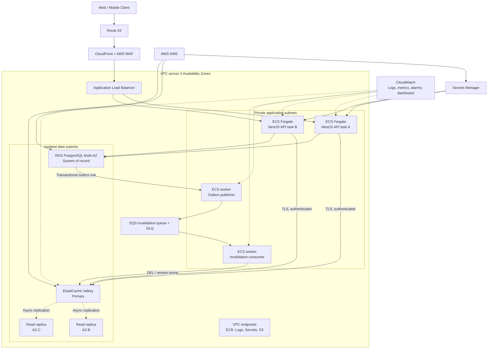
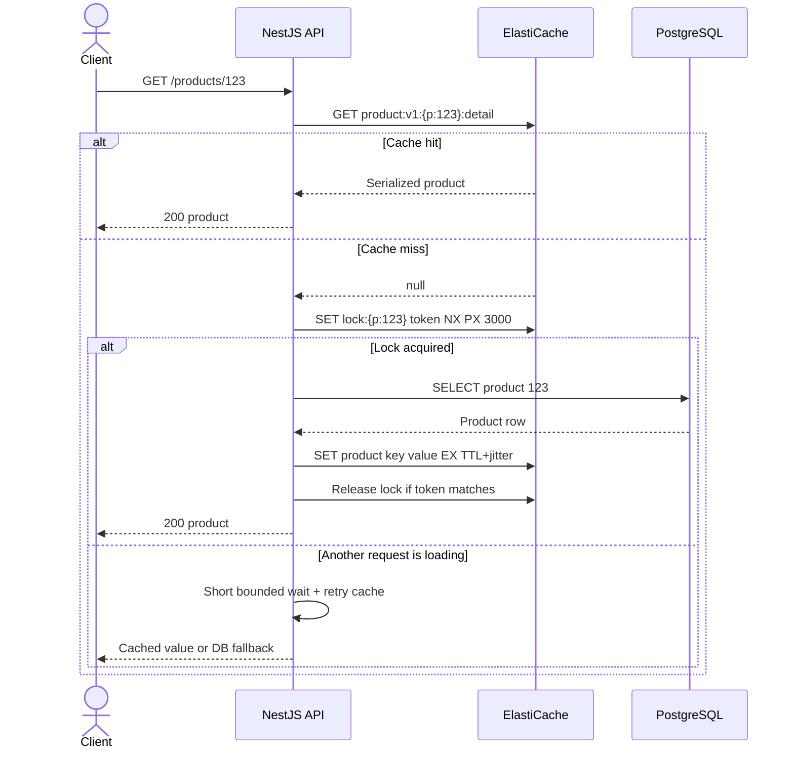
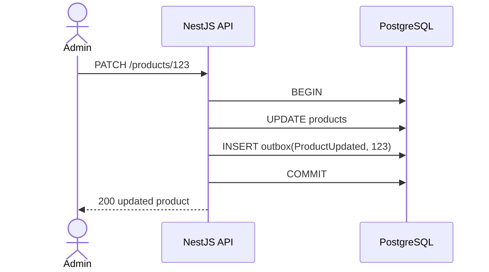
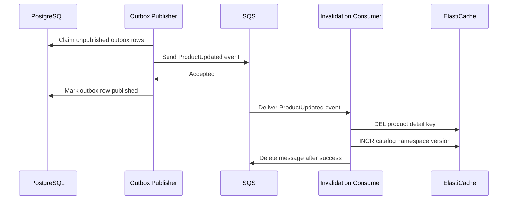
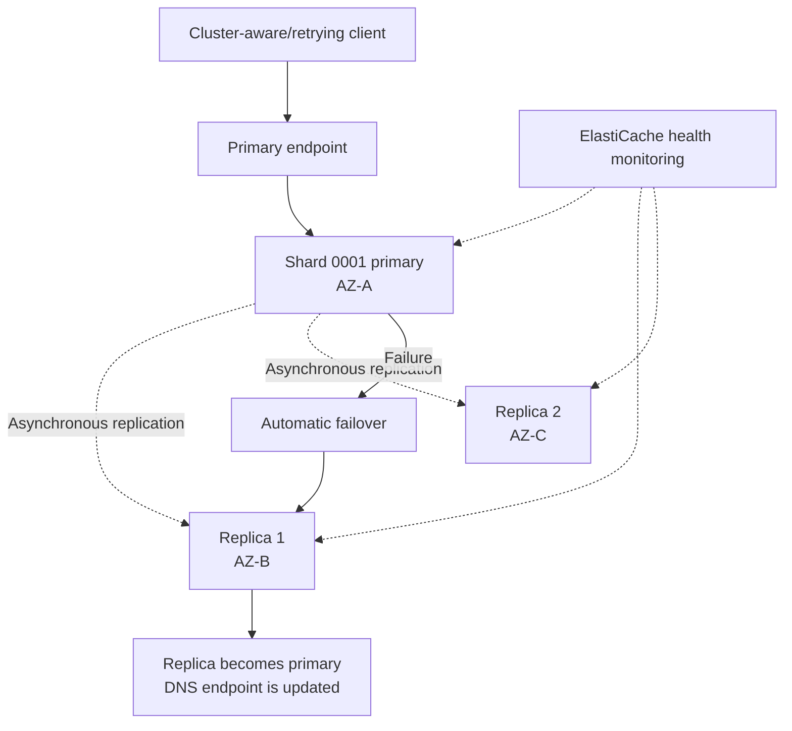

# Amazon ElastiCache — End-to-End POC and Architecture Guide

> **Project:** High-Performance E-commerce Catalog, Session, and Analytics Platform
>
> **Primary stack:** NestJS, Amazon ECS Fargate, Amazon RDS for PostgreSQL, Amazon ElastiCache for Valkey, Amazon SQS, Amazon CloudWatch
>
> **Audience:** Senior developers and architects
>
> **Last reviewed:** 31 August 2026

---

## 1. Executive Summary

This POC builds an e-commerce API whose product reads, user sessions, rate limits, and real-time popularity rankings use Amazon ElastiCache. PostgreSQL remains the system of record; the cache improves latency and absorbs repetitive database traffic.

The POC is intentionally divided into three stages:

1. **Local learning:** NestJS + PostgreSQL + a Redis-compatible local container.
2. **AWS high-availability cache:** Node-based ElastiCache for Valkey, cluster mode disabled, one primary and two replicas across Availability Zones.
3. **Scaling experiment:** A separate cluster-mode-enabled cache with multiple shards and cluster-aware clients.

This sequence exposes the mechanics of cache-aside, TTLs, invalidation, eviction, replication, failover, backups, connection management, and sharding. ElastiCache Serverless is evaluated afterward, once these concepts are understood.

### Current engine terminology

Amazon ElastiCache currently supports **Valkey, Redis OSS, and Memcached**. Valkey is the recommended Redis-compatible engine for this POC. The application uses standard Redis-compatible commands, making the concepts transferable to Redis OSS. See the [AWS engine comparison](https://docs.aws.amazon.com/AmazonElastiCache/latest/dg/SelectEngine.html).

---

## 2. Learning Outcomes

After completing the POC, you should be able to:

- Explain where ElastiCache fits between an application and its system of record.
- Select Valkey/Redis OSS or Memcached for a workload.
- Select Serverless or node-based deployment.
- Implement cache-aside, write invalidation, write-through, TTL, negative caching, and cache warming.
- Design keys, TTLs, serialization, memory budgets, and eviction policies.
- Use strings, hashes, sets, sorted sets, counters, and atomic operations.
- Explain cluster mode disabled versus enabled.
- Configure Multi-AZ replication, automatic failover, encryption, authentication, backups, and monitoring.
- Prevent cache stampedes, penetration, hot keys, stale reads, and connection storms.
- Test cache failure without making the application fail.
- Use measurements rather than assumptions to decide whether caching is valuable.

---

## 3. Core ElastiCache Concepts

### 3.1 What ElastiCache is—and is not

ElastiCache is a managed, in-memory data service. It is appropriate for frequently accessed or short-lived data that benefits from very low latency.

It is **not automatically a replacement for a durable database**. In this project:

- PostgreSQL owns products, prices, inventory, customers, and orders.
- ElastiCache stores derived, reconstructable, or deliberately temporary data.
- Losing query-cache data must affect performance, not correctness.
- Session requirements are handled separately because eviction can log users out.

### 3.2 Engine selection

| Capability | Valkey / Redis OSS | Memcached |
|---|---|---|
| Data model | Strings plus hashes, lists, sets, sorted sets, streams, counters, and more | Simple key/object cache |
| High availability | Replication and automatic failover | No native node replication for node-based clusters |
| Persistence features | Snapshots; additional durability options depend on engine/version | Serverless backup support; no node-based backup/restore |
| Partitioning | Cluster mode | Client-side distribution across nodes |
| Atomic workflows | Rich commands, transactions, scripts/functions | Limited |
| Pub/Sub | Yes | No |
| Multi-threaded engine | Engine/version dependent; traditional command execution is largely single-threaded | Yes |
| Best fit | Sessions, counters, ranking, rate limiting, structured cache, HA | Simple disposable object cache at high throughput |

**POC decision:** Use **ElastiCache for Valkey** because the project needs sessions, counters, sorted sets, replication, automatic failover, and cluster-mode learning.

**Memcached experiment:** Repeat only the product-detail cache test with Memcached. Compare simplicity, multi-threaded throughput, node distribution, and behavior when a node is removed.

### 3.3 Deployment model selection

| Decision | Serverless | Node-based |
|---|---|---|
| Capacity | Automatically scales within configured usage limits | Choose node type, shard count, and replica count |
| Operations | Less capacity planning | More topology and tuning control |
| Learning value | Fastest way to start | Best way to observe shards, replicas, failover, and node metrics |
| Workload fit | Uncertain, variable, or spiky workloads | Predictable workloads or explicit topology requirements |
| POC use | Phase 4 comparison | Primary learning environment |

Serverless caches are encrypted at rest and expose security group, subnet, snapshot, and usage-limit controls. Review the [ElastiCache Serverless API model](https://docs.aws.amazon.com/AmazonElastiCache/latest/APIReference/API_ServerlessCache.html) and [serverless scaling guidance](https://docs.aws.amazon.com/AmazonElastiCache/latest/dg/Scaling-serverless.html) before selecting production capacity limits.

### 3.4 Cluster mode decision

| Item | Cluster mode disabled | Cluster mode enabled |
|---|---|---|
| Shards | One | Multiple |
| Write scaling | Scale the primary vertically | Scale horizontally by adding shards |
| Read scaling | Add replicas | Add replicas per shard |
| Client | Standard Redis-compatible client | Cluster-aware client required |
| Multi-key commands | Straightforward | Keys must share a hash slot when a command spans keys |
| Complexity | Lower | Higher: slot discovery, MOVED/ASK handling, resharding, hot slots |
| Recommended use | Dataset/write load fits one primary | Dataset or write throughput requires partitioning |

**Initial POC:** Cluster mode disabled, one primary and two replicas, Multi-AZ enabled.

**Scaling lab:** Cluster mode enabled, two shards and one replica per shard.

---

## 4. Project Definition

### 4.1 Business scenario

Build an API for an online store with these endpoints:

| Endpoint | Purpose | Cache behavior |
|---|---|---|
| `GET /products/:id` | Product detail | Cache-aside with TTL and jitter |
| `GET /categories/:id/products?page=n` | Catalog listing | Cache-aside; short TTL; versioned key |
| `PATCH /products/:id` | Admin product update | Database transaction, then reliable invalidation |
| `POST /sessions` | Create login session | Store opaque session with TTL |
| `GET /sessions/me` | Resolve current session | Read and optionally extend TTL |
| `POST /products/:id/view` | Count product views | Atomic counter and sorted-set ranking |
| `GET /products/trending` | Top products | Sorted-set read |
| All public endpoints | Abuse protection | Fixed-window or token-bucket rate limit |

### 4.2 Functional goals

- Product data is returned correctly on a hit or miss.
- A product update becomes visible within the defined consistency window.
- Concurrent misses for one hot key do not overwhelm PostgreSQL.
- Sessions expire and cannot be guessed from cache keys.
- View counters are atomic under concurrency.
- A cache outage degrades performance but does not break product reads.
- The application reconnects after Multi-AZ failover.
- Cluster-mode-enabled clients follow slot redirections during scaling.

### 4.3 Measurable POC success criteria

Use these as starting targets; revise them after a baseline test.

| Metric | Target |
|---|---|
| Product-detail cache hit ratio after warm-up | At least 85% |
| Database read reduction | At least 70% compared with no-cache baseline |
| Application p95 for a cache hit | At least 5× faster than the uncached baseline |
| Stale product window | No more than the selected TTL; usually much less due to invalidation |
| Cache failure behavior | Product reads fall back to DB within a bounded timeout |
| Failover | Client reconnects without application restart |
| Session isolation | Session cache is not exposed publicly and uses authenticated TLS |
| Observability | Dashboard and alarms cover latency, memory, evictions, connections, CPU, and replication |

Do not promise “sub-millisecond API latency.” ElastiCache can provide very low data-operation latency, but end-to-end API latency also includes network, serialization, application, and edge processing.

---

## 5. Detailed AWS Architecture



### 5.1 Component responsibilities

| Component | Responsibility | Key design point |
|---|---|---|
| CloudFront + WAF | Edge protection and optional static/content caching | Do not confuse CDN caching with application data caching |
| ALB | TLS termination/routing and ECS health checks | Only public entry point into application subnets |
| NestJS API | Cache policy, DB fallback, validation, serialization | Cache is accessed only by server-side code |
| RDS PostgreSQL | Durable system of record | All correctness-critical writes commit here |
| ElastiCache primary | Writes and strongly ordered operations within the primary | Use primary endpoint for writes |
| Read replicas | Scale eligible reads and provide failover targets | Replica reads can be stale due to asynchronous replication |
| Transactional outbox | Couples DB state change with an invalidation event | Prevents “DB committed but invalidation event lost” gap |
| SQS + DLQ | Reliable asynchronous invalidation/retry | Consumer must be idempotent |
| Secrets Manager / IAM / RBAC | Authentication and least-privilege access | Separate AWS control-plane permissions from cache data commands |
| KMS | Encryption key management | Use customer-managed keys when governance requires them |
| CloudWatch | Metrics, logs, alarms, dashboards | Alert on symptoms before users report them |

### 5.2 Network boundaries

- Place ECS tasks, RDS, and ElastiCache in the same VPC.
- Use at least two Availability Zones; this design uses three.
- ElastiCache data subnets have no public route and no public endpoint.
- Cache security group allows inbound only from the ECS application/worker security groups on the cache port.
- RDS security group allows inbound only from application/worker security groups.
- Use TLS for cache connections and certificate validation in the client.
- Use VPC endpoints where practical to reduce dependence on public egress.
- Restrict administrative access to approved private paths; do not open cache ports to developer IP addresses or the internet.

---

## 6. Runtime Request Flows

### 6.1 Product read: cache-aside with stampede protection



**Algorithm**

1. Build a deterministic, versioned key.
2. Read from cache with a short timeout.
3. On hit, deserialize and return.
4. On miss, attempt a short-lived per-key lock.
5. The lock owner reads PostgreSQL and populates the cache with TTL plus random jitter.
6. Other requests wait briefly and retry; they eventually fall back to the database rather than waiting indefinitely.
7. Release the lock only when its stored token matches the owner’s token.

The application must treat cache timeout, connection failure, malformed cached data, and deserialization failure as recoverable miss conditions. Emit a metric for each condition.

### 6.2 Product update: DB first, then reliable invalidation





**Why invalidate instead of overwriting immediately?**

- Deletion is idempotent.
- The next reader reconstructs the value from the database.
- It avoids accidentally caching a partial or differently shaped write response.
- A namespace-version bump invalidates many catalog query keys without an expensive key scan.

For the shortest consistency window, the API may also perform a best-effort `DEL` after commit. The outbox pipeline remains the reliable path.

### 6.3 Session flow

1. Authentication succeeds against the identity system.
2. Generate a cryptographically random opaque session ID.
3. Return the raw ID only in a `Secure`, `HttpOnly`, `SameSite` cookie.
4. Store only `SHA-256(sessionId)` in the cache key.
5. Store minimal session claims; do not cache passwords, payment details, or unnecessary PII.
6. Apply an absolute TTL; optionally extend it within a defined maximum lifetime.
7. Logout deletes the session key.

For production, put sessions in a **separate cache** from disposable query data. Query-cache eviction must not cause random user logouts.

### 6.4 Product popularity

- `ZINCRBY popular:v1:2026-08-31 1 product:123` records a view score.
- `ZREVRANGE ... WITHSCORES` returns trending products.
- Use daily keys with TTL so historical rankings expire automatically.
- Periodically aggregate results to a durable analytics store if the ranking must survive cache loss.

---

## 7. Cache Key and Data-Structure Design

### 7.1 Key conventions

Use this form:

```text
<domain>:<schema-version>:{<hash-tag>}:<resource>:<qualifiers>
```

| Use case | Example key | Type | Suggested initial TTL |
|---|---|---|---|
| Product detail | `product:v1:{p:123}:detail` | String/JSON or hash | 5–15 minutes + jitter |
| Category page | `catalog:v3:{c:42}:page:1:sort:popular` | String/JSON | 60–180 seconds + jitter |
| Catalog namespace | `catalog:v3:{c:42}:generation` | Integer string | No expiry or long TTL |
| Inventory display | `inventory:v1:{p:123}:display` | String/integer | 3–10 seconds |
| Session | `session:v1:{sha256-id}` | Hash/string | 30 minutes sliding, bounded absolute lifetime |
| Rate limit | `ratelimit:v1:{tenant:7:user:9}:60s` | Counter | Window + small buffer |
| Popular products | `popular:v1:{2026-08-31}` | Sorted set | 2–7 days |
| Miss lock | `lock:v1:{p:123}:load` | String token | 2–5 seconds |
| Negative result | `product:v1:{p:999}:notfound` | Sentinel string | 15–60 seconds |

TTL values are business decisions, not universal constants. Base them on update frequency, acceptable staleness, database cost, and traffic distribution.

### 7.2 Hash tags in cluster mode

In cluster mode, the substring inside `{...}` controls hash-slot placement. Keys used together in a multi-key atomic operation must use the same tag.

```text
product:v1:{p:123}:detail
inventory:v1:{p:123}:display
lock:v1:{p:123}:load
```

Do not put every key in the same hash tag: that would create one hot shard and defeat partitioning.

### 7.3 Serialization rules

- Store an explicit schema version in the key or value.
- Prefer compact JSON for POC visibility; evaluate MessagePack/Protobuf only after measuring size and CPU.
- Do not cache ORM entities with methods or lazy references.
- Validate deserialized data before use.
- Set maximum object and collection sizes.
- Compress only sufficiently large values; small-value compression can cost more CPU than memory saved.

### 7.4 Redis-compatible data structures to practise

| Structure | POC exercise | Senior-level concern |
|---|---|---|
| String | Product JSON, counter, lock token | Size, TTL, atomic `SET` options |
| Hash | Session claims | Field growth and whole-key expiration |
| Set | Unique active campaign/user IDs | Cardinality and cleanup |
| Sorted set | Trending product ranking | Hot keys, score semantics, retention |
| List/Stream | Optional transient event lab | Do not replace SQS/Kafka without evaluating durability and consumer semantics |
| Bitmap / HyperLogLog | Optional daily active-user lab | Approximation, merge strategy, retention |

---

## 8. Caching Strategy Decisions

### 8.1 Strategy matrix

| Strategy | Read behavior | Write behavior | Best for | Main risk |
|---|---|---|---|---|
| Cache-aside / lazy loading | App checks cache, then DB | Cache filled after miss | Read-heavy data | First-read penalty and staleness |
| Write-through | Read cache | Update DB and cache | Frequently reread writes | Write latency and unused cached data |
| Write-behind | Read cache | Queue persistence later | Very high write throughput | Data loss/ordering complexity |
| Refresh-ahead | Refresh before expiry | Background refresh | Predictably hot keys | Waste and refresh storms |
| Invalidation | Read cache | Delete/version after DB commit | Mutable data | Lost invalidation event |

**Project decisions**

- Product detail: cache-aside + TTL + post-commit invalidation.
- Catalog queries: cache-aside + short TTL + namespace version.
- Session: explicit write/read/delete, not DB query caching.
- Popularity: cache-native counter/ranking; asynchronously persist if required.
- Inventory: PostgreSQL is authoritative; cache only display reads. Never confirm an order from a possibly stale cached quantity.

AWS documents lazy loading, write-through, and TTL trade-offs in [caching strategies](https://docs.aws.amazon.com/AmazonElastiCache/latest/dg/Strategies.html).

### 8.2 TTL jitter

If 100,000 keys are loaded at the same time with the same 300-second TTL, they can expire together and overload the database. Add bounded randomness:

```text
effectiveTTL = baseTTL × random(0.8, 1.2)
```

Keep the maximum within the business staleness budget.

### 8.3 Negative caching

Cache “not found” briefly to prevent repeated database queries for invalid or malicious IDs. Use a distinct sentinel, not `null`, so an absent cache key remains distinguishable. Never use a long negative TTL for entities that may be created soon.

### 8.4 Namespace versioning

Instead of scanning and deleting every key for a category:

1. Read `catalog:v3:{c:42}:generation`, for example `17`.
2. Build query key `catalog:v3:{c:42}:g:17:page:1`.
3. On relevant product update, increment generation to `18`.
4. Old keys become unreachable and expire naturally.

This trades temporary memory for predictable invalidation cost.

---

## 9. Eviction and Memory Design

### 9.1 Policy selection

Common Valkey/Redis-compatible policies include:

| Policy | Behavior | Appropriate use |
|---|---|---|
| `noeviction` | Reject writes when memory is full | Critical data where silent eviction is unacceptable |
| `allkeys-lru` | Evict approximately least recently used keys | General-purpose disposable cache |
| `allkeys-lfu` | Evict approximately least frequently used keys | Skewed workloads with stable hot items |
| `volatile-lru` / `volatile-lfu` | Evict only keys with TTL | Mixed dataset only when every evictable key has TTL |
| `volatile-ttl` | Evict keys closest to expiry | Workloads where near-expiry data has least value |

**Recommended production separation**

| Cache | Data | Initial policy |
|---|---|---|
| Query cache | Products, catalog, display inventory | `allkeys-lfu` or `volatile-lfu` after workload testing |
| Session cache | Authenticated sessions | `noeviction`, strict TTLs, capacity headroom |
| Analytics cache | Counters and rankings | Dedicated policy based on whether loss is acceptable |

An eviction policy is not a substitute for capacity planning. Unexpected evictions can mean undersized nodes, missing TTLs, oversized values, or runaway key cardinality.

### 9.2 Memory budget

Estimate before deployment:

```text
logicalData = averageSerializedValueBytes × expectedLiveKeyCount
estimatedMemory = logicalData × overheadFactor
requiredCapacity = estimatedMemory / targetUtilization
```

Measure the overhead factor with representative keys; do not guess it for production. Leave headroom for replication buffers, fragmentation, failover, and snapshots. Monitor memory usage, fragmentation, swap, and evictions.

### 9.3 Hot-key mitigation

- Identify hot commands/keys using application metrics and permitted diagnostic tooling.
- Avoid a single global key when partitioned counters will work.
- Split high-write counters by time bucket or logical partition and aggregate them.
- Cache hot immutable content at CloudFront when appropriate.
- Use local in-process micro-caches only with carefully bounded TTL and memory.
- In cluster mode, add shards only if the workload can distribute across slots; one hot key still lives on one shard.

---

## 10. Availability, Durability, and Disaster Recovery

### 10.1 Node-based topology



With standard asynchronous replication, acknowledged data can be lost during a primary failure if a replica has not received it yet. ElastiCache documentation explains replication-group topology, Multi-AZ failover, and version-dependent durability behavior in [high availability using replication groups](https://docs.aws.amazon.com/AmazonElastiCache/latest/dg/Replication.html).

### 10.2 Availability decisions

- Enable Multi-AZ and automatic failover.
- Place replicas in different Availability Zones.
- Use the logical endpoint; never pin the client to a node IP.
- Configure bounded connect/command timeouts and retry with exponential backoff plus jitter.
- Avoid unbounded offline command queues, which can release a traffic burst after recovery.
- Make application operations idempotent where retries are possible.
- Test failover in a non-production environment and record reconnection time, errors, and stale-read behavior.

### 10.3 Backup and restore

- Enable automated snapshots for Valkey/Redis-compatible caches when recovery has value.
- Define retention according to recovery requirements and data sensitivity.
- Encrypt snapshots and restrict snapshot copy/export permissions.
- Test restoring to a new cache; an untested backup is only an assumption.
- Record Recovery Point Objective (RPO) and Recovery Time Objective (RTO).
- Remember that query caches are usually reconstructable; backup may be more important for session or cache-native analytical data.

### 10.4 Multi-Region

Do not add multi-Region complexity to the first POC. For a later lab, evaluate Global Datastore support for the selected engine/version, cross-Region replication lag, promotion procedure, DNS/application routing, and consistency implications. The durable database’s disaster-recovery design must be coordinated with the cache design.

---

## 11. Security Architecture

### 11.1 Security checklist

- [ ] Cache is in private/isolated subnets.
- [ ] Security group source is the application security group, not a broad CIDR.
- [ ] In-transit encryption is enabled.
- [ ] At-rest encryption is enabled; use the required KMS key policy.
- [ ] Valkey/Redis OSS RBAC users have command and key-pattern restrictions.
- [ ] Authentication secrets are not stored in source code or container images.
- [ ] ECS task role follows least privilege.
- [ ] CloudTrail records ElastiCache control-plane API activity.
- [ ] Sensitive values and raw session identifiers are excluded from logs and traces.
- [ ] Backup access and sharing are restricted.
- [ ] Dependency, container, and IaC security checks run in CI.

### 11.2 Authentication and authorization layers

Do not confuse these two layers:

1. **AWS control plane:** IAM controls who can create, modify, snapshot, scale, or delete ElastiCache resources.
2. **Cache data plane:** TLS plus Valkey/Redis OSS authentication and RBAC control which cache commands and key patterns an application can use.

ElastiCache supports IAM authentication and Valkey/Redis OSS `AUTH`, with RBAC for command authorization. See [ElastiCache authentication and authorization](https://docs.aws.amazon.com/AmazonElastiCache/latest/dg/auth-redis.html).

Suggested RBAC separation:

| User | Key patterns | Commands |
|---|---|---|
| `catalog-api` | `product:*`, `catalog:*`, `inventory:*`, `lock:*` | Read/write/expire/delete required for cache-aside; deny administrative commands |
| `session-api` | `session:*` | Read/write/expire/delete only |
| `analytics-worker` | `popular:*` | Sorted-set and expiration commands only |
| `ops-breakglass` | Explicitly governed | Temporary audited operations only |

### 11.3 Data minimization

- Cache only fields required by the use case.
- Hash opaque identifiers before using them as keys when disclosure would be sensitive.
- Never put credentials, access tokens, passwords, card details, or secrets in keys.
- Remember that keys may appear in diagnostics and metrics tooling.
- Use short retention for personal data and include cache deletion in privacy workflows.

AWS covers in-transit and at-rest options in the [ElastiCache encryption overview](https://docs.aws.amazon.com/AmazonElastiCache/latest/dg/encryption.html).

---

## 12. NestJS Implementation Blueprint

### 12.1 Suggested project layout

```text
src/
├── app.module.ts
├── config/
│   ├── cache.config.ts
│   └── validation.schema.ts
├── cache/
│   ├── cache.module.ts
│   ├── cache.client.ts
│   ├── cache.service.ts
│   ├── cache-key.factory.ts
│   ├── cache.metrics.ts
│   └── cache.types.ts
├── products/
│   ├── products.controller.ts
│   ├── products.service.ts
│   ├── products.repository.ts
│   └── product-cache.policy.ts
├── sessions/
│   ├── sessions.controller.ts
│   └── sessions.service.ts
├── analytics/
│   ├── popularity.controller.ts
│   └── popularity.service.ts
├── outbox/
│   ├── outbox.entity.ts
│   ├── outbox.publisher.ts
│   └── cache-invalidation.consumer.ts
└── observability/
    ├── metrics.module.ts
    └── tracing.module.ts
```

### 12.2 Dependencies

```bash
npm install ioredis @nestjs/config class-validator class-transformer
npm install @aws-sdk/client-secrets-manager @aws-sdk/client-sqs
```

Pin and review versions through the project’s normal dependency-management process.

### 12.3 Non-cluster client factory

```ts
import Redis from 'ioredis';

export function createCacheClient(config: CacheConfig): Redis {
  return new Redis({
    host: config.primaryEndpoint,
    port: config.port,
    username: config.username,
    password: config.password,
    tls: { servername: config.primaryEndpoint },
    connectTimeout: 1_000,
    commandTimeout: 500,
    maxRetriesPerRequest: 1,
    enableOfflineQueue: false,
    lazyConnect: true,
    retryStrategy(attempt) {
      if (attempt > 8) return null;
      return Math.min(50 * 2 ** attempt, 2_000) + Math.random() * 100;
    },
  });
}
```

Use environment/schema validation so the service refuses to start with missing TLS/authentication configuration. Choose timeouts from measured application and DB behavior; the values above are POC starting points.

### 12.4 Cluster-mode client factory

```ts
import Redis from 'ioredis';

export function createClusterClient(config: CacheConfig): Redis.Cluster {
  return new Redis.Cluster(
    [{ host: config.configurationEndpoint, port: config.port }],
    {
      enableOfflineQueue: false,
      clusterRetryStrategy: (attempt) =>
        Math.min(100 * 2 ** attempt, 2_000) + Math.random() * 100,
      redisOptions: {
        username: config.username,
        password: config.password,
        tls: { servername: config.configurationEndpoint },
        connectTimeout: 1_000,
        commandTimeout: 500,
        maxRetriesPerRequest: 1,
      },
    },
  );
}
```

Validate the exact TLS/DNS behavior with the selected client and ElastiCache endpoint. A cluster client must discover nodes and correctly process slot redirections.

### 12.5 Cache-aside service

```ts
type Loader<T> = () => Promise<T | null>;

interface CachePolicy {
  ttlSeconds: number;
  negativeTtlSeconds: number;
}

async function getOrLoad<T>(
  key: string,
  policy: CachePolicy,
  loader: Loader<T>,
): Promise<T | null> {
  try {
    const cached = await redis.get(key);
    if (cached === '__NOT_FOUND__') return null;
    if (cached !== null) {
      metrics.cacheHit.add(1, { cache: 'product' });
      return JSON.parse(cached) as T;
    }
    metrics.cacheMiss.add(1, { cache: 'product' });
  } catch (error) {
    metrics.cacheError.add(1, { operation: 'get' });
    logger.warn({ err: safeError(error), keyHash: hashKey(key) }, 'cache read failed');
  }

  const value = await loader();

  try {
    if (value === null) {
      await redis.set(key, '__NOT_FOUND__', 'EX', policy.negativeTtlSeconds);
    } else {
      await redis.set(
        key,
        JSON.stringify(value),
        'EX',
        withJitter(policy.ttlSeconds, 0.2),
      );
    }
  } catch (error) {
    metrics.cacheError.add(1, { operation: 'set' });
  }

  return value;
}
```

Add the lock behavior from the sequence diagram after the basic path works. Keep DB fallback outside the cache failure path so cache errors cannot block product reads.

### 12.6 Safe lock release

Never `DEL` a lock without verifying ownership. The original lock may have expired and been acquired by another request.

```lua
if redis.call('GET', KEYS[1]) == ARGV[1] then
  return redis.call('DEL', KEYS[1])
end
return 0
```

Locks need bounded TTLs, unique random owner tokens, metrics, and failure analysis. Do not use a cache lock as the only correctness control for money, inventory, or other durable transactions.

### 12.7 Product update with transactional outbox

```sql
BEGIN;

UPDATE products
SET name = $2, price = $3, updated_at = NOW()
WHERE id = $1;

INSERT INTO outbox_events(id, event_type, aggregate_id, payload, created_at)
VALUES (gen_random_uuid(), 'ProductUpdated', $1, jsonb_build_object('productId', $1), NOW());

COMMIT;
```

Consumer behavior:

```ts
await redis.del(productKey(productId));
await redis.incr(categoryGenerationKey(categoryId));
// A repeated event produces the same correct outcome.
```

If incrementing a generation more than once is undesirable, store processed event IDs or design the consumer so an absolute generation/version from the event is applied monotonically.

### 12.8 Rate limiting

A simple fixed-window implementation can atomically increment and set expiry through a Lua script or function. For production edge protection, retain AWS WAF/API rate controls; application rate limiting handles tenant/user business limits.

Required tests:

- First request creates the key and expiry.
- Concurrent requests do not lose increments.
- Expiry is not accidentally removed.
- Fail-open versus fail-closed behavior is explicitly selected per endpoint.
- Key cardinality is bounded against spoofed identifiers.

---

## 13. Infrastructure as Code Blueprint

### 13.1 Repository structure

```text
infra/
├── environments/
│   ├── poc/
│   └── production/
├── modules/
│   ├── network/
│   ├── elasticache/
│   ├── rds/
│   ├── ecs-service/
│   ├── queue/
│   └── observability/
└── tests/
```

### 13.2 ElastiCache resources

For the node-based Valkey POC, define:

- ElastiCache subnet group spanning private data subnets.
- Dedicated cache security group.
- Parameter group with an explicitly reviewed eviction policy.
- Replication group:
  - Valkey engine and supported version.
  - Cluster mode disabled initially.
  - One primary and two replicas.
  - Multi-AZ and automatic failover enabled.
  - At-rest and in-transit encryption enabled.
  - KMS key where required.
  - Automated snapshot retention and maintenance window.
  - Log delivery if supported for the selected engine/version.
- RBAC users and user group.
- CloudWatch alarms and dashboard.
- Secrets Manager secret or IAM-auth configuration for the application.

Do not copy an old engine version or node type from a tutorial. Query what is supported in the target Region and choose deliberately; ElastiCache engine upgrades generally cannot be downgraded in place.

### 13.3 Illustrative Terraform shape

This is a design skeleton, not a complete copy/paste deployment:

```hcl
resource "aws_elasticache_replication_group" "query_cache" {
  replication_group_id = "shop-poc-query-cache"
  description          = "POC product and catalog cache"

  engine               = "valkey"
  node_type            = var.cache_node_type
  port                 = 6379
  num_cache_clusters   = 3

  automatic_failover_enabled = true
  multi_az_enabled            = true
  transit_encryption_enabled  = true
  at_rest_encryption_enabled  = true

  subnet_group_name  = aws_elasticache_subnet_group.cache.name
  security_group_ids = [aws_security_group.cache.id]
  parameter_group_name = aws_elasticache_parameter_group.query_cache.name

  snapshot_retention_limit = var.snapshot_retention_days
  maintenance_window       = var.maintenance_window
  snapshot_window          = var.snapshot_window

  tags = local.common_tags
}
```

Before applying, verify current provider schema, engine/version compatibility, RBAC/auth requirements, and target-Region availability using official AWS and Terraform provider documentation.

### 13.4 Separate environments

| Environment | Cache shape | Purpose |
|---|---|---|
| Local | Single Redis-compatible container | API development and deterministic tests |
| POC HA | One shard, primary + 2 replicas | Replication, Multi-AZ, failover, backup |
| POC sharded | 2 shards, 1 replica each | Cluster client, slotting, resharding |
| Load test | Isolated data and alarms | Performance/eviction experiments without affecting demo |

---

## 14. Observability

### 14.1 Application metrics

Record by cache name and operation, without high-cardinality raw keys:

- `cache_requests_total{result=hit|miss|error}`
- `cache_operation_duration_ms{operation=get|set|del}`
- `cache_fallback_total{reason=timeout|connection|deserialize}`
- `cache_load_duration_ms{source=database}`
- `cache_lock_contention_total`
- `cache_invalidation_total{result=success|retry|failed}`
- `cache_value_bytes`
- End-to-end endpoint latency and database query count

Calculate:

```text
hitRatio = hits / (hits + misses)
effectiveSavings = avoidedDBQueries - cacheMaintenanceCost
```

### 14.2 CloudWatch metrics and alarms

AWS recommends monitoring CPU, engine CPU, swap, evictions, connections, memory, network, latency, replication, and traffic management. See [Which metrics should I monitor?](https://docs.aws.amazon.com/AmazonElastiCache/latest/dg/CacheMetrics.WhichShouldIMonitor.html).

| Signal | Why it matters | Initial action |
|---|---|---|
| `EngineCPUUtilization` / `CPUUtilization` | Command-processing saturation | Find expensive commands/hot keys; scale up/out |
| `DatabaseMemoryUsagePercentage` / free memory | Capacity pressure | Inspect key count/value size/TTL; add capacity |
| `Evictions` | Memory pressure or chosen policy taking effect | Confirm whether expected; fix sizing/TTL |
| `CurrConnections` / new connections | Connection leaks or storms | Reuse clients/pools; check task scaling |
| Read/write latency | User-impacting cache slowdown | Correlate with CPU, network, hot keys |
| `ReplicationLag` | Stale replicas/failover risk | Investigate write load and node health |
| Network bytes/allowance | Bandwidth saturation | Reduce payload, pipeline carefully, scale |
| `TrafficManagementActive` | Sustained overload protection | Scale and investigate workload |
| Cache hit/miss metrics | Policy effectiveness | Fix key/TTL/invalidation/workload selection |

Set thresholds from load-test baselines and business SLOs, not from arbitrary universal numbers.

### 14.3 Structured logs

Log:

- Cache operation name, duration, result, cache name, and hashed key identifier.
- Connection state changes and failover/reconnect events.
- Invalidation event ID and retry count.
- Deserialization/schema failures.

Never log passwords, auth tokens, raw session IDs, full cache values, or user PII.

---

## 15. Failure Modes and Controls

| Failure mode | Effect | Prevention/detection | Application response |
|---|---|---|---|
| Cache unavailable | Misses/errors and DB traffic spike | Multi-AZ, alarms, circuit breaker | Bounded timeout; DB fallback; load shedding if DB approaches limit |
| Primary failover | Brief connection interruption | Replicas, automatic failover, retry testing | Re-resolve endpoint and retry idempotently |
| Cache stampede | DB overload after hot-key expiry | TTL jitter, per-key lock, refresh-ahead | One loader; bounded wait; fallback |
| Cache penetration | Repeated misses for nonexistent keys | Validation, negative cache, optional Bloom filter | Briefly cache not-found sentinel |
| Hot key | One node/shard saturates | Key metrics, partitioned counters | Split/replicate design; CDN/local micro-cache where valid |
| Stale data | Old value served | Short TTL, reliable invalidation, versioned keys | Define consistency contract |
| Lost invalidation | Stale until TTL | Transactional outbox + retry + DLQ | TTL remains safety net |
| Eviction storm | Falling hit rate and DB surge | Capacity headroom, correct policy, TTL | Scale and protect DB |
| Connection storm | Cache connection exhaustion | Singleton clients, jittered reconnect, ECS scale controls | Backoff; avoid unbounded queue |
| Oversized value | Latency/network/memory pressure | Size limits and metrics | Reject or bypass cache |
| Poisoned/malformed value | Exceptions or bad response | Schema/version validation | Delete key and reload from DB |
| Cross-slot command | Cluster-mode command failure | Hash-tag/key tests | Redesign keys or split operation |
| Replica stale read | Old data after recent write | Read from primary when freshness matters | Document read-consistency choice |

### Circuit-breaker principle

When cache errors cross a threshold, temporarily bypass the cache rather than spending the entire request timeout on a known-bad dependency. The breaker must also protect PostgreSQL: use concurrency limits, request prioritization, and load shedding so fallback traffic does not cause a database cascade.

---

## 16. Step-by-Step Implementation Plan

### Phase 0 — Define the experiment

- [ ] Choose 1,000–100,000 representative product records.
- [ ] Define traffic mix: product 60%, catalog 20%, session 10%, analytics 10%.
- [ ] Define read/write ratio and a Zipf-like hot-product distribution.
- [ ] Record consistency requirements and TTL starting values.
- [ ] Define baseline, success metrics, cost guardrail, and cleanup date.

### Phase 1 — Build without cache

- [ ] Create NestJS endpoints and PostgreSQL schema.
- [ ] Add indexes and measure query latency first.
- [ ] Add structured logging, tracing, and database query metrics.
- [ ] Run a baseline load test and save p50/p95/p99, throughput, DB CPU, and query count.

**Exit criterion:** The database path is correct and measured. Caching must not hide a bad query or missing index.

### Phase 2 — Local cache-aside

- [ ] Start a Redis-compatible local container.
- [ ] Implement versioned keys and JSON serialization.
- [ ] Implement hit, miss, negative cache, TTL, jitter, and invalidation.
- [ ] Add unit/integration tests using controlled time.
- [ ] Load test cold cache, warm cache, and cache disabled.

**Exit criterion:** Correctness is identical with the cache enabled or disabled.

### Phase 3 — AWS node-based HA

- [ ] Create VPC data subnets and least-privilege security groups.
- [ ] Deploy Valkey replication group with primary + replicas across AZs.
- [ ] Enable TLS, at-rest encryption, RBAC/authentication, snapshots, and alarms.
- [ ] Deploy ECS application with singleton clients per task.
- [ ] Verify DNS endpoint, certificate validation, and secrets retrieval.
- [ ] Run baseline/warm/cold tests again.

**Exit criterion:** Application works through the managed endpoint and all security/monitoring controls are visible.

### Phase 4 — Failure and recovery

- [ ] Trigger a controlled test failover in the POC environment.
- [ ] Record failed requests, reconnect duration, retry behavior, and replica lag.
- [ ] Stop/block cache access for one test task and confirm DB fallback.
- [ ] Simulate simultaneous expiry of hot keys; then add jitter/lock and compare DB load.
- [ ] Restore a snapshot to a new cache and validate contents.
- [ ] Test outbox retry and DLQ behavior.

**Exit criterion:** Failure behavior is documented and bounded.

### Phase 5 — Eviction and capacity

- [ ] Load representative values until memory pressure occurs in an isolated test cache.
- [ ] Compare `allkeys-lru`, `allkeys-lfu`, and selected volatile policy.
- [ ] Measure hit ratio, evictions, latency, and DB fallback load.
- [ ] Establish normal memory headroom and scale thresholds.

**Exit criterion:** Eviction policy is justified with workload evidence.

### Phase 6 — Cluster mode

- [ ] Deploy separate two-shard cluster with a replica per shard.
- [ ] Switch to cluster-aware client configuration.
- [ ] Add tests for hash tags and cross-slot operations.
- [ ] Observe slot distribution and identify hot slots.
- [ ] Perform online scaling/resharding in the POC environment.
- [ ] Compare throughput, latency, operational complexity, and cost with one shard.

**Exit criterion:** You can explain whether the production workload actually needs sharding.

### Phase 7 — Alternatives

- [ ] Repeat product-object caching with Memcached.
- [ ] Evaluate ElastiCache Serverless with the same load profile.
- [ ] Compare operational effort, scaling behavior, metrics, resilience, and cost model.

### Phase 8 — Review and cleanup

- [ ] Produce before/after performance report.
- [ ] Document production recommendation and rejected alternatives.
- [ ] Export diagrams/dashboard screenshots for the demo.
- [ ] Destroy unused POC resources, snapshots, NAT gateways, and test data.
- [ ] Confirm deletion through IaC state and the AWS console.

---

## 17. Test Plan

### 17.1 Functional tests

| Test | Expected result |
|---|---|
| First product read | DB query, cache population, correct response |
| Second product read | Cache hit, no product DB query |
| Product update | DB commits; detail key invalidated; listing generation advances |
| Unknown product | Short negative entry; repeated request avoids DB |
| TTL expiry | Next request reloads correct DB value |
| Malformed cached JSON | Key removed/bypassed; DB response succeeds |
| Session expiry | Request is rejected or re-authenticated according to policy |
| Trending update | Concurrent increments produce correct score |
| Rate limit | Limit is enforced atomically and resets after window |

### 17.2 Resilience tests

| Test | Observe |
|---|---|
| Primary failover | Error rate, reconnect time, DNS/client behavior |
| Cache security group blocked | Timeout duration, breaker, DB fallback |
| Cache full | Write response, eviction count, API correctness |
| 1,000 concurrent cold reads for one product | DB query count before/after stampede protection |
| Worker unavailable | Outbox accumulation and eventual catch-up |
| Poison DLQ event | Alerting and safe replay procedure |
| ECS scale-out | New connection rate and total connections |
| Replica read after write | Measured staleness window |

### 17.3 Performance test stages

1. Cache disabled baseline.
2. Empty cache (cold start).
3. Warm cache steady state.
4. Hot-key skew.
5. Mixed reads/writes and invalidations.
6. Failover during load.
7. Memory pressure and eviction.
8. Shard scale-out/resharding during load.

Keep the generator outside the application tasks and record the exact dataset, traffic profile, duration, concurrency, and software versions so results are reproducible.

---

## 18. Production Readiness Checklist

### Architecture

- [ ] Cache use cases and consistency contracts are documented.
- [ ] System-of-record ownership is unambiguous.
- [ ] Session/query/analytics isolation is decided.
- [ ] Cluster mode decision is supported by measured capacity needs.
- [ ] Every cached value has an owner, schema, invalidation rule, and TTL decision.

### Reliability

- [ ] Multi-AZ and automatic failover are enabled where required.
- [ ] Client timeouts, retries, jitter, and circuit breaker are tested.
- [ ] Cache outage cannot silently corrupt durable data.
- [ ] Stampede and penetration controls are tested.
- [ ] Snapshot restore and failover runbooks have been exercised.

### Security

- [ ] Private network path, TLS, at-rest encryption, RBAC/auth, and least privilege are enforced.
- [ ] Secrets rotate without source-code changes.
- [ ] Keys/logs contain no sensitive raw identifiers or values.
- [ ] Snapshot and KMS permissions are reviewed.

### Performance and cost

- [ ] Hit ratio and database savings justify the cache.
- [ ] Key/value sizes and cardinality are measured.
- [ ] Memory headroom and eviction policy are justified.
- [ ] Connection counts remain safe during task scaling and failover.
- [ ] Cross-AZ traffic, snapshots, data tiering, reserved capacity, and Serverless are evaluated where relevant.

### Operations

- [ ] Dashboard, alarms, ownership, and escalation path exist.
- [ ] Maintenance and engine-upgrade process is documented.
- [ ] DLQ replay and invalidation reconciliation are documented.
- [ ] IaC drift and destructive changes are reviewed in CI.
- [ ] POC resources have an owner and deletion date.

---

## 19. Demo Script for Leadership or a Client

1. Show the architecture and explain that PostgreSQL remains authoritative.
2. Call a product endpoint with an empty cache; show DB latency and miss metric.
3. Call it again; show lower latency, cache hit, and no DB query.
4. Update the product; show outbox event and cache invalidation.
5. Read again and prove the updated value is returned.
6. Run concurrent hot-key requests; compare DB load with/without stampede protection.
7. Show session TTL and safe key design.
8. Increment product views and display the sorted-set leaderboard.
9. Trigger controlled failover; show the brief error/reconnect window and recovery.
10. Show the CloudWatch dashboard and explain scaling/eviction decisions.
11. Finish with measured before/after results and the production recommendation.

---

## 20. Architecture Decision Records to Produce

Create short ADRs for:

1. Valkey versus Redis OSS versus Memcached.
2. Serverless versus node-based cache.
3. Cluster mode disabled versus enabled.
4. Cache-aside plus invalidation versus write-through.
5. Separate caches for sessions, query data, and analytics.
6. Selected eviction policies.
7. Authentication method: IAM authentication or credential-based RBAC.
8. Read-from-primary versus read-from-replica policy.
9. Snapshot retention and recovery objectives.
10. Multi-Region requirement or explicit non-requirement.

Each ADR should include context, decision, alternatives, consequences, metrics that could reverse the decision, and review date.

---

## 21. Common Anti-Patterns

- Treating ElastiCache as the only copy of correctness-critical data without a deliberate durability design.
- Caching every query without measuring reuse.
- Using one TTL for every data type.
- Mixing critical sessions with aggressively evicted query data.
- Calling `KEYS *` or performing broad scans in request paths.
- Storing unbounded collections or large blobs.
- Opening the cache to the internet or broad VPC CIDRs.
- Disabling certificate validation to “fix” TLS.
- Creating one connection per request.
- Retrying indefinitely during an outage.
- Using a distributed lock without token ownership and expiry.
- Assuming more shards fix a single hot key.
- Reading replicas immediately after writes when read-your-write consistency is required.
- Deploying caching before fixing database indexes and inefficient queries.
- Measuring only average latency instead of percentiles and error rates.

---

## 22. Recommended Final POC Configuration

| Area | Recommendation |
|---|---|
| Engine | Current supported ElastiCache for Valkey version after compatibility testing |
| Deployment | Node-based for the primary learning POC |
| Topology | Cluster mode disabled; 1 primary + 2 replicas across AZs |
| Query-cache policy | TTL + jitter, cache-aside, invalidation, `allkeys-lfu` candidate |
| Session policy | Separate cache, strict TTL, `noeviction` candidate |
| Security | Private subnets, SG-to-SG access, TLS, at-rest encryption, RBAC/auth, least-privilege IAM |
| Reliability | Multi-AZ, automatic failover, snapshots where recovery is required |
| Consistency | PostgreSQL authoritative; primary reads when freshness is required |
| Invalidation | Best-effort immediate delete + reliable transactional outbox worker |
| Observability | Application hit/miss/error metrics + CloudWatch cache/node metrics and alarms |
| Scaling lab | Separate 2-shard, 1-replica-per-shard cluster-mode-enabled environment |

---

## 23. Official AWS References

- [What is Amazon ElastiCache?](https://docs.aws.amazon.com/AmazonElastiCache/latest/dg/WhatIs.html)
- [Comparing Valkey, Memcached, and Redis OSS](https://docs.aws.amazon.com/AmazonElastiCache/latest/dg/SelectEngine.html)
- [High availability using replication groups](https://docs.aws.amazon.com/AmazonElastiCache/latest/dg/Replication.html)
- [Multi-AZ with automatic failover](https://docs.aws.amazon.com/AmazonElastiCache/latest/dg/multi-az.html)
- [ElastiCache encryption](https://docs.aws.amazon.com/AmazonElastiCache/latest/dg/encryption.html)
- [Authentication and authorization](https://docs.aws.amazon.com/AmazonElastiCache/latest/dg/auth-redis.html)
- [Caching strategies](https://docs.aws.amazon.com/AmazonElastiCache/latest/dg/Strategies.html)
- [ElastiCache best practices](https://docs.aws.amazon.com/AmazonElastiCache/latest/dg/BestPractices.html)
- [CloudWatch metrics to monitor](https://docs.aws.amazon.com/AmazonElastiCache/latest/dg/CacheMetrics.WhichShouldIMonitor.html)
- [Engine versions and upgrading](https://docs.aws.amazon.com/AmazonElastiCache/latest/dg/engine-versions.html)
- [ElastiCache Serverless scaling](https://docs.aws.amazon.com/AmazonElastiCache/latest/dg/Scaling-serverless.html)

---

## 24. Review Questions

If you can answer these without referring to the guide, the POC has achieved its purpose:

1. Why is the cache not the source of truth for inventory?
2. What happens on a product cache hit, miss, timeout, and malformed value?
3. How do TTL jitter and a per-key lock prevent a stampede?
4. Why is a transactional outbox safer than publishing after a DB commit?
5. When should a read go to a replica rather than the primary?
6. Why should sessions and query cache use separate capacity/eviction policies?
7. What does cluster mode change in the client and key design?
8. Why can adding shards fail to solve a hot-key problem?
9. Which metrics prove that the cache is valuable?
10. What happens to application and database load during a cache outage?
11. How are AWS IAM permissions different from Valkey/Redis data-plane RBAC?
12. What evidence would make you choose Serverless or Memcached instead?
