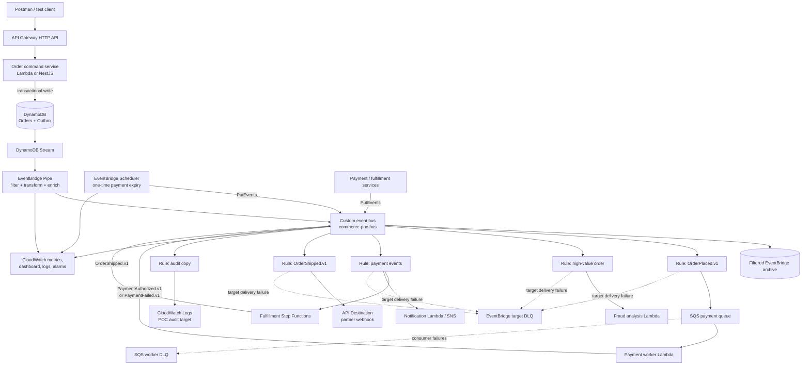
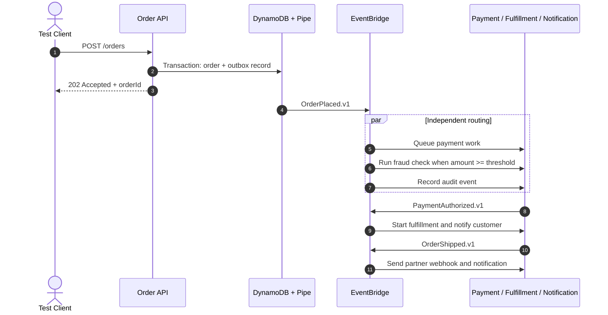
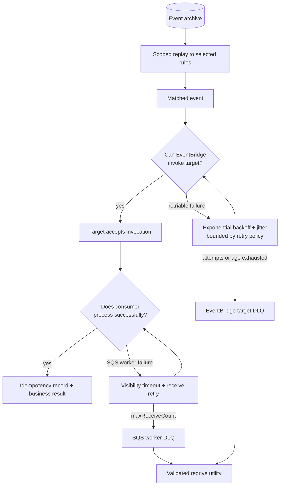
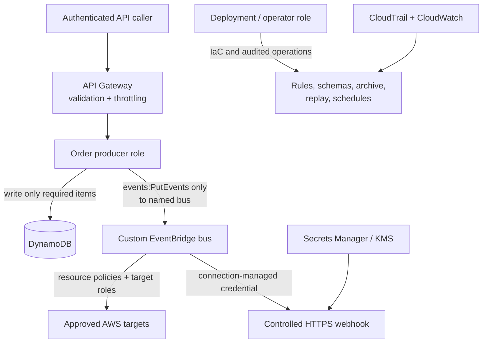
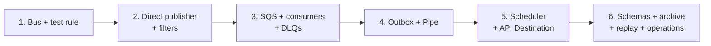

# Amazon EventBridge End-to-End POC

## Order Lifecycle Event Hub

> A hands-on learning project for understanding Amazon EventBridge deeply—from publishing a business event to routing, filtering, enrichment, scheduling, delivery, failure recovery, replay, security, and monitoring.

**Audience:** Senior developers, solution architects, and technical leads  
**Recommended implementation:** AWS CDK with TypeScript, Node.js/TypeScript Lambda functions, Amazon API Gateway, DynamoDB, SQS, and Amazon EventBridge  
**POC duration:** 5–8 focused working days  
**Deployment:** A sandbox AWS account or isolated development environment  
**Last reviewed:** 31 August 2026

---

## 1. Executive Summary

Build an event-driven order platform in which an Order API accepts a new order and publishes an `OrderPlaced` event. Amazon EventBridge becomes the central event router. Independent consumers receive only the events relevant to them:

- Payment processing receives every valid order.
- Fraud detection receives only high-value orders.
- Customer loyalty receives only orders from loyalty members.
- Notifications receive payment and shipment events.
- A webhook receives shipment events through an EventBridge API Destination.
- EventBridge Scheduler produces payment-expiry events.
- An EventBridge archive retains selected events for replay and recovery.

The advanced phase replaces fragile database-plus-event dual writes with a transactional outbox, DynamoDB Streams, and EventBridge Pipes. This makes the project useful not only for learning EventBridge features but also for understanding production event-driven architecture.

### Why this is the recommended POC

This project covers the features an architect should understand:

| EventBridge capability | Where the POC uses it |
|---|---|
| Custom event bus | Isolates the commerce domain from the default AWS event bus |
| `PutEvents` | Direct publishing phase and service-produced domain events |
| Event patterns | Routes by source, detail type, value, status, and field existence |
| Multiple rules | Implements fan-out without coupling producers to consumers |
| Input transformers | Creates target-specific payloads without transformation Lambda functions |
| EventBridge Pipes | Moves outbox stream records to the bus with filtering and enrichment |
| Scheduler | Publishes a one-time payment-expiry event for each order |
| API Destinations | Delivers shipment events to an HTTPS webhook |
| Schema Registry | Documents and versions domain event contracts |
| Archives and replays | Reprocesses historical events after a bug fix or consumer outage |
| Retry policies and DLQs | Captures events that EventBridge cannot deliver to a target |
| IAM and KMS | Applies least privilege and encryption decisions |
| CloudWatch | Measures ingestion, matches, invocations, failures, latency, and DLQs |

---

## 2. Alternative EventBridge Project Ideas

If the order domain is not suitable, these are strong alternatives:

| Project | Core scenario | EventBridge features emphasized |
|---|---|---|
| **Order Lifecycle Event Hub — recommended** | Route order, payment, fulfillment, and notification events | Broadest end-to-end coverage |
| Security Finding Response Hub | Route GuardDuty, Security Hub, and custom findings by severity | Default bus, AWS service events, cross-account buses, remediation |
| SaaS Integration Router | Synchronize CRM, billing, and support systems | Partner events, API Destinations, transformations, retries |
| Media Processing Coordinator | Route upload, transcode, moderation, and publish events | S3 events, content routing, Step Functions, replay |
| Multi-account Operations Hub | Aggregate operational events from multiple AWS accounts | Bus policies, AWS Organizations, centralized routing |
| IoT Maintenance Alert Platform | Route telemetry-derived alerts by device, region, and severity | Pipes, filtering, enrichment, schedules, high event volume |

The rest of this document fully designs the **Order Lifecycle Event Hub**.

---

## 3. Learning Objectives

After completing the POC, you should be able to explain and demonstrate:

1. The difference between an event bus, a rule, a target, a pipe, a schedule, and an archive.
2. When to use EventBridge instead of SNS, SQS, Step Functions, or Kafka.
3. How EventBridge performs content-based routing.
4. How one event can independently trigger several business capabilities.
5. Why events must be versioned and consumers must be idempotent.
6. How to handle duplicate, delayed, and out-of-order delivery.
7. The difference between an EventBridge target DLQ and an SQS consumer DLQ.
8. How producer-side `PutEvents` failures differ from target delivery failures.
9. How EventBridge Pipes simplifies point-to-point integration.
10. How Scheduler differs from legacy scheduled rules.
11. How archives and replays help recover or introduce a new consumer.
12. How to apply least-privilege IAM, encryption, logging, and alarms.

---

## 4. Scope

### 4.1 POC scope

- Create and retrieve a simple order.
- Publish business events to a custom EventBridge bus.
- Filter events using several event-pattern techniques.
- Route events to Lambda, SQS, Step Functions, SNS, CloudWatch Logs, and an API Destination where practical.
- Use a transactional outbox and EventBridge Pipe in the advanced phase.
- Create and cancel one-time payment-expiry schedules.
- Configure retry policies and dead-letter queues.
- Archive and replay selected events.
- Demonstrate idempotent consumers.
- Add logs, metrics, dashboards, alarms, and trace/correlation identifiers.
- Provision all cloud resources using infrastructure as code.

### 4.2 Out of scope

- A polished e-commerce UI.
- Real payment-card processing.
- Production customer data or personally identifiable information.
- Full inventory, tax, shipping, refund, and accounting logic.
- Multi-region active/active production deployment.
- Production throughput or soak testing.

Use fake customers, fake email addresses, and synthetic payment tokens only.

---

## 5. EventBridge Mental Model

| Concept | Responsibility | POC example |
|---|---|---|
| Producer | Creates a fact that already happened | Order service emits `OrderPlaced.v1` |
| Event bus | Receives events and evaluates its rules | `commerce-poc-bus` |
| Rule | Matches an event pattern and invokes target(s) | High-value order rule |
| Target | Receives a matched event | SQS queue, Lambda, Step Functions, API Destination |
| Input transformer | Reshapes a matched event for a target | Converts `OrderShipped.v1` to webhook contract |
| Pipe | Point-to-point source → filter → enrich → target integration | DynamoDB Stream → normalizer → custom bus |
| Scheduler | Invokes a target once or repeatedly at a specified time | Emit `PaymentWindowExpired.v1` after 15 minutes |
| Schema Registry | Stores discoverable or manually managed event schemas | `OrderPlaced.v1` schema |
| Archive | Retains matching events from one bus | Commerce event archive |
| Replay | Sends archived events back to their original bus | Reprocess orders after a consumer fix |
| DLQ | Stores an event EventBridge could not deliver | `eventbridge-target-dlq` |

### EventBridge versus adjacent services

| Requirement | Prefer | Reason |
|---|---|---|
| Many producers and many consumers with content routing | EventBridge event bus | Decoupled, rule-based many-to-many routing |
| Durable work queue, backpressure, consumer-controlled processing | SQS | Messages wait until a consumer successfully processes them |
| Simple broadcast to subscribers | SNS | Straightforward topic-based fan-out |
| Ordered, replayable, high-throughput event log | Kafka/MSK or Kinesis | Partition ordering and stream retention semantics |
| Multi-step business workflow with explicit state | Step Functions | Visible orchestration, branching, retries, and state |
| Point-to-point integration from a supported source | EventBridge Pipes | Managed polling, filtering, enrichment, transformation, and delivery |
| One-time or recurring invocation | EventBridge Scheduler | Purpose-built schedules, time zones, flexible windows, retry, and DLQ |

These services are complementary. This POC intentionally uses EventBridge for routing and SQS for durable asynchronous work.

---

## 6. Detailed Architecture

### 6.1 Complete logical architecture



### 6.2 Responsibility boundaries

| Layer | Components | Responsibility |
|---|---|---|
| Entry | API Gateway, Order service | Validate request, create identifiers, write order and outbox atomically |
| Ingestion | DynamoDB Stream, EventBridge Pipe | Select outbox records, normalize/enrich them, publish to custom bus |
| Routing | Custom bus and rules | Match business event content and independently invoke targets |
| Processing | SQS/Lambda, Step Functions, notification target | Perform business actions and publish follow-up facts |
| Time | EventBridge Scheduler | Emit payment-expiry fact at the required time |
| External integration | API Destination and connection | Transform and deliver webhook request securely |
| Recovery | DLQs, archive, replay, redrive utility | Retain failed or historical events and safely reprocess them |
| Governance | Schema Registry, IAM, KMS, tags | Control contracts, permissions, encryption, ownership, and cost |
| Operations | CloudWatch, CloudTrail, X-Ray/correlation IDs | Make event flow and failures observable |

### 6.3 Normal order sequence



### 6.4 Failure and recovery architecture



**Important distinction:** the EventBridge target DLQ captures a failure to deliver an event to the configured target. If EventBridge successfully places the event on SQS, its delivery responsibility is complete. A later worker failure belongs to the SQS queue/consumer retry policy and the SQS worker DLQ.

---

## 7. Event Catalog and Contracts

### 7.1 Event catalog

| Event | Producer | Main consumers | Key routing data |
|---|---|---|---|
| `OrderPlaced.v1` | Order service/outbox pipe | Payment, fraud, audit | `orderId`, `totalAmount`, `currency`, `customerTier` |
| `PaymentAuthorized.v1` | Payment worker | Fulfillment, notification, audit | `orderId`, `paymentId`, `amount` |
| `PaymentFailed.v1` | Payment worker | Notification, order status handler, audit | `orderId`, `reasonCode`, `retryable` |
| `PaymentWindowExpired.v1` | EventBridge Scheduler | Order cancellation handler | `orderId`, `expiresAt` |
| `InventoryReserved.v1` | Fulfillment workflow | Shipping step | `orderId`, `reservationId` |
| `OrderShipped.v1` | Fulfillment workflow | Notification, webhook, audit | `orderId`, `shipmentId`, `carrier` |
| `OrderCancelled.v1` | Order status handler | Notification, audit | `orderId`, `reason` |

### 7.2 Recommended EventBridge envelope

Use EventBridge’s standard top-level fields for coarse routing and a consistent domain envelope inside `detail`.

```json
{
  "Source": "com.example.commerce.orders",
  "DetailType": "OrderPlaced.v1",
  "EventBusName": "commerce-poc-bus",
  "Time": "2026-08-31T10:30:00Z",
  "Resources": [
    "arn:aws:dynamodb:REGION:ACCOUNT_ID:table/commerce-poc-orders"
  ],
  "Detail": "{\"eventId\":\"01J...\",\"eventVersion\":1,\"occurredAt\":\"2026-08-31T10:30:00Z\",\"correlationId\":\"corr-123\",\"causationId\":\"cmd-123\",\"aggregateType\":\"Order\",\"aggregateId\":\"ord-1001\",\"data\":{\"orderId\":\"ord-1001\",\"totalAmount\":750,\"currency\":\"USD\",\"customerTier\":\"GOLD\"}}"
}
```

When a consumer receives the event, EventBridge adds standard fields such as `id`, `account`, `region`, and `time`. Keep your own stable `detail.eventId`; it is the business event identity used for idempotency and remains meaningful across retries and controlled republishing.

### 7.3 Contract rules

- Name events as facts in the past tense: `OrderPlaced`, not `PlaceOrder`.
- Add a version to `detail-type`, such as `OrderPlaced.v1`.
- Treat an existing version as immutable.
- Prefer additive compatible changes within a version; create `v2` for breaking changes.
- Put routing fields in stable, shallow locations.
- Keep secrets, access tokens, full card data, and unnecessary PII out of events.
- Put large documents in S3 and publish a reference, checksum, content type, and size.
- Include `eventId`, `occurredAt`, `correlationId`, `causationId`, and aggregate identity.
- Validate produced and consumed events against a JSON Schema in CI and at application boundaries.
- Do not use the EventBridge-generated event `id` as the only business idempotency key.

### 7.4 Example schemas

#### `OrderPlaced.v1` detail schema

```json
{
  "$schema": "https://json-schema.org/draft/2020-12/schema",
  "title": "OrderPlaced.v1 detail",
  "type": "object",
  "required": [
    "eventId",
    "eventVersion",
    "occurredAt",
    "correlationId",
    "aggregateId",
    "data"
  ],
  "properties": {
    "eventId": { "type": "string", "minLength": 1 },
    "eventVersion": { "const": 1 },
    "occurredAt": { "type": "string", "format": "date-time" },
    "correlationId": { "type": "string", "minLength": 1 },
    "causationId": { "type": "string" },
    "aggregateType": { "const": "Order" },
    "aggregateId": { "type": "string", "minLength": 1 },
    "data": {
      "type": "object",
      "required": ["orderId", "totalAmount", "currency", "customerTier"],
      "properties": {
        "orderId": { "type": "string", "minLength": 1 },
        "totalAmount": { "type": "number", "minimum": 0 },
        "currency": { "type": "string", "pattern": "^[A-Z]{3}$" },
        "customerTier": {
          "type": "string",
          "enum": ["STANDARD", "SILVER", "GOLD", "PLATINUM"]
        }
      },
      "additionalProperties": false
    }
  },
  "additionalProperties": false
}
```

---

## 8. Event Rules and Filters

Use one target per rule for clearer ownership, alarms, retry policies, deployments, and failure isolation, even though a rule can support multiple targets.

### 8.1 All placed orders → payment queue

```json
{
  "source": ["com.example.commerce.orders"],
  "detail-type": ["OrderPlaced.v1"]
}
```

### 8.2 High-value orders → fraud analysis

```json
{
  "source": ["com.example.commerce.orders"],
  "detail-type": ["OrderPlaced.v1"],
  "detail": {
    "data": {
      "totalAmount": [{ "numeric": [">=", 500] }]
    }
  }
}
```

### 8.3 Loyalty member orders → loyalty consumer

```json
{
  "source": ["com.example.commerce.orders"],
  "detail-type": ["OrderPlaced.v1"],
  "detail": {
    "data": {
      "customerTier": ["GOLD", "PLATINUM"]
    }
  }
}
```

### 8.4 Payment outcome → notification

```json
{
  "source": ["com.example.commerce.payments"],
  "detail-type": ["PaymentAuthorized.v1", "PaymentFailed.v1"]
}
```

### 8.5 Failure event with a reason → operations

```json
{
  "detail-type": ["PaymentFailed.v1"],
  "detail": {
    "data": {
      "reasonCode": [{ "exists": true }]
    }
  }
}
```

### 8.6 Testing rule patterns

For every rule, keep at least:

- One positive fixture that must match.
- One negative fixture with another `detail-type`.
- One boundary fixture, such as amount `499.99` and `500.00`.
- One malformed-contract fixture, which should be rejected by the producer or consumer rather than silently processed.

Run EventBridge pattern tests in CI before deploying rule changes.

---

## 9. Publishing Strategy

### 9.1 Phase 1: direct `PutEvents`

The simplest learning path is:

1. Order API saves the order.
2. Order API calls `PutEvents`.
3. Rules route the event.

This makes the EventBridge mechanics visible quickly but creates a dual-write risk: the database write may succeed while publishing fails, or publishing may succeed while the API loses the response.

Producer requirements:

- Use the EventBridge client from AWS SDK for JavaScript v3.
- Batch only when it benefits throughput.
- Check `FailedEntryCount` even when the HTTP call succeeds.
- Inspect each response entry in the same position as its request entry.
- Retry only failed entries with exponential backoff and jitter.
- Log `eventId`, `orderId`, `correlationId`, result `EventId`, and error code.
- Place unrecoverable producer failures into an application outbox or producer-failure queue.

### 9.2 Phase 2: transactional outbox with EventBridge Pipes

Recommended advanced flow:

1. In a single DynamoDB transaction, write the order and an immutable outbox item.
2. DynamoDB Streams captures the outbox insert.
3. EventBridge Pipe polls the stream.
4. Pipe filter accepts only `entityType = OUTBOX` and supported event types.
5. Optional enrichment Lambda converts the DynamoDB stream image into the canonical event contract.
6. Pipe sends the normalized event to the custom EventBridge bus.
7. A publisher-status process marks or expires old outbox items for operational tracking.

This removes the database/event dual-write gap because the business record and outbox record commit together.

#### Example outbox item

```json
{
  "pk": "ORDER#ord-1001",
  "sk": "OUTBOX#01J...",
  "entityType": "OUTBOX",
  "eventId": "01J...",
  "eventType": "OrderPlaced.v1",
  "source": "com.example.commerce.orders",
  "occurredAt": "2026-08-31T10:30:00Z",
  "payload": {
    "orderId": "ord-1001",
    "totalAmount": 750,
    "currency": "USD",
    "customerTier": "GOLD"
  },
  "expiresAtEpoch": 1788172200
}
```

#### Pipe decision

Use enrichment only when the output cannot be produced using a Pipe input transformer. A transformation-only Lambda adds cost, latency, code, IAM, logging, and failure modes.

---

## 10. Consumer Design and Idempotency

Event-driven consumers must assume an event can be delivered more than once or after another related event.

### 10.1 Idempotency algorithm

For each consumer:

1. Read `detail.eventId`.
2. Atomically insert `{consumerName, eventId}` into a DynamoDB idempotency table using a condition that the key does not exist.
3. If the conditional write fails because the record exists, log `duplicate_ignored` and return success.
4. Perform the business operation.
5. Record the processing result and a TTL for POC cleanup.

For a production system, make the idempotency record and business state change atomic where the storage technology permits it. Do not mark the event completed before the business effect succeeds.

### 10.2 Handling out-of-order events

- Store aggregate version or business-state transition rules.
- Reject impossible transitions, such as `SHIPPED → PAYMENT_PENDING`.
- Treat a late older version as a no-op.
- Do not depend on EventBridge to serialize all events for an order.
- If strict per-order ordering is mandatory, route work into an SQS FIFO queue using the order ID as the message group, or choose a partitioned streaming service.

### 10.3 Consumer failure behavior

| Target type | EventBridge considers delivery successful when | Business retry owner |
|---|---|---|
| Lambda | The Lambda service accepts the asynchronous invocation | Lambda asynchronous retry/destination settings plus an idempotent handler; an EventBridge target DLQ does not capture handler-code failures after invocation acceptance |
| SQS | Message is accepted by the queue | SQS visibility timeout, redrive policy, and worker |
| Step Functions | State-machine execution is accepted | State-machine retry/catch and workflow design |
| API Destination | Endpoint returns a successful response within its constraints | EventBridge retry policy and DLQ |
| Another event bus | Target bus accepts the event | Rules and targets on the receiving bus |

---

## 11. EventBridge Scheduler Design

Use EventBridge Scheduler rather than a legacy scheduled rule.

### Use case

When `OrderPlaced.v1` is processed, create a one-time schedule for 15 minutes later:

- Schedule name: `payment-expiry-<orderId>`
- Schedule group: `commerce-poc-payment-expiry`
- Target: EventBridge `PutEvents` on `commerce-poc-bus`
- Event: `PaymentWindowExpired.v1`
- Flexible time window: off for a precise POC demonstration
- Retry policy: configured explicitly
- DLQ: `scheduler-dlq`
- Action after completion: delete, if supported by the chosen provisioning/API approach

When `PaymentAuthorized.v1` arrives before expiry, the payment status handler attempts to delete the schedule. The expiry consumer must still check current order status because schedule deletion and execution can race.

### Expiry handling rule

```json
{
  "source": ["com.example.commerce.scheduler"],
  "detail-type": ["PaymentWindowExpired.v1"]
}
```

### Required lesson

A scheduled event is a trigger, not authoritative business state. The cancellation handler must conditionally change an order from `PAYMENT_PENDING` to `CANCELLED`; if payment is already authorized, it returns a successful no-op.

---

## 12. API Destination Design

Use an API Destination to send `OrderShipped.v1` to a controlled POC webhook deployed with API Gateway and Lambda.

### Components

- EventBridge connection containing an API key or OAuth credentials.
- API Destination pointing to the HTTPS webhook.
- Rule matching `OrderShipped.v1`.
- Input transformer that maps the internal event to the external contract.
- Invocation rate limit suitable for the test endpoint.
- Retry policy and EventBridge target DLQ.

### Example transformed webhook payload

```json
{
  "event": "shipment.created",
  "eventId": "01J...",
  "orderReference": "ord-1001",
  "shipmentReference": "shp-501",
  "carrier": "POC-CARRIER",
  "occurredAt": "2026-08-31T10:45:00Z"
}
```

### Security and behavior checks

- Use HTTPS and a certificate trusted by the endpoint integration.
- Keep authorization values in the EventBridge connection, not in event payloads or templates.
- Restrict who can read or update the connection.
- Make the webhook idempotent using `eventId`.
- Make the endpoint return quickly and perform long work asynchronously.
- Test 2xx, 400, 401, 409, 429, 500, timeout, and `Retry-After` behavior.
- Never point this learning POC at a real third-party production endpoint.

---

## 13. Archive and Replay

### Archive configuration

- Name: `commerce-poc-archive`
- Source: `commerce-poc-bus`
- Event pattern: only domain events under `com.example.commerce.*`, or a narrower list for cost control
- Retention: 7 days for the POC
- Encryption: follow the event-bus encryption decision

### Replay experiment

1. Deploy a deliberately failing notification consumer.
2. Publish five `PaymentAuthorized.v1` events.
3. Observe failures and DLQ entries.
4. Disable the affected rule to stop repeated side effects while repairing.
5. Fix and deploy the consumer.
6. Start a replay for only the affected time range and, where possible, select only the corrected rule.
7. Verify the idempotency table prevents already-completed side effects.
8. Confirm replayed events contain replay metadata and are not re-archived.

### Replay safety checklist

- Use the smallest correct time range.
- Target only the required rules where possible.
- Estimate downstream load before starting.
- Confirm every selected consumer is idempotent.
- Consider disabling notifications or external webhooks during a recovery rehearsal.
- Reconcile business outcomes after replay.
- Do not expect replay to reproduce original global ordering.
- Wait for recent events to reach the archive before replaying them.

---

## 14. Retry and Dead-Letter Queue Strategy

### 14.1 Failure layers

| Layer | Example failure | Mechanism |
|---|---|---|
| Producer → bus | `PutEvents` entry rejected | Inspect per-entry response; retry failed entries; producer outbox |
| Pipe source/transform/target | Invalid record or target unavailable | Pipe source semantics, retry settings, logs, and DLQ where supported |
| Bus rule → target | Permission denied, throttling, unavailable target | EventBridge target retry policy and SQS DLQ |
| SQS → worker | Handler error or poison message | Visibility timeout, `maxReceiveCount`, worker DLQ |
| Business operation | Invalid state transition | Domain error event, manual review, or safe no-op—not blind infrastructure retry |
| Scheduler → target | Target invocation fails | Scheduler retry policy and scheduler DLQ |
| API Destination | Timeout, throttling, eligible HTTP error | Retry policy, `Retry-After`, invocation rate, and DLQ |

### 14.2 DLQ metadata to inspect

For an EventBridge DLQ message, review message attributes and payload to determine:

- Rule and target that failed.
- Error code and error message.
- Retry attempts or exhaustion condition.
- Original event and its stable business `eventId`.
- Whether the failure is transient, configuration-related, or a poison event.

### 14.3 Redrive utility safeguards

Create a small CLI or Lambda that:

- Reads a limited batch from a named DLQ.
- Validates the event schema.
- Prints a dry-run summary.
- Requires an explicit destination and maximum count.
- Republishes with the original business `eventId` plus redrive metadata.
- Deletes the DLQ message only after confirmed acceptance.
- Records operator, time, reason, original queue, and result.
- Stops on a configured error threshold.

Never build an uncontrolled infinite DLQ-to-bus loop.

---

## 15. Schema Registry Strategy

### Learning phase

1. Enable schema discovery temporarily on the custom bus.
2. Send every event type.
3. Inspect discovered schemas and versions.
4. Generate or examine code bindings if useful to the selected language.
5. Disable discovery after the exercise to avoid unexpected schemas and cost.

### Production-oriented phase

- Create a dedicated registry and manually publish reviewed schemas.
- Store JSON Schema source files in the repository.
- Validate backward compatibility in CI.
- Make schema ownership part of the producing domain.
- Add consumer contract tests for every subscribed version.
- Maintain a deprecation policy before removing old versions.

### Encryption trade-off to demonstrate

AWS documentation notes that schema discovery is not supported for event buses encrypted with a customer-managed key. For the learning phase, use the AWS-owned-key configuration to explore discovery. For the security-hardening phase, use a customer-managed key if required and manage schemas explicitly. Document this as an architectural decision rather than enabling incompatible features simultaneously.

---

## 16. Security Architecture

### 16.1 Trust boundaries



### 16.2 Security controls

| Area | Control |
|---|---|
| Producer IAM | Allow `events:PutEvents` only on `commerce-poc-bus`; do not grant wildcard EventBridge administration |
| Pipe role | Read only the named stream, invoke only the named enrichment, and write only to the named bus |
| Rule targets | Use resource policies or target roles scoped to exact Lambda, SQS, Step Functions, SNS, or bus ARNs |
| Scheduler role | Permit only the required target API on the exact target resource |
| Bus policy | Accept events only from approved principals/accounts and, when applicable, organization conditions |
| KMS | Use least-privilege key policies; separate application use from key administration |
| API Destination | Store credentials in the managed connection; restrict connection read/update permissions |
| Event content | Exclude credentials, card data, sensitive tokens, and unnecessary PII |
| Logs | Use structured logs with redaction; never log secrets or full sensitive payloads |
| API | Authentication, authorization, JSON schema validation, request-size limit, WAF/rate limits if required |
| IaC pipeline | Static analysis, dependency scanning, policy checks, protected deployment roles |
| Audit | CloudTrail for control-plane changes and replay/schedule operations; alarms for unexpected changes |
| Data lifecycle | Short POC retention and TTLs for tables, logs, archives, and DLQs |

### 16.3 Threat scenarios to test

- An unapproved principal attempts `PutEvents` on the custom bus.
- Producer attempts to publish to another bus.
- An event contains an unexpected sensitive field.
- A consumer receives a tampered or schema-invalid payload.
- An operator starts an overly broad replay.
- A compromised API Destination credential is rotated.
- A rule is accidentally changed to match all events.
- A recursive rule causes one target to republish the same event indefinitely.

For loop prevention, use precise `source` and `detail-type` patterns, distinguish commands from facts, and optionally include/honor hop-count or origin metadata at integration boundaries.

---

## 17. Observability

### 17.1 Structured logging fields

Every producer and consumer log should include:

```text
timestamp, level, service, function, eventId, eventType, eventVersion,
orderId, correlationId, causationId, awsRequestId, replayName,
attempt, outcome, durationMs, errorCode
```

Do not log the full event by default. Log a redacted summary and keep debug payload logging disabled outside a controlled test.

### 17.2 Dashboard

Create one CloudWatch dashboard with:

- Events submitted and producer entry failures.
- Rule matches and triggered rule counts.
- Target invocations, failed invocations, and throttled invocations.
- Pipe execution, filtered records, failures, and duration metrics available for the configured source/target.
- Lambda errors, throttles, duration, and concurrency.
- SQS visible messages, oldest message age, in-flight messages, and DLQ depth.
- Step Functions failed, timed-out, and aborted executions.
- Scheduler target errors and DLQ depth.
- API Destination invocation and failure behavior.
- Business metrics: orders placed, payments authorized/failed, expired orders, shipped orders.

### 17.3 Alarms

| Alarm | Example POC condition | Response |
|---|---|---|
| EventBridge failed invocation | `> 0` for 5 minutes | Inspect rule target, IAM, and target availability |
| EventBridge target DLQ | Visible messages `> 0` | Triage and controlled redrive |
| Payment queue age | Oldest message `> 120 seconds` | Check worker errors/concurrency |
| Worker DLQ | Visible messages `> 0` | Diagnose poison event/business failure |
| Lambda error rate | Error percentage above threshold | Inspect correlated logs |
| Pipe failure | Any sustained failure | Inspect source position, transform, enrichment, and target |
| Payment failures | Abnormal business-rate increase | Validate simulated provider and business conditions |

### 17.4 Correlation flow

Generate `correlationId` at API entry and copy it to every derived event. Set `causationId` to the event or command that directly caused the new event. This enables a complete order timeline even when processing is asynchronous.

---

## 18. Infrastructure as Code and Repository Design

### Recommended stack

| Layer | Choice | Reason |
|---|---|---|
| IaC | AWS CDK v2 with TypeScript | Fits Node/NestJS experience and supports reusable constructs |
| Runtime | Node.js/TypeScript Lambda | Fast POC delivery and shared event types |
| API | API Gateway HTTP API | Small managed entry layer |
| Data | DynamoDB | Transactional writes, streams, TTL, and idempotency table |
| Work buffering | SQS Standard | Durable decoupling and consumer DLQ behavior |
| Workflow | Step Functions Standard | Visible fulfillment orchestration |
| Tests | Vitest/Jest plus AWS SDK integration tests | Unit, contract, and deployed-resource verification |
| CI | GitHub Actions or current enterprise pipeline | Build, test, scan, synth, diff, and deploy |

### Suggested repository

```text
eventbridge-order-poc/
├── README.md
├── package.json
├── cdk.json
├── docs/
│   ├── architecture.md
│   ├── event-catalog.md
│   ├── runbook.md
│   └── demo-script.md
├── schemas/
│   ├── order-placed-v1.schema.json
│   ├── payment-authorized-v1.schema.json
│   ├── payment-failed-v1.schema.json
│   └── order-shipped-v1.schema.json
├── events/
│   ├── valid/
│   ├── invalid/
│   └── non-matching/
├── infra/
│   ├── app.ts
│   ├── stacks/
│   │   ├── data-stack.ts
│   │   ├── eventing-stack.ts
│   │   ├── compute-stack.ts
│   │   └── observability-stack.ts
│   └── constructs/
│       ├── event-rule-target.ts
│       └── monitored-queue.ts
├── src/
│   ├── order-api/
│   ├── pipe-enrichment/
│   ├── payment-worker/
│   ├── fraud-consumer/
│   ├── notification-consumer/
│   ├── expiry-consumer/
│   ├── webhook-receiver/
│   └── shared/
│       ├── events/
│       ├── idempotency/
│       ├── logging/
│       └── validation/
├── scripts/
│   ├── publish-test-events.ts
│   ├── inspect-order-timeline.ts
│   ├── dlq-redrive.ts
│   └── cleanup-test-data.ts
└── test/
    ├── unit/
    ├── contract/
    └── integration/
```

### Environment naming

Use deterministic names:

```text
commerce-poc-bus
commerce-poc-orders
commerce-poc-idempotency
commerce-poc-payment-queue
commerce-poc-payment-worker-dlq
commerce-poc-eventbridge-target-dlq
commerce-poc-scheduler-dlq
commerce-poc-archive
```

Tag all supported resources with `Project=EventBridgeOrderPOC`, `Environment=dev`, `Owner`, and `ExpiresOn`.

---

## 19. Progressive Implementation Plan

### Phase 0 — Foundation

**Build**

- CDK application and environment configuration.
- Custom event bus.
- CloudWatch log target for safe inspection.
- Shared event envelope types and schema validation.
- Test-event publisher script.

**Learn**

- Custom versus default bus.
- `source`, `detail-type`, and `detail` fields.
- Bus rules and targets.

**Exit criteria**

- A valid test event is accepted and appears only in the expected log target.
- A non-matching event does not invoke the target.

### Phase 1 — Direct publisher and content routing

**Build**

- Order HTTP endpoint.
- DynamoDB orders table.
- Direct `PutEvents` publisher.
- Payment SQS target.
- High-value fraud Lambda target.
- Loyalty filter target.

**Learn**

- `PutEvents` response handling.
- Numeric, exact-value, array, and existence matching.
- Fan-out and target isolation.

**Exit criteria**

- A `$100` standard order goes to payment only.
- A `$750` gold order goes to payment, fraud, loyalty, and audit targets.
- Producer detects a failed event entry.

### Phase 2 — Reliability and idempotency

**Build**

- EventBridge target DLQ.
- Payment queue worker DLQ.
- Explicit target retry policies.
- DynamoDB idempotency table.
- Failure-injection configuration.
- Controlled DLQ redrive utility.

**Learn**

- Delivery failure versus processing failure.
- Duplicate handling.
- Retry exhaustion and redrive.

**Exit criteria**

- Duplicate event causes only one business effect.
- Broken target produces an EventBridge DLQ message.
- Poison SQS message reaches the worker DLQ.
- A repaired event can be safely redriven.

### Phase 3 — Transactional outbox and Pipe

**Build**

- Atomic order + outbox transaction.
- DynamoDB Stream.
- Pipe filter, input transformation, optional enrichment, and target bus.
- Remove direct publishing from the order request path.

**Learn**

- Pipes versus event buses.
- Source polling and filter behavior.
- Avoiding dual writes.

**Exit criteria**

- Order API succeeds even if downstream consumers are offline.
- Every committed outbox event eventually reaches the bus.
- Non-outbox stream records are filtered out.

### Phase 4 — Scheduler

**Build**

- One-time payment-expiry schedules.
- Schedule deletion on payment authorization.
- Expiry consumer with conditional order-state update.
- Scheduler DLQ.

**Learn**

- One-time schedules, execution roles, retries, and race-safe handlers.

**Exit criteria**

- Unpaid order expires after the POC interval.
- Paid order is not cancelled even if a schedule races with payment.

### Phase 5 — API Destination

**Build**

- Controlled webhook receiver.
- Connection, API Destination, rate limit, transformer, retry, and DLQ.

**Learn**

- Secure outbound HTTP integration and target-specific payload transformation.

**Exit criteria**

- Shipment event reaches webhook in external contract format.
- Rate-limit and error experiments produce expected retries/DLQ results.

### Phase 6 — Schemas, archive, and replay

**Build**

- Temporary schema discovery exercise.
- Reviewed manual schemas.
- Filtered archive with short retention.
- Replay runbook.

**Learn**

- Contract evolution and operational reprocessing.

**Exit criteria**

- Schemas are versioned and tested in CI.
- A scoped replay reprocesses the corrected consumer without duplicate business effects.

### Phase 7 — Security and operations

**Build**

- Least-privilege roles and resource policies.
- Encryption decision and key policy if using a customer-managed key.
- Dashboard, alarms, CloudTrail review, redaction, and cost tags.
- Cleanup script and runbook.

**Exit criteria**

- Unauthorized publish attempt is denied.
- Every injected failure is visible and actionable.
- `cdk destroy` plus residual-resource checklist removes POC resources.

---

## 20. Test Plan

### 20.1 Functional and routing tests

| ID | Scenario | Expected result |
|---|---|---|
| F01 | Place `$100` standard order | Payment and audit only |
| F02 | Place `$750` standard order | Payment, fraud, and audit |
| F03 | Place `$750` gold order | Payment, fraud, loyalty, and audit |
| F04 | Publish unrelated event source | No commerce consumer invoked |
| F05 | Publish `PaymentAuthorized.v1` | Fulfillment and notification invoked |
| F06 | Publish `OrderShipped.v1` | Webhook and notification invoked |
| F07 | Leave order unpaid | Expiry event conditionally cancels order |
| F08 | Pay order before expiry | Order remains paid/processing |

### 20.2 Contract tests

| ID | Scenario | Expected result |
|---|---|---|
| C01 | Missing `eventId` | Producer/consumer validation rejects it |
| C02 | Unsupported event version | Routed to no v1 consumer or explicitly rejected |
| C03 | Amount is a string instead of number | Schema validation fails; numeric rule does not falsely match |
| C04 | Add compatible optional field | Existing v1 consumers continue to work |
| C05 | Sensitive field included | Security validation/test fails |

### 20.3 Reliability tests

| ID | Failure injection | Expected result |
|---|---|---|
| R01 | Publish same `eventId` three times | One business side effect; duplicates logged |
| R02 | Remove EventBridge permission to target | Retries followed by EventBridge target DLQ |
| R03 | Payment worker throws | SQS retry then worker DLQ |
| R04 | Webhook returns `429` | Retried according to integration behavior; eventual DLQ if exhausted |
| R05 | Webhook times out | Retry then DLQ according to policy |
| R06 | One entry in a `PutEvents` batch is invalid | Partial failure detected and only failed entry retried |
| R07 | Events arrive in reverse business order | State-transition protection prevents regression |
| R08 | Replay previously processed events | Idempotency suppresses duplicate effects |
| R09 | Pipe enrichment fails | Failure is observable and source record is not silently lost |
| R10 | Schedule deletion races execution | Conditional update keeps final state correct |

### 20.4 Security tests

| ID | Scenario | Expected result |
|---|---|---|
| S01 | Unapproved role calls `PutEvents` | Access denied |
| S02 | Producer publishes to another bus | Access denied |
| S03 | Consumer reads unrelated table | Access denied |
| S04 | Log statement receives secret-like field | Field redacted or rejected |
| S05 | Operator requests broad replay | Runbook approval/guardrail blocks or flags it |
| S06 | API key is rotated | Webhook delivery continues with updated connection |

### 20.5 Performance experiment

Publish controlled batches at increasing rates and observe:

- `PutEvents` latency and partial failures.
- Rule matches and target invocation throttling.
- SQS backlog and oldest-message age.
- Lambda concurrency and duration.
- API Destination rate limiting and backlog behavior.
- Archive/replay downstream load.

Do not perform uncontrolled load tests. Review current regional service quotas first, set a maximum event count, and stop automatically on elevated errors or cost.

---

## 21. Demo Script for Stakeholders

### 10–15 minute demonstration

1. **Show architecture:** Explain producer, custom bus, rules, targets, Pipe, Scheduler, archive, and DLQs.
2. **Place a normal order:** Show payment routing and absence from fraud/loyalty consumers.
3. **Place a high-value gold order:** Show one event independently matching several rules.
4. **Show event contract:** Explain version, correlation, causation, and why there is no sensitive data.
5. **Show idempotency:** Publish the same business `eventId` twice and show one effect.
6. **Inject a target failure:** Show retries and the EventBridge target DLQ.
7. **Contrast worker failure:** Fail the SQS payment handler and show the separate worker DLQ.
8. **Show Scheduler:** Demonstrate an unpaid order expiring and a paid order remaining valid.
9. **Show API Destination:** Ship an order and inspect the transformed webhook payload.
10. **Show archive/replay:** Fix a consumer and replay a narrow time window to the selected rule.
11. **Show dashboard and IAM:** Close with observability, least privilege, cost, and cleanup.

### Key architecture messages

- Producers publish facts, not consumer-specific instructions.
- Rules own routing; producers do not know consumers.
- EventBridge routes events; SQS protects asynchronous work.
- Retry and DLQ mechanisms exist at multiple layers and solve different failures.
- Idempotency is an application responsibility.
- Replay is powerful but must be scoped and operationally controlled.

---

## 22. Architecture Decisions to Record

Create lightweight ADRs for:

1. Custom bus instead of default bus for domain events.
2. Event naming and versioning convention.
3. One target per rule for operational isolation.
4. Direct `PutEvents` for phase 1, transactional outbox/Pipe for advanced phase.
5. SQS between routing and payment worker for buffering and backpressure.
6. Idempotency storage and retention period.
7. Scheduler instead of legacy scheduled rules.
8. API Destination authentication method.
9. AWS-owned key for discovery phase versus customer-managed key and manual schemas.
10. Archive scope, retention, and replay authorization.
11. PII exclusion and large-payload reference pattern.
12. Regional deployment and future disaster-recovery strategy.

---

## 23. Common Mistakes This POC Should Expose

- Treating EventBridge like a durable work queue.
- Publishing commands named after a consumer instead of business facts.
- Creating broad patterns that accidentally match unrelated events.
- Ignoring `FailedEntryCount` after a successful `PutEvents` HTTP response.
- Assuming exactly-once or global ordering.
- Performing non-idempotent side effects.
- Confusing EventBridge target DLQ with an SQS worker DLQ.
- Putting several unrelated targets on one rule and losing ownership clarity.
- Adding Lambda only to rename or select fields that an input transformer can handle.
- Storing secrets or excessive PII in event payloads.
- Replaying a broad time window into all consumers without impact analysis.
- Using scheduled events as authoritative state rather than conditionally checking current state.
- Creating a rule loop in which a target republishes an event that matches the same rule.
- Enabling schema discovery and customer-managed bus encryption without checking compatibility.
- Leaving archives, schedules, log groups, queues, or secrets after destroying the main stack.

---

## 24. Definition of Done

The POC is complete when:

- [ ] Infrastructure is reproducible through CDK.
- [ ] Custom bus, rules, targets, and event patterns are documented.
- [ ] Direct publisher handles partial `PutEvents` failures.
- [ ] Transactional outbox and EventBridge Pipe are demonstrated.
- [ ] At least four event types flow end to end.
- [ ] Numeric and exact-value content filters are demonstrated.
- [ ] Input transformation is demonstrated without unnecessary Lambda code.
- [ ] EventBridge target DLQ and SQS worker DLQ are both demonstrated.
- [ ] All state-changing consumers are idempotent.
- [ ] One-time Scheduler flow and race-safe expiry logic work.
- [ ] API Destination authentication, rate, retry, and DLQ behavior are tested.
- [ ] Schemas and compatibility tests exist in the repository.
- [ ] Archive and scoped replay are successfully demonstrated.
- [ ] Dashboard, alarms, structured logs, and correlation are working.
- [ ] Least-privilege IAM tests pass.
- [ ] POC contains no real secrets or sensitive customer data.
- [ ] Demo script and failure-recovery runbook are validated.
- [ ] Cleanup removes or explicitly accounts for every billable resource.

---

## 25. Recommended Build Order at a Glance



For the first demo, stop after step 3. For deep EventBridge understanding, complete all six steps.

---

## 26. Current AWS Notes Used in This Design

- EventBridge rules match incoming events using event patterns and can route a matched event to targets in parallel.
- AWS recommends EventBridge Scheduler over legacy scheduled rules for scheduled invocations.
- EventBridge Pipes is designed for point-to-point source-to-target integration with optional filtering, enrichment, and transformation; event buses are suited to many-to-many routing.
- EventBridge retries retriable target-delivery failures using exponential backoff and jitter. The documented event-bus default is up to 24 hours and 185 attempts; configure the POC explicitly rather than relying on defaults.
- A target DLQ is required if undelivered events must be retained after retry exhaustion.
- A `PutEvents` request can contain up to 10 entries; inspect per-entry results and `FailedEntryCount`.
- An archive receives events from one source bus, can use a filter and retention period, and replays only to that original bus.
- Replay adds a `replay-name` field, does not guarantee the original global ordering, and should be delayed for very recent events so they have time to reach the archive.
- Schema discovery creates schema versions when event shapes change, but is not supported on an event bus encrypted with a customer-managed key.
- API Destinations invoke HTTPS endpoints using a connection, have a five-second client execution timeout, and support defined retry behavior for selected HTTP status codes.
- EventBridge quotas vary by Region and feature. Review Service Quotas before performance testing; a rule currently supports up to five targets, reinforcing the operational preference for one target per rule.

---

## 27. Official AWS References

- [Rules in Amazon EventBridge](https://docs.aws.amazon.com/eventbridge/latest/userguide/eb-rules.html)
- [How EventBridge retries delivering events](https://docs.aws.amazon.com/eventbridge/latest/userguide/eb-rule-retry-policy.html)
- [Using dead-letter queues to process undelivered events](https://docs.aws.amazon.com/eventbridge/latest/userguide/eb-rule-dlq.html)
- [PutEvents API](https://docs.aws.amazon.com/eventbridge/latest/APIReference/API_PutEvents.html)
- [Amazon EventBridge Pipes](https://docs.aws.amazon.com/eventbridge/latest/userguide/eb-pipes.html)
- [Event filtering in EventBridge Pipes](https://docs.aws.amazon.com/eventbridge/latest/userguide/eb-pipes-event-filtering.html)
- [Amazon EventBridge Scheduler](https://docs.aws.amazon.com/eventbridge/latest/userguide/using-eventbridge-scheduler.html)
- [Archiving and replaying events](https://docs.aws.amazon.com/eventbridge/latest/userguide/eb-archive.html)
- [Schema discovery](https://docs.aws.amazon.com/eventbridge/latest/userguide/eb-schemas-infer.html)
- [API Destinations as targets](https://docs.aws.amazon.com/eventbridge/latest/userguide/eb-api-destinations.html)
- [Amazon EventBridge quotas](https://docs.aws.amazon.com/eventbridge/latest/userguide/eb-quota.html)

---

## 28. Final Recommendation

Implement the POC in two milestones:

1. **Demo milestone:** direct `PutEvents`, custom bus, four rules, SQS/Lambda targets, filtering, idempotency, retry, and two types of DLQ.
2. **Architect milestone:** transactional outbox with Pipe, Scheduler, API Destination, schema governance, archive/replay, security hardening, and operational dashboards.

This sequence provides a working demonstration quickly while preserving a clear path to the advanced concepts that distinguish a production-quality EventBridge architecture.
