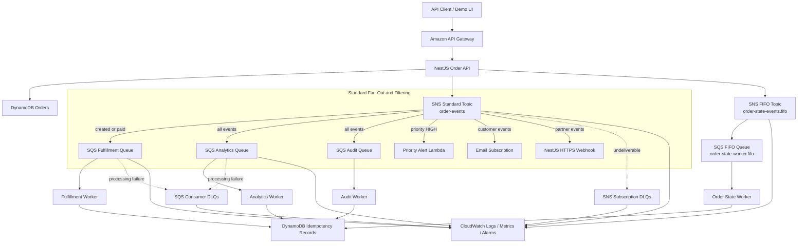
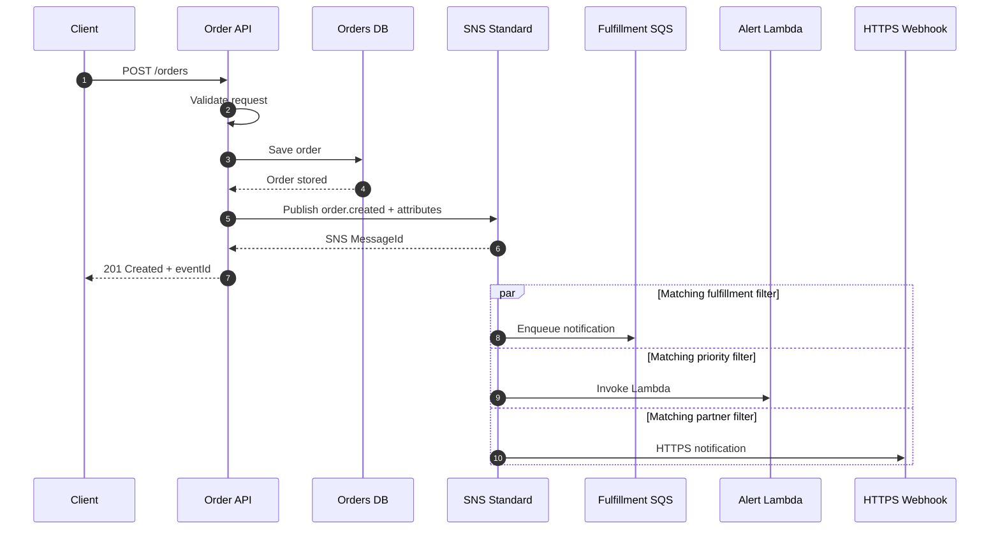
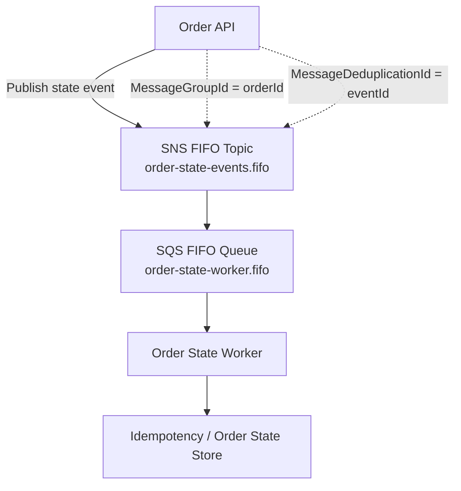
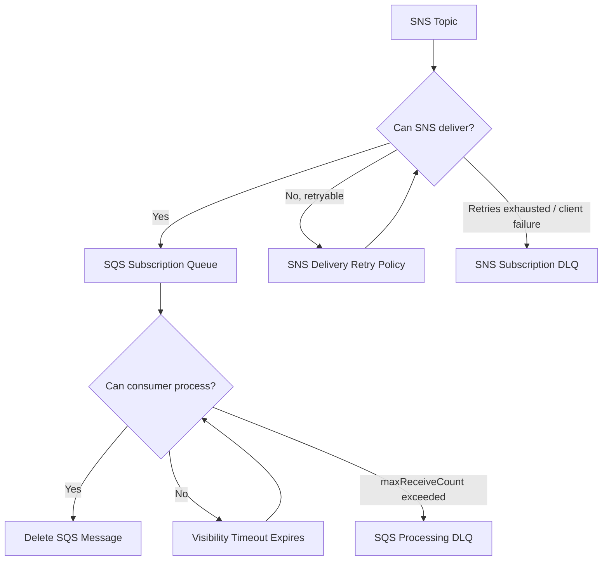
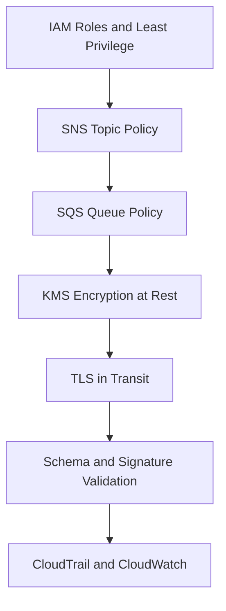

# Amazon SNS Order Event Fan-Out Platform

## End-to-End Architect-Level POC Design

**Document status:** Proposed POC design  
**Primary objective:** Learn Amazon SNS deeply through a realistic event-driven order platform  
**Primary stack:** NestJS, TypeScript, Amazon SNS, Amazon SQS, AWS Lambda, DynamoDB, CloudWatch, AWS CDK  
**Audience:** Senior developers, solution architects, technical leads, and engineering stakeholders

---

## 1. Executive Summary

This proof of concept demonstrates how Amazon Simple Notification Service (SNS) can act as the event-distribution layer for an e-commerce order platform.

The Order Service publishes each business event once. Amazon SNS then distributes the event to multiple independent subscribers such as fulfillment, customer notification, analytics, audit, priority operations, and external webhook systems.

The POC deliberately includes both:

- An **SNS Standard topic** for high-throughput fan-out, flexible subscriber types, filtering, retries, and failure handling.
- An **SNS FIFO topic** connected to SQS FIFO for order-sensitive workflows requiring ordered delivery and deduplication.

The project is not limited to sending email. It demonstrates production-relevant topics including:

- Publisher/subscriber decoupling
- One-to-many fan-out
- Attribute-based and payload-based filtering
- SNS-to-SQS integration
- Lambda and HTTPS subscriptions
- Subscription confirmation and signature verification
- Standard versus FIFO topic selection
- Ordering and message grouping
- Message deduplication
- Delivery retries and dead-letter queues
- Consumer idempotency
- IAM and resource policies
- KMS encryption
- CloudWatch metrics, logs, alarms, and tracing
- Infrastructure as Code
- Failure injection and recovery testing

---

## 2. Problem Statement

In a tightly coupled order system, the Order Service might directly call fulfillment, notification, analytics, audit, and partner systems. This creates several problems:

- The Order Service must know every downstream system.
- A slow consumer can increase order API latency.
- A failed consumer can cause the whole order request to fail.
- Adding a new consumer requires changing the publisher.
- Retry logic becomes duplicated across services.
- Traffic spikes affect all services at the same time.
- Business routing logic becomes embedded in application code.

The POC solves these problems by publishing domain events to Amazon SNS. Subscribers are configured independently and receive only the events they require.

---

## 3. Learning Objectives

After completing the POC, the developer should be able to explain and demonstrate:

1. The difference between SNS push-based messaging and SQS pull-based queuing.
2. How a single SNS publish operation fans out to multiple subscribers.
3. When to place SQS between SNS and a worker.
4. How subscription filter policies reduce unnecessary delivery.
5. How message attributes differ from the event payload.
6. How SNS retries differ across AWS-managed and customer-managed endpoints.
7. Why an SNS subscription DLQ differs from an SQS consumer DLQ.
8. How Standard and FIFO topics differ.
9. How `MessageGroupId` controls ordering and concurrency.
10. How deduplication IDs suppress duplicate FIFO publishing.
11. Why application-level idempotency is still necessary.
12. How topic policies, queue policies, IAM, and KMS work together.
13. How to observe delivery success, failure, filtering, latency, and backlog.
14. How to test messaging systems using controlled failure scenarios.
15. How to provision the entire design using repeatable Infrastructure as Code.

---

## 4. Scope

### 4.1 In Scope

- NestJS Order API
- Event publishing module using AWS SDK for JavaScript v3
- SNS Standard order event topic
- Multiple SNS subscription types
- SQS Standard queues and consumer workers
- Lambda subscriber
- Email subscription for demonstration
- HTTPS webhook subscriber
- SNS subscription filter policies
- Subscription delivery DLQs
- SQS processing DLQs
- SNS FIFO topic and SQS FIFO queue
- Ordering, grouping, and deduplication tests
- Idempotency store
- Structured logging and correlation IDs
- CloudWatch metrics, logs, dashboards, and alarms
- IAM least-privilege policies
- KMS encryption at rest
- AWS CDK infrastructure
- Local unit testing and AWS sandbox integration testing

### 4.2 Out of Scope for the Initial POC

- Complete e-commerce frontend
- Real payment gateway integration
- Production SMS campaigns
- Real customer personally identifiable information
- Multi-account production deployment
- Multi-region disaster recovery
- Enterprise schema registry
- Full CI/CD production promotion process

These can be added after the core SNS behavior has been proven.

---

## 5. Architecture Principles

The POC follows these principles:

- **Publish facts, not commands:** Prefer `order.paid` over `send-order-to-warehouse`.
- **Publisher independence:** The Order Service does not know subscriber implementation details.
- **Immutable events:** Published event facts are not modified by consumers.
- **At-least-once-aware processing:** Consumers are designed to tolerate duplicate delivery.
- **Explicit contracts:** Every event contains a type, version, ID, timestamp, source, and data object.
- **Least privilege:** Every service has only the actions and resources it needs.
- **Failure isolation:** SQS buffers protect consumers from temporary outages and traffic spikes.
- **Observable behavior:** Delivery, filtering, retry, backlog, and failure are measurable.
- **Infrastructure repeatability:** AWS resources are created through CDK rather than manual-only setup.

---

## 6. Detailed Logical Architecture



### 6.1 Architecture Interpretation

The POC uses two messaging lanes:

| Lane | Purpose | Delivery characteristics |
|---|---|---|
| Standard lane | General event fan-out to many subscriber types | High throughput, at-least-once delivery, best-effort ordering |
| FIFO lane | Order state transitions requiring per-order sequence | Ordered within a message group, deduplication support, SQS FIFO subscriber |

The Standard lane demonstrates the broad SNS integration model. The FIFO lane isolates ordering-sensitive behavior so the two models can be compared directly.

---

## 7. AWS Components and Responsibilities

| Component | Responsibility | Key learning |
|---|---|---|
| API Gateway | Exposes the Order API | Authentication, throttling, request tracing |
| NestJS Order API | Validates requests, stores order state, publishes events | AWS SDK publishing and domain-event design |
| DynamoDB Orders | Stores POC order records | Separating state storage from event transport |
| SNS Standard topic | Fans events out to subscribers | Pub/sub, filtering, policies, delivery behavior |
| SQS Standard queues | Buffer work for asynchronous consumers | Durable decoupling and backpressure |
| Lambda subscriber | Processes high-priority alerts | Direct serverless SNS subscription |
| Email subscriber | Demonstrates human notification | Subscription confirmation and endpoint behavior |
| HTTPS webhook | Demonstrates an external endpoint | Confirmation, signature verification, retries |
| SNS subscription DLQ | Captures messages SNS could not deliver | Transport/delivery failure handling |
| SQS processing DLQ | Captures messages consumers repeatedly failed to process | Business-processing failure handling |
| SNS FIFO topic | Publishes ordered order-state events | Grouping, ordering, deduplication |
| SQS FIFO queue | Buffers ordered messages | FIFO consumption and visibility behavior |
| DynamoDB idempotency table | Records processed event IDs | Duplicate-safe processing |
| CloudWatch | Captures logs, metrics, dashboards, and alarms | Operational observability |
| KMS | Encrypts topics and queues | Encryption and key policies |
| AWS CDK | Defines infrastructure | Repeatability and reviewable configuration |

---

## 8. Business Event Model

### 8.1 Event Types

The POC should support the following events:

| Event type | Producer action | Typical subscribers |
|---|---|---|
| `order.created` | New order accepted | Fulfillment, analytics, audit |
| `order.paid` | Payment completed | Fulfillment, notification, analytics, audit |
| `order.shipped` | Shipment dispatched | Notification, analytics, audit, partner webhook |
| `order.cancelled` | Order cancelled | Fulfillment, notification, analytics, audit |
| `payment.failed` | Payment rejected | Notification, priority alert, analytics, audit |
| `refund.completed` | Refund completed | Notification, analytics, audit |

### 8.2 Canonical Event Envelope

```json
{
  "eventId": "evt-01J6N5A5N7G89V1D7V1D9A1R2B",
  "eventType": "order.created",
  "eventVersion": "1.0",
  "occurredAt": "2026-08-31T10:30:00.000Z",
  "source": "order-service",
  "correlationId": "cor-01J6N59V6E2D5T4Q18V5V88T7R",
  "traceId": "Root=1-example-trace-id",
  "data": {
    "orderId": "ORD-501",
    "customerId": "CUS-99",
    "amount": 75000,
    "currency": "INR",
    "region": "IN",
    "priority": "HIGH",
    "status": "CREATED"
  }
}
```

### 8.3 Required Envelope Fields

| Field | Purpose |
|---|---|
| `eventId` | Unique idempotency and diagnostic identifier |
| `eventType` | Business event name used for routing |
| `eventVersion` | Contract evolution control |
| `occurredAt` | When the business event happened |
| `source` | Producing bounded context or service |
| `correlationId` | Connects logs across one business journey |
| `traceId` | Connects distributed tracing data |
| `data` | Event-specific business payload |

### 8.4 SNS Message Attributes

The publisher should also add selected routing data as SNS message attributes:

| Attribute | SNS type | Example |
|---|---|---|
| `eventType` | String | `order.created` |
| `eventVersion` | String | `1.0` |
| `priority` | String | `HIGH` |
| `region` | String | `IN` |
| `amount` | Number | `75000` |
| `source` | String | `order-service` |

Message attributes should contain routing metadata, not secrets or the entire business object.

---

## 9. Subscription and Filter Design

### 9.1 Subscription Matrix

| Subscription | Endpoint | Filter behavior | Raw delivery |
|---|---|---|---|
| Fulfillment | SQS Standard | `order.created`, `order.paid`, `order.cancelled` | Enabled |
| Analytics | SQS Standard | All events | Enabled |
| Audit | SQS Standard | All events | Enabled |
| Priority operations | Lambda | `priority=HIGH` or `payment.failed` | Not applicable |
| Customer email | Email | Selected customer-visible events | Not applicable |
| Partner webhook | HTTPS | `order.shipped`, `order.cancelled` | SNS envelope received |

### 9.2 Fulfillment Filter Policy

```json
{
  "eventType": [
    "order.created",
    "order.paid",
    "order.cancelled"
  ]
}
```

### 9.3 High-Priority Filter Policy

```json
{
  "priority": ["HIGH"]
}
```

### 9.4 High-Value Order Filter Policy

```json
{
  "amount": [
    {
      "numeric": [">=", 50000]
    }
  ]
}
```

### 9.5 Regional Filter Policy

```json
{
  "region": ["IN", "SG"]
}
```

### 9.6 Attribute-Based Versus Payload-Based Filtering

| Option | Use when | Trade-off |
|---|---|---|
| Message attributes | Routing keys are small, stable, and intentionally exposed | Publisher must populate attributes correctly |
| Message body | Routing must inspect fields already inside the JSON payload | Filter becomes more coupled to payload structure |

Start the POC with attribute-based filtering. Add one payload-based filter as an advanced exercise so both approaches can be demonstrated.

---

## 10. Standard Topic Publish and Fan-Out Sequence



### Important Design Note

The simple POC stores the order and then publishes the event. This can produce a dual-write failure: the database operation may succeed while the SNS publish fails.

For advanced production design, introduce a **transactional outbox**:

1. Save the order and outbox record in one database transaction where supported.
2. An outbox publisher reads unpublished records.
3. It publishes them to SNS.
4. It marks them as published.
5. Consumers remain idempotent because retries can create duplicate publications.

The initial version may use direct publishing for simplicity, but the limitation must be documented and demonstrated.

---

## 11. FIFO Ordering and Deduplication Design

### 11.1 FIFO Architecture



### 11.2 FIFO Publishing Rules

For each FIFO message:

```text
MessageGroupId = orderId
MessageDeduplicationId = eventId
```

Example streams:

```text
ORD-501: order.created -> order.paid -> order.shipped
ORD-502: order.created -> order.cancelled
```

SNS preserves order within each message group. Using the order ID as the group ID allows separate orders to progress independently while maintaining the correct sequence for a given order.

### 11.3 Deduplication Exercise

Publish the same message twice using the same `MessageDeduplicationId` within the SNS FIFO deduplication interval. Verify that the publish calls can be accepted while duplicate delivery is suppressed.

Also test content-based deduplication and demonstrate that SNS computes the hash from the message body; SNS message attributes are not included in that hash.

### 11.4 Senior-Level Caveat

FIFO deduplication does not eliminate the need for idempotent consumers. Network ambiguity, consumer retries, visibility timeout behavior, replay, operational redrive, and downstream side effects can still lead to repeated processing attempts.

---

## 12. Failure, Retry, and DLQ Architecture



### 12.1 Two Different DLQ Responsibilities

| DLQ | Attached to | Captures | Example |
|---|---|---|---|
| SNS subscription DLQ | SNS subscription | SNS could not deliver to the endpoint | Deleted Lambda, denied queue policy, unreachable webhook |
| SQS processing DLQ | SQS source queue redrive policy | Consumer repeatedly could not process a delivered message | Invalid business data, database outage, code defect |

Conflating these two failure modes is a common design mistake. Both should be included in the POC.

### 12.2 Failure Injection Scenarios

1. Remove `sqs:SendMessage` permission for the SNS topic.
2. Configure the HTTPS webhook to return HTTP `500`.
3. Configure the HTTPS webhook to return a permanent HTTP `4xx` response.
4. Delete or disable the Lambda endpoint.
5. Make a worker throw an exception before deleting the SQS message.
6. Set a short visibility timeout and simulate slow processing.
7. Publish a contract version the consumer does not support.
8. Block a downstream database dependency.
9. Inspect delivery logs, queue metrics, retry behavior, and DLQ contents.
10. Repair the issue and redrive the failed message safely.

---

## 13. Idempotent Consumer Design

Every consumer should assume that the same event may be received more than once.

### 13.1 Processing Algorithm

```text
1. Receive message.
2. Parse and validate the event envelope.
3. Check idempotency store using consumerName + eventId.
4. If already COMPLETED, acknowledge/delete the message.
5. Create or conditionally acquire a PROCESSING record.
6. Execute the business action.
7. Mark idempotency record COMPLETED.
8. Delete the SQS message.
```

### 13.2 Suggested DynamoDB Key

```text
PK = CONSUMER#fulfillment-worker
SK = EVENT#evt-01J6N5A5N7G89V1D7V1D9A1R2B
```

Suggested fields:

- `status`: `PROCESSING`, `COMPLETED`, or `FAILED`
- `createdAt`
- `completedAt`
- `payloadHash`
- `resultReference`
- `expiresAt` for TTL cleanup

Use a conditional write so two concurrent deliveries cannot both claim the same event.

---

## 14. API Design

### 14.1 Create Order

```http
POST /api/v1/orders
Content-Type: application/json
Idempotency-Key: client-request-501
```

```json
{
  "customerId": "CUS-99",
  "amount": 75000,
  "currency": "INR",
  "region": "IN",
  "priority": "HIGH"
}
```

Example response:

```json
{
  "orderId": "ORD-501",
  "status": "CREATED",
  "eventId": "evt-01J6N5A5N7G89V1D7V1D9A1R2B",
  "message": "Order accepted"
}
```

### 14.2 Change Order Status

```http
PATCH /api/v1/orders/ORD-501/status
Content-Type: application/json
```

```json
{
  "status": "PAID"
}
```

### 14.3 Publish a Controlled Test Event

```http
POST /api/v1/test/events
```

This endpoint is available only in the POC environment and allows the developer to vary event type, attributes, deduplication ID, group ID, and deliberately invalid values.

### 14.4 SNS Webhook Endpoint

```http
POST /api/v1/webhooks/sns
```

The webhook must handle:

- `SubscriptionConfirmation`
- `Notification`
- `UnsubscribeConfirmation`
- SNS message signature verification
- Topic ARN allowlisting
- Timestamp validation
- Duplicate message detection
- Fast response followed by asynchronous business processing

Never trust a request merely because it contains SNS-shaped JSON.

---

## 15. NestJS Application Modules

### 15.1 Suggested Repository Layout

```text
amazon-sns-order-fanout-poc/
├── apps/
│   ├── order-api/
│   │   └── src/
│   │       ├── orders/
│   │       ├── events/
│   │       ├── sns-publisher/
│   │       ├── webhook/
│   │       ├── health/
│   │       └── observability/
│   ├── fulfillment-worker/
│   ├── analytics-worker/
│   ├── audit-worker/
│   └── order-state-worker/
├── packages/
│   ├── event-contracts/
│   ├── idempotency/
│   ├── logging/
│   └── configuration/
├── infrastructure/
│   └── cdk/
│       ├── bin/
│       ├── lib/
│       └── test/
├── test/
│   ├── integration/
│   ├── contract/
│   ├── failure-injection/
│   └── performance/
├── docker-compose.yml
├── package.json
└── README.md
```

### 15.2 Core NestJS Modules

| Module | Responsibility |
|---|---|
| `OrdersModule` | Order validation and state transitions |
| `EventContractsModule` | Event schemas and version validation |
| `SnsPublisherModule` | Standard and FIFO publishing abstraction |
| `WebhookModule` | SNS HTTPS confirmation and notification handling |
| `IdempotencyModule` | Duplicate-safe consumer processing |
| `ObservabilityModule` | Logger, correlation context, metrics, tracing |
| `HealthModule` | Liveness, readiness, and dependency checks |

---

## 16. Publishing Example Using AWS SDK v3

```typescript
import { Injectable } from '@nestjs/common';
import { PublishCommand, SNSClient } from '@aws-sdk/client-sns';

@Injectable()
export class OrderEventPublisher {
  constructor(private readonly sns: SNSClient) {}

  async publish(event: OrderEvent): Promise<string> {
    const result = await this.sns.send(
      new PublishCommand({
        TopicArn: process.env.ORDER_EVENTS_TOPIC_ARN,
        Message: JSON.stringify(event),
        MessageAttributes: {
          eventType: {
            DataType: 'String',
            StringValue: event.eventType,
          },
          eventVersion: {
            DataType: 'String',
            StringValue: event.eventVersion,
          },
          priority: {
            DataType: 'String',
            StringValue: event.data.priority,
          },
          region: {
            DataType: 'String',
            StringValue: event.data.region,
          },
          amount: {
            DataType: 'Number',
            StringValue: String(event.data.amount),
          },
        },
      }),
    );

    if (!result.MessageId) {
      throw new Error('SNS publish did not return a MessageId');
    }

    return result.MessageId;
  }
}
```

Do not log the entire message payload if it could contain sensitive data. Log identifiers and non-sensitive routing fields.

---

## 17. Security Architecture

### 17.1 Security Layers



### 17.2 Publisher IAM Policy

The Order API role should be allowed to publish only to the required topics:

```json
{
  "Version": "2012-10-17",
  "Statement": [
    {
      "Effect": "Allow",
      "Action": "sns:Publish",
      "Resource": [
        "arn:aws:sns:REGION:ACCOUNT_ID:order-events",
        "arn:aws:sns:REGION:ACCOUNT_ID:order-state-events.fifo"
      ]
    }
  ]
}
```

It should not receive `sns:*` or permissions to create, delete, or modify topics.

### 17.3 SQS Queue Resource Policy

Each SQS queue should allow `sqs:SendMessage` only from the expected SNS topic:

```json
{
  "Version": "2012-10-17",
  "Statement": [
    {
      "Sid": "AllowExpectedSnsTopic",
      "Effect": "Allow",
      "Principal": {
        "Service": "sns.amazonaws.com"
      },
      "Action": "sqs:SendMessage",
      "Resource": "QUEUE_ARN",
      "Condition": {
        "ArnEquals": {
          "aws:SourceArn": "TOPIC_ARN"
        },
        "StringEquals": {
          "aws:SourceAccount": "ACCOUNT_ID"
        }
      }
    }
  ]
}
```

### 17.4 Topic Policy

The SNS topic policy should restrict who can:

- Publish
- Subscribe
- Set topic attributes
- Delete the topic
- Read topic attributes

Where applicable, constrain access by principal, source account, source ARN, organization ID, and secure transport.

### 17.5 Encryption

- Enable server-side encryption on SNS topics using a customer-managed KMS key for the advanced POC.
- Enable encryption on all SQS queues and DLQs.
- Ensure KMS key policies permit the required SNS, SQS, publisher, and consumer operations.
- Use TLS for every HTTPS endpoint.
- Do not embed credentials in source code or event payloads.

### 17.6 Data Classification

Do not include:

- Card numbers
- CVV values
- Passwords
- Access or refresh tokens
- Secrets or API keys
- Unnecessary personal information

Use reference identifiers and let authorized consumers retrieve sensitive data from the system of record when necessary.

### 17.7 HTTPS Webhook Security

The webhook must:

1. Accept HTTPS only.
2. Validate SNS signature version and signature.
3. Obtain the signing certificate only from a trusted AWS SNS domain.
4. Verify the signature against the canonical SNS message form.
5. Allowlist expected topic ARNs.
6. Validate the message timestamp to reduce replay risk.
7. Validate the event schema after SNS authenticity is established.
8. Apply idempotency using the SNS `MessageId` and business `eventId`.
9. Avoid automatically visiting arbitrary `SubscribeURL` values.

---

## 18. Observability Design

### 18.1 Structured Log Fields

Every publisher and consumer log should include, where available:

```json
{
  "service": "fulfillment-worker",
  "environment": "poc",
  "eventId": "evt-example",
  "eventType": "order.created",
  "eventVersion": "1.0",
  "orderId": "ORD-501",
  "correlationId": "cor-example",
  "snsMessageId": "sns-example",
  "sqsMessageId": "sqs-example",
  "receiveCount": 1,
  "status": "processed",
  "durationMs": 42
}
```

### 18.2 Metrics to Monitor

Monitor at minimum:

- SNS messages published
- SNS notifications delivered
- SNS notifications failed
- SNS notifications filtered out
- SQS visible messages
- SQS in-flight messages
- Age of oldest SQS message
- SQS DLQ visible messages
- Lambda invocation count
- Lambda errors, throttles, and duration
- Worker processing success and failure counts
- Duplicate events skipped
- End-to-end event processing latency

### 18.3 Suggested Alarms

| Alarm | Example condition | Meaning |
|---|---|---|
| SNS delivery failure | Failed notifications greater than zero | SNS cannot deliver to a subscriber |
| DLQ activity | Visible DLQ messages greater than or equal to one | Manual investigation required |
| Queue backlog | Oldest message age above POC threshold | Consumer is slow or unavailable |
| Lambda errors | Error rate above threshold | Direct subscriber failure |
| No processing | Published events increase but processed events do not | Broken fan-out or consumer path |

### 18.4 Dashboard Layout

Create one CloudWatch dashboard with:

1. Publish rate
2. Delivery success and failure
3. Filtered message counts
4. Queue depth by subscriber
5. Oldest-message age
6. DLQ depth
7. Lambda errors and duration
8. End-to-end processing latency

---

## 19. Infrastructure as Code Resource Plan

The CDK stack should create:

### Messaging

- `order-events` SNS Standard topic
- `order-state-events.fifo` SNS FIFO topic
- Fulfillment, analytics, and audit SQS Standard queues
- Order state SQS FIFO queue
- SQS DLQs for every processing queue
- SNS subscription DLQs for selected endpoints
- Filtered subscriptions
- Raw message delivery where required

### Compute

- Priority alert Lambda
- Optional Lambda-based queue consumers
- API and worker roles
- CloudWatch log groups

### Data

- Orders DynamoDB table
- Idempotency DynamoDB table with TTL

### Security

- Customer-managed KMS key and aliases
- Topic policies
- Queue policies
- IAM execution roles
- Secrets Manager entries only if an external webhook secret is needed

### Operations

- Delivery-status logging roles
- CloudWatch dashboard
- CloudWatch alarms
- SNS alarm-notification topic kept separate from business topics

---

## 20. Environment Strategy

### 20.1 Local Development

Use local development for:

- NestJS API and worker coding
- Unit tests
- Contract validation
- Idempotency logic
- LocalStack-based basic publish/subscribe experiments where supported
- Docker-based worker execution

### 20.2 AWS Sandbox

Use a dedicated AWS sandbox account for final verification of:

- IAM and resource policies
- Email subscription confirmation
- HTTPS subscription confirmation
- SNS retry behavior
- Delivery status logging
- CloudWatch metrics and alarms
- KMS policies and encryption
- FIFO semantics
- DLQ behavior

Local emulation should not be treated as proof that AWS delivery, retry, security, or monitoring behavior is correct.

---

## 21. Implementation Plan

### Phase 1: Foundation

- Create monorepo structure.
- Create NestJS Order API.
- Define event envelope and validation schemas.
- Add structured logging and correlation IDs.
- Create CDK application and environment configuration.

**Exit criteria:** API runs locally, events validate, CDK synthesizes successfully.

### Phase 2: Standard SNS Publishing

- Provision Standard topic.
- Implement AWS SDK v3 publisher.
- Create email subscription.
- Publish `order.created` from the API.
- Capture and log SNS `MessageId`.

**Exit criteria:** A valid API request publishes one event and confirmed email receives it.

### Phase 3: SNS-to-SQS Fan-Out

- Create fulfillment, analytics, and audit queues.
- Add queue policies.
- Subscribe queues to the topic.
- Enable raw message delivery for selected SQS subscriptions.
- Create simple NestJS consumers.

**Exit criteria:** One published event appears independently in all matching queues.

### Phase 4: Filtering

- Add message attributes.
- Configure event-type, priority, region, and numeric filters.
- Add automated positive and negative filter tests.
- Add one payload-based filter exercise.

**Exit criteria:** Each subscriber receives only its expected event set.

### Phase 5: Lambda and HTTPS

- Add priority alert Lambda.
- Add NestJS SNS webhook endpoint.
- Implement subscription confirmation.
- Implement signature and topic ARN verification.
- Add idempotent webhook processing.

**Exit criteria:** Lambda and webhook receive only matching events and reject untrusted messages.

### Phase 6: Reliability

- Attach SNS subscription DLQs.
- Configure SQS processing DLQs.
- Implement worker idempotency.
- Run delivery and processing failure injections.
- Document safe redrive procedure.

**Exit criteria:** Delivery failures and processing failures are isolated into the correct DLQs.

### Phase 7: FIFO

- Create FIFO topic and FIFO queue.
- Publish with order ID as `MessageGroupId`.
- Publish with event ID as `MessageDeduplicationId`.
- Test ordering, parallel order groups, and duplicate suppression.

**Exit criteria:** Per-order sequence is preserved and duplicate IDs are demonstrated.

### Phase 8: Security and Observability

- Tighten IAM and resource policies.
- Enable encryption.
- Enable delivery status logging.
- Add dashboard and alarms.
- Add CloudTrail review procedure.

**Exit criteria:** Unauthorized publishing is denied and operational failures are visible.

### Phase 9: Final Demonstration

- Execute automated integration suite.
- Run failure scenarios.
- Capture architecture and dashboard screenshots.
- Present Standard versus FIFO findings.
- Clean up temporary AWS resources.

---

## 22. Test Strategy

### 22.1 Unit Tests

- Event schema validation
- Message attribute construction
- Filter-policy generation
- Event version handling
- Idempotency decisions
- Webhook message-type routing
- SNS signature verification helpers

### 22.2 Integration Tests

| Test | Action | Expected result |
|---|---|---|
| Basic publish | Publish `order.created` | SNS returns a message ID |
| Fan-out | Publish one matching event | All intended queues receive a copy |
| Negative filter | Publish `priority=LOW` | High-priority subscriber receives nothing |
| Numeric filter | Publish amount `75000` | High-value subscriber receives event |
| Region filter | Publish region `IN` | India subscriber receives event |
| Consumer outage | Stop fulfillment worker | SQS retains messages |
| Processing recovery | Restart fulfillment worker | Backlog drains successfully |
| Duplicate Standard delivery | Submit same event twice | Idempotency prevents duplicate side effect |
| FIFO order | Publish created, paid, shipped | Worker receives per-order sequence |
| FIFO duplicate | Reuse deduplication ID | Duplicate delivery is suppressed in the interval |
| Multiple FIFO groups | Publish interleaved orders | Each order remains internally ordered |
| Unauthorized publish | Use unapproved IAM role | AWS denies publish request |
| SNS delivery failure | Deny SNS access to endpoint | Message reaches SNS subscription DLQ |
| Consumer failure | Throw repeatedly in worker | Message reaches SQS processing DLQ |

### 22.3 Performance Experiment

Publish controlled batches such as 100, 1,000, and 10,000 synthetic events. Measure:

- Publish latency
- Delivery rate
- Queue growth
- Consumer throughput
- End-to-end latency
- Error and throttle counts
- FIFO behavior across different numbers of message groups

Do not run an unbounded load test. Set a cost budget and cleanup plan first.

---

## 23. Acceptance Criteria

The POC is complete when all of the following are true:

- [ ] Order API publishes versioned events to SNS.
- [ ] A single event fans out to at least three independent subscribers.
- [ ] SQS, Lambda, email, and HTTPS subscription behavior is demonstrated.
- [ ] Attribute-based filtering is proven with positive and negative tests.
- [ ] Payload-based filtering is demonstrated at least once.
- [ ] SNS delivery failure is captured in an SNS subscription DLQ.
- [ ] SQS consumer failure is captured in an SQS processing DLQ.
- [ ] Consumers prevent duplicate business side effects.
- [ ] FIFO ordering is proven per order ID.
- [ ] FIFO deduplication behavior is demonstrated.
- [ ] Publisher and consumer IAM policies use least privilege.
- [ ] Topics and queues use encryption in the advanced environment.
- [ ] HTTPS notifications validate SNS authenticity.
- [ ] CloudWatch dashboard displays the end-to-end messaging health.
- [ ] CloudWatch alarms detect delivery and backlog failures.
- [ ] Infrastructure can be created and removed through CDK.
- [ ] Automated tests cover the main success and failure scenarios.
- [ ] No secrets or sensitive customer data appear in events or logs.

---

## 24. Demo Script for Stakeholders

### Demo 1: Basic Fan-Out

1. Create a high-value Indian order.
2. Show one SNS publish in the API log.
3. Show copies delivered to fulfillment, analytics, and audit queues.
4. Show the priority Lambda invocation.
5. Show the notification endpoint.

**Message:** One publisher event supports many independently deployable consumers.

### Demo 2: Filtering

1. Publish a low-priority order.
2. Show fulfillment and analytics delivery.
3. Show that the priority subscriber did not receive it.
4. Publish a high-priority order and show the different result.

**Message:** Routing changes can be applied at the subscription without changing consumers.

### Demo 3: Consumer Outage

1. Stop the fulfillment worker.
2. Publish several orders.
3. Show the SQS backlog increasing.
4. Restart the worker.
5. Show messages processed and backlog decreasing.

**Message:** SNS plus SQS isolates the publisher from subscriber downtime.

### Demo 4: DLQ Separation

1. Break an SNS endpoint permission and show the subscription DLQ.
2. Repair delivery.
3. Make consumer processing fail and show the SQS processing DLQ.

**Message:** Transport failures and business-processing failures require different controls.

### Demo 5: FIFO

1. Publish interleaved events for two orders.
2. Show each order maintaining its own sequence.
3. Republish an existing deduplication ID.
4. Show duplicate suppression and idempotency records.

**Message:** FIFO ordering is scoped by message group and does not replace idempotent application design.

### Demo 6: Security and Monitoring

1. Attempt publishing with an unauthorized role.
2. Show the denied request.
3. Open the CloudWatch dashboard.
4. Trigger a controlled DLQ alarm.

**Message:** Messaging security and operability are designed into the platform, not added later.

---

## 25. Key Architecture Decisions to Review

### ADR-001: Use SNS Standard as the Main Fan-Out Bus

**Decision:** Use an SNS Standard topic for general order events.  
**Reason:** The POC requires multiple endpoint types, high-throughput fan-out, and filtering.  
**Consequence:** Consumers must tolerate duplicate delivery and cannot depend on strict global ordering.

### ADR-002: Put SQS Between SNS and Business Workers

**Decision:** Fulfillment, analytics, and audit consume through dedicated SQS queues.  
**Reason:** Each consumer needs independent buffering, scaling, retry, and failure isolation.  
**Consequence:** The system has additional queues and operational metrics to manage.

### ADR-003: Use a Separate FIFO Lane

**Decision:** Use an SNS FIFO topic and SQS FIFO queue only for order-state workflows requiring sequence.  
**Reason:** Not every subscriber needs FIFO constraints.  
**Consequence:** The publisher must classify which events enter each lane and maintain clear contracts.

### ADR-004: Use Order ID as the FIFO Message Group

**Decision:** Set `MessageGroupId=orderId`.  
**Reason:** State changes for one order must remain ordered, while separate orders should process concurrently.  
**Consequence:** A single extremely busy order is sequential within its group.

### ADR-005: Require Consumer Idempotency

**Decision:** Every state-changing consumer records event processing by consumer name and event ID.  
**Reason:** Messaging and operational recovery can produce repeated processing attempts.  
**Consequence:** Consumers need an idempotency data store and retention policy.

### ADR-006: Treat Event Contracts as Versioned Public Interfaces

**Decision:** Events include `eventVersion`; consumers explicitly support known versions.  
**Reason:** Publishers and subscribers deploy independently.  
**Consequence:** Breaking schema changes require a new version and migration strategy.

---

## 26. Production Hardening After the POC

Before evolving this design into production, consider:

- Transactional outbox or change-data-capture publishing
- Separate AWS accounts for development, test, and production
- Cross-account topic and queue policies
- Private connectivity using VPC endpoints where appropriate
- Automated contract compatibility validation
- Event data retention and privacy policies
- DLQ ownership and operational runbooks
- Safe replay tooling with approval and audit controls
- Reserved concurrency and backpressure controls
- Canary releases for consumers
- Multi-region business continuity requirements
- Cost allocation tags, budgets, and anomaly detection
- Security review of external webhook endpoints
- Formal threat model
- Load and chaos testing at expected production volumes

---

## 27. Common Mistakes the POC Should Expose

- Treating SNS as a queue that consumers poll
- Sending business commands to every subscriber instead of publishing facts
- Publishing sensitive data unnecessarily
- Giving the publisher `sns:*`
- Forgetting the SQS queue resource policy for SNS delivery
- Assuming Standard topics preserve order
- Assuming FIFO removes the need for idempotency
- Using one FIFO message group for all orders and unintentionally serializing all work
- Confusing SNS delivery DLQs with SQS processing DLQs
- Forgetting HTTPS subscription confirmation
- Trusting unverified webhook payloads
- Relying only on email for operational failures
- Not monitoring queue age and DLQ depth
- Performing a database write and SNS publish without considering dual-write failure
- Making breaking event-schema changes without versioning
- Testing only the successful path

---

## 28. Estimated POC Schedule

| Day | Focus | Deliverable |
|---|---|---|
| 1 | Repository, contracts, CDK foundation | Runnable API and synthesized stack |
| 2 | Standard topic and basic publish | Email and console verification |
| 3 | SQS fan-out and workers | Three independent consumers |
| 4 | Subscription filtering | Automated routing tests |
| 5 | Lambda and HTTPS endpoints | Multi-protocol demo |
| 6 | DLQs, retries, idempotency | Failure-recovery demo |
| 7 | FIFO topic and queue | Ordering and deduplication demo |
| 8 | IAM, KMS, webhook security | Security verification |
| 9 | Dashboard, alarms, integration tests | Operational view |
| 10 | Documentation and final demo | Stakeholder-ready POC |

The schedule assumes one experienced developer and a dedicated AWS sandbox environment.

---

## 29. Review Checklist Before Implementation

- [ ] Confirm AWS Region and sandbox account.
- [ ] Confirm CDK versus Terraform; this design recommends CDK with TypeScript.
- [ ] Confirm whether API runs in Lambda, ECS Fargate, or locally during the POC.
- [ ] Confirm allowed email address for subscription confirmation.
- [ ] Confirm HTTPS webhook exposure method.
- [ ] Confirm Standard and FIFO events use separate topic names and contracts.
- [ ] Confirm message retention and DLQ retention settings.
- [ ] Confirm KMS key ownership and deletion-window policy.
- [ ] Confirm log redaction requirements.
- [ ] Confirm POC budget and resource cleanup owner.
- [ ] Confirm who will receive CloudWatch alarms.
- [ ] Confirm acceptance criteria and stakeholder demo date.

---

## 30. Recommended Starting Decisions

For a focused but architecturally meaningful POC, start with:

| Decision | Recommendation |
|---|---|
| Application | NestJS monorepo with separate API and worker applications |
| Infrastructure | AWS CDK using TypeScript |
| Main topic | SNS Standard `order-events` |
| Ordered topic | SNS FIFO `order-state-events.fifo` |
| Durable consumers | One SQS queue per business consumer |
| Direct consumer | Lambda for high-priority alerts |
| External protocol | One NestJS HTTPS webhook |
| Human protocol | One confirmed development email subscription |
| Event schema | Versioned JSON envelope defined in a shared package |
| Routing | SNS message attributes first; one payload-filter exercise |
| Idempotency | DynamoDB conditional writes with TTL |
| Encryption | AWS-managed keys initially, customer-managed KMS in hardening phase |
| Monitoring | CloudWatch logs, metrics, dashboard, and DLQ alarms |
| Deployment | Local application execution first, AWS sandbox for integration behavior |

---

## 31. Official AWS References

- [Amazon SNS Developer Guide](https://docs.aws.amazon.com/sns/latest/dg/)
- [Fan out Amazon SNS notifications to Amazon SQS queues](https://docs.aws.amazon.com/sns/latest/dg/sns-sqs-as-subscriber.html)
- [Amazon SNS subscription message filtering](https://docs.aws.amazon.com/sns/latest/dg/sns-message-filtering.html)
- [Applying an Amazon SNS subscription filter policy](https://docs.aws.amazon.com/sns/latest/dg/message-filtering-apply.html)
- [Amazon SNS FIFO topics](https://docs.aws.amazon.com/sns/latest/dg/sns-fifo-topics.html)
- [Amazon SNS FIFO message deduplication](https://docs.aws.amazon.com/sns/latest/dg/fifo-message-dedup.html)
- [Amazon SNS dead-letter queues](https://docs.aws.amazon.com/sns/latest/dg/sns-dead-letter-queues.html)
- [Amazon SNS delivery status logging](https://docs.aws.amazon.com/sns/latest/dg/topics-attrib.html)
- [Amazon SNS security best practices](https://docs.aws.amazon.com/sns/latest/dg/sns-security-best-practices.html)

---

## 32. Final Outcome

This POC provides an end-to-end learning path for Amazon SNS while remaining small enough to build and demonstrate. It shows not only how to publish a message, but how to design, secure, observe, test, and recover a realistic event fan-out platform.

The strongest demonstration is the contrast between:

- SNS Standard fan-out for broad, independently filtered event distribution
- SNS plus SQS for durable asynchronous processing
- Direct SNS endpoints for immediate push delivery
- SNS FIFO plus SQS FIFO for per-order ordering and deduplication
- SNS subscription DLQs for delivery failures
- SQS processing DLQs for consumer failures
- Infrastructure guarantees and application-level idempotency working together

Completing the acceptance criteria will provide enough practical depth to explain Amazon SNS confidently in an architecture review, technical interview, internal knowledge session, or client demonstration.
