# Amazon SQS Reliable Order Processing System

## End-to-End POC Architecture and Implementation Blueprint

| Document field | Value |
|---|---|
| Purpose | Learn Amazon SQS deeply by building and breaking a realistic asynchronous system |
| Audience | Senior developers, architects, technical leads, and engineering managers |
| POC domain | E-commerce order processing |
| Primary stack | React, NestJS, PostgreSQL, Amazon SQS, AWS Lambda, CloudWatch |
| Local environment | Docker Compose and LocalStack |
| AWS infrastructure | AWS CDK or Terraform |
| Document status | Architecture review draft |

---

## 1. Executive Summary

This POC implements a reliable asynchronous order-processing platform using Amazon Simple Queue Service (SQS). A customer submits an order through a React application. A NestJS API stores the order and an outbox event in PostgreSQL, then an outbox dispatcher publishes the event to an SQS Standard queue. Horizontally scalable NestJS workers consume and process queued orders. Ordered lifecycle events are published to an SQS FIFO queue for audit processing. Messages that repeatedly fail are isolated in dead-letter queues and can be inspected, repaired, and redriven.

The POC is deliberately failure-driven. It must demonstrate duplicate delivery, consumer crashes, visibility-timeout expiry, partial batch failure, poison messages, traffic bursts, FIFO ordering, idempotency, DLQ redrive, monitoring, and least-privilege security.

The most important design assumption is:

> A message may be delivered more than once, a worker may fail at any point, and a network acknowledgement may be lost. Business operations must therefore be idempotent.

---

## 2. Learning Objectives

After completing this POC, the developer should be able to explain and demonstrate:

1. How SQS decouples producers from consumers.
2. How queues buffer traffic spikes and protect downstream services.
3. The differences between Standard and FIFO queues.
4. At-least-once delivery and why duplicate processing is possible.
5. Message group IDs, deduplication IDs, and FIFO parallelism.
6. Visibility timeout, in-flight messages, and visibility extension.
7. Short polling versus long polling.
8. Send, receive, and delete batch operations.
9. Retryable, non-retryable, and poison-message failures.
10. Dead-letter queue configuration, inspection, and redrive.
11. Idempotent-consumer and transactional-outbox patterns.
12. NestJS long-polling workers versus Lambda event-source mappings.
13. Queue depth, message age, processing latency, and operational alarms.
14. IAM, encryption, TLS, network controls, and sensitive-data handling.
15. Backlog-based scaling and FIFO message-group scaling constraints.

---

## 3. Scope

### 3.1 In Scope

- Submit and query orders through REST APIs.
- Persist orders in PostgreSQL.
- Reliably publish order jobs using a transactional outbox.
- Process orders asynchronously using NestJS workers.
- Simulate inventory reservation and payment authorization.
- Process ordered lifecycle events through a FIFO queue.
- Implement message validation and schema versioning.
- Implement idempotent message processing.
- Configure retries, DLQs, redrive, retention, and long polling.
- Process message batches and demonstrate partial failures.
- Run multiple workers to demonstrate horizontal scaling.
- Provide a React operations dashboard for experiments.
- Run locally with LocalStack and deploy to AWS.
- Monitor queue and application behavior with CloudWatch.
- Apply least-privilege IAM and encryption controls.

### 3.2 Out of Scope

- A real payment gateway.
- Production-grade product catalog or warehouse management.
- Complex distributed transactions across external systems.
- Multi-region active-active processing.
- Full customer identity and authentication platform.
- Real customer, payment-card, or personally identifiable data.

---

## 4. Architecture Principles

| Principle | Application in this POC |
|---|---|
| Asynchronous by default | The API accepts an order without waiting for background processing |
| Database is the source of truth | SQS transports work; it is not the system of record |
| At-least-once safe | Every consumer is designed to tolerate duplicate delivery |
| Acknowledge after success | A message is deleted only after the durable business transaction commits |
| Failure isolation | Poison messages eventually move to a DLQ |
| Contract evolution | Every message carries a type and schema version |
| Least privilege | Producers send only; consumers receive/delete only on required queues |
| Observable operations | Correlation IDs connect API, outbox, SQS, worker, and database activity |
| Bounded payloads | Messages carry identifiers and workflow facts, not large or sensitive objects |
| Reproducible infrastructure | Queue policies, alarms, and resources are defined as code |

---

## 5. System Context Diagram

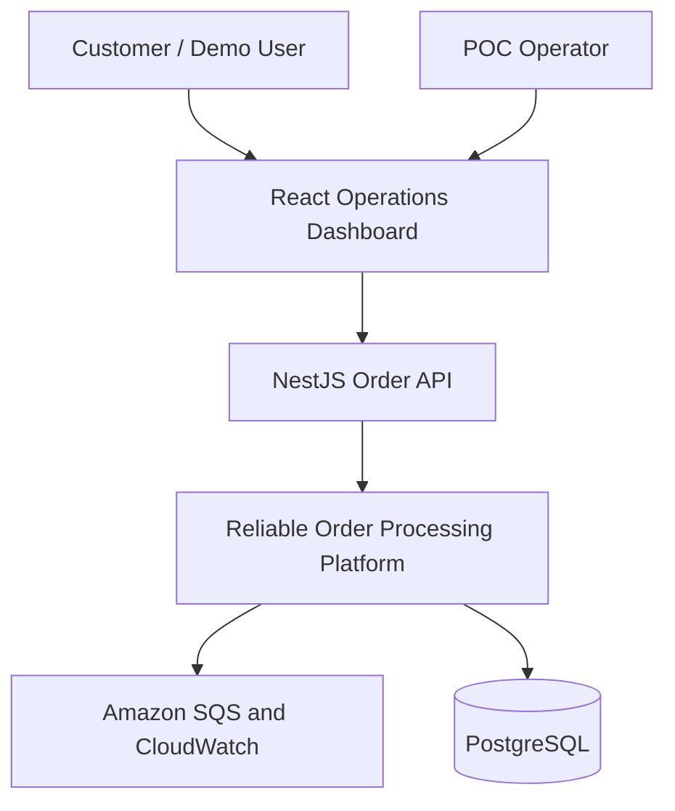

### Context responsibilities

- **Customer / Demo User:** creates orders and checks current state.
- **POC Operator:** injects failures, pauses consumers, generates load, and redrives DLQ messages.
- **React Dashboard:** exposes business and operational controls.
- **NestJS Order API:** validates commands and returns `202 Accepted` for asynchronous work.
- **Reliable Order Processing Platform:** owns publication, consumption, idempotency, workflow state, and audit events.
- **Amazon SQS:** buffers work and controls message delivery.
- **CloudWatch:** provides metrics, logs, dashboards, and alarms.
- **PostgreSQL:** stores orders, outbox records, processed-message records, and audit state.

---

## 6. Detailed Logical Architecture

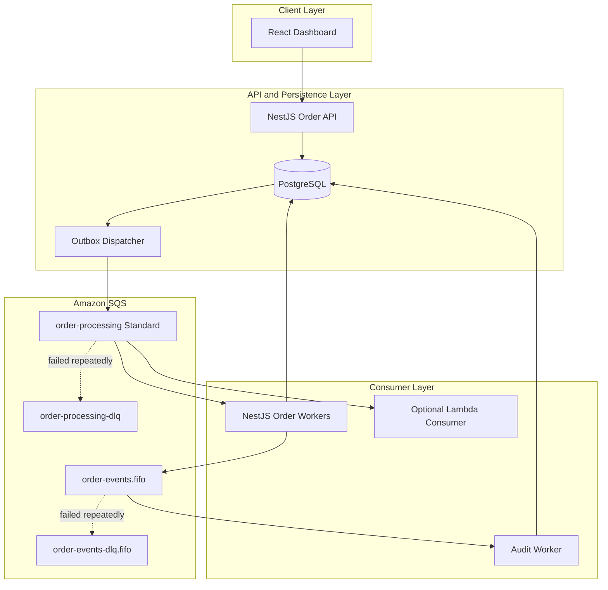

> The NestJS worker and Lambda consumer represent two learning modes. Do not enable both against the same queue when comparing behavior unless competing consumption is intentional.

### 6.1 Component Responsibilities

| Component | Main responsibilities |
|---|---|
| React Dashboard | Submit orders, display state, generate load, inject failure modes, display queue metrics |
| Order API | Validate requests, create order and outbox event atomically, expose query endpoints |
| PostgreSQL | Durable order, outbox, idempotency, and audit storage |
| Outbox Dispatcher | Lock unpublished records, send messages, mark records published, retry publication |
| Standard Queue | Buffer high-throughput order-processing jobs |
| Order Worker | Long-poll, validate, enforce idempotency, process, commit, and delete messages |
| FIFO Queue | Maintain order of lifecycle events within each order |
| Audit Worker | Persist ordered lifecycle history and detect illegal transitions |
| DLQs | Isolate messages that exceed the configured receive count |
| Lambda Consumer | Demonstrate AWS-managed polling, batching, scaling, and partial batch response |
| CloudWatch | Monitor backlog, age, in-flight messages, failures, throughput, and application logs |

---

## 7. Queue Topology and Configuration

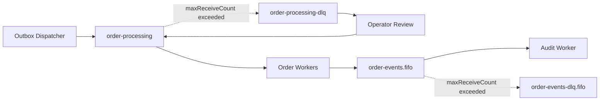

### 7.1 Initial Queue Settings

| Setting | Standard source | Standard DLQ | FIFO source | FIFO DLQ |
|---|---:|---:|---:|---:|
| Queue name | `order-processing` | `order-processing-dlq` | `order-events.fifo` | `order-events-dlq.fifo` |
| Queue type | Standard | Standard | FIFO | FIFO |
| Visibility timeout | 30 seconds | 30 seconds | 30 seconds | 30 seconds |
| Retention | 4 days | 14 days | 4 days | 14 days |
| Receive wait time | 20 seconds | 20 seconds | 20 seconds | 20 seconds |
| Delivery delay | 0 seconds | 0 seconds | 0 seconds | 0 seconds |
| DLQ max receive count | 3 | N/A | 3 | N/A |
| Server-side encryption | Enabled | Enabled | Enabled | Enabled |
| Content-based deduplication | N/A | N/A | Disabled initially | Disabled initially |

### 7.2 Why the Source Queue Is Standard

The order-processing job is a work item whose primary requirements are high throughput, buffering, and scalable competing consumers. Strict global order is unnecessary. Each order is independently idempotent, so Standard queue delivery is appropriate.

### 7.3 Why Lifecycle Events Use FIFO

The audit flow must record transitions for the same order in sequence:

```text
ORDER_CREATED -> INVENTORY_RESERVED -> PAYMENT_AUTHORIZED -> ORDER_CONFIRMED
```

FIFO message settings:

```text
MessageGroupId         = orderId
MessageDeduplicationId = eventId
```

This preserves ordering within one order while different `orderId` groups can be processed concurrently. Using one global message group would serialize all orders and unnecessarily limit parallelism.

### 7.4 Important FIFO Clarification

FIFO deduplication reduces duplicate enqueue operations within its deduplication behavior, but it does not make downstream business processing inherently exactly-once. A consumer can still be retried, crash after committing, or lose an acknowledgement. The consumer must remain idempotent.

---

## 8. Primary End-to-End Message Flow

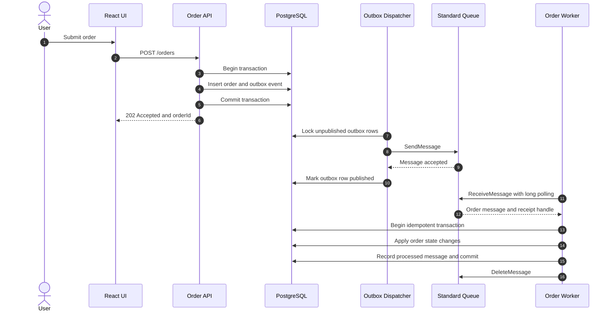

### 8.1 API Contract

#### Create order

```http
POST /api/v1/orders
Content-Type: application/json
Idempotency-Key: client-command-1001
```

```json
{
  "customerId": "customer-101",
  "items": [
    {
      "productId": "product-20",
      "quantity": 2,
      "unitPrice": 499.00
    }
  ],
  "failureMode": "NONE"
}
```

```http
HTTP/1.1 202 Accepted
Location: /api/v1/orders/ord-10001
```

```json
{
  "orderId": "ord-10001",
  "status": "QUEUED",
  "correlationId": "req-88372"
}
```

#### Query order

```http
GET /api/v1/orders/ord-10001
```

```json
{
  "orderId": "ord-10001",
  "status": "CONFIRMED",
  "version": 4,
  "updatedAt": "2026-08-31T10:31:08Z"
}
```

### 8.2 Recommended POC Endpoints

| Method | Endpoint | Purpose |
|---|---|---|
| `POST` | `/api/v1/orders` | Submit one order |
| `GET` | `/api/v1/orders/:id` | Read current order state |
| `GET` | `/api/v1/orders` | List recent orders |
| `POST` | `/api/v1/testing/load` | Generate a controlled traffic burst |
| `POST` | `/api/v1/testing/messages/poison` | Publish an invalid message |
| `POST` | `/api/v1/testing/messages/duplicate` | Publish the same business message twice |
| `POST` | `/api/v1/testing/worker/delay` | Change simulated processing duration |
| `POST` | `/api/v1/testing/worker/failure-rate` | Configure transient failure percentage |
| `GET` | `/api/v1/operations/queues` | Return selected queue metrics for the dashboard |
| `POST` | `/api/v1/operations/dlq/redrive` | Start an authorized POC redrive operation |

Testing and operations endpoints must be disabled outside POC environments.

---

## 9. Message Contract

### 9.1 Versioned Envelope

```json
{
  "messageId": "evt-7f67b28c",
  "messageType": "ORDER_PROCESSING_REQUESTED",
  "schemaVersion": 1,
  "correlationId": "req-88372",
  "causationId": "cmd-19384",
  "occurredAt": "2026-08-31T10:30:00Z",
  "producer": "order-api",
  "traceparent": "00-trace-id-span-id-01",
  "payload": {
    "orderId": "ord-10001",
    "customerId": "customer-101"
  }
}
```

### 9.2 Message Attributes

| Attribute | Example | Purpose |
|---|---|---|
| `messageType` | `ORDER_PROCESSING_REQUESTED` | Routing and validation |
| `schemaVersion` | `1` | Contract compatibility |
| `correlationId` | `req-88372` | End-to-end log correlation |
| `tenantId` | `demo-tenant` | Optional multi-tenant context |
| `contentType` | `application/json` | Deserialization contract |

### 9.3 Contract Rules

- Use JSON Schema, Zod, or class-validator at the consumer boundary.
- Reject unsupported `messageType` or `schemaVersion` values deliberately.
- Preserve backward compatibility during rolling deployments.
- Do not put access tokens, payment-card data, secrets, or unnecessary PII in messages.
- Keep large documents in S3 and send a bucket/key/version reference.
- Treat the message body as untrusted input even when it originates internally.

---

## 10. Data Architecture

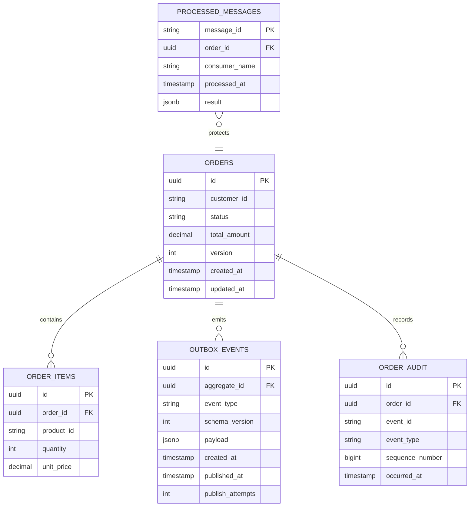

### 10.1 Order State Machine

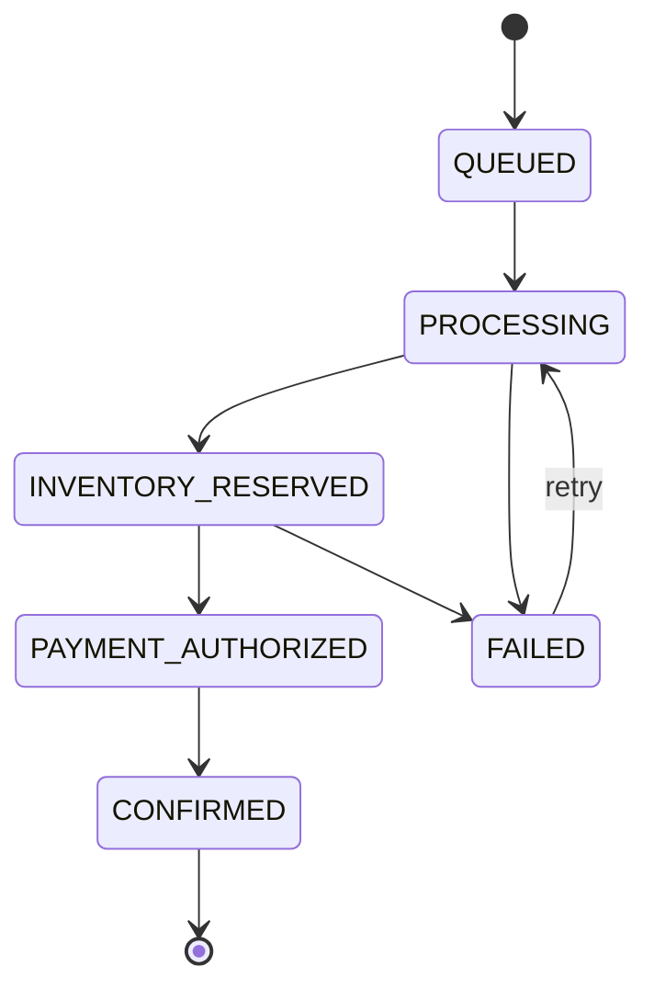

Use an optimistic `version` column to prevent concurrent state overwrites. Reject illegal transitions and record them with the correlation ID.

---

## 11. Transactional Outbox Pattern

### 11.1 Problem

The following naive operation is unsafe:

```text
1. Insert order into PostgreSQL
2. Send SQS message
```

If the database commit succeeds but publishing fails, the order exists without queued work. If publishing succeeds but the database transaction rolls back, the worker receives a message for a nonexistent order.

### 11.2 Solution

Write the order and outbox record in one local database transaction:

```sql
BEGIN;

INSERT INTO orders (...);
INSERT INTO outbox_events (...);

COMMIT;
```

The dispatcher publishes committed outbox rows independently.

### 11.3 Dispatcher Algorithm

```text
repeat:
    select a limited batch of unpublished outbox rows
    lock rows using FOR UPDATE SKIP LOCKED
    publish each record to SQS
    mark successfully published records with published_at
    increment publish_attempts when publication fails
```

The dispatcher itself may publish the same event more than once if it crashes after `SendMessage` succeeds but before `published_at` is committed. This is expected; downstream idempotency handles it.

---

## 12. Idempotent Consumer Pattern

### 12.1 Duplicate Scenario

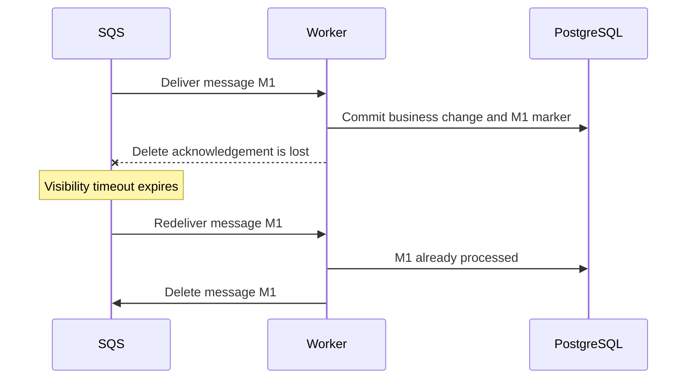

### 12.2 Database Guard

```sql
CREATE TABLE processed_messages (
    message_id VARCHAR(128) PRIMARY KEY,
    order_id UUID NOT NULL,
    consumer_name VARCHAR(100) NOT NULL,
    processed_at TIMESTAMPTZ NOT NULL DEFAULT NOW(),
    result JSONB
);
```

### 12.3 Processing Algorithm

```text
receive message
validate envelope and payload

begin database transaction
    insert messageId into processed_messages
    if unique-key conflict:
        message was already processed
        commit/rollback safely
        delete SQS message
        stop

    lock target order
    validate current state
    apply inventory/payment simulation
    update order
    insert lifecycle outbox event
commit database transaction

delete SQS message using the receipt handle
```

The idempotency marker and business change must be committed atomically. A cache-only idempotency key is not sufficient for a durable financial or inventory operation.

---

## 13. Visibility Timeout and Consumer Failure

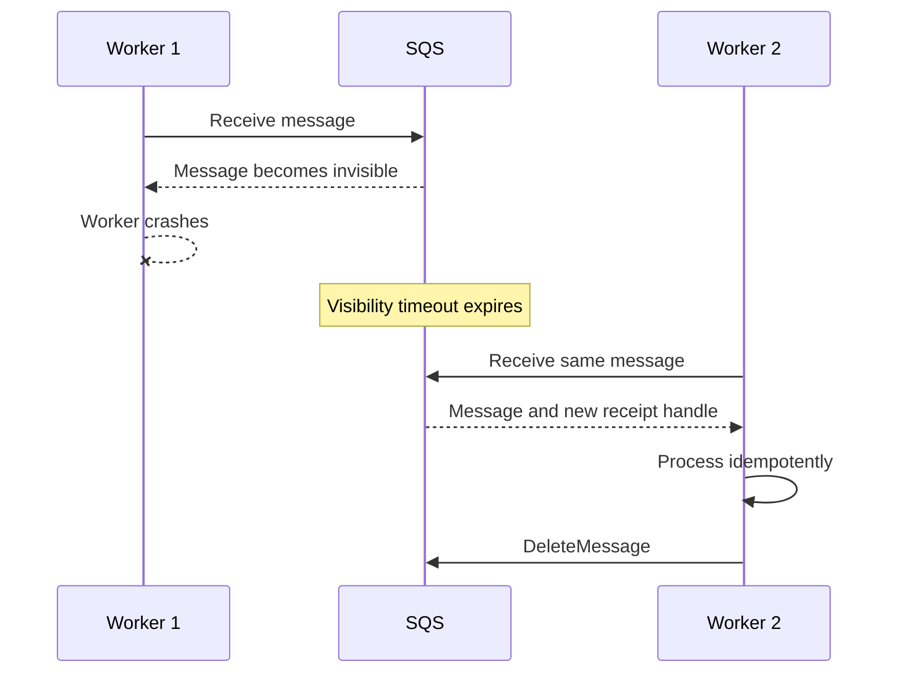

### 13.1 Starting Rule

Set the visibility timeout longer than the expected upper bound of processing time. For example, if P99 processing time is 8 seconds, start with 30 seconds and validate under load.

### 13.2 Variable or Long-Running Work

For unpredictable duration, implement a heartbeat that calls `ChangeMessageVisibility` before the current timeout expires. The heartbeat must stop when processing completes or fails.

### 13.3 POC Demonstration

1. Configure a 5-second visibility timeout.
2. Make the handler sleep for 15 seconds.
3. Run two workers.
4. Observe duplicate concurrent delivery.
5. Confirm that idempotency prevents duplicate business effects.
6. Increase the timeout or enable visibility extension.
7. Repeat and compare results.

---

## 14. Retry, DLQ, and Redrive Architecture

### 14.1 Failure Classification

| Failure class | Examples | Handling |
|---|---|---|
| Transient | Database timeout, rate limit, temporary dependency error | Do not delete; allow retry |
| Permanent business failure | Invalid order state, product permanently unavailable | Mark business outcome; usually delete |
| Poison message | Invalid JSON, unsupported schema, missing required identifier | Log safely; allow bounded attempts and DLQ |
| Worker defect | Null reference, unexpected exception | Retry within bounds, alert, then DLQ |
| Security violation | Unauthorized tenant, tampered content | Reject, audit, avoid leaking payload |

### 14.2 DLQ Flow

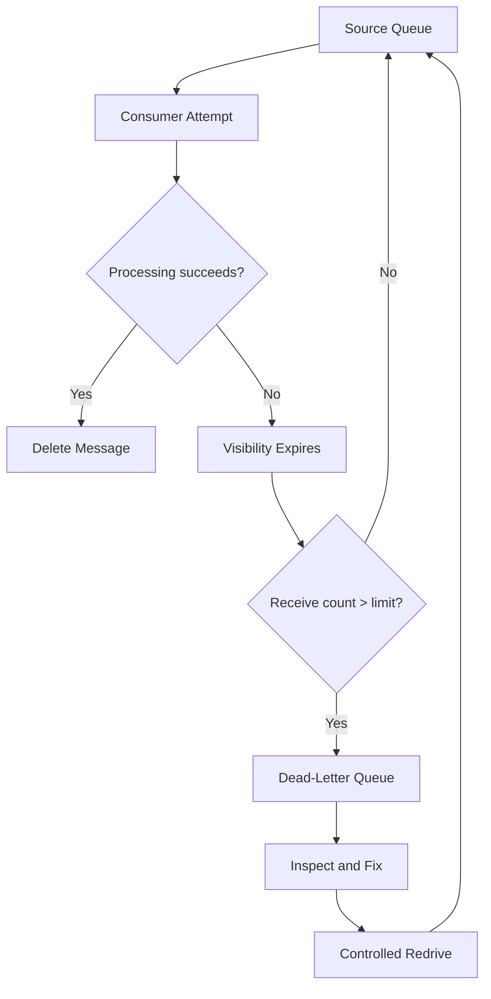

### 14.3 Redrive Runbook

1. Alarm when the DLQ has one or more visible messages.
2. Inspect message metadata, receive count, correlation ID, and sanitized error logs.
3. Determine whether the problem is code, configuration, dependency, or invalid data.
4. Deploy or apply the correction.
5. Start with a low redrive velocity.
6. Monitor source-queue age, depth, worker error rate, and downstream health.
7. Increase redrive rate gradually if healthy.
8. Confirm that the DLQ drains and source messages complete.
9. Record the incident and root cause.

Do not manually change the payload during native SQS redrive. If transformation is required, use a controlled repair process that reads, validates, publishes a new message with lineage metadata, and removes the old message only after success.

---

## 15. Long Polling and Batch Processing

### 15.1 Long Polling

Use `WaitTimeSeconds = 20` for worker receive calls unless latency requirements demand a different value. Ensure the HTTP client timeout is longer than the receive wait time.

Benefits:

- Fewer empty responses.
- Lower unnecessary API usage.
- Reduced false-empty responses.
- Messages return as soon as they become available.

### 15.2 Batch Operations

Use up to 10 messages per SQS send, receive, or delete batch request. Process each batch item independently.

For a custom NestJS worker:

```text
receive up to 10 messages
for each message with bounded concurrency:
    validate and process independently
collect successful receipt handles
delete successful messages in a batch
leave failed messages undeleted
inspect per-entry batch delete results
```

Every batch API can return partial success. Never assume that an HTTP-successful batch request means every entry succeeded.

### 15.3 Lambda Partial Batch Response

With Lambda, return failed record identifiers using `batchItemFailures`. Otherwise, one failed item can cause successfully processed items in the same batch to become visible and be retried.

For FIFO processing, stop processing later records from the affected message group after a failure so ordering is not violated.

---

## 16. NestJS Worker Design

### 16.1 Worker Lifecycle

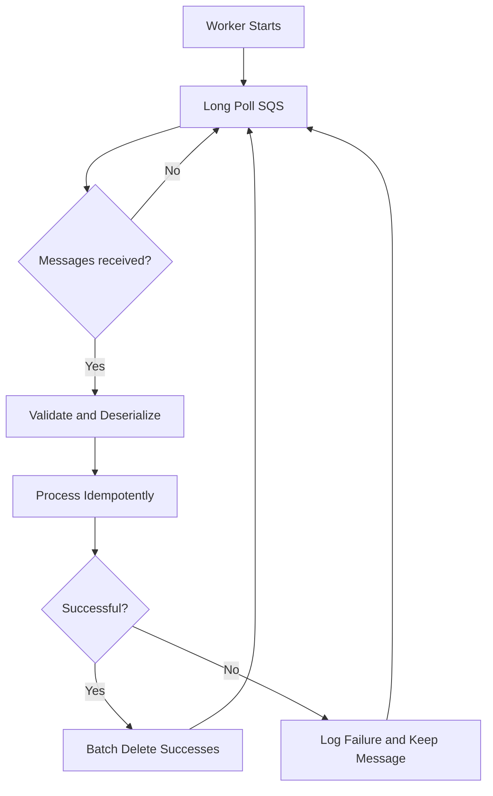

### 16.2 Graceful Shutdown

On `SIGTERM` or `SIGINT`:

1. Stop requesting new messages.
2. Allow in-progress work to finish within a shutdown deadline.
3. Extend visibility for work that can finish safely.
4. Do not delete unfinished messages.
5. Close database connections.
6. Exit cleanly.

### 16.3 Consumer Configuration

```text
SQS_WAIT_TIME_SECONDS=20
SQS_MAX_MESSAGES=10
SQS_VISIBILITY_TIMEOUT_SECONDS=30
WORKER_CONCURRENCY=5
WORKER_SHUTDOWN_GRACE_SECONDS=25
WORKER_VISIBILITY_HEARTBEAT_SECONDS=10
```

Do not hard-code queue URLs. Supply them through validated configuration.

---

## 17. AWS Deployment Architecture

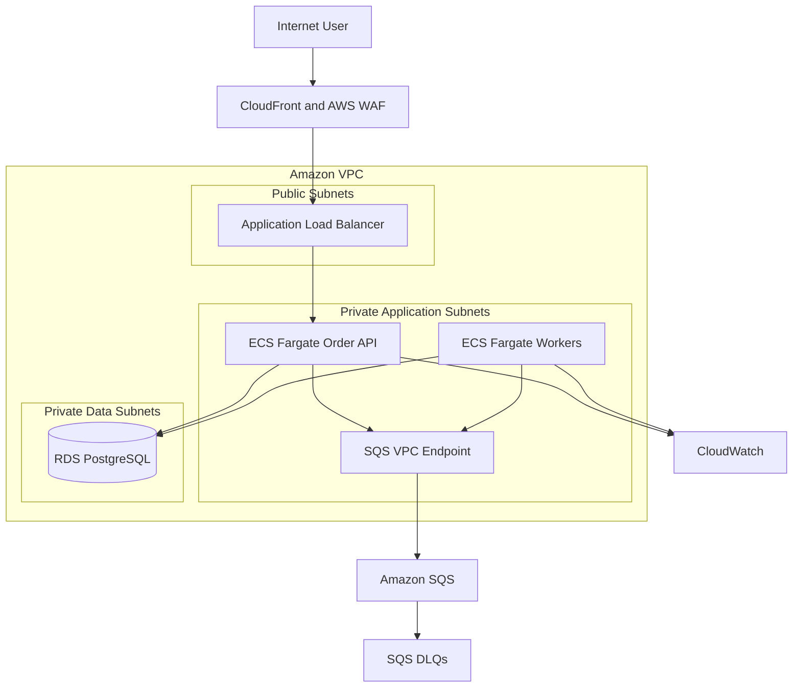

### 17.1 Recommended AWS Resources

| Area | AWS service | Purpose |
|---|---|---|
| Edge | CloudFront, WAF, ACM | TLS termination, protection, optional caching |
| Routing | Application Load Balancer | Route HTTPS traffic to the NestJS API |
| Compute | ECS Fargate | Run API, dispatcher, and worker containers |
| Serverless alternative | Lambda | Demonstrate managed SQS consumption |
| Messaging | Amazon SQS | Standard, FIFO, and DLQ queues |
| Database | Amazon RDS for PostgreSQL | Durable transactional storage |
| Secrets | Secrets Manager | Database and application secrets |
| Encryption | AWS KMS | Optional customer-managed keys |
| Private connectivity | Interface VPC endpoint for SQS | Access SQS without traversing the public internet |
| Container registry | Amazon ECR | Store versioned images |
| Monitoring | CloudWatch Logs, Metrics, Alarms | Operational visibility |
| Tracing | AWS X-Ray or OpenTelemetry | Cross-component trace correlation |
| Infrastructure | CDK, Terraform, or CloudFormation | Reproducible resources and policies |

### 17.2 Worker Scaling

For ECS workers, scale on backlog per task:

```text
backlogPerWorker = ApproximateNumberOfMessagesVisible / runningWorkerCount
```

Target capacity should account for arrival rate, average processing time, and business latency objectives.

A useful capacity estimate is:

```text
required concurrency ~= arrivalRatePerSecond * averageProcessingSeconds
```

Example: 100 messages/second × 0.2 seconds = approximately 20 concurrent processing slots, plus safety capacity.

For FIFO queues, concurrency is also constrained by the number and distribution of active message groups.

---

## 18. Local Development Architecture

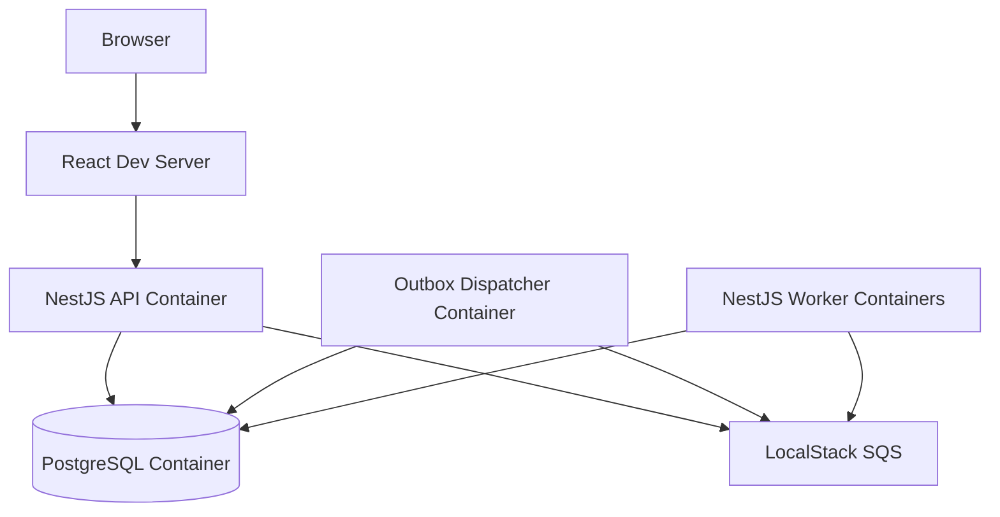

### 18.1 Docker Compose Services

```text
react-ui
order-api
outbox-dispatcher
order-worker-1
order-worker-2
audit-worker
postgres
localstack
```

LocalStack is useful for fast learning and failure experiments, but the final POC must also run against real AWS SQS because local emulation may not reproduce every distributed behavior, quota, metric, policy, or integration detail.

---

## 19. Security Architecture

### 19.1 IAM Separation

| Role | Required queue permissions |
|---|---|
| Outbox producer | `sqs:SendMessage`, optionally `sqs:SendMessageBatch`, `sqs:GetQueueUrl` |
| Order consumer | `sqs:ReceiveMessage`, `sqs:DeleteMessage`, `sqs:DeleteMessageBatch`, `sqs:ChangeMessageVisibility`, `sqs:GetQueueAttributes` |
| Audit producer | `sqs:SendMessage` on the FIFO queue only |
| Audit consumer | Receive/delete/change visibility on the FIFO queue only |
| DLQ operator | Explicit read and redrive permissions on approved queues |
| Infrastructure pipeline | Queue, policy, alarm, and role-management permissions scoped to deployment |

Producer roles must not receive or delete messages. Consumer roles must not modify queue policies or delete queues.

### 19.2 Queue Policy Controls

- Deny non-TLS requests with the `aws:SecureTransport` condition.
- Avoid wildcard principals.
- Restrict source accounts and source ARNs for service integrations.
- Restrict access through a VPC endpoint where required.
- Grant DLQ redrive permissions separately from normal consumption.
- Enable server-side encryption using SQS-managed or KMS keys.

### 19.3 Data Protection

- Never put secrets or payment-card data in message bodies or queue names.
- Minimize customer data and use opaque identifiers.
- Sanitize logs before recording payload content.
- Encrypt PostgreSQL, SQS, backups, and logs at rest.
- Use TLS for all service communication.
- Use IAM roles and temporary credentials, not static AWS keys in source code.
- Rotate secrets and use Secrets Manager in AWS.
- Apply retention and deletion rules appropriate to the data classification.

### 19.4 Threat Scenarios

| Threat | Primary controls |
|---|---|
| Unauthorized message injection | Least-privilege send role, queue policy, source conditions |
| Unauthorized consumption | Dedicated consumer role and private networking |
| Payload tampering | TLS, IAM authentication, validation, optional application signature |
| Sensitive-data leakage | Payload minimization, encryption, log redaction |
| Replay or duplicate processing | Message ID, API idempotency key, durable consumer idempotency |
| Poison-message denial of service | Bounded retries, DLQ, alarms, schema validation |
| Excessive redrive load | Restricted operator role and controlled redrive velocity |

---

## 20. Observability Architecture

### 20.1 Metrics

Monitor at minimum:

| Signal | Why it matters |
|---|---|
| `ApproximateNumberOfMessagesVisible` | Current backlog waiting to be processed |
| `ApproximateNumberOfMessagesNotVisible` | In-flight workload and possible stuck processing |
| `ApproximateAgeOfOldestMessage` | User-impacting processing delay |
| `NumberOfMessagesSent` | Producer throughput |
| `NumberOfMessagesReceived` | Consumer delivery activity, including retries |
| `NumberOfMessagesDeleted` | Successfully acknowledged processing |
| DLQ visible-message count | Persistent processing failures |
| Worker success/error count | Application-level outcome |
| Handler duration P50/P95/P99 | Visibility and capacity tuning input |
| Duplicate-detected count | Evidence of at-least-once behavior |
| Outbox unpublished age/count | Publishing health |
| Redrive count and result | Recovery activity |

### 20.2 Suggested Alarms

| Alarm | Example POC threshold |
|---|---|
| DLQ not empty | `>= 1` message for 1 minute |
| Oldest message too old | `> 120` seconds for 5 minutes |
| Backlog too high | `> 1,000` visible messages for 5 minutes |
| No delete progress | Messages visible but no deletes for 5 minutes |
| Worker error spike | Error rate `> 5%` for 5 minutes |
| Outbox stuck | Oldest unpublished event `> 60` seconds |

Thresholds are learning defaults, not production recommendations. Production thresholds must derive from service-level objectives and measured workloads.

### 20.3 Structured Logging

Every log record should include applicable identifiers:

```json
{
  "level": "info",
  "service": "order-worker",
  "message": "Order processing completed",
  "messageId": "evt-7f67b28c",
  "orderId": "ord-10001",
  "correlationId": "req-88372",
  "receiveCount": 1,
  "processingDurationMs": 842
}
```

Do not log receipt handles, credentials, secrets, or complete sensitive payloads.

---

## 21. Reliability and Failure Matrix

| Failure point | Expected behavior | Verification |
|---|---|---|
| API fails before DB commit | No order and no outbox event | Query database |
| API fails after DB commit | Order and outbox event remain durable | Dispatcher later publishes |
| Dispatcher fails before send | Outbox remains unpublished | Restart and verify publication |
| Dispatcher fails after send, before mark | Message may be sent again | Consumer detects duplicate |
| Worker crashes before DB commit | Message becomes visible again | Restart worker and process |
| Worker crashes after DB commit, before delete | Duplicate delivery occurs | Idempotency prevents second effect |
| Processing exceeds visibility timeout | Concurrent redelivery may occur | Two workers plus artificial delay |
| One batch item fails | Successful items are not retried unnecessarily | Partial result test |
| Invalid message repeats | Message moves to DLQ | Observe receive count and DLQ |
| DLQ is redriven too quickly | Source/downstream may be overloaded | Controlled redrive experiment |
| FIFO group message fails | Later messages in group are blocked/retried appropriately | Multi-group ordering test |
| Database unavailable | Messages remain queued and retry later | Stop/restart PostgreSQL |
| Consumer is paused | Queue buffers traffic; age increases | Dashboard metrics |

---

## 22. Hands-On Experiment Plan

### Experiment 1: Basic Asynchronous Processing

1. Start the API and queue but keep the worker stopped.
2. Submit an order and confirm `202 Accepted`.
3. Verify the order remains `QUEUED` and the queue has a visible message.
4. Start the worker.
5. Verify the order reaches `CONFIRMED` and the message is deleted.

**Learning:** decoupling, buffering, and eventual completion.

### Experiment 2: Worker Crash and Redelivery

1. Receive a message.
2. Crash the worker before deletion.
3. Wait for visibility timeout.
4. Start a second worker.
5. Confirm redelivery with a higher receive count.

**Learning:** in-flight state, visibility timeout, and at-least-once delivery.

### Experiment 3: Duplicate Business Message

1. Publish two messages with the same `messageId`.
2. Run multiple workers.
3. Confirm one business operation and one duplicate detection.

**Learning:** idempotency belongs in the consumer/business boundary.

### Experiment 4: Incorrect Visibility Timeout

1. Set visibility to 5 seconds.
2. Make processing take 15 seconds.
3. Run two workers.
4. Observe concurrent delivery.
5. enable visibility heartbeat or increase timeout.
6. Repeat and compare.

**Learning:** visibility is not a permanent lock.

### Experiment 5: Poison Message and DLQ

1. Publish malformed or unsupported content.
2. Let it fail three receives.
3. Verify movement to the DLQ.
4. Fix the consumer or data-production issue.
5. Redrive at a low rate.
6. Verify successful completion.

**Learning:** bounded retries, failure isolation, and operational recovery.

### Experiment 6: Standard Versus FIFO

1. Publish `CREATED`, `PAID`, `PACKED`, and `SHIPPED` rapidly.
2. Compare Standard delivery with FIFO delivery.
3. Use one FIFO group for all orders and measure throughput.
4. Change to one group per order and measure concurrency.

**Learning:** ordering scope and message-group design.

### Experiment 7: Long Versus Short Polling

1. Poll an empty queue with a wait time of zero.
2. Count empty receives for five minutes.
3. Repeat with a 20-second wait time.
4. Compare calls, empty responses, latency, and estimated cost.

**Learning:** long polling efficiency.

### Experiment 8: Batch Partial Failure

1. Receive a batch of 10 messages.
2. Make message 5 fail.
3. Delete only the nine successful receipt handles.
4. Confirm only message 5 returns.
5. Repeat with Lambda partial batch responses.

**Learning:** per-item batch results and retry isolation.

### Experiment 9: Traffic Burst and Scaling

1. Publish 10,000 messages rapidly.
2. Drain the queue with one worker.
3. Repeat with five workers.
4. Compare oldest-message age, drain time, CPU, and database load.

**Learning:** competing consumers, backpressure, and bottleneck movement.

### Experiment 10: Retention

1. Use a short retention value in an isolated test queue.
2. Leave messages unconsumed.
3. Observe expiry.
4. Compare source and DLQ retention behavior.

**Learning:** retention is a data-loss boundary, not a retry policy.

---

## 23. Test Strategy

### 23.1 Unit Tests

- Message envelope and payload validation.
- Order state transitions.
- Retry classification.
- Idempotency duplicate handling.
- Outbox record creation.
- FIFO group and deduplication ID selection.
- Log redaction.

### 23.2 Integration Tests

- PostgreSQL transaction creates order and outbox atomically.
- Dispatcher publishes and marks outbox state.
- Worker commits before deleting.
- Duplicate message does not duplicate business effects.
- Visibility expiry causes safe redelivery.
- Poison message reaches DLQ.
- FIFO events remain ordered per order.
- Batch partial failure retries only failed work.

### 23.3 Load Tests

- Sustained arrival rate.
- Sudden burst.
- Slow database response.
- One versus multiple workers.
- Uniform versus hot FIFO message groups.
- Redrive while live traffic is entering the source queue.

### 23.4 Security Tests

- Producer role cannot receive or delete.
- Consumer role cannot send to unrelated queues.
- Non-TLS requests are denied.
- Unauthorized queue and DLQ access is denied.
- Invalid and oversized payload handling is safe.
- Sensitive fields are absent from logs.

---

## 24. Recommended Repository Structure

```text
reliable-order-processing/
├── apps/
│   ├── web-dashboard/
│   ├── order-api/
│   ├── outbox-dispatcher/
│   ├── order-worker/
│   ├── audit-worker/
│   └── lambda-order-consumer/
├── packages/
│   ├── message-contracts/
│   ├── observability/
│   ├── database/
│   ├── sqs-client/
│   └── test-fixtures/
├── infrastructure/
│   ├── localstack/
│   ├── cdk-or-terraform/
│   ├── iam/
│   └── cloudwatch/
├── tests/
│   ├── integration/
│   ├── failure/
│   ├── load/
│   └── security/
├── docs/
│   ├── architecture.md
│   ├── message-contracts.md
│   ├── experiments.md
│   └── dlq-runbook.md
├── docker-compose.yml
├── .env.example
└── README.md
```

---

## 25. Delivery Plan

### Phase 1: SQS Fundamentals

- Create the Standard queue and DLQ.
- Implement basic NestJS producer and long-polling consumer.
- Demonstrate receive, visibility, delete, and redelivery.
- Add a minimal React order screen.

**Exit criteria:** orders are processed asynchronously, and worker crashes cause safe redelivery.

### Phase 2: Production Reliability Patterns

- Add PostgreSQL.
- Add order state transitions.
- Implement transactional outbox.
- Implement durable consumer idempotency.
- Add contract validation and correlation IDs.

**Exit criteria:** no tested crash point causes lost work or duplicate business effects.

### Phase 3: FIFO, Batch, and DLQ Operations

- Add FIFO lifecycle events.
- Add multiple message groups.
- Implement batch send/receive/delete.
- Implement poison-message tests.
- Add DLQ inspection and redrive runbook.

**Exit criteria:** ordering is demonstrated per order, and failed messages are recoverable.

### Phase 4: AWS Deployment and Observability

- Define infrastructure as code.
- Deploy API and workers.
- Configure IAM, encryption, and private access as needed.
- Add CloudWatch dashboards and alarms.
- Add the Lambda consumer alternative.

**Exit criteria:** the POC runs in AWS with traceable, least-privilege message processing.

### Phase 5: Performance and Architecture Review

- Run 10,000-message and sustained-rate tests.
- Tune visibility, batch size, and worker concurrency.
- Demonstrate backlog-based scaling.
- Capture results and architectural decisions.

**Exit criteria:** the team can explain measured bottlenecks and justify queue settings.

---

## 26. POC Acceptance Criteria

- [ ] `POST /orders` returns `202 Accepted` without waiting for processing.
- [ ] An order and outbox event are saved in the same database transaction.
- [ ] The dispatcher eventually publishes every committed outbox event.
- [ ] A worker uses long polling and manual acknowledgement.
- [ ] A message is deleted only after durable processing succeeds.
- [ ] A worker crash causes redelivery without losing work.
- [ ] Duplicate delivery does not duplicate payment or inventory effects.
- [ ] An invalid message moves to the DLQ after the configured attempts.
- [ ] A DLQ message can be safely redriven after correction.
- [ ] FIFO lifecycle events are ordered within each order.
- [ ] Different FIFO message groups process concurrently.
- [ ] Batch partial failure retries only failed messages.
- [ ] Multiple workers drain a burst faster than one worker.
- [ ] The dashboard displays order state, backlog, age, and DLQ count.
- [ ] CloudWatch alarms detect DLQ messages and excessive message age.
- [ ] Producer and consumer IAM permissions are separated.
- [ ] Queue traffic requires TLS and messages are encrypted at rest.
- [ ] Logs contain correlation fields and exclude sensitive content.
- [ ] LocalStack and real-AWS execution paths are documented.

---

## 27. Key Architecture Decisions

| Decision | Choice | Reason |
|---|---|---|
| Main work queue | Standard | High throughput and no strict cross-order ordering requirement |
| Lifecycle queue | FIFO | Preserve transitions for the same order |
| FIFO grouping | `orderId` | Per-order order with cross-order parallelism |
| Acknowledgement | Manual delete after commit | Prevent acknowledgement before durable success |
| Database consistency | Transactional outbox | Avoid database/SQS dual-write loss |
| Duplicate protection | PostgreSQL processed-message table | Durable idempotency with business transaction |
| Polling | 20-second long polling | Reduce empty receives and unnecessary calls |
| Batch size | Start at 10 | Exercise batch efficiency and partial results |
| Failure isolation | DLQ with bounded receives | Prevent infinite poison-message cycling |
| Source retention | 4 days initially | POC-friendly default window |
| DLQ retention | 14 days | Preserve diagnostic time beyond source retention |
| Local runtime | Docker Compose and LocalStack | Fast, repeatable experiments |
| AWS runtime | ECS Fargate; Lambda alternative | Compare explicit worker control with managed polling |
| Infrastructure | CDK or Terraform | Reviewable, reproducible configuration |

---

## 28. Senior-Level Review Questions

1. What business guarantee is required: accepted, delivered, processed, or processed exactly once in effect?
2. Which operation defines successful processing and where is it committed?
3. Can every side effect be made idempotent?
4. What happens if the worker commits and crashes before deleting the message?
5. What happens if the outbox dispatcher sends and crashes before marking the row?
6. Is strict ordering genuinely required, and at what aggregation boundary?
7. Could one hot FIFO message group reduce system throughput?
8. Is the visibility timeout derived from measured P99 processing time?
9. How will long-running processing extend visibility safely?
10. Which failures should retry, fail the business operation, or reach the DLQ?
11. Who owns DLQ review and how quickly must it occur?
12. Can redrive overload a repaired downstream service?
13. Are message contracts backward compatible during rolling deployment?
14. Which queue metrics map directly to user-facing service-level objectives?
15. What is the maximum tolerable backlog age?
16. Is sensitive data excluded from messages, attributes, queue names, and logs?
17. Are producer, consumer, and operator permissions separated?
18. What is the recovery plan if messages approach retention expiry?

---

## 29. AWS SQS Facts Relevant to This POC

At the time of this document:

- A batch request can include up to 10 messages.
- SQS message retention can be configured from 1 minute to 14 days; the default is 4 days.
- Visibility timeout can be configured from 0 seconds to 12 hours; the default is 30 seconds.
- Long polling can wait for up to 20 seconds.
- The maximum message size is 1 MiB.
- Standard queues provide very high throughput and at-least-once delivery.
- FIFO ordering applies within a message group, and different groups enable parallelism.

Validate current quotas and regional throughput before using the POC design for production capacity planning.

---

## 30. Official AWS References

- [Amazon SQS Developer Guide](https://docs.aws.amazon.com/AWSSimpleQueueService/latest/SQSDeveloperGuide/welcome.html)
- [Amazon SQS message quotas](https://docs.aws.amazon.com/AWSSimpleQueueService/latest/SQSDeveloperGuide/quotas-messages.html)
- [Amazon SQS visibility timeout](https://docs.aws.amazon.com/AWSSimpleQueueService/latest/SQSDeveloperGuide/sqs-visibility-timeout.html)
- [Amazon SQS short and long polling](https://docs.aws.amazon.com/AWSSimpleQueueService/latest/SQSDeveloperGuide/sqs-short-and-long-polling.html)
- [Amazon SQS long-polling best practices](https://docs.aws.amazon.com/AWSSimpleQueueService/latest/SQSDeveloperGuide/best-practices-setting-up-long-polling.html)
- [Amazon SQS dead-letter queues](https://docs.aws.amazon.com/AWSSimpleQueueService/latest/SQSDeveloperGuide/sqs-dead-letter-queues.html)
- [Amazon SQS DLQ redrive](https://docs.aws.amazon.com/AWSSimpleQueueService/latest/SQSDeveloperGuide/sqs-configure-dead-letter-queue-redrive.html)
- [Amazon SQS FIFO delivery logic](https://docs.aws.amazon.com/AWSSimpleQueueService/latest/SQSDeveloperGuide/FIFO-queues-understanding-logic.html)
- [Amazon SQS security best practices](https://docs.aws.amazon.com/AWSSimpleQueueService/latest/SQSDeveloperGuide/sqs-security-best-practices.html)
- [Using AWS Lambda with Amazon SQS](https://docs.aws.amazon.com/lambda/latest/dg/with-sqs.html)

---

## 31. Final Outcome

When complete, this POC will be more than an SQS send-and-receive demo. It will demonstrate how to design a recoverable, observable, secure, and scalable asynchronous workflow under real failure conditions. It can be used for personal learning, architecture reviews, engineering workshops, and leadership demonstrations.

