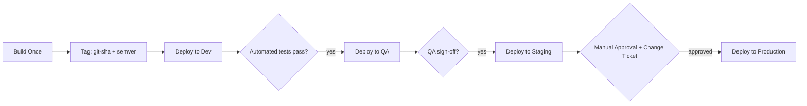

# AWS CI/CD Architecture & Implementation Guide (Frontend + Backend)

> Document 1 of 2. Companion document: [Azure-CICD-Frontend-Backend.md](./Azure-CICD-Frontend-Backend.md)

A production-grade, end-to-end reference for designing, implementing, and operating CI/CD pipelines on AWS for both frontend (SPA/static/SSR) and backend (API/microservices) applications.

---

## 0. How to Use This Document

This guide is organized so you can read it top-to-bottom as a learning path, or jump directly to a stage (e.g., "Artifact Storage") as a reference during implementation. Every pipeline stage is documented with the same template:

- **Purpose** — what problem this stage solves
- **Why it exists** — the risk/cost of skipping it
- **Inputs** — what enters the stage
- **Outputs** — what leaves the stage
- **AWS Tools/Services** — concrete service choices
- **Configuration** — real config/YAML/JSON
- **Security Considerations**
- **Common Failures**
- **Troubleshooting**
- **Best Practices**
- **Production Considerations**

> **Assumption flag:** Statements marked with `⚠ VERIFY` depend on account-specific limits, regional availability, or pricing that changes over time — confirm against current AWS documentation before relying on them in production.

---

## 1. Glossary (Acronyms Defined on First Use)

| Term | Definition |
|---|---|
| **CI** | Continuous Integration — automatically building and testing code on every change |
| **CD** | Continuous Delivery/Deployment — automatically preparing (Delivery) or automatically releasing (Deployment) validated code to environments |
| **VCS** | Version Control System (e.g., Git) |
| **PR** | Pull Request — a proposed code change submitted for review before merging |
| **SPA** | Single Page Application — a frontend app that runs mostly in the browser (React/Angular/Vue) |
| **SSR** | Server-Side Rendering — HTML generated on the server per request (e.g., Next.js) |
| **SAST** | Static Application Security Testing — scanning source code without executing it |
| **DAST** | Dynamic Application Security Testing — scanning a running application |
| **SCA** | Software Composition Analysis — scanning third-party dependencies for known vulnerabilities |
| **SBOM** | Software Bill of Materials — a manifest listing all components/dependencies in a build |
| **IAM** | Identity and Access Management — AWS's permission system |
| **IaC** | Infrastructure as Code — defining infrastructure in versioned config (CloudFormation, CDK, Terraform) |
| **ECR** | Elastic Container Registry — AWS's Docker image registry |
| **ECS** | Elastic Container Service — AWS's container orchestration service |
| **EKS** | Elastic Kubernetes Service — AWS's managed Kubernetes |
| **S3** | Simple Storage Service — AWS's object storage |
| **CDN** | Content Delivery Network (AWS's is CloudFront) |
| **OAC** | Origin Access Control — restricts S3 bucket access to only CloudFront |
| **SSM** | Systems Manager (specifically **Parameter Store** here) — a config/secret storage service |
| **KMS** | Key Management Service — manages encryption keys |
| **ARN** | Amazon Resource Name — the unique identifier for an AWS resource |
| **UAT** | User Acceptance Testing — business/stakeholder validation before production |
| **RTO/RPO** | Recovery Time Objective / Recovery Point Objective — disaster recovery targets |
| **Blue/Green** | Deployment strategy running two identical environments, switching traffic atomically |
| **Canary** | Deployment strategy releasing to a small % of traffic before full rollout |
| **MTTR** | Mean Time To Recovery |
| **OIDC** | OpenID Connect — used here for GitHub Actions ↔ AWS federated auth without long-lived keys |

---

## 2. High-Level Architecture Overview

```mermaid
flowchart LR
    Dev[Developer] -->|git push| Repo[(CodeCommit / GitHub)]
    Repo --> Trigger[EventBridge / Webhook Trigger]
    Trigger --> Pipeline[CodePipeline]
    subgraph CI["CI Stage"]
        Lint[Lint & Code Quality]
        SAST[SAST + SCA Scan]
        Build[CodeBuild: Build]
        Test[Unit/Integration Tests]
    end
    Pipeline --> Lint --> SAST --> Build --> Test
    Test --> Artifact{Artifact Type}
    Artifact -->|Static bundle| S3Artifacts[(S3 Artifact Bucket)]
    Artifact -->|Container image| ECRRepo[(ECR)]
    S3Artifacts --> DeployFE[CodeDeploy / S3 Sync + CloudFront Invalidation]
    ECRRepo --> DeployBE[CodeDeploy / ECS Rolling or Blue-Green]
    DeployFE --> Dev1[Dev Env]
    DeployBE --> Dev1
    Dev1 -->|approval| QA[QA/Test Env]
    QA -->|approval| Stg[Staging/UAT]
    Stg -->|manual approval gate| Prod[Production]
    Prod --> CW[CloudWatch: Metrics/Logs/Alarms]
    CW -->|alarm breach| Rollback[Automated Rollback]
```



**Core principle:** Frontend and backend pipelines are **independent and decoupled** (separate repos or separate build definitions in a monorepo), each with its own build/test/deploy cadence, but they converge at the **environment level** — e.g., "Staging" means "current frontend build + current backend build deployed together and tested as a system."

---

## 3. Repository & Branching Strategy

### 3.1 Recommended Strategy: Trunk-Based Development with Short-Lived Feature Branches

```
main (protected, always deployable)
 ├── feature/JIRA-123-add-checkout
 ├── feature/JIRA-124-fix-auth-bug
 ├── release/2026.08.1   (optional, cut only if you need release stabilization)
 └── hotfix/JIRA-200-prod-incident
```

- **`main`**: Protected branch. Every merge triggers CI. Deployable to Dev automatically, to higher environments via promotion.
- **`feature/*`**: Short-lived (< 2-3 days ideally). Opens a PR into `main`. Triggers CI (build+test+scan) but **does not deploy**.
- **`release/*`** (optional): Used only if you need a stabilization window (e.g., regulated industries). Most modern AWS shops skip this and rely on feature flags instead.
- **`hotfix/*`**: Branches from the current production tag, patched, tested, merged back to `main` and cherry-picked to release if applicable.

**Why trunk-based over GitFlow:** GitFlow's long-lived `develop`/`release` branches cause merge conflicts, delayed integration, and drift between branches and reality. Trunk-based development forces small, frequent, low-risk merges — the foundation that makes CI/CD actually continuous.

### 3.2 Branch Protection Rules (GitHub example, applies conceptually to CodeCommit approval rules too)

- Require PR before merging to `main`
- Require ≥1 (ideally 2) approving reviews
- Require status checks to pass: `build`, `unit-tests`, `sast-scan`, `sca-scan`
- Require branches to be up to date before merging
- Disallow force-push and branch deletion on `main`
- Require signed commits (recommended for regulated environments) `⚠ VERIFY org policy`

### 3.3 Monorepo vs Polyrepo

| Aspect | Monorepo (frontend+backend together) | Polyrepo (separate repos) |
|---|---|---|
| Atomic cross-stack changes | Easy (one PR) | Requires coordinated PRs |
| CI trigger scoping | Needs path filters (`paths:` in CodeBuild/GitHub Actions) to avoid rebuilding everything | Naturally scoped |
| Access control granularity | Harder (same repo perms for all) | Easy (per-team repo perms) |
| Tooling complexity | Higher (Nx/Turborepo/Lerna needed) | Lower |
| Recommended when | Small-to-mid team, tightly coupled FE/BE | Larger orgs, independent release cadences |

---

## 4. Environments & Promotion Strategy

### 4.1 Environment Ladder

| Environment | Purpose | Data | Deploy Trigger | Approval |
|---|---|---|---|---|
| **Development (Dev)** | Fast feedback for engineers, integration testing of merged code | Synthetic/anonymized | Automatic on merge to `main` | None |
| **QA/Test** | Manual + automated QA, exploratory testing | Synthetic, seeded fixtures | Automatic after Dev passes smoke tests, or on-demand | Optional (QA lead) |
| **Staging/UAT** | Production-like environment; performance, security, and business-stakeholder acceptance testing | Masked copy of prod data or realistic synthetic data | Manual trigger or automatic after QA sign-off | Required (Eng lead / Product) |
| **Production (Prod)** | Live customer traffic | Real data | Manual approval gate | Required (Release manager + change ticket) |

### 4.2 Promotion Strategy: "Build Once, Promote the Artifact"

**Critical principle:** You build the artifact (container image or static bundle) **exactly once**, and the *same immutable artifact* is promoted through Dev → QA → Staging → Prod. You never rebuild per environment — only re-configure (env vars, secrets references) at deploy time.



**Why this matters:** If you rebuild per environment, you risk "it worked in staging but broke in prod" due to non-determinism (dependency drift, different base image digest, different build-time env leaking into the binary). Building once and promoting the artifact eliminates an entire class of environment-drift bugs.

### 4.3 Approval Gates in AWS CodePipeline

```json
{
  "name": "ApprovalForProduction",
  "actions": [
    {
      "name": "ManualApproval",
      "actionTypeId": {
        "category": "Approval",
        "owner": "AWS",
        "provider": "Manual",
        "version": "1"
      },
      "configuration": {
        "NotificationArn": "arn:aws:sns:us-east-1:123456789012:pipeline-approvals",
        "CustomData": "Approve deployment of build #{codepipeline.PipelineExecutionId} to Production"
      }
    }
  ]
}
```

- SNS notifies an approver group (Slack via SNS→Lambda→Slack webhook, or email).
- Approval action pauses the pipeline indefinitely (default 7-day timeout, configurable) until approved/rejected.
- Combine with an AWS Lambda **validation action** that checks a change-ticket ID against Jira/ServiceNow before allowing approval, for regulated environments `⚠ VERIFY compliance requirement`.

---

## 5. Frontend CI/CD Pipeline (AWS)

Target stack assumption: React/Angular/Vue SPA, or Next.js SSR. Static assets served via **S3 + CloudFront**; SSR served via **Lambda@Edge / Lambda Function URLs / ECS Fargate** depending on rendering needs.

### 5.1 Source Control & Trigger

- **Purpose:** Detect a new commit/PR and kick off the pipeline.
- **Why it exists:** Manual pipeline triggering doesn't scale and introduces human delay/error.
- **Inputs:** Git push event, PR event.
- **Outputs:** A pipeline execution with a specific commit SHA as its context.
- **Tools:** CodeCommit + EventBridge rule → CodePipeline; or GitHub + CodeStar Connections (webhook-based) → CodePipeline; or fully GitHub Actions (self-contained, calls AWS via OIDC).
- **Configuration (CodePipeline source stage via GitHub CodeStar Connection):**

```yaml
Stages:
  - Name: Source
    Actions:
      - Name: SourceAction
        ActionTypeId:
          Category: Source
          Owner: AWS
          Provider: CodeStarSourceConnection
          Version: '1'
        Configuration:
          ConnectionArn: arn:aws:codestar-connections:us-east-1:123456789012:connection/abc-123
          FullRepositoryId: myorg/frontend-app
          BranchName: main
          OutputArtifactFormat: CODE_ZIP
        OutputArtifacts:
          - Name: SourceOutput
```

- **Security Considerations:** Use CodeStar Connections (OAuth-based) instead of storing GitHub personal access tokens in plaintext. Restrict the connection to specific repos.
- **Common Failures:** Webhook not firing (connection needs re-authorization after GitHub org permission changes); wrong branch filter.
- **Troubleshooting:** Check CodeStar Connections console for "Pending" status (needs manual handshake); check EventBridge rule metrics for trigger misses.
- **Best Practices:** Trigger only on `main` and release branches for deploy pipelines; use a separate lightweight "PR validation" pipeline (or GitHub Actions) for feature branches that only runs build+test+scan, never deploy.
- **Production Considerations:** Add path filters so a monorepo frontend change doesn't trigger a backend deploy pipeline and vice versa.

### 5.2 Pull Request & Code Review

- **Purpose:** Human + automated gate before code merges to a deployable branch.
- **Why it exists:** Catches logic errors, design issues, and knowledge-sharing gaps that automation can't.
- **Inputs:** Feature branch diff.
- **Outputs:** Approved/rejected PR; CI status checks attached to the PR.
- **Tools:** GitHub PRs (most common even in AWS shops) or CodeCommit pull requests + CodeGuru Reviewer (AWS's ML-based code review tool for Java/Python).
- **Configuration:** Branch protection (see §3.2) + required status checks:
  - `ci/lint`
  - `ci/unit-tests`
  - `ci/sast`
  - `ci/sca`
  - `ci/build`
- **Security Considerations:** PR pipelines must run with **read-only, least-privilege** AWS credentials — never deploy credentials — since PR branches can be from external forks.
- **Common Failures:** Flaky tests blocking merges; reviewers rubber-stamping due to PR fatigue (large diffs).
- **Troubleshooting:** Keep PRs small (< 400 lines changed as a soft rule) to reduce review fatigue and flake surface area.
- **Best Practices:** Use CODEOWNERS file to auto-assign domain-expert reviewers; require at least one reviewer outside the author's immediate sub-team for critical paths (auth, payments).
- **Production Considerations:** Track PR cycle time (open→merge) as a DORA-adjacent engineering health metric.

### 5.3 Code Quality (Lint, Format, Static Analysis)

- **Purpose:** Enforce consistent style and catch code smells before they reach build/test.
- **Why it exists:** Style debates and preventable bugs (unused vars, unreachable code, `any` abuse in TypeScript) waste review time; catching them in CI is instant and objective.
- **Inputs:** Source code.
- **Outputs:** Pass/fail + annotated report (e.g., SARIF for GitHub code scanning).
- **Tools:** ESLint + Prettier (JS/TS), Stylelint (CSS), `tsc --noEmit` (TypeScript type-check as a quality gate).
- **Configuration (CodeBuild buildspec fragment):**

```yaml
phases:
  install:
    commands:
      - npm ci
  pre_build:
    commands:
      - npm run lint
      - npx tsc --noEmit
      - npm run format:check
```

- **Security Considerations:** Lock down `npm ci` (not `npm install`) to respect `package-lock.json` exactly — prevents supply-chain drift between local and CI installs.
- **Common Failures:** Lint rule version drift between local dev and CI (fix: pin exact versions, use `.nvmrc`/`engines` field).
- **Troubleshooting:** Run `npm run lint -- --fix` locally, commit, re-push; check CI Node.js version matches `.nvmrc`.
- **Best Practices:** Fail fast — put lint before build (cheaper, quicker signal). Use `--max-warnings=0` so warnings don't silently accumulate.
- **Production Considerations:** Track lint-suppression comments (`eslint-disable`) over time; too many indicate eroding code quality standards.

### 5.4 Dependency & Security Scanning (SCA + SAST)

- **Purpose:** Find known-vulnerable dependencies (SCA) and insecure code patterns (SAST) before deployment.
- **Why it exists:** The majority of real-world breaches originate from known, unpatched, publicly-disclosed vulnerabilities in dependencies (per OWASP A06:2021 – Vulnerable and Outdated Components).
- **Inputs:** `package.json`/lockfile, source code.
- **Outputs:** Vulnerability report (SARIF/JSON), SBOM, pass/fail gate based on severity threshold.
- **Tools:**
  - **SCA:** `npm audit`, Snyk, or Amazon Inspector (for container images and Lambda code, scans post-build) `⚠ VERIFY Inspector language/ecosystem coverage`
  - **SAST:** SonarQube/SonarCloud, Semgrep, CodeQL (via GitHub Advanced Security), or Amazon CodeGuru Reviewer (Java/Python only)
  - **SBOM:** CycloneDX or Syft to generate, stored alongside the artifact for audit trails
- **Configuration (buildspec fragment with Snyk + SBOM):**

```yaml
phases:
  pre_build:
    commands:
      - npx snyk auth $SNYK_TOKEN
      - npx snyk test --severity-threshold=high
      - npx @cyclonedx/cyclonedx-npm --output-file sbom.json
  post_build:
    commands:
      - aws s3 cp sbom.json s3://my-artifact-bucket/sboms/$CODEBUILD_RESOLVED_SOURCE_VERSION.json
```

- **Security Considerations:** Store `SNYK_TOKEN` in **SSM Parameter Store (SecureString)** or **Secrets Manager**, injected via CodeBuild environment variable with `type: SECRETS_MANAGER`, never hardcoded in the buildspec.
- **Common Failures:** Scan blocks the build on a low-risk transitive dependency with no available fix — leads to teams disabling the gate entirely (anti-pattern).
- **Troubleshooting:** Use severity-based gating (block on Critical/High only, warn on Medium/Low); maintain a time-boxed vulnerability exception list with expiry dates and owner sign-off, not permanent ignores.
- **Best Practices:** Scan on every PR (fast feedback) **and** on a nightly schedule against `main` (catches newly-disclosed CVEs in already-merged code, since a dependency that was safe yesterday might not be today).
- **Production Considerations:** Feed SBOM into a central inventory so security teams can instantly answer "are we affected by CVE-XXXX-YYYY" org-wide without re-scanning everything.

### 5.5 Build

- **Purpose:** Transform source into a deployable artifact (minified/bundled JS/CSS/HTML, or a compiled SSR server bundle).
- **Why it exists:** Browsers need optimized, transpiled, bundled code; source code as written isn't deployable directly.
- **Inputs:** Source code (post code-quality/security gates), environment-agnostic build config.
- **Outputs:** Static asset bundle (`dist/` or `build/` directory) or SSR server bundle.
- **Tools:** AWS CodeBuild running `npm run build` (Webpack/Vite/Next.js build).
- **Configuration (full buildspec.yml for a Vite/React app):**

```yaml
version: 0.2

env:
  parameter-store:
    SNYK_TOKEN: /frontend/snyk-token

phases:
  install:
    runtime-versions:
      nodejs: 20
    commands:
      - npm ci
  pre_build:
    commands:
      - npm run lint
      - npx snyk test --severity-threshold=high
      - npm run test:unit -- --ci --coverage
  build:
    commands:
      - npm run build   # produces ./dist
  post_build:
    commands:
      - echo "Build completed on $(date)"
      - tar -czf frontend-$CODEBUILD_RESOLVED_SOURCE_VERSION.tar.gz -C dist .

artifacts:
  files:
    - frontend-*.tar.gz
  discard-paths: yes

cache:
  paths:
    - node_modules/**/*
```

- **Security Considerations:** Never bake secrets into the frontend build (anything in a JS bundle is public!). Only inject **public, non-sensitive** runtime config (API base URL, feature flags) via build-time env vars, clearly namespaced (e.g., `VITE_PUBLIC_*`, `NEXT_PUBLIC_*`).
- **Common Failures:** Build succeeds locally but fails in CI due to case-sensitive filesystem differences (macOS is case-insensitive by default, Linux CI is case-sensitive) — e.g., `import './Button'` vs actual file `button.tsx`.
- **Troubleshooting:** Reproduce CI build locally in a Linux container (`docker run -v $(pwd):/app node:20 ...`) to catch these before pushing.
- **Best Practices:** Use `npm ci` not `npm install`; pin the Node.js version exactly; enable CodeBuild's local/S3 caching for `node_modules` to cut build time significantly.
- **Production Considerations:** Record build metadata (git SHA, build number, timestamp) into a `build-info.json` served alongside the app for support/debugging ("what version is live right now?").

### 5.6 Unit / Integration Tests

- **Purpose:** Verify component logic (unit) and interactions between components/modules (integration) automatically.
- **Why it exists:** Manual regression testing doesn't scale; automated tests catch regressions in seconds instead of days.
- **Inputs:** Source + test files.
- **Outputs:** Test report (JUnit XML/coverage), pass/fail gate.
- **Tools:** Jest/Vitest + React Testing Library (unit/component), Cypress/Playwright (integration/E2E — often run against a deployed Dev environment rather than in the build stage).
- **Configuration:**

```yaml
  pre_build:
    commands:
      - npm run test:unit -- --ci --coverage --reporters=default --reporters=jest-junit
reports:
  unit-tests:
    files:
      - junit.xml
    file-format: JUNITXML
  coverage:
    files:
      - coverage/clover.xml
    file-format: CLOVERXML
```

- **Security Considerations:** Don't run E2E tests against production data; use isolated seeded test accounts.
- **Common Failures:** Flaky tests (timing/async issues) causing false-negative pipeline failures — the single biggest cause of "just re-run it" culture that erodes trust in CI.
- **Troubleshooting:** Quarantine flaky tests into a separate non-blocking suite with a tracked ticket to fix them; never silently `.skip()` and forget.
- **Best Practices:** Enforce a coverage floor (e.g., 70-80%) as a gate, but don't chase 100% — focus coverage on business-critical logic. Run E2E/Cypress against the just-deployed Dev environment as a **post-deploy smoke test**, not pre-deploy.
- **Production Considerations:** Track test suite duration over time; a suite that grows from 2 min to 20 min silently kills deployment velocity — budget and prune it.

### 5.7 Artifact Creation

- **Purpose:** Package the build output into a single, versioned, immutable unit.
- **Why it exists:** Deployment tools need one identifiable thing to promote across environments (§4.2).
- **Inputs:** Build output directory.
- **Outputs:** Versioned tarball/zip (static frontend) — no container needed unless doing SSR-in-container.
- **Tools:** CodeBuild `artifacts` block (as above) or `zip`/`tar`.
- **Configuration:** Tag the artifact with the commit SHA (`$CODEBUILD_RESOLVED_SOURCE_VERSION`) — never `latest`.
- **Security Considerations:** Sign artifacts (e.g., using `cosign` even for non-container artifacts, or S3 Object Lock for tamper-evidence) for high-compliance environments `⚠ VERIFY need`.
- **Common Failures:** Overwriting a previous artifact because of non-unique naming — breaks rollback.
- **Troubleshooting:** Enable S3 versioning on the artifact bucket as a safety net even if naming is unique.
- **Best Practices:** Immutable naming scheme: `frontend-<git-sha>-<build-number>.tar.gz`.
- **Production Considerations:** Retain artifacts for a defined period (e.g., 90 days) matching your rollback SLA, then lifecycle-expire to control storage cost.

### 5.8 Artifact Storage

- **Purpose:** Durable, access-controlled home for build artifacts between build and deploy.
- **Why it exists:** Deploy stage and build stage are decoupled in time (approvals may pause a pipeline for days) — you need persistent storage in between.
- **Inputs:** Artifact from §5.7.
- **Outputs:** S3 object with a stable URI.
- **Tools:** S3 (CodePipeline uses its own internal S3 "artifact store" bucket automatically, or you manage a dedicated one for cross-pipeline promotion).
- **Configuration (S3 bucket policy — deny non-TLS, deny non-KMS-encrypted uploads):**

```json
{
  "Version": "2012-10-17",
  "Statement": [
    {
      "Sid": "DenyInsecureTransport",
      "Effect": "Deny",
      "Principal": "*",
      "Action": "s3:*",
      "Resource": ["arn:aws:s3:::my-artifact-bucket", "arn:aws:s3:::my-artifact-bucket/*"],
      "Condition": { "Bool": { "aws:SecureTransport": "false" } }
    },
    {
      "Sid": "DenyUnEncryptedObjectUploads",
      "Effect": "Deny",
      "Principal": "*",
      "Action": "s3:PutObject",
      "Resource": "arn:aws:s3:::my-artifact-bucket/*",
      "Condition": { "StringNotEquals": { "s3:x-amz-server-side-encryption": "aws:kms" } }
    }
  ]
}
```

- **Security Considerations:** Enable default encryption (SSE-KMS with a customer-managed key), enable bucket versioning, block all public access, enable access logging to a separate log bucket.
- **Common Failures:** Cross-account pipeline promotion fails due to bucket policy not granting the target account's deploy role access.
- **Troubleshooting:** Verify KMS key policy also grants `kms:Decrypt` to the consuming account/role, not just the bucket policy.
- **Best Practices:** One artifact bucket per organization/pipeline-domain with strict prefix-based IAM scoping (`frontend/*`, `backend/*`), not one bucket per environment (environments consume from the same artifact store — see §4.2).
- **Production Considerations:** Enable S3 Lifecycle rules to transition old artifacts to Glacier after 90 days and expire after 1 year, balancing audit needs vs. cost `⚠ VERIFY retention policy`.

### 5.9 Deployment (S3 + CloudFront for static; Lambda@Edge/ECS for SSR)

- **Purpose:** Get the artifact running and serving traffic in a target environment.
- **Why it exists:** This is the actual value delivery step — everything before this is validation.
- **Inputs:** Artifact + environment-specific config (API endpoint, feature flags).
- **Outputs:** Live, serving application; deployment record/event.
- **Tools:** CodeBuild "deploy" step running `aws s3 sync` + CloudFront invalidation, or CodeDeploy for more controlled rollout (less common for pure static sites, more relevant for SSR-on-EC2/ECS).
- **Configuration (static site deploy via CodeBuild post_build, or a dedicated Deploy stage in CodePipeline):**

```yaml
phases:
  build:
    commands:
      - aws s3 sync ./dist s3://my-frontend-$ENV-bucket --delete --cache-control "public,max-age=31536000,immutable" --exclude "index.html"
      - aws s3 cp ./dist/index.html s3://my-frontend-$ENV-bucket/index.html --cache-control "no-cache,no-store,must-revalidate"
      - aws cloudfront create-invalidation --distribution-id $CF_DISTRIBUTION_ID --paths "/index.html" "/"
```

- **Security Considerations:**
  - S3 bucket is **private**; CloudFront reaches it via **Origin Access Control (OAC)**, not public bucket policy.
  - Enforce HTTPS-only via CloudFront viewer protocol policy `redirect-to-https`.
  - Set security headers via a CloudFront Response Headers Policy: `Content-Security-Policy`, `Strict-Transport-Security`, `X-Content-Type-Options: nosniff`, `X-Frame-Options: DENY`.
- **Common Failures:** Cached `index.html` serves a stale app shell referencing deleted hashed JS/CSS chunk filenames → users get blank white screen after a deploy.
- **Troubleshooting:** Always set `index.html` (and any non-hashed file) to `no-cache`; only hashed, content-addressed assets (`main.a1b2c3.js`) get `immutable` long-lived caching. Confirm the CloudFront invalidation actually completed (`aws cloudfront get-invalidation`) before declaring the deploy done.
- **Best Practices:** Deploy new hashed assets **before** updating `index.html` (as shown above — `--exclude index.html` uploads first) so there's never a window where `index.html` references not-yet-uploaded chunks.
- **Production Considerations:** For SSR (Next.js) on Lambda@Edge/CloudFront Functions or ECS Fargate, use the same artifact-promotion + blue/green pattern as backend (§6.9) rather than the static S3 sync approach.

### 5.10 Environment Promotion & Approvals

Covered generally in §4; frontend-specific nuance: promoting a frontend build to a new environment often just means re-pointing environment-specific config (API base URL) and re-running the same sync/invalidate deploy step against that environment's bucket/distribution — the JS/CSS bundle itself is untouched (build-once principle, §4.2).

### 5.11 Monitoring & Observability (Frontend)

- **Purpose:** Detect user-facing issues (errors, slow loads, broken flows) in real time.
- **Tools:** CloudWatch RUM (Real User Monitoring) for frontend performance/error telemetry; CloudWatch Synthetics (canary scripts) to proactively probe critical user journeys (login, checkout) every N minutes from multiple regions; CloudFront + S3 access logs → CloudWatch Logs/Athena for traffic analysis.
- **Configuration:** Instrument the app with the CloudWatch RUM web client SDK; define Synthetics canaries in Node.js/Puppeteer scripts stored as IaC.
- **Security Considerations:** RUM data may include PII in URLs (session tokens, emails) — configure PII scrubbing/allowlisted URL patterns.
- **Common Failures:** Alerting only on backend 5xx and missing frontend-only failures (JS exceptions, failed asset loads, CDN 403/404s).
- **Best Practices:** Alert on Core Web Vitals regressions (LCP, CLS, INP) in addition to error rate; correlate RUM session IDs with backend request IDs (propagate a trace header) for full-stack debugging.
- **Production Considerations:** Set CloudWatch Alarms on CloudFront 4xx/5xx error rate % (not raw count, which doesn't scale with traffic) to catch broken deployments within minutes.

### 5.12 Rollback (Frontend)

- **Purpose:** Restore service quickly when a deployment introduces a regression.
- **Tools:** Re-run the deploy step pointing at the **previous artifact version** (from S3 versioning or artifact bucket) + re-invalidate CloudFront.
- **Configuration:** Keep an `aws s3 sync s3://artifact-bucket/frontend-<previous-sha>/ s3://frontend-prod-bucket/ --delete` runbook/pipeline stage ready to trigger manually or via a "Rollback" pipeline variant.
- **Common Failures:** Rollback restores old JS/CSS but the backend API has already moved forward and is no longer backward-compatible → broken frontend.
- **Best Practices:** This is why backend API changes must be **backward-compatible for at least one deployment cycle** (expand-contract pattern, §6.12) — never assume frontend and backend roll back in lockstep.
- **Production Considerations:** Target MTTR for a frontend rollback: under 5 minutes (it's just a re-sync + cache invalidation — should be one of the fastest rollback paths in the whole system).

---

## 6. Backend CI/CD Pipeline (AWS)

Target stack assumption: containerized Node.js/Java/Python API deployed to **ECS Fargate** (primary example), with notes on EKS and Lambda alternatives.

### 6.1 Source Control & Trigger

Same mechanics as §5.1. Backend repos typically also trigger on `release/*` branches if the team uses release trains, and additionally support **manual pipeline execution** (re-run with parameters) for coordinated multi-service releases.

### 6.2 Pull Request & Code Review

Same as §5.2, plus for backend: require an **API contract diff check** (e.g., OpenAPI spec diffing via `oasdiff` or Optic) to catch breaking API changes before merge — critical since frontend and possibly other services depend on contract stability.

### 6.3 Code Quality

- **Tools:** ESLint/Checkstyle/Pylint depending on language; `go vet`/`golangci-lint` for Go.
- Same purpose/config pattern as §5.3, applied server-side. Additionally run **API schema linting** (Spectral for OpenAPI) to enforce consistent REST conventions.

### 6.4 Dependency & Security Scanning

- Same as §5.4, plus:
  - **Container image scanning**: Amazon Inspector (continuous ECR scanning) or Trivy in the pipeline before push.
  - **IaC scanning**: `cfn-nag`/`cfn_nag` or Checkov against CloudFormation/CDK/Terraform templates to catch insecure infra config (e.g., open security groups, unencrypted RDS) before it's ever applied.
  - **Secrets scanning**: `gitleaks`/`truffleHog` in the PR pipeline to catch accidentally committed credentials.

```yaml
  pre_build:
    commands:
      - gitleaks detect --source . --exit-code 1
      - checkov -d ./infra --compact
```

### 6.5 Build

- **Purpose:** Compile code and produce a Docker image (or Lambda deployment package).
- **Configuration (buildspec.yml building & pushing to ECR):**

```yaml
version: 0.2

env:
  parameter-store:
    SNYK_TOKEN: /backend/snyk-token

phases:
  install:
    runtime-versions:
      nodejs: 20
  pre_build:
    commands:
      - echo Logging in to ECR...
      - aws ecr get-login-password --region $AWS_REGION | docker login --username AWS --password-stdin $ECR_REPO_URI
      - npm ci
      - npm run lint
      - npx snyk test --severity-threshold=high
      - IMAGE_TAG=$(echo $CODEBUILD_RESOLVED_SOURCE_VERSION | cut -c1-8)
  build:
    commands:
      - npm run test:unit -- --ci --coverage
      - docker build -t $ECR_REPO_URI:$IMAGE_TAG -t $ECR_REPO_URI:latest .
  post_build:
    commands:
      - trivy image --severity HIGH,CRITICAL --exit-code 1 $ECR_REPO_URI:$IMAGE_TAG
      - docker push $ECR_REPO_URI:$IMAGE_TAG
      - docker push $ECR_REPO_URI:latest
      - printf '{"ImageURI":"%s"}' "$ECR_REPO_URI:$IMAGE_TAG" > imageDetail.json

artifacts:
  files:
    - imageDetail.json
    - appspec.yaml
    - taskdef.json
```

- **Security Considerations:** Use a minimal base image (`node:20-alpine` or distroless); run container as non-root (`USER node` in Dockerfile); multi-stage builds to exclude dev dependencies/build tools from the final image.
- **Common Failures:** "Works on my machine" due to architecture mismatch (building on Apple Silicon, deploying to `linux/amd64` Fargate) — always specify `--platform linux/amd64` in CI builds regardless of build-host architecture, or build multi-arch.
- **Troubleshooting:** `docker manifest inspect` the pushed image to confirm architecture; check CodeBuild compute type has enough CPU/memory for the build (Java builds especially need ≥ `BUILD_GENERAL1_MEDIUM`).
- **Best Practices:** Tag with **both** immutable git-SHA tag (for traceability/rollback) and update `latest` only for convenience/local dev — never deploy based on `latest`.
- **Production Considerations:** Enable ECR image scanning on push (basic) and Inspector (enhanced, continuous) so newly-disclosed CVEs in already-pushed images are still caught.

### 6.6 Unit / Integration Tests

- Same as §5.6, with backend-specific addition: **contract tests** (Pact) verifying the API still satisfies consumer expectations (frontend, other services) and **integration tests against real dependencies** using Testcontainers (spin up ephemeral Postgres/Redis in the CodeBuild container) rather than mocks, for higher-fidelity signal.

```yaml
  pre_build:
    commands:
      - docker run -d --name test-db -e POSTGRES_PASSWORD=test -p 5432:5432 postgres:16-alpine
      - ./wait-for-it.sh localhost:5432
  build:
    commands:
      - npm run test:integration
```

- **Common Failures:** Integration tests pass locally (Docker Desktop) but fail in CodeBuild because CodeBuild's default build environment doesn't support Docker-in-Docker without enabling **privileged mode**.
- **Troubleshooting:** Set `PrivilegedMode: true` on the CodeBuild project when tests need to run containers.

### 6.7 Artifact Creation

- **Backend artifact = the Docker image itself**, already versioned by git-SHA tag (§6.5). Additionally produce:
  - `taskdef.json` (ECS task definition template) — see §6.9
  - `appspec.yaml` (CodeDeploy spec) — see §6.9
  - SBOM (Syft) attached to the image as an OCI referrer or stored in S3 alongside.

### 6.8 Artifact Storage

- **Tools:** **ECR** (container images) is the equivalent of §5.8's S3 for the backend.
- **Configuration:** ECR repository policy restricting push to the CI role only; pull allowed to deployment roles (ECS task execution role, or cross-account for a shared registry).
- **Security Considerations:** Enable ECR **image tag immutability** (`IMAGE_TAG_MUTABILITY: IMMUTABLE`) so a tag can never be overwritten/spoofed post-push. Enable KMS encryption at rest for the repository.
- **Common Failures:** Hitting ECR's default repository image count limits without lifecycle policies, causing storage bloat.
- **Best Practices:** Lifecycle policy expiring untagged images after 1 day and tagged non-release images after 30-90 days, while always retaining images referenced by any current deployment/tag `⚠ VERIFY retention policy`.

### 6.9 Deployment (ECS Fargate — Rolling, Blue/Green via CodeDeploy)

- **Purpose:** Roll the new container image into the running service safely.
- **Tools:** **AWS CodeDeploy** (Blue/Green for ECS) is strongly preferred over plain ECS rolling updates for production because it supports automated health-check-gated traffic shifting and one-click rollback.
- **Configuration (`appspec.yaml` for ECS Blue/Green):**

```yaml
version: 0.0
Resources:
  - TargetService:
      Type: AWS::ECS::Service
      Properties:
        TaskDefinition: <TASK_DEFINITION_ARN_PLACEHOLDER>
        LoadBalancerInfo:
          ContainerName: "api"
          ContainerPort: 3000
        PlatformVersion: "LATEST"
Hooks:
  - BeforeInstall: "LambdaHookValidateConfig"
  - AfterInstall: "LambdaHookSmokeTestGreenTaskSet"
  - AfterAllowTestTraffic: "LambdaHookRunIntegrationTestsAgainstGreen"
  - BeforeAllowTraffic: "LambdaHookFinalHealthCheck"
  - AfterAllowTraffic: "LambdaHookNotifySuccess"
```

- **Blue/Green mechanics:**
  1. CodeDeploy provisions a new ("green") ECS task set alongside the running ("blue") one, registered to a *test* listener/target group first.
  2. Runs `AfterAllowTestTraffic` hook (Lambda) to smoke-test the green task set directly (bypassing production traffic).
  3. Shifts a controlled percentage (or all) of production ALB listener traffic from blue to green — can be **linear** (e.g., 10% every 5 min) or **canary** (e.g., 10% for 15 min, then 100%) or **all-at-once**.
  4. CloudWatch Alarms are attached to the deployment — if error rate/latency alarms breach during the shift, CodeDeploy **automatically rolls back** by shifting traffic back to blue and terminating the green task set.
  5. After a bake time with no alarms, the blue task set is terminated.
- **Security Considerations:** ECS Task Execution Role (pulls image, writes logs) must be scoped separately and more narrowly than the Task Role (app's runtime AWS permissions) — never combine them. Secrets injected via `secrets` block in task definition referencing **Secrets Manager ARNs**, never plaintext env vars.

```json
{
  "containerDefinitions": [
    {
      "name": "api",
      "image": "<IMAGE1_NAME>",
      "secrets": [
        { "name": "DB_PASSWORD", "valueFrom": "arn:aws:secretsmanager:us-east-1:123456789012:secret:prod/db-password" }
      ],
      "environment": [
        { "name": "NODE_ENV", "value": "production" }
      ]
    }
  ]
}
```

- **Common Failures:** New task set fails to reach `HEALTHY` in the target group (health check misconfigured, app takes longer to boot than the health-check grace period) → deployment stalls/times out.
- **Troubleshooting:** Check ECS service events (`aws ecs describe-services`) and target group health check reason codes; increase `HealthCheckGracePeriodSeconds` if app has slow cold-start (e.g., JVM warm-up).
- **Best Practices:** Always define CloudWatch Alarms (e.g., ALB `5XX` rate, `TargetResponseTime` p99) on the CodeDeploy deployment group so bad deploys **auto-rollback** without waiting for a human to notice.
- **Production Considerations:** Use **canary** traffic shifting (`CodeDeployDefault.ECSCanary10Percent5Minutes`) for production, and **all-at-once** only for lower environments where speed matters more than safety `⚠ VERIFY per-org risk tolerance`.

**EKS alternative:** Use Argo Rollouts or Flagger for Blue/Green/Canary on Kubernetes, with the same CloudWatch-alarm-gated promotion pattern, integrated via CodePipeline invoking `kubectl`/Helm through a CodeBuild step with an EKS-scoped IAM role mapped via `aws-auth` ConfigMap.

**Lambda alternative:** Use **CodeDeploy for Lambda** with weighted alias traffic shifting (`Linear10PercentEvery1Minute`) — simpler than ECS since there's no task set/target group, just Lambda version aliases.

### 6.10 Environment Promotion & Approvals

Same principle as §4.2/§4.3 — the **exact image digest** (not just the tag, to defend against tag mutation even with immutability enabled — reference by `sha256:...` digest for production-grade rigor `⚠ VERIFY org rigor level`) is promoted through environments via separate CodePipeline stages, each with its own ECS cluster/service and its own approval gate before Staging→Prod.

### 6.11 Monitoring & Observability (Backend)

- **Tools:** CloudWatch Logs (via `awslogs` driver in the task definition) + CloudWatch Container Insights (CPU/memory/network per task) + X-Ray (distributed tracing across service calls) + CloudWatch Alarms + AWS Health Dashboard.
- **Configuration:** Enable X-Ray daemon as a sidecar container or use the X-Ray SDK's direct UDP export; structure logs as JSON for CloudWatch Logs Insights queryability.
- **Security Considerations:** Redact PII/secrets from logs (structured logging with an explicit allowlist of fields, not "log everything").
- **Common Failures:** Alarms configured on averages hide p99 latency spikes affecting a subset of users.
- **Best Practices:** Alert on the **four golden signals**: latency (p50/p99), traffic (req/sec), errors (rate %), saturation (CPU/memory/connection pool usage). Use composite alarms combining multiple signals to reduce alert noise/false positives.
- **Production Considerations:** Set up a CloudWatch Dashboard per service showing deploy markers (annotate the dashboard with deployment events) overlaid on error-rate/latency graphs — makes correlating "did the last deploy cause this" trivial.

### 6.12 Rollback (Backend)

- **Purpose:** Revert to the last known-good task set/image quickly and safely.
- **Tools:** CodeDeploy's built-in automatic rollback (triggered by CloudWatch Alarms during Blue/Green shift, §6.9) is the primary mechanism; manual rollback = redeploy the pipeline with the previous image tag/digest as a parameter.
- **Configuration:** `autoRollbackConfiguration` on the CodeDeploy deployment group:

```json
{
  "autoRollbackConfiguration": {
    "enabled": true,
    "events": ["DEPLOYMENT_FAILURE", "DEPLOYMENT_STOP_ON_ALARM", "DEPLOYMENT_STOP_ON_REQUEST"]
  }
}
```

- **Common Failures:** Rollback restores old code but a **database migration already ran** and isn't backward-compatible with the old code → rollback causes a *worse* outage than the original bug.
- **Best Practices — Expand/Contract Pattern for DB migrations:**
  1. **Expand:** Deploy a migration that only *adds* (new nullable column, new table) — compatible with both old and new app code.
  2. **Deploy** new app code that writes to both old and new schema (dual-write) or reads new-with-fallback.
  3. **Backfill** data.
  4. Only after the new code has been stable in production for a full cycle, **Contract:** deploy a migration that removes the old column/table in a *separate*, later deployment.
  - This guarantees any single deployment can be rolled back without a corresponding "un-migration."
- **Production Considerations:** Target backend rollback MTTR under 10-15 minutes including alarm-detection time; measure and report this as an SLO for the platform/DevOps team.

---

## 7. Frontend–Backend Integration

- **Contract-first development:** Define the OpenAPI/GraphQL schema as the source of truth; generate frontend API clients (`openapi-typescript-codegen`) from it in CI so frontend and backend can never silently drift.
- **Environment config wiring:** Each environment's frontend build points to that environment's backend API Gateway/ALB DNS name via a config file fetched at runtime (`/config.json` served from S3, not baked into the JS bundle) — this lets you swap backend endpoints without rebuilding the frontend, preserving the build-once principle from both sides.
- **Cross-service integration testing:** After both frontend and backend are deployed to Dev/QA, run an E2E suite (Playwright/Cypress) against the *deployed* environment (not local mocks) as a required gate before promoting either to Staging.
- **Independent deploy cadence, shared environment identity:** Frontend and backend pipelines are separate, but an "environment" (e.g., QA) always has **one current frontend version + one current backend version** — track this pairing in a simple deployment manifest (e.g., a DynamoDB table or SSM parameters: `/env/qa/frontend/version`, `/env/qa/backend/version`) so you can always answer "what's actually running in QA right now."
- **Versioned API contracts:** Backend must support at least N-1 frontend versions (backward compatibility) since frontend deploys (CDN cache, users with open tabs) roll out more slowly/unevenly than backend deploys.

---

## 8. AWS Services Deep Dive

### 8.1 CodePipeline
Orchestrates the end-to-end workflow (source → build → test → deploy) as a series of stages/actions. Does not build or test itself — delegates to CodeBuild, CodeDeploy, Lambda, etc. Supports parallel actions within a stage, manual approval actions, and cross-region/cross-account deployments.

### 8.2 CodeBuild
Fully-managed build service; runs your `buildspec.yml` in an ephemeral container. Supports custom Docker images (bring your own build environment), local caching, VPC connectivity (to reach private resources like an RDS instance for integration tests), and CloudWatch Logs streaming of build output in real time.

### 8.3 CodeDeploy
Deployment orchestrator supporting EC2/on-prem (in-place or blue/green), ECS (blue/green via a second target group), and Lambda (traffic-shifted aliases). Its value-add over "just run a script" is the built-in lifecycle hooks, CloudWatch-alarm-gated automatic rollback, and deployment history/audit trail.

### 8.4 ECR (Elastic Container Registry)
Private, IAM-authenticated Docker/OCI registry. Supports image scanning (basic on-push, enhanced continuous via Inspector), lifecycle policies, cross-region/cross-account replication, and immutable tags.

### 8.5 S3
Used for: (a) frontend static hosting origin behind CloudFront, (b) CodePipeline's internal artifact store, (c) long-term artifact/log/SBOM storage. Key features for CI/CD: versioning, SSE-KMS encryption, lifecycle rules, Object Lock (WORM compliance) `⚠ VERIFY if needed`.

### 8.6 CloudFront
AWS's CDN. Terminates TLS, caches static assets at edge locations globally, supports Lambda@Edge/CloudFront Functions for lightweight edge logic (redirects, header injection, A/B routing), and Origin Access Control to keep the S3 origin private.

### 8.7 ECS / EKS / Lambda — Compute Choice for Backend

| Factor | ECS Fargate | EKS | Lambda |
|---|---|---|---|
| Ops overhead | Low (no node management) | High (cluster upgrades, node groups, add-ons) | Lowest |
| Best for | Most containerized microservices | Teams already invested in Kubernetes, multi-cloud portability | Event-driven, spiky/bursty, short-lived workloads |
| Cold start | N/A (long-running tasks) | N/A | Can be significant for large runtimes `⚠ VERIFY per-runtime` |
| Cost model | Pay for allocated task vCPU/memory while running | Pay for control plane + nodes (EC2/Fargate) | Pay per invocation + duration |
| CI/CD deploy pattern | CodeDeploy Blue/Green (§6.9) | Argo Rollouts/Flagger + Helm | CodeDeploy Lambda alias traffic shifting |
| When to avoid | Extremely spiky, near-zero-traffic workloads (idle cost) | Small teams without K8s expertise (steep learning curve) | Long-running/stateful connections, very large payloads |

### 8.8 IAM
Least-privilege roles per pipeline stage: a `CodeBuildServiceRole` scoped only to what that specific build needs (e.g., read one S3 prefix, push to one ECR repo) — never a broad `AdministratorAccess` role for CI. Use **OIDC federation** for GitHub Actions → AWS instead of long-lived IAM user access keys, eliminating a major secret-leakage risk:

```yaml
# GitHub Actions step using OIDC (no static AWS keys stored in GitHub)
- uses: aws-actions/configure-aws-credentials@v4
  with:
    role-to-assume: arn:aws:iam::123456789012:role/github-actions-deploy-role
    aws-region: us-east-1
```

### 8.9 Secrets Manager / SSM Parameter Store

| | Secrets Manager | SSM Parameter Store (SecureString) |
|---|---|---|
| Automatic rotation | Yes (built-in for RDS/Redshift/DocumentDB, custom Lambda for others) | No (manual only) |
| Cost | Per-secret monthly charge `⚠ VERIFY current pricing` | Free for standard tier |
| Best for | Database credentials, API keys needing rotation | Build-time config, feature flags, non-rotating tokens |
| CI/CD usage | `secrets` block in ECS task definition; CodeBuild `secrets-manager` env var type | CodeBuild `parameter-store` env var type (as shown in §5.4, §6.5) |

### 8.10 CloudWatch
Central observability: Logs (application/build/deploy logs), Metrics (built-in + custom), Alarms (threshold/anomaly-detection-based, drive CodeDeploy auto-rollback), Dashboards, Synthetics (canary scripts), RUM (frontend real-user monitoring), Container Insights, and Contributor Insights (top-N analysis, e.g., top error-producing endpoints).

---

## 9. Infrastructure as Code Integration

- **Recommended tools:** AWS CDK (TypeScript/Python) or Terraform for defining the pipeline itself, the ECS/EKS/Lambda infra, and the networking (VPC, ALB, security groups) — all versioned alongside application code.
- **Pattern: "Pipeline as Code."** The CodePipeline/CodeBuild definitions themselves live in a CDK/CloudFormation stack in the repo (e.g., `infra/pipeline-stack.ts`), so pipeline changes go through the same PR review process as application code — no manual console clicking for pipeline config.
- **CI for IaC itself:** Run `cdk diff` (or `terraform plan`) on every PR touching `infra/` and post the diff as a PR comment for reviewer visibility before merge triggers `cdk deploy`/`terraform apply`.
- **Security Considerations:** Scan IaC templates with Checkov/`cfn-nag`/`tfsec` in the same PR pipeline (§6.4) — catch an open `0.0.0.0/0` security group rule before it's ever applied, not after.
- **State management (Terraform):** Remote state in S3 with DynamoDB state locking, versioned and encrypted, never local `.tfstate` in production pipelines.

---

## 10. Environment Variables & Secrets Strategy Summary

| Data | Where it lives | How it's injected |
|---|---|---|
| Public frontend config (API URL, feature flags) | S3 `config.json` or build-time `VITE_PUBLIC_*` env vars | Fetched at runtime, or baked at build time — never secret |
| CI-time secrets (Snyk token, npm registry token) | SSM Parameter Store (SecureString) or Secrets Manager | CodeBuild `parameter-store`/`secrets-manager` env var blocks |
| Runtime backend secrets (DB password, 3rd-party API keys) | Secrets Manager | ECS task definition `secrets` block, resolved at container start, never in the image |
| IaC/pipeline credentials | IAM roles (no static keys) via OIDC or task/execution roles | Assumed automatically by AWS SDKs, never exported as env vars in plaintext |

**Golden rule:** If a value can appear in a browser's dev tools (frontend bundle), it is **not a secret** — treat it as public. Real secrets only ever exist server-side, injected at runtime from Secrets Manager/SSM, never committed, never logged, never in a frontend build.

---

## 10.1 Repository Structure Example (Monorepo)

```
my-app/
├── apps/
│   ├── frontend/
│   │   ├── src/
│   │   ├── package.json
│   │   ├── buildspec.yml
│   │   └── Dockerfile            # only if SSR-in-container
│   └── backend/
│       ├── src/
│       ├── package.json
│       ├── Dockerfile
│       ├── buildspec.yml
│       ├── appspec.yaml
│       └── taskdef.template.json
├── infra/
│   ├── pipeline-stack.ts         # CDK: CodePipeline/CodeBuild/CodeDeploy defs
│   ├── network-stack.ts          # VPC, subnets, security groups
│   ├── frontend-stack.ts         # S3 + CloudFront + OAC
│   └── backend-stack.ts          # ECS cluster/service, ALB, target groups
├── .github/
│   └── workflows/
│       └── pr-validation.yml     # lint/test/scan on PR, no deploy
└── package.json                  # workspaces / turborepo config
```

---

## 11. Common Failure Scenarios & Troubleshooting Matrix

| Failure | Likely Cause | Fix |
|---|---|---|
| Pipeline stuck at "InProgress" indefinitely | Manual approval action awaiting response, or CodeDeploy waiting on a stuck health check | Check SNS/approval queue; check ECS service events / target group health |
| Build succeeds but deploy fails immediately | Task definition references a secret ARN the execution role can't read | Check Task Execution Role's `secretsmanager:GetSecretValue` permission scoped to that ARN |
| Frontend shows blank white screen post-deploy | Stale cached `index.html` referencing deleted hashed chunks | Ensure `index.html` is `no-cache`; verify CloudFront invalidation completed |
| Intermittent 5xx right after deploy, recovers after ~1 min | New tasks receiving traffic before app finished booting | Increase ALB target group deregistration/health-check grace period |
| "It worked in Dev, broke in Prod" | Rebuilt per environment instead of promoting the same artifact | Enforce build-once/promote pattern (§4.2) |
| CodeBuild "DOCKER_IN_DOCKER" errors | Privileged mode not enabled for a build needing to run containers | Set `PrivilegedMode: true` on the CodeBuild project |
| Rollback makes things worse | DB migration not backward-compatible with rolled-back app version | Adopt expand/contract migration pattern (§6.12) |
| Secrets appear in CloudWatch Logs | App or build script `echo`s an env var containing a secret | Add secret-value redaction in logging config; audit build scripts for stray `echo`/`printenv` |

---

## 12. Best Practices Checklist

- [ ] Trunk-based development with short-lived branches and protected `main`
- [ ] PR pipeline (lint/test/SAST/SCA) is separate from deploy pipeline and never has deploy credentials
- [ ] Build-once, promote-the-artifact across all environments
- [ ] Immutable artifact tagging (git SHA, never `latest` for deploys)
- [ ] SCA + SAST + secrets scanning + IaC scanning all present and gating on Critical/High
- [ ] SBOM generated and stored per build
- [ ] All CI/CD secrets in Secrets Manager/SSM, never hardcoded
- [ ] Least-privilege IAM roles per pipeline stage; OIDC federation instead of static keys
- [ ] Manual approval gate before Production with audit trail (change ticket linkage)
- [ ] Blue/Green or canary deployment with CloudWatch-alarm-gated automatic rollback for backend
- [ ] Frontend cache headers correctly split between immutable hashed assets and no-cache `index.html`
- [ ] Monitoring: golden signals (latency/traffic/errors/saturation) + RUM + Synthetics
- [ ] Expand/contract pattern for all DB schema migrations
- [ ] Documented, tested rollback runbook for both frontend and backend, with MTTR targets

---

## 13. Production Readiness Checklist

- [ ] Multi-AZ deployment for ECS/EKS services and RDS
- [ ] Disaster recovery plan with defined RTO/RPO `⚠ VERIFY against business requirements`
- [ ] Load testing performed against Staging at expected peak traffic + margin
- [ ] Alarms tested (deliberately trigger a synthetic failure and confirm alerting + auto-rollback fire)
- [ ] Runbooks for top 5 failure scenarios (§11) written and reviewed by on-call team
- [ ] Cost monitoring/budget alerts configured (CI/CD spend can silently balloon with unpruned artifacts/logs)
- [ ] Compliance/audit requirements mapped to specific controls (encryption at rest/in transit, access logging, approval trails) `⚠ VERIFY against applicable regulatory framework`

---

## 14. Assumptions & Areas Requiring Verification

This guide makes the following assumptions; verify against current AWS documentation and your organization's policies before production use:

1. Service quotas/limits (CodeBuild concurrent builds, ECR image counts, Lambda payload sizes) change over time — check current AWS service quotas.
2. Pricing for Secrets Manager, Inspector, CodeGuru, and RUM was not asserted numerically — check current AWS pricing pages.
3. Regional availability of newer features (Inspector for Lambda, CodeDeploy canary defaults) varies — confirm in your target region.
4. Compliance-specific requirements (retention periods, signed commits, WORM storage) depend on your regulatory context (SOC2, HIPAA, PCI-DSS) and are flagged, not asserted, in this document.
5. Exact IAM policy JSON shown is illustrative/minimal-example, not a copy-paste-ready least-privilege policy — always run through IAM Access Analyzer before applying.

---

**Next:** See [Azure-CICD-Frontend-Backend.md](./Azure-CICD-Frontend-Backend.md) for the Azure equivalent and a full AWS-vs-Azure comparison (§15 in that document).
