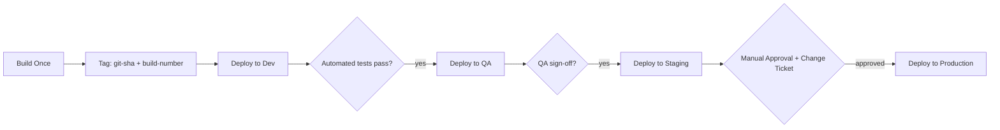

# Azure CI/CD Architecture & Implementation Guide (Frontend + Backend)

> Document 2 of 2. Companion document: [AWS-CICD-Frontend-Backend.md](./AWS-CICD-Frontend-Backend.md)

A production-grade, end-to-end reference for designing, implementing, and operating CI/CD pipelines on Microsoft Azure for both frontend (SPA/static/SSR) and backend (API/microservices) applications.

---

## 0. How to Use This Document

Same stage-by-stage template as the AWS document: **Purpose, Why it exists, Inputs, Outputs, Tools/Services, Configuration, Security Considerations, Common Failures, Troubleshooting, Best Practices, Production Considerations.**

> **Assumption flag:** Statements marked with `⚠ VERIFY` depend on tenant-specific limits, regional availability, or pricing that changes over time — confirm against current Microsoft Learn documentation before relying on them in production.

---

## 1. Glossary (Acronyms Defined on First Use)

| Term | Definition |
|---|---|
| **CI/CD** | Continuous Integration / Continuous Delivery-Deployment (see AWS doc §1 for full definition) |
| **ADO** | Azure DevOps — Microsoft's suite (Repos, Pipelines, Boards, Artifacts, Test Plans) |
| **YAML pipeline** | Azure Pipelines defined as code in a `azure-pipelines.yml` file, versioned with the repo |
| **ACR** | Azure Container Registry — Azure's Docker/OCI image registry |
| **AKS** | Azure Kubernetes Service — Azure's managed Kubernetes |
| **App Service** | Azure's managed PaaS for hosting web apps/APIs without managing servers |
| **Deployment Slot** | A separate, live App Service instance (e.g., "staging") that can be swapped with production atomically |
| **Static Web Apps** | Azure service purpose-built for hosting SPA/static frontend with integrated CI/CD and a global CDN |
| **Front Door** | Azure's global HTTP(S) load balancer + CDN + WAF |
| **Key Vault** | Azure's secrets/keys/certificates management service |
| **RBAC** | Role-Based Access Control — Azure's permission model |
| **Managed Identity** | An Azure AD identity automatically assigned to a resource (e.g., App Service, VM) so it can authenticate to other Azure services without stored credentials |
| **Service Connection** | An Azure DevOps construct storing (or federating) credentials to deploy into an Azure subscription |
| **Bicep** | Microsoft's domain-specific language for Infrastructure as Code, compiles to ARM templates |
| **ARM Template** | Azure Resource Manager JSON template — Azure's native IaC format |
| **App Insights** | Application Insights — Azure Monitor's APM (application performance monitoring) component |
| **WAF** | Web Application Firewall |
| **SAST/DAST/SCA/SBOM** | See AWS document §1 — identical definitions, provider-agnostic |
| **OIDC** | OpenID Connect — used for Workload Identity Federation between Azure DevOps/GitHub Actions and Azure AD without stored secrets |

---

## 2. High-Level Architecture Overview

```mermaid
flowchart LR
    Dev[Developer] -->|git push| Repo[(Azure Repos / GitHub)]
    Repo --> Trigger[Pipeline Trigger]
    Trigger --> Pipeline[Azure Pipelines]
    subgraph CI["CI Stage"]
        Lint[Lint & Code Quality]
        SAST[SAST + SCA Scan]
        Build[Build Job]
        Test[Unit/Integration Tests]
    end
    Pipeline --> Lint --> SAST --> Build --> Test
    Test --> Artifact{Artifact Type}
    Artifact -->|Static bundle| Artifacts[(Azure Artifacts / Pipeline Artifact)]
    Artifact -->|Container image| ACRRepo[(ACR)]
    Artifacts --> DeployFE[Static Web Apps / App Service Deploy]
    ACRRepo --> DeployBE[AKS Rollout / App Service Container / Slot Swap]
    DeployFE --> DevEnv[Dev Env]
    DeployBE --> DevEnv
    DevEnv -->|approval| QA[QA/Test Env]
    QA -->|approval| Stg[Staging/UAT]
    Stg -->|manual approval gate| Prod[Production]
    Prod --> Mon[Azure Monitor / App Insights]
    Mon -->|alert| Rollback[Automated Rollback / Slot Swap Back]
```



**Core principle (same as AWS):** Frontend and backend pipelines are independent, each with its own build/test/deploy cadence, converging at the environment level.

---

## 3. Repository & Branching Strategy

Identical strategic recommendation as the AWS document (§3): **trunk-based development**, protected `main`, short-lived feature branches, PR-gated merges.

### 3.1 Azure Repos Branch Policies (native equivalent of GitHub branch protection)

Configure under **Project Settings → Repos → Branches → Branch Policies** for `main`:

- Require a minimum number of reviewers (e.g., 2)
- Check for linked work items (Azure Boards) — enforces traceability
- Check for comment resolution before merge
- Require a build validation policy (YAML pipeline runs, must succeed) — this is Azure's equivalent of GitHub's "required status checks"
- Automatically include specific reviewers via required reviewer groups on paths (e.g., `/infra/**` requires the platform team)
- Block direct pushes; require squash merge for a clean history `⚠ VERIFY team preference`

### 3.2 Monorepo vs Polyrepo

Same trade-offs as the AWS document (§3.3). Azure DevOps YAML pipelines support **path filters** (`trigger: paths: include/exclude`) to scope triggers in a monorepo, and **pipeline resources/templates** to share reusable stage definitions across frontend/backend pipelines within the same repo.

```yaml
trigger:
  branches:
    include: [main]
  paths:
    include:
      - apps/frontend/*
    exclude:
      - apps/backend/*
```

---

## 4. Environments & Promotion Strategy

### 4.1 Environment Ladder

Same four-tier ladder as AWS document §4.1: **Development → QA/Test → Staging/UAT → Production**, with the same purpose/data/trigger/approval characteristics.

### 4.2 Azure DevOps "Environments" Feature

Azure Pipelines has a first-class **Environments** object (Pipelines → Environments) that:
- Represents a deployment target (can be a plain logical name, or tied to actual Kubernetes namespaces/VM resources for richer tracking)
- Holds **approval and check gates** configured directly on the environment (not just in YAML) — e.g., required approvers, business hours restriction, invoking an Azure Function/REST API gate that must return success before proceeding
- Shows a full deployment history per environment (which build is where, right now)

```yaml
- stage: DeployToProduction
  jobs:
    - deployment: DeployAPI
      environment: 'production'   # approvals/checks configured on this Environment object
      strategy:
        runOnce:
          deploy:
            steps:
              - script: echo "Deploying to production"
```

### 4.3 Promotion Strategy: "Build Once, Promote the Artifact" (Identical Principle to AWS §4.2)



In Azure Pipelines this is naturally expressed as **one pipeline with multiple stages**, each `stage` depending on the previous (`dependsOn`), each targeting a different `environment:`, with the **same build artifact** (`publish`/`download` pipeline artifact by name) flowing through every stage — never rebuilt.

```yaml
stages:
  - stage: Build
    jobs: [...]
  - stage: DeployDev
    dependsOn: Build
    jobs:
      - deployment: DeployDev
        environment: 'dev'
        strategy:
          runOnce:
            deploy:
              steps:
                - download: current
                  artifact: app-artifact
  - stage: DeployQA
    dependsOn: DeployDev
    jobs:
      - deployment: DeployQA
        environment: 'qa'
        strategy: { runOnce: { deploy: { steps: [ { download: current, artifact: app-artifact } ] } } }
  - stage: DeployStaging
    dependsOn: DeployQA
    jobs:
      - deployment: DeployStaging
        environment: 'staging'
        strategy: { runOnce: { deploy: { steps: [ { download: current, artifact: app-artifact } ] } } }
  - stage: DeployProduction
    dependsOn: DeployStaging
    jobs:
      - deployment: DeployProd
        environment: 'production'   # approval gate lives here, configured on the Environment
        strategy: { runOnce: { deploy: { steps: [ { download: current, artifact: app-artifact } ] } } }
```

### 4.4 Approval Gates in Azure Pipelines

Configured on the **Environment** object itself (Pipelines → Environments → production → Approvals and checks):

- **Approvals**: named approver(s)/group, optional instructions, optional "approver cannot approve their own run"
- **Business hours check**: restrict deployment window (e.g., no Friday-afternoon prod deploys)
- **Invoke Azure Function / REST API check**: e.g., call out to a change-management system (ServiceNow) and require a "change approved" response before proceeding
- **Branch control check**: only allow deployments originating from `main` or `release/*`
- **Required template check**: enforce the pipeline YAML itself came from an approved template (prevents a rogue pipeline edit from bypassing security scanning stages)

---

## 5. Frontend CI/CD Pipeline (Azure)

Target stack assumption: React/Angular/Vue SPA (Azure **Static Web Apps** as primary example, with **App Service** as an alternative for SSR).

### 5.1 Source Control & Trigger

- **Purpose/Why:** Same as AWS document §5.1.
- **Tools:** Azure Repos (Git) or GitHub, both natively integrated with Azure Pipelines via Service Connections or the GitHub App integration.
- **Configuration:**

```yaml
trigger:
  branches:
    include: [main]
pr:
  branches:
    include: [main]
```

- **Security Considerations:** Use the **Azure Pipelines GitHub App** (fine-grained, repo-scoped) rather than a personal access token for GitHub-hosted repos.
- **Common Failures:** Pipeline doesn't trigger after a GitHub org repo transfer — the GitHub App installation needs to be re-authorized for the new org/repo.
- **Best Practices:** Separate a lightweight **PR validation pipeline** (`pr:` trigger, build+test+scan only, no deploy) from the **CI/CD pipeline** (`trigger:` on `main`, full deploy chain).

### 5.2 Pull Request & Code Review

- Same purpose as AWS §5.2. Use **Azure Boards** work-item linking to enforce traceability (every PR references a work item).
- **Tools:** Azure Repos PRs (or GitHub PRs) + branch policy requiring the PR validation pipeline to pass (§3.1).
- **Security Considerations:** PR-triggered pipeline runs use a **restricted Service Connection** (or none at all, since PR pipelines shouldn't deploy) to prevent a malicious fork PR from exfiltrating deployment credentials.
- **Best Practices:** Use CODEOWNERS (supported natively in Azure Repos) to auto-assign reviewers by path.

### 5.3 Code Quality (Lint, Format, Static Analysis)

- Same tools as AWS document §5.3 (ESLint/Prettier/Stylelint/`tsc --noEmit`) — these are provider-agnostic JS/TS tools.
- **Configuration (Azure Pipelines YAML job):**

```yaml
- job: CodeQuality
  steps:
    - task: NodeTool@0
      inputs:
        versionSpec: '20.x'
    - script: npm ci
      displayName: 'Install dependencies'
    - script: npm run lint
      displayName: 'ESLint'
    - script: npx tsc --noEmit
      displayName: 'TypeScript type-check'
```

- **Best Practices:** Publish lint results as a build artifact/test result (`PublishTestResults@2` with a JUnit-formatted ESLint reporter) so failures show inline in the Azure DevOps UI, not just raw console text.

### 5.4 Dependency & Security Scanning (SCA + SAST)

- **Tools:**
  - **SCA:** `npm audit`, **Microsoft Defender for DevOps** (aggregates SCA/SAST/IaC/secrets findings into a unified dashboard, surfaces in Azure DevOps and Microsoft Defender for Cloud) `⚠ VERIFY current product name/availability`, or Snyk/Mend via marketplace extension.
  - **SAST:** SonarQube/SonarCloud (very common in Azure DevOps via the official extension), Microsoft Security DevOps extension (wraps CredScan, Bandit, ESLint security rules, Template Analyzer).
  - **Secrets scanning:** Microsoft Security DevOps (CredScan) or GitHub secret scanning if source is on GitHub.
- **Configuration:**

```yaml
- task: MicrosoftSecurityDevOps@1
  displayName: 'Microsoft Security DevOps (SAST + secrets + IaC)'

- script: npx snyk test --severity-threshold=high
  displayName: 'Snyk SCA scan'
  env:
    SNYK_TOKEN: $(SnykToken)   # sourced from a Variable Group linked to Key Vault
```

- **Security Considerations:** Store `SnykToken` in a **Variable Group backed by Azure Key Vault**, marked secret, never as a plain pipeline variable in YAML.
- **Common Failures:** Same as AWS §5.4 — teams disabling the gate after one false-positive-driven blocked release.
- **Best Practices:** Same severity-gating + time-boxed exception approach as AWS §5.4; run SonarCloud Quality Gate as a required PR check for maintainability/duplication/coverage thresholds, not just security.
- **Production Considerations:** Feed findings into **Microsoft Defender for Cloud DevOps security** for a unified cross-pipeline security posture view `⚠ VERIFY tenant licensing`.

### 5.5 Build

- **Configuration (full `azure-pipelines.yml` build stage for a Vite/React app):**

```yaml
trigger:
  branches: { include: [main] }

pool:
  vmImage: 'ubuntu-latest'

variables:
  - group: frontend-secrets   # Key Vault-linked variable group

stages:
  - stage: Build
    jobs:
      - job: BuildAndTest
        steps:
          - task: NodeTool@0
            inputs: { versionSpec: '20.x' }
          - script: npm ci
            displayName: 'Install'
          - script: npm run lint
            displayName: 'Lint'
          - task: MicrosoftSecurityDevOps@1
          - script: npx snyk test --severity-threshold=high
            env: { SNYK_TOKEN: $(SnykToken) }
          - script: npm run test:unit -- --ci --coverage
            displayName: 'Unit tests'
          - task: PublishTestResults@2
            inputs:
              testResultsFormat: 'JUnit'
              testResultsFiles: 'junit.xml'
          - task: PublishCodeCoverageResults@2
            inputs:
              summaryFileLocation: 'coverage/cobertura-coverage.xml'
          - script: npm run build
            displayName: 'Build production bundle'
          - task: ArchiveFiles@2
            inputs:
              rootFolderOrFile: 'dist'
              archiveType: 'tar'
              archiveFile: '$(Build.ArtifactStagingDirectory)/frontend-$(Build.SourceVersion).tar.gz'
          - task: PublishPipelineArtifact@1
            inputs:
              targetPath: '$(Build.ArtifactStagingDirectory)'
              artifact: 'frontend-build'
```

- **Security Considerations:** Same "never bake secrets into a frontend bundle" rule as AWS §5.5 — only public runtime config via `VITE_PUBLIC_*`/`NEXT_PUBLIC_*`.
- **Common Failures:** Microsoft-hosted agents (`ubuntu-latest`) periodically update tool versions, causing "worked yesterday, fails today" — pin exact tool versions (`NodeTool@0` with explicit `versionSpec`) rather than relying on agent image defaults.
- **Best Practices:** Enable pipeline caching (`Cache@2` task keyed on lockfile hash) for `node_modules` to cut build time; consider **self-hosted agents** for very large monorepos to control the exact toolchain and avoid Microsoft-hosted agent queue wait times `⚠ VERIFY queue times for your tier`.
- **Production Considerations:** Embed build metadata (`Build.BuildNumber`, `Build.SourceVersion`) into a `build-info.json` for support/debugging, same as AWS §5.5.

### 5.6 Unit / Integration Tests

Same tools/patterns as AWS document §5.6 (Jest/Vitest, Playwright/Cypress against a deployed Dev slot as post-deploy smoke test). Azure Pipelines has first-class **Test Plans** integration if manual/exploratory QA test case tracking is needed alongside automation.

### 5.7 Artifact Creation & 5.8 Artifact Storage

- **Purpose:** Same as AWS §5.7/§5.8 — one immutable, versioned artifact promoted through all environments.
- **Tools:** **Pipeline Artifacts** (`PublishPipelineArtifact@1`/`DownloadPipelineArtifact@2`) for artifacts scoped to a single pipeline run's lifetime; **Azure Artifacts** (universal packages/npm/NuGet feeds) for artifacts that need to be versioned and shared/reused across multiple pipelines over a longer retention window.
- **Configuration (publishing a Universal Package to Azure Artifacts for longer-term retention):**

```yaml
- task: UniversalPackages@0
  inputs:
    command: publish
    publishDirectory: '$(Build.ArtifactStagingDirectory)'
    feedsToUsePublish: 'internal'
    vstsFeedPublish: 'my-project/frontend-artifacts'
    vstsFeedPackagePublish: 'frontend-app'
    versionOption: 'custom'
    versionPublish: '1.0.$(Build.BuildId)'
```

- **Security Considerations:** Feed-level permissions (Azure Artifacts feed views/permissions) restrict who can publish vs. consume; enable **upstream sources** carefully (a compromised upstream can poison your feed — pin/allowlist upstream registries).
- **Common Failures:** Pipeline Artifacts expire per the project's retention policy (default often 30 days `⚠ VERIFY current default`) — if you need artifacts retained longer for audit/rollback, use Azure Artifacts feeds or export to Blob Storage instead.
- **Best Practices:** Immutable naming with `$(Build.SourceVersion)` embedded, exactly as AWS §5.7.

### 5.9 Deployment (Azure Static Web Apps primary; App Service for SSR)

- **Purpose:** Get the frontend serving traffic.
- **Tools:** **Azure Static Web Apps** (purpose-built: free managed CDN, auto SSL, built-in staged environments per PR, integrated auth) is the most idiomatic Azure choice for pure SPA/static hosting. **App Service** (with deployment slots) is used for SSR (Next.js) or when you need more control.
- **Configuration (Static Web Apps deploy stage):**

```yaml
- stage: DeployStaticWebApp
  jobs:
    - job: Deploy
      steps:
        - task: AzureStaticWebApp@0
          inputs:
            app_location: 'dist'
            api_location: ''
            azure_static_web_apps_api_token: $(SWA_DEPLOYMENT_TOKEN)
```

- **Configuration (App Service with deployment slots for SSR, using Slot Swap for zero-downtime release):**

```yaml
- task: AzureWebApp@1
  inputs:
    azureSubscription: 'prod-service-connection'
    appType: 'webAppLinux'
    appName: 'my-frontend-ssr'
    package: '$(Pipeline.Workspace)/frontend-build/**'
    deployToSlotOrASE: true
    resourceGroupName: 'rg-frontend-prod'
    slotName: 'staging'

- task: AzureAppServiceManage@0
  displayName: 'Warm up staging slot before swap'
  inputs:
    azureSubscription: 'prod-service-connection'
    action: 'Start Azure App Service'
    webAppName: 'my-frontend-ssr'
    specifySlotOrASE: true
    slot: 'staging'

- task: AzureAppServiceManage@0
  displayName: 'Swap staging -> production'
  inputs:
    azureSubscription: 'prod-service-connection'
    action: 'Swap Slots'
    webAppName: 'my-frontend-ssr'
    resourceGroupName: 'rg-frontend-prod'
    sourceSlot: 'staging'
    targetSlot: 'production'
```

- **Security Considerations:** Restrict Service Connections with **Workload Identity Federation** (Azure AD OIDC, no stored client secret) instead of a Service Principal with a stored secret. Enable Static Web Apps' built-in authentication/authorization if the app needs gated preview environments. For App Service, enforce HTTPS-only and minimum TLS version in the resource config (IaC, §9).
- **Common Failures:** Slot swap succeeds but the "warmed up" staging slot wasn't actually warm (cold-start on first prod requests post-swap) → latency spike right after release.
- **Troubleshooting:** Use **Auto Swap with health check path** configured on the slot, or an explicit warm-up step (as shown above) hitting a health endpoint before swapping.
- **Best Practices:** Same static-asset caching split as AWS §5.9 — hashed assets get long-lived immutable caching, `index.html`/entry HTML gets `no-cache`. Static Web Apps handles this automatically for its default routing; verify custom `staticwebapp.config.json` headers if overriding.
- **Production Considerations:** Front Azure Static Web Apps or App Service with **Azure Front Door** for a WAF, global anycast routing, and additional caching layer in multi-region setups `⚠ VERIFY need based on traffic geography`.

### 5.10 Environment Promotion & Approvals

Same principle as §4.3/§4.4. Static Web Apps additionally provides **automatic PR preview environments** (a full staged deployment per open PR) — extremely useful for frontend review beyond just Dev/QA/Staging, at no extra pipeline-authoring cost.

### 5.11 Monitoring & Observability (Frontend)

- **Tools:** **Application Insights** (JavaScript SDK) for RUM — page load timing, JS exceptions, AJAX call tracking, user session/session replay-adjacent telemetry; **Azure Monitor availability tests** (URL ping tests / multi-step web tests) as the equivalent of CloudWatch Synthetics canaries.
- **Configuration:** Include the App Insights JS snippet or npm SDK (`@microsoft/applicationinsights-web`) in the frontend entry point, configured with the connection string sourced from a public (non-secret) config value.
- **Security Considerations:** Configure **telemetry sampling** and PII filtering (`telemetryInitializers`) to avoid capturing sensitive query params/form data.
- **Common Failures:** Same as AWS §5.11 — alerting only on backend errors, missing frontend-only failures.
- **Best Practices:** Alert on Core Web Vitals via App Insights' custom metrics; correlate frontend `operation_Id`/trace context with backend requests using **distributed tracing** (App Insights auto-correlates if both frontend and backend SDKs are configured with the same instrumentation approach).
- **Production Considerations:** Use **Azure Monitor Workbooks** to build a single-pane dashboard combining Front Door/CDN metrics, Static Web App/App Service metrics, and App Insights RUM data.

### 5.12 Rollback (Frontend)

- **Tools:** Static Web Apps — redeploy the previous build's artifact (re-run the pipeline stage with a prior artifact, or use its built-in deployment history to revert); App Service — **slot swap back** (swap production ↔ staging again) is often the fastest rollback since the previous version is still warm in the other slot.
- **Best Practices:** Same expand/contract dependency on backend compatibility as AWS §5.12 — frontend rollback is only safe if the backend API remains compatible with the older frontend version.
- **Production Considerations:** App Service slot-swap rollback can be near-instant (seconds) since no rebuild/redeploy is needed — a strong argument for using deployment slots even for "just" a frontend App Service.

---

## 6. Backend CI/CD Pipeline (Azure)

Target stack assumption: containerized API deployed to **AKS** (primary example), with **App Service for Containers** and **Azure Functions** as alternatives.

### 6.1 Source Control & Trigger

Same mechanics as §5.1. Backend pipelines commonly also support **pipeline resource triggers** — e.g., trigger the backend deploy pipeline automatically when a shared "base image" pipeline publishes a new hardened base image.

### 6.2 Pull Request & Code Review

Same as §5.2, plus an **OpenAPI contract diff check** (Optic/`oasdiff`) as a required PR check — identical rationale to AWS document §6.2.

### 6.3 Code Quality

Same tools/pattern as §5.3 applied server-side (ESLint/Checkstyle/Pylint/`golangci-lint` depending on language), plus API schema linting (Spectral).

### 6.4 Dependency & Security Scanning

- **Container image scanning:** **Microsoft Defender for Containers** (continuous ACR scanning) or Trivy in-pipeline before push.
- **IaC scanning:** Checkov or **Template Analyzer** (Microsoft's own ARM/Bicep security linter) against Bicep/ARM templates.
- **Secrets scanning:** Microsoft Security DevOps (CredScan) or `gitleaks`.

```yaml
- task: MicrosoftSecurityDevOps@1
  displayName: 'CredScan + Template Analyzer + Bandit (as applicable)'
- script: |
    docker build -t $(acrName).azurecr.io/backend:$(Build.SourceVersion) .
    trivy image --severity HIGH,CRITICAL --exit-code 1 $(acrName).azurecr.io/backend:$(Build.SourceVersion)
  displayName: 'Trivy container scan'
```

### 6.5 Build

- **Configuration (full `azure-pipelines.yml` building and pushing to ACR):**

```yaml
trigger:
  branches: { include: [main] }

variables:
  - group: backend-secrets
  - name: acrName
    value: 'myregistry'
  - name: imageRepo
    value: 'backend-api'

pool:
  vmImage: 'ubuntu-latest'

stages:
  - stage: Build
    jobs:
      - job: BuildTestPush
        steps:
          - task: NodeTool@0
            inputs: { versionSpec: '20.x' }
          - script: npm ci && npm run lint
          - task: MicrosoftSecurityDevOps@1
          - script: npx snyk test --severity-threshold=high
            env: { SNYK_TOKEN: $(SnykToken) }
          - script: npm run test:unit -- --ci --coverage
          - task: Docker@2
            displayName: 'Build image'
            inputs:
              containerRegistry: 'acr-service-connection'
              repository: '$(imageRepo)'
              command: 'build'
              Dockerfile: '**/Dockerfile'
              tags: |
                $(Build.SourceVersion)
                latest
          - script: |
              trivy image --severity HIGH,CRITICAL --exit-code 1 $(acrName).azurecr.io/$(imageRepo):$(Build.SourceVersion)
            displayName: 'Trivy scan built image'
          - task: Docker@2
            displayName: 'Push image'
            inputs:
              containerRegistry: 'acr-service-connection'
              repository: '$(imageRepo)'
              command: 'push'
              tags: |
                $(Build.SourceVersion)
                latest
```

- **Security Considerations:** Same non-root/minimal-base-image/multi-stage guidance as AWS §6.5. Use the `Docker@2` task's `containerRegistry` input tied to a **Service Connection using Workload Identity Federation** to ACR, avoiding stored admin credentials.
- **Common Failures:** Same architecture-mismatch issue as AWS §6.5 if building on non-Linux/non-amd64 dev machines vs. Microsoft-hosted `ubuntu-latest` agents (usually not an issue since hosted agents are consistent, but relevant for self-hosted ARM agents) `⚠ VERIFY agent architecture`.
- **Best Practices:** Tag with immutable `$(Build.SourceVersion)`; enable **ACR content trust / Notary v2 image signing** for supply-chain integrity `⚠ VERIFY current ACR signing feature name`.
- **Production Considerations:** Enable **Microsoft Defender for Containers** continuous re-scanning of images already in ACR to catch newly-disclosed CVEs.

### 6.6 Unit / Integration Tests

Same as AWS §6.6 — contract tests (Pact), Testcontainers-based integration tests. Azure Pipelines Microsoft-hosted agents support Docker natively (no special "privileged mode" flag needed, unlike CodeBuild) since the hosted agents already have Docker installed and available.

### 6.7 Artifact Creation & 6.8 Artifact Storage

- **Backend artifact = the container image**, stored in **ACR** (equivalent of AWS's ECR).
- **Configuration:** Enable ACR **repository-scoped tokens** for fine-grained pull access per environment/cluster instead of sharing one admin credential across all consumers.
- **Security Considerations:** Enable ACR **quarantine pattern** (image pushed but held until scan completes and passes before being pullable) for the highest-rigor pipelines `⚠ VERIFY current ACR quarantine feature availability`. Enable geo-replication if AKS clusters span multiple regions, to avoid cross-region pull latency/egress cost.
- **Best Practices:** Same lifecycle/retention policy approach as AWS §6.8 (ACR Tasks/retention policies to purge untagged manifests).

### 6.9 Deployment (AKS — Rolling, Blue/Green, Canary via Argo Rollouts/Flagger; App Service Slots as PaaS alternative)

- **Purpose:** Roll the new container image into the running service safely.
- **Tools:**
  - **AKS + Helm/Kustomize + Argo Rollouts or Flagger** for Blue/Green/Canary with automated metric-based promotion (the AKS-native equivalent of AWS CodeDeploy for ECS).
  - **App Service for Containers with deployment slots** for a simpler PaaS-level Blue/Green when full Kubernetes isn't warranted.
  - **Azure Pipelines native Kubernetes tasks** (`KubernetesManifest@1`) for straightforward rolling updates without a progressive-delivery controller.
- **Configuration (AKS rolling deploy via `KubernetesManifest@1`):**

```yaml
- task: KubernetesManifest@1
  displayName: 'Deploy to AKS'
  inputs:
    action: 'deploy'
    kubernetesServiceConnection: 'aks-prod-service-connection'
    namespace: 'backend-prod'
    manifests: |
      k8s/deployment.yaml
      k8s/service.yaml
    containers: '$(acrName).azurecr.io/$(imageRepo):$(Build.SourceVersion)'
```

- **Configuration (Argo Rollouts canary spec, applied via the above deploy step or a Helm chart):**

```yaml
apiVersion: argoproj.io/v1alpha1
kind: Rollout
metadata:
  name: backend-api
spec:
  strategy:
    canary:
      steps:
        - setWeight: 10
        - pause: { duration: 300 }
        - analysis:
            templates:
              - templateName: success-rate-check   # queries Azure Monitor/Prometheus metrics
        - setWeight: 50
        - pause: { duration: 300 }
        - setWeight: 100
```

- **Configuration (App Service Blue/Green via slot swap, same pattern as §5.9 but for the API):**

```yaml
- task: AzureWebApp@1
  inputs:
    azureSubscription: 'prod-service-connection'
    appType: 'webAppLinuxContainer'
    appName: 'my-backend-api'
    containers: '$(acrName).azurecr.io/$(imageRepo):$(Build.SourceVersion)'
    deployToSlotOrASE: true
    slotName: 'staging'
- task: AzureAppServiceManage@0
  inputs:
    action: 'Swap Slots'
    webAppName: 'my-backend-api'
    sourceSlot: 'staging'
    targetSlot: 'production'
```

- **Security Considerations:** AKS workload identity (Azure AD Workload Identity for Kubernetes) so pods authenticate to Key Vault/other Azure services without stored credentials, replacing the older "pod identity"/service-principal-in-secret pattern. Network policies (Calico/Cilium) restricting pod-to-pod traffic to least-privilege.
- **Common Failures:** Same readiness-probe-misconfiguration failure mode as AWS §6.9 (ECS health check) — Kubernetes `readinessProbe` too aggressive for app boot time, causing rollout to stall/rollback prematurely.
- **Troubleshooting:** `kubectl rollout status`/`kubectl describe pod` to see probe failure reasons; tune `initialDelaySeconds`/`periodSeconds`.
- **Best Practices:** Attach an **Analysis Template** (Argo Rollouts) or **Azure Monitor alert-based gate check** (Azure Pipelines Environment check calling Azure Monitor's metrics API) so canary promotion is automated and metric-driven, not just time-based.
- **Production Considerations:** For App Service, prefer slot-swap Blue/Green (simpler, PaaS-managed) unless you need Kubernetes-specific features (custom scheduling, service mesh, multi-container pods) — don't default to AKS just because it's more "flexible" if App Service meets the requirement with far less operational overhead.

**Azure Functions alternative:** Use **deployment slots for Functions** (same slot-swap mechanic as App Service) for a simpler Blue/Green story on serverless backends.

### 6.10 Environment Promotion & Approvals

Same principle as §4.3/§4.4 — promote the exact image tag/digest through Dev → QA → Staging → Prod stages in one pipeline, each stage's `environment:` carrying its own approval/check gates.

### 6.11 Monitoring & Observability (Backend)

- **Tools:** **Application Insights** (server SDK) for distributed tracing/APM, **Azure Monitor** for infrastructure metrics (AKS node/pod metrics via Container Insights, App Service metrics), **Log Analytics** as the central log store queried via **KQL (Kusto Query Language)**.
- **Configuration:** Enable **Container Insights** on the AKS cluster (managed add-on); instrument the app with the App Insights SDK or OpenTelemetry exporting to Azure Monitor.
- **Security Considerations:** Same log redaction discipline as AWS §6.11 — no secrets/PII in logs; use Log Analytics workspace RBAC to restrict who can query sensitive logs.
- **Common Failures:** Same "alerting on averages hides p99 spikes" issue as AWS §6.11.
- **Best Practices:** Same four golden signals (latency/traffic/errors/saturation); use **Azure Monitor Action Groups** to route alerts to Teams/Slack/PagerDuty/email/webhook uniformly; annotate deployment events onto App Insights/Workbook dashboards (Azure Pipelines can call the Azure Monitor REST API to log a deployment annotation automatically as a post-deploy step).
- **Production Considerations:** Use **Azure Monitor Smart Detection** (built into App Insights) for automatic anomaly detection on failure rate/response time without manually authoring every threshold.

### 6.12 Rollback (Backend)

- **Tools:** AKS — `kubectl rollout undo` (native Kubernetes rollback to the previous ReplicaSet) or Argo Rollouts' automated `abort`/rollback on failed analysis; App Service/Functions — slot swap back (near-instant, previous version still warm).
- **Configuration (Argo Rollouts automatic abort on failed analysis is built into the canary spec in §6.9 — no separate config needed; for plain `Deployment` objects):**

```bash
kubectl rollout undo deployment/backend-api -n backend-prod
```

- **Common Failures:** Same DB-migration-incompatibility risk as AWS §6.12 — rolling back app code without considering an already-applied non-backward-compatible migration causes a worse outage.
- **Best Practices:** **Identical Expand/Contract migration pattern** as AWS document §6.12 — this is a database-design principle, not a cloud-provider-specific one, and applies equally here: Expand (additive migration) → Dual-write/deploy new code → Backfill → Contract (remove old schema) only after a full stable cycle.
- **Production Considerations:** Target the same 10-15 minute backend rollback MTTR as AWS §6.12; App Service/Functions slot-swap rollback is typically faster (near-instant) than AKS rollout-undo (which still needs new pods to schedule and become ready) — factor this into environment choice if rollback speed is a hard requirement.

---

## 7. Frontend–Backend Integration

Identical integration principles as AWS document §7 — contract-first development (OpenAPI/GraphQL as source of truth), runtime (not build-time) environment config wiring for the API base URL, cross-service E2E testing against deployed environments before promotion, and tracking "what version is running where" (Azure DevOps **Environments** view provides this natively per-pipeline, or use App Configuration/a simple tracking table for cross-pipeline visibility).

- **Azure-specific tool:** **Azure App Configuration** is a good fit for centralizing non-secret runtime config (feature flags, API endpoints) across environments, with built-in feature-flag management UI and SDKs — an Azure-native alternative to a hand-rolled config table.

---

## 8. Azure Services Deep Dive

### 8.1 Azure Pipelines
Orchestrates CI/CD as YAML-defined stages/jobs/steps. A single pipeline can span build → multiple deploy stages (unlike AWS where CodePipeline/CodeBuild/CodeDeploy are more distinctly separate services) — Azure Pipelines is more of an all-in-one orchestrator+executor. Supports Microsoft-hosted agents (ephemeral, maintained by Microsoft) or self-hosted agents (your own VMs/containers, needed for private network access or custom toolchains).

### 8.2 Azure Repos
Git repository hosting with branch policies, PR workflows, and native Azure Boards work-item linking. Functionally comparable to CodeCommit but far more actively maintained/featured; many Azure shops use GitHub instead and just use Azure Pipelines for CI/CD, which is fully supported.

### 8.3 Azure Artifacts
Package feeds (npm, NuGet, Maven, Python, Universal Packages) with upstream source proxying, comparable to a private npm/Maven registry. Used for longer-lived artifact retention beyond a single pipeline run's Pipeline Artifacts.

### 8.4 ACR (Azure Container Registry)
Private, Azure-AD-authenticated Docker/OCI registry. Supports geo-replication, content trust/image signing, quarantine pattern, ACR Tasks (in-registry image building/base-image update automation), and continuous Defender for Containers scanning.

### 8.5 App Service
PaaS for web apps/APIs (code or container-based). Key CI/CD-relevant feature: **Deployment Slots** — swap-based zero-downtime releases with instant rollback, auto-swap with health-check gating, and slot-scoped configuration (so secrets/connection strings can differ per slot if needed, or be "slot-sticky" to survive swaps).

### 8.6 AKS
Managed Kubernetes control plane (Azure manages the control plane; you manage/scale node pools, or use fully-managed "Automatic" mode `⚠ VERIFY current AKS Automatic availability/maturity`). CI/CD integrates via `kubectl`/Helm tasks, or GitOps (Flux/Argo CD) pulling from a Git repo of manifests rather than pipelines pushing directly — GitOps is increasingly the recommended pattern for AKS production deployments.

### 8.7 Azure Functions
Serverless compute, event-driven, consumption or premium/dedicated hosting plans. CI/CD via `AzureFunctionApp@2` pipeline task or GitHub Actions; supports deployment slots for Blue/Green on Premium/Dedicated plans (not available on the Consumption plan `⚠ VERIFY current plan feature matrix`).

### 8.8 Compute Choice Comparison — App Service vs AKS vs Functions

| Factor | App Service | AKS | Azure Functions |
|---|---|---|---|
| Ops overhead | Low | High (cluster/node management, upgrades) | Lowest |
| Best for | Most web APIs/apps, teams wanting PaaS simplicity | Complex microservices, need for service mesh/custom scheduling, multi-cloud K8s portability | Event-driven, bursty, short-lived workloads |
| Deployment pattern | Slot swap (Blue/Green) | Rolling / Argo Rollouts canary/blue-green | Slot swap (Premium/Dedicated only) |
| Cold start | Minimal (Always On setting) | N/A (long-running pods) | Can be significant on Consumption plan `⚠ VERIFY per-language runtime` |
| Cost model | Per App Service Plan tier (fixed capacity) | Control plane (often free tier available `⚠ VERIFY`) + node VM costs | Pay-per-execution (Consumption) or fixed (Premium/Dedicated) |
| When to avoid | Very large multi-service meshes needing fine-grained traffic control | Small teams without Kubernetes expertise | Long-running/stateful connections, very large payloads |

### 8.9 Key Vault
Centralized secrets/keys/certificates store. CI/CD integration via **Variable Groups linked to Key Vault** (Azure Pipelines) so secrets are referenced by name, resolved at pipeline run time, never stored in pipeline YAML. Applications read secrets at runtime via **Managed Identity** (App Service/AKS Workload Identity) authenticating directly to Key Vault — no connection-string-with-embedded-secret needed.

```yaml
variables:
  - group: 'prod-secrets'   # linked to a Key Vault in Library settings
steps:
  - script: echo "Using $(DbPassword)"   # resolved from Key Vault at run time, masked in logs
```

### 8.10 Azure Monitor / Application Insights
Azure's unified observability platform: **Azure Monitor** (metrics, alerts, Log Analytics/KQL) + **Application Insights** (APM: distributed tracing, dependency tracking, exception tracking, RUM, Smart Detection anomaly alerts) + **Workbooks** (custom dashboards) + **Availability Tests** (synthetic canary probes).

---

## 9. Infrastructure as Code Integration

- **Recommended tools:** **Bicep** (Microsoft's modern, concise IaC language, compiles to ARM JSON) is the idiomatic Azure-native choice; Terraform is a strong cross-cloud alternative if your org already standardizes on it.
- **Pattern: "Pipeline as Code."** Same principle as AWS document §9 — the Azure Pipelines YAML itself, plus Bicep/Terraform defining the AKS cluster/App Service/networking, all live in the repo and go through PR review.
- **CI for IaC itself:** Run `az deployment group what-if` (Bicep/ARM's equivalent of `terraform plan`/`cdk diff`) on every PR touching `infra/`, posting the diff as a PR comment for reviewer visibility.

```yaml
- script: |
    az deployment group what-if \
      --resource-group rg-backend-prod \
      --template-file infra/main.bicep \
      --parameters infra/prod.parameters.json
  displayName: 'Bicep what-if preview'
```

- **Security Considerations:** Scan Bicep/ARM templates with **Template Analyzer** or Checkov in the PR pipeline (§6.4) — same "catch the open network rule before it's applied" rationale as AWS.
- **State management:** Bicep/ARM is stateless by design (Azure Resource Manager tracks deployed state itself, no separate state file to manage/lock, unlike Terraform) — this removes an entire class of Terraform state-file corruption/locking failure modes, though Terraform remains valid if cross-cloud consistency is a priority `⚠ VERIFY org tooling standard`.

---

## 10. Environment Variables & Secrets Strategy Summary

| Data | Where it lives | How it's injected |
|---|---|---|
| Public frontend config (API URL, feature flags) | `staticwebapp.config.json` / Azure App Configuration / build-time `VITE_PUBLIC_*` | Fetched at runtime, or baked at build time — never secret |
| CI-time secrets (Snyk token, registry credentials) | Key Vault, referenced via a Variable Group | Automatically resolved as pipeline variables, masked in logs |
| Runtime backend secrets (DB password, 3rd-party API keys) | Key Vault | App reads directly via Managed Identity at runtime, or App Service "Key Vault references" in App Settings (`@Microsoft.KeyVault(...)`) |
| IaC/pipeline credentials | Service Connections using Workload Identity Federation (Azure AD OIDC, no stored secret) | Automatically used by pipeline tasks (`AzureWebApp@1`, `Docker@2`, etc.) |

**Golden rule (identical to AWS document §10):** anything reaching the browser bundle is public by definition — real secrets live only server-side, resolved at runtime from Key Vault via Managed Identity, never committed, never logged.

---

## 10.1 Repository Structure Example (Monorepo)

```
my-app/
├── apps/
│   ├── frontend/
│   │   ├── src/
│   │   ├── package.json
│   │   ├── staticwebapp.config.json
│   │   └── azure-pipelines.yml
│   └── backend/
│       ├── src/
│       ├── package.json
│       ├── Dockerfile
│       ├── azure-pipelines.yml
│       └── k8s/
│           ├── deployment.yaml
│           └── service.yaml
├── infra/
│   ├── main.bicep                # AKS/App Service, networking, Key Vault
│   ├── modules/
│   │   ├── aks.bicep
│   │   ├── keyvault.bicep
│   │   └── acr.bicep
│   └── prod.parameters.json
├── .azuredevops/
│   └── pr-validation-pipeline.yml   # lint/test/scan on PR, no deploy
└── package.json
```

---

## 11. Common Failure Scenarios & Troubleshooting Matrix

| Failure | Likely Cause | Fix |
|---|---|---|
| Pipeline stuck at "Waiting" indefinitely | Environment approval pending, or a check (business hours / REST API gate) not yet satisfied | Check Pipelines → Environments → pending approvals/checks |
| Deploy fails with "Key Vault access denied" | App/pipeline Managed Identity or Service Connection missing Key Vault RBAC role (`Key Vault Secrets User`) | Grant the identity the correct Key Vault access policy/RBAC role |
| Frontend shows blank white screen post-deploy | Stale cached entry HTML referencing deleted hashed chunks | Verify `staticwebapp.config.json`/App Service cache headers split (no-cache for HTML, immutable for hashed assets) |
| Intermittent errors right after AKS rollout | Readiness probe too aggressive for app boot time | Tune `initialDelaySeconds`/`periodSeconds` on the probe |
| "It worked in Dev, broke in Prod" | Rebuilt per environment instead of promoting the same artifact | Enforce build-once/promote pattern (§4.3) using pipeline `download: current` artifact reuse |
| Rollback makes things worse | DB migration not backward-compatible with rolled-back app version | Adopt expand/contract migration pattern (§6.12) |
| Secrets appear in pipeline logs | Variable not marked `secret` in Key Vault/Variable Group, or a script explicitly echoes it | Confirm variable is sourced from a Key Vault-linked group (auto-masked); audit scripts for stray `echo`/`printenv` |
| ACR pull failures from AKS | Missing `AcrPull` role assignment for the AKS cluster's kubelet identity | Grant `AcrPull` RBAC role to the AKS managed identity on the ACR resource |

---

## 12. Best Practices Checklist

- [ ] Trunk-based development with short-lived branches and branch policies on `main`
- [ ] Separate PR validation pipeline (no deploy credentials) from the full CI/CD pipeline
- [ ] Build-once, promote-the-artifact across all stages within a single multi-stage pipeline
- [ ] Immutable artifact/image tagging (`$(Build.SourceVersion)`, never bare `latest` for deploys)
- [ ] SCA + SAST + secrets scanning + IaC scanning (Microsoft Security DevOps / Defender for DevOps) gating on Critical/High
- [ ] SBOM generated and retained per build
- [ ] All secrets in Key Vault via Variable Groups; Managed Identity / Workload Identity Federation everywhere — no stored Service Principal secrets
- [ ] Approval gates configured on Azure Pipelines **Environments**, not just informally in Slack/email
- [ ] Blue/Green (slot swap) or canary (Argo Rollouts/Flagger) deployment with automated, metric-gated rollback
- [ ] Frontend cache headers correctly split between immutable hashed assets and no-cache entry HTML
- [ ] Monitoring: golden signals + App Insights RUM + Availability Tests + Smart Detection
- [ ] Expand/contract pattern for all DB schema migrations
- [ ] Documented, tested rollback runbook (slot-swap-back / `kubectl rollout undo`) with MTTR targets

---

## 13. Production Readiness Checklist

- [ ] Multi-zone/multi-region deployment for AKS node pools and App Service Plans where required `⚠ VERIFY region support`
- [ ] Disaster recovery plan with defined RTO/RPO `⚠ VERIFY against business requirements`
- [ ] Load testing performed against Staging (Azure Load Testing service or k6/JMeter) at expected peak traffic + margin
- [ ] Alerts tested (deliberately trigger a synthetic failure and confirm Action Group notification + auto-rollback/analysis-gate fire)
- [ ] Runbooks for top failure scenarios (§11) written and reviewed by on-call team
- [ ] Cost monitoring/budget alerts (Azure Cost Management budgets) configured — unpruned ACR images/Log Analytics ingestion can silently balloon cost
- [ ] Compliance/audit requirements mapped to specific controls (encryption at rest/in transit via Key Vault-managed keys, diagnostic logging enabled, approval audit trails) `⚠ VERIFY against applicable regulatory framework`

---

## 14. Assumptions & Areas Requiring Verification

1. Product names change over time (e.g., "Microsoft Security DevOps," "Defender for DevOps," "Defender for Containers" naming/scope has evolved) — confirm current naming/capability against Microsoft Learn.
2. Pricing for Azure Artifacts storage, App Insights ingestion, and Defender plans was not asserted numerically — check current Azure pricing pages.
3. Feature availability (ACR quarantine pattern, AKS Automatic mode, Functions Premium slots) varies by region/tier and evolves — confirm before relying on it.
4. Compliance-specific requirements depend on your regulatory context and are flagged, not asserted.
5. Example YAML/Bicep is illustrative, not copy-paste production-ready — validate RBAC scope and resource names against your environment before applying.

---

## 15. AWS vs Azure Comparison at Equivalent CI/CD Stages

| CI/CD Concern | AWS | Azure | Notes / Trade-offs |
|---|---|---|---|
| Pipeline orchestration | CodePipeline (orchestrator) + CodeBuild (executor) — separate services | Azure Pipelines — single service, YAML-native, does both | Azure Pipelines' all-in-one model is often faster to author for small teams; AWS's separation gives more granular IAM control per stage |
| Source repo | CodeCommit (legacy, limited new investment `⚠ VERIFY`) or GitHub | Azure Repos or GitHub | Most modern shops on either cloud use GitHub; native repo services are secondary options |
| Build compute | CodeBuild (ephemeral containers, custom images, VPC connectivity) | Microsoft-hosted or self-hosted Azure Pipelines agents | Comparable capability; CodeBuild's VPC connectivity vs. Azure self-hosted agents in a VNet achieve the same private-resource-access goal differently |
| Container registry | ECR | ACR | Feature parity is close (scanning, geo-replication, immutability); ACR Tasks (in-registry build automation) has no exact ECR equivalent |
| Container orchestration | ECS (AWS-proprietary, simpler) / EKS (Kubernetes) | AKS (Kubernetes) — no AWS-ECS-equivalent proprietary orchestrator | If you want a simpler-than-Kubernetes managed container service, AWS's ECS has no direct Azure analog — App Service for Containers is the closest simpler PaaS option |
| Serverless compute | Lambda | Azure Functions | Comparable; deployment-slot Blue/Green on Functions requires Premium/Dedicated plan, whereas Lambda alias traffic-shifting works on the base service |
| Static frontend hosting | S3 + CloudFront (you assemble the pieces) | Azure Static Web Apps (purpose-built, includes PR preview environments out of the box) | Azure's Static Web Apps offers more out-of-the-box CI/CD convenience for pure SPA hosting; S3+CloudFront offers more granular control |
| PaaS web hosting with Blue/Green | Not a direct PaaS equivalent — ECS/EKS + CodeDeploy required even for "simple" web apps | App Service + Deployment Slots (slot swap is near-instant, very low ops overhead) | Azure has a clearer advantage here for teams that want Blue/Green without container/K8s complexity |
| Secrets management | Secrets Manager (auto-rotation for supported DBs) + SSM Parameter Store (free tier) | Key Vault (single unified service for secrets/keys/certs) | AWS splits by rotation-capability/cost tier; Azure unifies into one service |
| Identity for CI/CD → cloud auth | IAM Roles + OIDC federation (GitHub Actions/CodeBuild) | Managed Identity / Workload Identity Federation (Service Connections) | Conceptually equivalent "no stored static credentials" goal; implementation details differ |
| IaC state model | CloudFormation (stateful, AWS-managed) / Terraform (external state) | Bicep/ARM (stateless, Azure Resource Manager tracks state) / Terraform | Bicep's statelessness removes a class of state-file-corruption failures that Terraform users on either cloud must manage carefully |
| Progressive delivery (canary/blue-green) for containers | CodeDeploy native Blue/Green for ECS with CloudWatch-alarm gating | No fully-native AKS equivalent — relies on Argo Rollouts/Flagger (CNCF tools) + Azure Monitor-based analysis | AWS has a more "batteries-included" story for ECS; Azure's AKS approach requires adopting a CNCF progressive-delivery controller, which is also portable to any Kubernetes cluster (including on AWS's EKS) |
| Observability/APM | CloudWatch + X-Ray + RUM + Synthetics (several distinct services composed together) | Azure Monitor + Application Insights (more unified single-pane product) | Azure's story is more consolidated out of the box; AWS's is more composable/granular |
| Frontend RUM | CloudWatch RUM | Application Insights JS SDK | Comparable capability |
| When AWS may be preferable | Org already deep in AWS ecosystem; need ECS's simpler-than-K8s container model; need fine-grained per-stage IAM separation | — | — |
| When Azure may be preferable | Org is Microsoft-centric (Entra ID/Active Directory, Microsoft 365 integration); want a fast, low-ops PaaS Blue/Green story (App Service slots) without committing to Kubernetes; want a more unified observability product out of the box | — | — |

**Bottom line:** At the level of individual CI/CD *stages* (source, build, test, scan, artifact, deploy, promote, monitor, rollback), AWS and Azure are functionally equivalent — every stage described in both documents has a direct counterpart. The meaningful differences are in **service granularity/composability** (AWS tends to compose several focused services; Azure tends to offer more unified, batteries-included products) and in **ecosystem fit** (an org's existing identity provider, container orchestration preference, and team Kubernetes maturity should drive the choice more than any single pipeline-stage capability gap).

---

**See also:** [AWS-CICD-Frontend-Backend.md](./AWS-CICD-Frontend-Backend.md) for the AWS equivalent guide.
