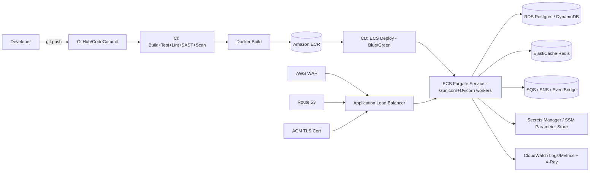

# Python FastAPI Microservice — End-to-End AWS Deployment with CI/CD (Architect Guide)

> Scope: Production-grade deployment architecture for a Python **FastAPI** microservice on AWS, with a full CI/CD pipeline and enterprise best practices (security, resilience, observability, cost, DR).

---

## 1. Choose the Right Compute Pattern First

| Pattern | Best AWS Service | When to use |
|---|---|---|
| Containerized microservice, full control | **ECS Fargate** (serverless containers) | Most common default — no EC2 patching, scales per-task, works well behind ALB |
| Containerized, need K8s ecosystem/portability | **EKS (Fargate or managed nodes)** | Multi-cloud/K8s-native org, complex orchestration, Helm charts |
| Event-driven / bursty / low-traffic API | **Lambda** (via **Mangum** adapter) + API Gateway | Short-lived requests, spiky traffic, pay-per-invocation, no idle cost |
| Simple long-running app, minimal ops | **AWS App Runner** | Small teams, want git-push-to-URL simplicity |
| Data/ML-heavy inference endpoints | **ECS Fargate w/ GPU** or **SageMaker endpoints** | Model serving alongside FastAPI, needs GPU or managed ML infra |

**Architect recommendation (default):** **ECS on Fargate** behind an **Application Load Balancer**, with **ECR** for image storage, running FastAPI via **Uvicorn + Gunicorn (uvicorn workers)** — same production pattern as the Node.js microservice guide, adapted for Python's ASGI stack. Use **Lambda + Mangum** for genuinely event-driven/low-traffic APIs instead of idle Fargate tasks.



---

## 2. Target AWS Architecture (ECS Fargate FastAPI Service)

```
Route 53 (DNS)
  -> ACM (TLS cert, regional)
  -> Application Load Balancer (public or internal)
       -> AWS WAF (attached to ALB)
       -> Target Group -> ECS Service (Fargate tasks, private subnets)
            -> RDS Postgres/Aurora or DynamoDB (data layer, private subnets)
            -> ElastiCache (Redis, caching/session/rate-limit store)
            -> SQS/SNS/EventBridge (async messaging between services)
            -> Secrets Manager / SSM Parameter Store (config & secrets)
       -> CloudWatch Logs + Metrics + X-Ray (observability)
  -> VPC: public subnets (ALB/NAT) + private subnets (ECS tasks, DB) across 2+ AZs
```

Key components:
- **VPC** — public subnets for ALB/NAT Gateway, private subnets for ECS tasks and data stores, ≥2 AZs for HA.
- **ECR** — private image repository, image scanning on push enabled.
- **ECS Fargate Service** — tasks in private subnets, no public IP; runs `gunicorn -k uvicorn.workers.UvicornWorker` for production-grade process management (multiple worker processes per task, graceful reload).
- **ALB** — health checks against FastAPI's `/health` route, HTTPS listener (redirect HTTP→HTTPS), path/host routing per service.
- **Secrets Manager / Parameter Store** — DB credentials, API keys injected via ECS task definition `secrets`, never baked into the image or `.env` committed to the repo.
- **RDS (Postgres) or DynamoDB** — data layer; use **SQLAlchemy (async) + asyncpg** or **Databases** library for non-blocking DB access under ASGI.
- **SQS/SNS/EventBridge** — decouple services; use **Celery** or **arq**/**FastAPI BackgroundTasks** (for lightweight cases) for async job processing.
- **CloudWatch + X-Ray** — logs, metrics, distributed tracing (`aws-xray-sdk` or OpenTelemetry).
- **AWS WAF** — attached to ALB, managed rule groups + rate limiting.

---

## 3. Infrastructure as Code (Mandatory)

Use **Terraform** or **AWS CDK**. Never hand-configure production ECS services or IAM roles via console.

### 3.1 Recommended repo layout

```
infra/
  cdk/ (or terraform/)
    lib/
      network-stack.ts       # VPC, subnets, NAT, security groups
      data-stack.ts           # RDS/DynamoDB, ElastiCache
      ecr-stack.ts            # ECR repo + lifecycle policy
      service-stack.ts        # ECS cluster, task def, service, ALB, WAF
      pipeline-stack.ts        # CodePipeline (if AWS-native CI/CD)
    environments/
      dev.json
      staging.json
      prod.json
```

### 3.2 Example: AWS CDK (TypeScript) — ECS Fargate Service + ALB

> Infra is defined in CDK/Terraform regardless of the app's language — only the container image and task env differ from the Node.js version.

```ts
import * as cdk from "aws-cdk-lib";
import * as ec2 from "aws-cdk-lib/aws-ec2";
import * as ecs from "aws-cdk-lib/aws-ecs";
import * as ecr from "aws-cdk-lib/aws-ecr";
import * as ecsPatterns from "aws-cdk-lib/aws-ecs-patterns";
import * as acm from "aws-cdk-lib/aws-certificatemanager";
import * as logs from "aws-cdk-lib/aws-logs";
import * as secretsmanager from "aws-cdk-lib/aws-secretsmanager";
import * as wafv2 from "aws-cdk-lib/aws-wafv2";
import { Construct } from "constructs";

export class ServiceStack extends cdk.Stack {
  constructor(scope: Construct, id: string, props: cdk.StackProps & { domainName: string; serviceName: string }) {
    super(scope, id, props);

    const vpc = new ec2.Vpc(this, "Vpc", {
      maxAzs: 2,
      natGateways: 1, // use 2 in prod for HA
      subnetConfiguration: [
        { name: "public", subnetType: ec2.SubnetType.PUBLIC, cidrMask: 24 },
        { name: "private", subnetType: ec2.SubnetType.PRIVATE_WITH_EGRESS, cidrMask: 24 },
      ],
    });

    const cluster = new ecs.Cluster(this, "Cluster", { vpc, containerInsights: true });
    const repo = ecr.Repository.fromRepositoryName(this, "Repo", `${props.serviceName}-repo`);
    const dbSecret = secretsmanager.Secret.fromSecretNameV2(this, "DbSecret", `${props.serviceName}/db-credentials`);
    const certificate = new acm.Certificate(this, "Cert", { domainName: props.domainName });

    const service = new ecsPatterns.ApplicationLoadBalancedFargateService(this, "Service", {
      cluster,
      cpu: 512,
      memoryLimitMiB: 1024,
      desiredCount: 2,
      certificate,
      redirectHTTP: true,
      domainName: props.domainName,
      taskImageOptions: {
        image: ecs.ContainerImage.fromEcrRepository(repo, "latest"),
        containerPort: 8000,
        environment: {
          ENV: "production",
          PORT: "8000",
          WEB_CONCURRENCY: "4", // gunicorn worker count, tune to vCPU
        },
        secrets: {
          DATABASE_PASSWORD: ecs.Secret.fromSecretsManager(dbSecret, "password"),
        },
        logDriver: ecs.LogDrivers.awsLogs({
          streamPrefix: props.serviceName,
          logRetention: logs.RetentionDays.ONE_MONTH,
        }),
      },
      publicLoadBalancer: true,
      healthCheckGracePeriod: cdk.Duration.seconds(60),
    });

    service.targetGroup.configureHealthCheck({
      path: "/health",
      healthyHttpCodes: "200",
      interval: cdk.Duration.seconds(30),
      timeout: cdk.Duration.seconds(5),
    });

    const scaling = service.service.autoScaleTaskCount({ minCapacity: 2, maxCapacity: 10 });
    scaling.scaleOnCpuUtilization("CpuScaling", { targetUtilizationPercent: 60 });
    scaling.scaleOnRequestCount("RequestScaling", { requestsPerTarget: 1000, targetGroup: service.targetGroup });

    const webAcl = new wafv2.CfnWebACL(this, "WebAcl", {
      defaultAction: { allow: {} },
      scope: "REGIONAL",
      visibilityConfig: { sampledRequestsEnabled: true, cloudWatchMetricsEnabled: true, metricName: `${props.serviceName}Waf` },
      rules: [
        {
          name: "AWS-AWSManagedRulesCommonRuleSet",
          priority: 0,
          overrideAction: { none: {} },
          statement: { managedRuleGroupStatement: { vendorName: "AWS", name: "AWSManagedRulesCommonRuleSet" } },
          visibilityConfig: { sampledRequestsEnabled: true, cloudWatchMetricsEnabled: true, metricName: "commonRules" },
        },
        {
          name: "RateLimit",
          priority: 1,
          action: { block: {} },
          statement: { rateBasedStatement: { limit: 2000, aggregateKeyType: "IP" } },
          visibilityConfig: { sampledRequestsEnabled: true, cloudWatchMetricsEnabled: true, metricName: "rateLimit" },
        },
      ],
    });

    new wafv2.CfnWebACLAssociation(this, "WafAssociation", {
      resourceArn: service.loadBalancer.loadBalancerArn,
      webAclArn: webAcl.attrArn,
    });

    new cdk.CfnOutput(this, "ServiceUrl", { value: `https://${props.domainName}` });
  }
}
```

### 3.3 Dockerfile best practices (FastAPI)

```dockerfile
# Multi-stage build to keep final image small and free of build tooling
FROM python:3.12-slim AS builder
WORKDIR /app
ENV PIP_NO_CACHE_DIR=1 PYTHONDONTWRITEBYTECODE=1
RUN pip install --upgrade pip poetry
COPY pyproject.toml poetry.lock ./
RUN poetry export -f requirements.txt --without-hashes -o requirements.txt
RUN pip install --prefix=/install -r requirements.txt

FROM python:3.12-slim AS runner
WORKDIR /app
ENV PYTHONUNBUFFERED=1 PYTHONDONTWRITEBYTECODE=1
RUN groupadd -r appgroup && useradd -r -g appgroup appuser
COPY --from=builder /install /usr/local
COPY . .
USER appuser
EXPOSE 8000
HEALTHCHECK --interval=30s --timeout=5s CMD python -c "import urllib.request; urllib.request.urlopen('http://localhost:8000/health')" || exit 1
CMD ["gunicorn", "app.main:app", \
     "-k", "uvicorn.workers.UvicornWorker", \
     "--workers", "4", \
     "--bind", "0.0.0.0:8000", \
     "--timeout", "30", \
     "--graceful-timeout", "30", \
     "--access-logfile", "-"]
```

- Multi-stage build → smaller image, no compilers/build tools in runtime layer.
- **Gunicorn + Uvicorn workers** for production (never run plain `uvicorn` alone in prod — Gunicorn gives process management, worker recycling, graceful restarts).
- Run as **non-root user**.
- Pin base image digest in prod, pin dependency versions via `poetry.lock`/`requirements.txt` with hashes.
- `.dockerignore` excludes `.venv`, `__pycache__`, `.env`, `.git`, tests.

---

## 4. CI/CD Pipeline Design

### 4.1 Pipeline stages

1. **Source** — trigger on push/PR to `main`/`develop`/feature branches.
2. **Install & Cache** — `poetry install` (or `pip install -r requirements.txt`), cache `~/.cache/pypoetry`/pip cache.
3. **Lint & Format** — `ruff check .`, `black --check .`, `isort --check-only .`.
4. **Type check** — `mypy app/`.
5. **Unit tests** — `pytest --cov=app --cov-report=xml` + coverage gate (e.g., 80%).
6. **Security scans**:
   - **Dependency CVEs**: `pip-audit` or Snyk.
   - **SAST**: `bandit -r app/`, CodeQL/Semgrep.
   - **Secret scanning**: gitleaks.
   - **Container image scan**: Trivy/ECR scan-on-push.
7. **Build Docker image** — multi-stage, tag with commit SHA (immutable tags).
8. **Push to ECR**.
9. **Integration tests** — `pytest` against `docker-compose` (Postgres/Redis test containers) or a preview environment; **schemathesis** for OpenAPI contract/property-based testing against FastAPI's auto-generated schema.
10. **Deploy to environment** — ECS service update (rolling or blue/green via CodeDeploy).
11. **Post-deploy smoke/health check** — hit `/health`, run a synthetic transaction against `/docs` or a critical endpoint.
12. **Manual approval gate** — before prod.
13. **Notify** — Slack/Teams.

### 4.2 Branching & environment strategy

| Branch | Environment | Deploy trigger |
|---|---|---|
| `feature/*` | Ephemeral preview (optional) | On PR open |
| `develop` | `dev` | Auto on merge |
| `release/*` | `staging` | Auto on merge, QA signoff |
| `main` | `prod` | Manual approval, blue/green |

### 4.3 GitHub Actions Example (ECS Fargate)

```yaml
name: FastAPI CI/CD

on:
  push:
    branches: [main, develop]
  pull_request:
    branches: [main, develop]

permissions:
  id-token: write
  contents: read

env:
  PYTHON_VERSION: "3.12"
  ECR_REPOSITORY: my-fastapi-repo
  ECS_CLUSTER: my-cluster
  ECS_SERVICE: my-fastapi-service

jobs:
  build-test:
    runs-on: ubuntu-latest
    steps:
      - uses: actions/checkout@v4

      - uses: actions/setup-python@v5
        with:
          python-version: ${{ env.PYTHON_VERSION }}
          cache: "pip"

      - name: Install dependencies
        run: |
          pip install poetry
          poetry install --no-interaction

      - name: Lint (ruff, black, isort)
        run: |
          poetry run ruff check .
          poetry run black --check .
          poetry run isort --check-only .

      - name: Type check
        run: poetry run mypy app/

      - name: Unit tests with coverage
        run: poetry run pytest --cov=app --cov-report=xml --cov-fail-under=80

      - name: Dependency vulnerability scan
        run: poetry run pip-audit

      - name: SAST (bandit)
        run: poetry run bandit -r app/ -ll

      - name: Secret scan
        uses: gitleaks/gitleaks-action@v2

  docker-push:
    needs: build-test
    runs-on: ubuntu-latest
    outputs:
      image: ${{ steps.build-image.outputs.image }}
    steps:
      - uses: actions/checkout@v4

      - name: Configure AWS credentials (OIDC)
        uses: aws-actions/configure-aws-credentials@v4
        with:
          role-to-assume: arn:aws:iam::<ACCOUNT_ID>:role/github-actions-deploy-role
          aws-region: us-east-1

      - name: Login to ECR
        id: ecr-login
        uses: aws-actions/amazon-ecr-login@v2

      - name: Build, scan, and push image
        id: build-image
        env:
          ECR_REGISTRY: ${{ steps.ecr-login.outputs.registry }}
          IMAGE_TAG: ${{ github.sha }}
        run: |
          docker build -t $ECR_REGISTRY/$ECR_REPOSITORY:$IMAGE_TAG .
          docker run --rm -v /var/run/docker.sock:/var/run/docker.sock \
            aquasec/trivy image --exit-code 1 --severity HIGH,CRITICAL \
            $ECR_REGISTRY/$ECR_REPOSITORY:$IMAGE_TAG
          docker push $ECR_REGISTRY/$ECR_REPOSITORY:$IMAGE_TAG
          echo "image=$ECR_REGISTRY/$ECR_REPOSITORY:$IMAGE_TAG" >> $GITHUB_OUTPUT

  deploy:
    needs: docker-push
    if: github.ref == 'refs/heads/main'
    runs-on: ubuntu-latest
    environment: production   # manual approval via GitHub Environments
    steps:
      - uses: actions/checkout@v4

      - name: Configure AWS credentials (OIDC)
        uses: aws-actions/configure-aws-credentials@v4
        with:
          role-to-assume: arn:aws:iam::<ACCOUNT_ID>:role/github-actions-deploy-role
          aws-region: us-east-1

      - name: Render new task definition
        id: task-def
        uses: aws-actions/amazon-ecs-render-task-definition@v1
        with:
          task-definition: task-definition.json
          container-name: app
          image: ${{ needs.docker-push.outputs.image }}

      - name: Deploy to ECS (blue/green via CodeDeploy)
        uses: aws-actions/amazon-ecs-deploy-task-definition@v2
        with:
          task-definition: ${{ steps.task-def.outputs.task-definition }}
          service: ${{ env.ECS_SERVICE }}
          cluster: ${{ env.ECS_CLUSTER }}
          codedeploy-appspec: appspec.yaml
          codedeploy-application: my-fastapi-app
          codedeploy-deployment-group: my-fastapi-dg

      - name: Post-deploy health check
        run: curl -sSf https://api.example.com/health -o /dev/null

      - name: Notify Slack
        if: always()
        uses: slackapi/slack-github-action@v1
        with:
          payload: '{"text":"Deploy ${{ job.status }} for ${{ github.sha }}"}'
        env:
          SLACK_WEBHOOK_URL: ${{ secrets.SLACK_WEBHOOK }}
```

**Critical practice:** use **OIDC federation** for AWS auth — no static IAM access keys in CI secrets. Scope the deploy role to only the specific ECS cluster/service/ECR repo it needs.

### 4.4 AWS-native alternative: CodePipeline + CodeBuild + CodeDeploy

```
CodePipeline:
  Source: CodeStar Connection (GitHub) or CodeCommit
  Build: CodeBuild (buildspec.yml -> lint, mypy, pytest, bandit/pip-audit, docker build, trivy scan, push to ECR)
  Deploy: CodeDeploy (ECS blue/green) using appspec.yaml
Approval: Manual approval action before Prod stage
```

`buildspec.yml`:
```yaml
version: 0.2
phases:
  install:
    runtime-versions:
      python: 3.12
    commands:
      - pip install poetry
      - poetry install --no-interaction
  pre_build:
    commands:
      - aws ecr get-login-password | docker login --username AWS --password-stdin $ECR_REGISTRY
      - poetry run ruff check .
      - poetry run mypy app/
      - poetry run pytest --cov=app --cov-fail-under=80
      - poetry run bandit -r app/ -ll
  build:
    commands:
      - docker build -t $ECR_REGISTRY/$ECR_REPO:$CODEBUILD_RESOLVED_SOURCE_VERSION .
  post_build:
    commands:
      - docker push $ECR_REGISTRY/$ECR_REPO:$CODEBUILD_RESOLVED_SOURCE_VERSION
      - printf '[{"name":"app","imageUri":"%s"}]' $ECR_REGISTRY/$ECR_REPO:$CODEBUILD_RESOLVED_SOURCE_VERSION > imagedefinitions.json
artifacts:
  files:
    - imagedefinitions.json
    - appspec.yaml
    - taskdef.json
```

---

## 5. Deployment Strategy & Rollback

- **Immutable image tags**: always deploy by commit SHA, never `latest`.
- **Blue/Green deployment** via **CodeDeploy for ECS**: shifts traffic between old/new task sets; CloudWatch alarms (5xx rate, latency) trigger automatic rollback.
- **Canary option**: shift 10% traffic first, bake time (e.g., 5 min), then 100%.
- **Rolling update** (ECS native `minimumHealthyPercent`/`maximumPercent`) acceptable for lower-risk services.
- **Rollback plan**: redeploy previous ECS task definition revision — near-instant since the image is already in ECR.
- **Database migrations**: run **Alembic** migrations as a separate pipeline step (before service deploy), using expand/contract pattern for backward-compatible schema changes during blue/green cutover.
- **Feature flags** to decouple risky logic from deployment.

---

## 6. Security Best Practices (OWASP-aligned)

1. **Network isolation**: ECS tasks in private subnets, no public IP; only ALB public. Security groups least-privilege (ALB→ECS app port only, ECS→RDS DB port only).
2. **Secrets**: DB credentials/API keys in **Secrets Manager**/**SSM Parameter Store**, injected via ECS task definition `secrets` — never in `.env` committed to the repo or plaintext env vars in the image.
3. **IAM least privilege**: separate **task role** (runtime AWS permissions, e.g., S3/SQS) vs **task execution role** (image pull, log write) — never over-scope with `*`.
4. **TLS everywhere**: ALB HTTPS listener with ACM cert, HTTP→HTTPS redirect, TLS 1.2+ enforced.
5. **WAF on ALB**: AWS Managed Rules (Common, SQLi, Known Bad Inputs), rate-based rules.
6. **Container security**: non-root user, read-only root filesystem where possible, scan images (Trivy/ECR scan-on-push), block deploy on HIGH/CRITICAL CVEs.
7. **Input validation**: FastAPI + **Pydantic** models validate/sanitize all request bodies, query/path params by default — keep strict `Field` constraints (max length, regex) rather than permissive `Any`/`dict` types.
8. **SQL injection prevention**: use SQLAlchemy ORM/parameterized queries; never string-format raw SQL with user input.
9. **AuthN/AuthZ**: OAuth2/JWT via FastAPI's `Security`/`Depends` (e.g., `fastapi-users` or custom OAuth2PasswordBearer flow), short-lived tokens, signing keys rotated via Secrets Manager/KMS. Validate JWT audience/issuer, not just signature.
10. **CORS**: configure `CORSMiddleware` with an explicit allow-list of origins — never `allow_origins=["*"]` combined with `allow_credentials=True` in production.
11. **Rate limiting**: `slowapi` (Redis-backed) at the app layer plus WAF rate-based rules at the edge.
12. **Dependency hygiene**: Dependabot/Renovate, `pip-audit`/Snyk as a CI gate; pin exact versions via `poetry.lock`.
13. **Multi-account strategy**: separate AWS accounts for dev/staging/prod via AWS Organizations + SCPs.
14. **Audit logging**: CloudTrail account-wide, VPC Flow Logs, ALB access logs centralized in a log-archive account.
15. **Encryption at rest**: RDS/EBS/S3 encrypted with KMS CMKs.
16. **Supply chain**: pin base image digests, disable FastAPI's `/docs`/`/redoc` in production (or protect behind auth) if the API surface shouldn't be publicly browsable.

---

## 7. Resilience & Scalability

- **Auto Scaling**: ECS service scales on CPU/memory and/or ALB request count per target; consider custom CloudWatch metrics (e.g., queue depth) for worker-style services.
- **Async I/O**: use `async def` route handlers with async DB drivers (`asyncpg`, `databases`, or SQLAlchemy 2.0 async engine) — mixing blocking sync calls inside `async def` routes blocks the whole event loop and kills throughput.
- **Gunicorn worker tuning**: `--workers` ≈ `(2 × vCPU) + 1` per task; combine with ECS horizontal scaling rather than over-provisioning workers per task.
- **Multi-AZ**: tasks and RDS spread across ≥2 AZs.
- **Health checks**: ALB target group health check on `/health` (liveness) and optionally `/ready` (checks DB/cache connectivity); tune `healthCheckGracePeriod` to app startup time (FastAPI + DB pool warm-up).
- **Circuit breakers & retries**: `tenacity` for retry/backoff on downstream HTTP/DB calls; avoid unbounded retries (retry storms).
- **Timeouts** set explicitly on all outbound HTTP calls (`httpx.Timeout`) and DB queries — never rely on defaults.
- **Async decoupling**: use SQS/EventBridge + Celery/arq workers for long-running tasks instead of blocking request handlers; configure DLQs with alarms.
- **Graceful shutdown**: handle `SIGTERM` (Gunicorn forwards to workers) to drain in-flight requests before ECS stops the task.
- **Connection pooling**: tune SQLAlchemy pool size per task considering `workers × pool_size ≤ RDS max_connections`; use **RDS Proxy** to avoid connection exhaustion under Fargate scale-out.

---

## 8. Observability & Monitoring

- **Structured logging**: JSON logs (`structlog` or `python-json-logger`) shipped to **CloudWatch Logs**; include request/correlation IDs (FastAPI middleware) for cross-service tracing.
- **Distributed tracing**: **AWS X-Ray SDK for Python** or **OpenTelemetry** (`opentelemetry-instrumentation-fastapi`) instrumented to trace ALB → ECS → RDS/SQS/downstream calls.
- **Metrics**: CloudWatch Container Insights for ECS (CPU/memory/network per task); custom business metrics via EMF or a Prometheus exporter scraped into CloudWatch.
- **Alarms → SNS → Slack/PagerDuty**: high 5xx rate, high p99 latency, unhealthy target count > 0, queue depth/DLQ growth, CPU/memory near limits.
- **Synthetic monitoring**: CloudWatch Synthetics canary hitting critical endpoints every few minutes.
- **Deploy correlation**: annotate dashboards on every deploy to correlate regressions with releases.
- **Cost dashboards**: tag every resource (`Environment`, `Service`, `Team`) with AWS Budgets alerts.

---

## 9. Cost Optimization

- **Fargate Spot** for dev/staging; Savings Plans for steady-state prod baseline.
- **Right-size** task CPU/memory using Container Insights data; tune Gunicorn worker count to match allocated vCPU rather than over-provisioning.
- **Scale-to-near-zero** for dev/staging outside business hours (scheduled scaling).
- **VPC endpoints** (S3, ECR, Secrets Manager, CloudWatch Logs) to avoid routing traffic through NAT Gateway.
- **Log retention**: set CloudWatch Logs retention (e.g., 30–90 days).
- **Consider Lambda + Mangum** for genuinely low-traffic/event-driven APIs instead of always-on Fargate tasks.

---

## 10. Multi-Region / DR

- Define **RTO/RPO** targets explicitly per service tier.
- **Active-passive**: Route 53 failover routing to a warm-standby ECS deployment + RDS cross-region read replica (promote on failover).
- **Active-active** (higher cost/complexity): Aurora Global Database, ECS services in multiple regions behind Route 53 latency/geolocation routing.
- Regularly **test failover** (game days) — an untested DR plan is not a DR plan.
- Automated RDS snapshots + point-in-time recovery; periodically test restore procedure.

---

## 11. Checklist Summary (Architect Sign-off)

- [ ] IaC (CDK/Terraform) for VPC, ECS, ALB, IAM, WAF — no manual console changes in prod
- [ ] Separate AWS accounts per environment (dev/staging/prod)
- [ ] ECS tasks in private subnets, least-privilege security groups
- [ ] Secrets in Secrets Manager/Parameter Store, never plaintext in env/image
- [ ] Separate task role vs task execution role, least privilege IAM
- [ ] ALB with WAF, ACM TLS cert, HTTP→HTTPS redirect
- [ ] Gunicorn + Uvicorn workers in production (not bare `uvicorn`)
- [ ] CI/CD: ruff/black/isort, mypy, pytest+coverage gate, bandit, pip-audit, secret scan, image scan (Trivy/ECR)
- [ ] OIDC-based AWS auth from CI (no static keys)
- [ ] Immutable image tags (commit SHA), blue/green or canary deploy via CodeDeploy
- [ ] Manual approval gate before prod deploy
- [ ] Rollback strategy documented and tested (previous task def revision)
- [ ] Alembic migrations run as a separate, backward-compatible pipeline step
- [ ] Health checks (`/health`, `/ready`), graceful shutdown on SIGTERM
- [ ] Auto scaling configured (CPU/memory/request count/custom metric)
- [ ] Pydantic strict validation on all inputs, CORS allow-list (no wildcard + credentials)
- [ ] `/docs`/`/redoc` disabled or protected in production if not meant to be public
- [ ] Async DB drivers used correctly (no blocking calls inside `async def`)
- [ ] CloudWatch alarms + Container Insights + X-Ray tracing + synthetic canary
- [ ] Cost tagging + budget alerts, Fargate Spot for non-prod
- [ ] DR/failover plan documented with RTO/RPO, periodically tested

---

## 12. Reference Reading

- AWS Well-Architected Framework — https://aws.amazon.com/architecture/well-architected/
- Amazon ECS Best Practices Guide — AWS docs
- FastAPI official docs — Deployment, Security, and Async sections
- OWASP Top 10 / OWASP API Security Top 10
- AWS CDK / Terraform AWS provider documentation
