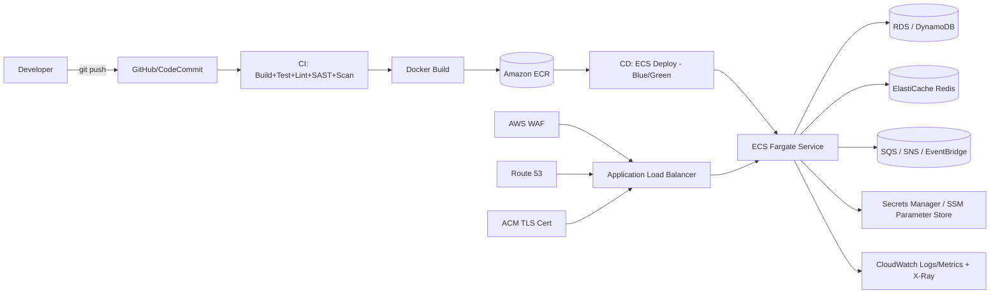

# Node.js Microservice — End-to-End AWS Deployment with CI/CD (Architect Guide)

> Scope: Production-grade deployment architecture for a Node.js microservice (Express/NestJS/Fastify) on AWS, with a full CI/CD pipeline and enterprise best practices (security, resilience, observability, cost, DR).

---

## 1. Choose the Right Compute Pattern First

| Pattern | Best AWS Service | When to use |
|---|---|---|
| Containerized microservice, full control | **ECS Fargate** (serverless containers) | Most common default — no EC2 patching, scales per-task, works well with ALB + service mesh |
| Containerized, need K8s ecosystem/portability | **EKS (Fargate or managed nodes)** | Multi-cloud/K8s-native org, complex orchestration, Helm charts |
| Event-driven / bursty / low-traffic | **Lambda** (Node.js runtime) + API Gateway | Short-lived requests, spiky traffic, pay-per-invocation, no idle cost |
| Simple long-running app, minimal ops | **AWS App Runner** | Small teams, want git-push-to-URL simplicity |
| Legacy/stateful, need full OS control | **EC2 + Auto Scaling Group** | Rare now; only when container/serverless isn't viable |

**Architect recommendation (default):** **ECS on Fargate** behind an **Application Load Balancer**, with **ECR** for image storage — best balance of control, cost, and operational simplicity for a microservice fleet. Use **Lambda** for event-driven/low-traffic services instead of running idle Fargate tasks.



---

## 2. Target AWS Architecture (ECS Fargate Microservice)

```
Route 53 (DNS)
  -> ACM (TLS cert, regional)
  -> Application Load Balancer (public or internal, per service or shared)
       -> AWS WAF (attached to ALB)
       -> Target Group -> ECS Service (Fargate tasks, private subnets)
            -> RDS/Aurora or DynamoDB (data layer, private subnets)
            -> ElastiCache (Redis, session/cache layer)
            -> SQS/SNS/EventBridge (async messaging between microservices)
            -> Secrets Manager / SSM Parameter Store (config & secrets)
       -> CloudWatch Logs + Metrics + X-Ray (observability)
  -> VPC: public subnets (ALB/NAT) + private subnets (ECS tasks, DB) across 2+ AZs
```

Key components:
- **VPC** — public subnets for ALB/NAT Gateway, private subnets for ECS tasks and data stores, spread across ≥2 Availability Zones for HA.
- **ECR** — private image repository, image scanning on push enabled.
- **ECS Fargate Service** — tasks run in private subnets, no public IP; auto scaling on CPU/memory/custom CloudWatch metric (e.g., SQS queue depth).
- **ALB** — health checks, path/host-based routing per microservice, HTTPS listener (redirect HTTP→HTTPS).
- **Service Discovery** — AWS Cloud Map or internal ALB per service for service-to-service calls (or a lightweight service mesh via App Mesh if many services).
- **Secrets Manager / Parameter Store** — DB credentials, API keys; injected into ECS task definition as `secrets`, never as plain env vars in the image.
- **RDS (Postgres/MySQL) or DynamoDB** — data layer, Multi-AZ for prod.
- **SQS/SNS/EventBridge** — decouple microservices, async processing, retries/DLQ.
- **CloudWatch + X-Ray** — logs, metrics, distributed tracing.
- **AWS WAF** — attached to ALB, managed rule groups + rate limiting.

---

## 3. Infrastructure as Code (Mandatory)

Use **Terraform** or **AWS CDK**. Never hand-configure production ECS services or IAM roles via console.

### 3.1 Recommended repo layout

```
infra/
  cdk/ (or terraform/)
    lib/
      network-stack.ts       # VPC, subnets, NAT, security groups
      data-stack.ts           # RDS/DynamoDB, ElastiCache
      ecr-stack.ts            # ECR repo + lifecycle policy
      service-stack.ts        # ECS cluster, task def, service, ALB, WAF
      pipeline-stack.ts        # CodePipeline (if AWS-native CI/CD)
    environments/
      dev.json
      staging.json
      prod.json
```

### 3.2 Example: AWS CDK (TypeScript) — ECS Fargate Service + ALB

```ts
import * as cdk from "aws-cdk-lib";
import * as ec2 from "aws-cdk-lib/aws-ec2";
import * as ecs from "aws-cdk-lib/aws-ecs";
import * as ecr from "aws-cdk-lib/aws-ecr";
import * as ecsPatterns from "aws-cdk-lib/aws-ecs-patterns";
import * as acm from "aws-cdk-lib/aws-certificatemanager";
import * as logs from "aws-cdk-lib/aws-logs";
import * as secretsmanager from "aws-cdk-lib/aws-secretsmanager";
import * as wafv2 from "aws-cdk-lib/aws-wafv2";
import { Construct } from "constructs";

export class ServiceStack extends cdk.Stack {
  constructor(scope: Construct, id: string, props: cdk.StackProps & { domainName: string; serviceName: string }) {
    super(scope, id, props);

    const vpc = new ec2.Vpc(this, "Vpc", {
      maxAzs: 2,
      natGateways: 1, // use 2 in prod for HA
      subnetConfiguration: [
        { name: "public", subnetType: ec2.SubnetType.PUBLIC, cidrMask: 24 },
        { name: "private", subnetType: ec2.SubnetType.PRIVATE_WITH_EGRESS, cidrMask: 24 },
      ],
    });

    const cluster = new ecs.Cluster(this, "Cluster", { vpc, containerInsights: true });

    const repo = ecr.Repository.fromRepositoryName(this, "Repo", `${props.serviceName}-repo`);

    const dbSecret = secretsmanager.Secret.fromSecretNameV2(this, "DbSecret", `${props.serviceName}/db-credentials`);

    const certificate = new acm.Certificate(this, "Cert", { domainName: props.domainName });

    const service = new ecsPatterns.ApplicationLoadBalancedFargateService(this, "Service", {
      cluster,
      cpu: 512,
      memoryLimitMiB: 1024,
      desiredCount: 2,
      certificate,
      redirectHTTP: true,
      domainName: props.domainName,
      taskImageOptions: {
        image: ecs.ContainerImage.fromEcrRepository(repo, "latest"),
        containerPort: 3000,
        environment: {
          NODE_ENV: "production",
          PORT: "3000",
        },
        secrets: {
          DB_PASSWORD: ecs.Secret.fromSecretsManager(dbSecret, "password"),
        },
        logDriver: ecs.LogDrivers.awsLogs({
          streamPrefix: props.serviceName,
          logRetention: logs.RetentionDays.ONE_MONTH,
        }),
      },
      publicLoadBalancer: true,
      healthCheckGracePeriod: cdk.Duration.seconds(60),
    });

    service.targetGroup.configureHealthCheck({
      path: "/health",
      healthyHttpCodes: "200",
      interval: cdk.Duration.seconds(30),
      timeout: cdk.Duration.seconds(5),
    });

    // Autoscaling on CPU + request count
    const scaling = service.service.autoScaleTaskCount({ minCapacity: 2, maxCapacity: 10 });
    scaling.scaleOnCpuUtilization("CpuScaling", { targetUtilizationPercent: 60 });
    scaling.scaleOnRequestCount("RequestScaling", {
      requestsPerTarget: 1000,
      targetGroup: service.targetGroup,
    });

    const webAcl = new wafv2.CfnWebACL(this, "WebAcl", {
      defaultAction: { allow: {} },
      scope: "REGIONAL",
      visibilityConfig: { sampledRequestsEnabled: true, cloudWatchMetricsEnabled: true, metricName: `${props.serviceName}Waf` },
      rules: [
        {
          name: "AWS-AWSManagedRulesCommonRuleSet",
          priority: 0,
          overrideAction: { none: {} },
          statement: { managedRuleGroupStatement: { vendorName: "AWS", name: "AWSManagedRulesCommonRuleSet" } },
          visibilityConfig: { sampledRequestsEnabled: true, cloudWatchMetricsEnabled: true, metricName: "commonRules" },
        },
        {
          name: "RateLimit",
          priority: 1,
          action: { block: {} },
          statement: { rateBasedStatement: { limit: 2000, aggregateKeyType: "IP" } },
          visibilityConfig: { sampledRequestsEnabled: true, cloudWatchMetricsEnabled: true, metricName: "rateLimit" },
        },
      ],
    });

    new wafv2.CfnWebACLAssociation(this, "WafAssociation", {
      resourceArn: service.loadBalancer.loadBalancerArn,
      webAclArn: webAcl.attrArn,
    });

    new cdk.CfnOutput(this, "ServiceUrl", { value: `https://${props.domainName}` });
  }
}
```

> Terraform equivalent: `aws_ecs_cluster`, `aws_ecs_task_definition` (with `secrets` block referencing Secrets Manager ARNs), `aws_ecs_service`, `aws_lb` + `aws_lb_target_group` + health check, `aws_appautoscaling_target/policy`, `aws_wafv2_web_acl` + `aws_wafv2_web_acl_association`.

### 3.3 Dockerfile best practices (Node.js)

```dockerfile
# Multi-stage build to keep final image small and free of dev dependencies
FROM node:20-alpine AS builder
WORKDIR /app
COPY package*.json ./
RUN npm ci
COPY . .
RUN npm run build

FROM node:20-alpine AS runner
WORKDIR /app
ENV NODE_ENV=production
RUN addgroup -S appgroup && adduser -S appuser -G appgroup
COPY package*.json ./
RUN npm ci --omit=dev
COPY --from=builder /app/dist ./dist
USER appuser
EXPOSE 3000
HEALTHCHECK --interval=30s --timeout=5s CMD node dist/healthcheck.js || exit 1
CMD ["node", "dist/main.js"]
```

- Multi-stage build → smaller attack surface, no build tools in runtime image.
- Run as **non-root user**.
- Pin base image digest in prod (`node:20-alpine@sha256:...`) to avoid supply-chain drift.
- Add `.dockerignore` (`node_modules`, `.env`, `.git`).

---

## 4. CI/CD Pipeline Design

### 4.1 Pipeline stages

1. **Source** — trigger on push/PR to `main`/`develop`/feature branches.
2. **Install & Cache** — `npm ci`, cache `node_modules`/npm cache.
3. **Lint & Format** — ESLint, Prettier `--check`.
4. **Type check** — `tsc --noEmit` (if TypeScript).
5. **Unit tests** — Jest/Vitest + coverage gate.
6. **Security scans**:
   - `npm audit`/Snyk (dependency CVEs).
   - SAST: CodeQL/Semgrep.
   - Secret scanning: gitleaks.
   - **Container image scan**: Trivy/ECR image scanning.
7. **Build Docker image** — multi-stage, tag with commit SHA (immutable tags, never rely on `latest` in prod).
8. **Push to ECR**.
9. **Integration tests** — spin up service + testcontainers (DB/Redis) or against a preview environment.
10. **Deploy to environment** — ECS service update (rolling or blue/green via CodeDeploy).
11. **Post-deploy smoke/health check** — hit `/health`, run a small synthetic transaction.
12. **Manual approval gate** — before prod.
13. **Notify** — Slack/Teams.

### 4.2 Branching & environment strategy

| Branch | Environment | Deploy trigger |
|---|---|---|
| `feature/*` | Ephemeral preview (optional, ECS service per PR) | On PR open |
| `develop` | `dev` | Auto on merge |
| `release/*` | `staging` | Auto on merge, QA signoff |
| `main` | `prod` | Manual approval, blue/green |

### 4.3 GitHub Actions Example (ECS Fargate)

```yaml
name: Node Microservice CI/CD

on:
  push:
    branches: [main, develop]
  pull_request:
    branches: [main, develop]

permissions:
  id-token: write
  contents: read

env:
  NODE_VERSION: "20"
  ECR_REPOSITORY: my-service-repo
  ECS_CLUSTER: my-cluster
  ECS_SERVICE: my-service

jobs:
  build-test:
    runs-on: ubuntu-latest
    steps:
      - uses: actions/checkout@v4

      - uses: actions/setup-node@v4
        with:
          node-version: ${{ env.NODE_VERSION }}
          cache: "npm"

      - name: Install dependencies
        run: npm ci

      - name: Lint
        run: npm run lint

      - name: Type check
        run: npm run typecheck

      - name: Unit tests with coverage
        run: npm test -- --coverage

      - name: Dependency vulnerability scan
        run: npm audit --audit-level=high

      - name: Secret scan
        uses: gitleaks/gitleaks-action@v2

      - name: Build
        run: npm run build

  docker-push:
    needs: build-test
    runs-on: ubuntu-latest
    outputs:
      image: ${{ steps.build-image.outputs.image }}
    steps:
      - uses: actions/checkout@v4

      - name: Configure AWS credentials (OIDC)
        uses: aws-actions/configure-aws-credentials@v4
        with:
          role-to-assume: arn:aws:iam::<ACCOUNT_ID>:role/github-actions-deploy-role
          aws-region: us-east-1

      - name: Login to ECR
        id: ecr-login
        uses: aws-actions/amazon-ecr-login@v2

      - name: Build, scan, and push image
        id: build-image
        env:
          ECR_REGISTRY: ${{ steps.ecr-login.outputs.registry }}
          IMAGE_TAG: ${{ github.sha }}
        run: |
          docker build -t $ECR_REGISTRY/$ECR_REPOSITORY:$IMAGE_TAG .
          docker run --rm -v /var/run/docker.sock:/var/run/docker.sock \
            aquasec/trivy image --exit-code 1 --severity HIGH,CRITICAL \
            $ECR_REGISTRY/$ECR_REPOSITORY:$IMAGE_TAG
          docker push $ECR_REGISTRY/$ECR_REPOSITORY:$IMAGE_TAG
          echo "image=$ECR_REGISTRY/$ECR_REPOSITORY:$IMAGE_TAG" >> $GITHUB_OUTPUT

  deploy:
    needs: docker-push
    if: github.ref == 'refs/heads/main'
    runs-on: ubuntu-latest
    environment: production   # manual approval via GitHub Environments
    steps:
      - uses: actions/checkout@v4

      - name: Configure AWS credentials (OIDC)
        uses: aws-actions/configure-aws-credentials@v4
        with:
          role-to-assume: arn:aws:iam::<ACCOUNT_ID>:role/github-actions-deploy-role
          aws-region: us-east-1

      - name: Render new task definition
        id: task-def
        uses: aws-actions/amazon-ecs-render-task-definition@v1
        with:
          task-definition: task-definition.json
          container-name: app
          image: ${{ needs.docker-push.outputs.image }}

      - name: Deploy to ECS (blue/green via CodeDeploy)
        uses: aws-actions/amazon-ecs-deploy-task-definition@v2
        with:
          task-definition: ${{ steps.task-def.outputs.task-definition }}
          service: ${{ env.ECS_SERVICE }}
          cluster: ${{ env.ECS_CLUSTER }}
          codedeploy-appspec: appspec.yaml
          codedeploy-application: my-service-app
          codedeploy-deployment-group: my-service-dg

      - name: Post-deploy health check
        run: curl -sSf https://api.example.com/health -o /dev/null

      - name: Notify Slack
        if: always()
        uses: slackapi/slack-github-action@v1
        with:
          payload: '{"text":"Deploy ${{ job.status }} for ${{ github.sha }}"}'
        env:
          SLACK_WEBHOOK_URL: ${{ secrets.SLACK_WEBHOOK }}
```

**Critical practice:** use **OIDC federation** for AWS auth — no static IAM access keys stored in CI secrets. Scope the deploy role to only the specific ECS cluster/service/ECR repo it needs.

### 4.4 AWS-native alternative: CodePipeline + CodeBuild + CodeDeploy

```
CodePipeline:
  Source: CodeStar Connection (GitHub) or CodeCommit
  Build: CodeBuild (buildspec.yml -> lint, test, docker build, trivy scan, push to ECR)
  Deploy: CodeDeploy (ECS blue/green) using appspec.yaml
Approval: Manual approval action before Prod stage
```

`buildspec.yml`:
```yaml
version: 0.2
phases:
  pre_build:
    commands:
      - aws ecr get-login-password | docker login --username AWS --password-stdin $ECR_REGISTRY
      - npm ci
      - npm run lint
      - npm test -- --coverage
  build:
    commands:
      - docker build -t $ECR_REGISTRY/$ECR_REPO:$CODEBUILD_RESOLVED_SOURCE_VERSION .
  post_build:
    commands:
      - docker push $ECR_REGISTRY/$ECR_REPO:$CODEBUILD_RESOLVED_SOURCE_VERSION
      - printf '[{"name":"app","imageUri":"%s"}]' $ECR_REGISTRY/$ECR_REPO:$CODEBUILD_RESOLVED_SOURCE_VERSION > imagedefinitions.json
artifacts:
  files:
    - imagedefinitions.json
    - appspec.yaml
    - taskdef.json
```

---

## 5. Deployment Strategy & Rollback

- **Immutable image tags**: always deploy by commit SHA, never `latest`, for reproducibility and instant rollback.
- **Blue/Green deployment** via **CodeDeploy for ECS**: shifts traffic between old (blue) and new (green) task sets; CloudWatch alarms (5xx rate, latency) trigger **automatic rollback**.
- **Canary option**: shift 10% traffic first, bake time (e.g., 5 min), then 100% — reduces blast radius of bad deploys.
- **Rolling update** (simpler, ECS native `minimumHealthyPercent`/`maximumPercent`) acceptable for lower-risk services.
- **Rollback plan**: redeploy previous task definition revision (ECS keeps revision history) — near-instant rollback since image is already in ECR.
- **Database migrations**: run as a separate pipeline step (before service deploy) using expand/contract pattern to keep backward compatibility during blue/green window.
- **Feature flags** to decouple risky logic changes from deployment.

---

## 6. Security Best Practices (OWASP-aligned)

1. **Network isolation**: ECS tasks in private subnets, no public IP; only ALB in public subnets. Security groups scoped to least privilege (ALB→ECS on app port only, ECS→RDS on DB port only).
2. **Secrets**: DB credentials/API keys in **Secrets Manager** or **SSM Parameter Store (SecureString)**, injected into task definition via `secrets`, never as plaintext env vars or baked into the image.
3. **IAM least privilege**: separate **task role** (permissions the app needs at runtime, e.g., S3/SQS access) vs **task execution role** (pulling image, writing logs) — never combine or over-scope with `*`.
4. **TLS everywhere**: ALB HTTPS listener with ACM cert, HTTP→HTTPS redirect, TLS 1.2+ enforced.
5. **WAF on ALB**: AWS Managed Rules (Common, SQLi, Known Bad Inputs), rate-based rules, optionally geo-restriction.
6. **Container security**: non-root user in Dockerfile, read-only root filesystem where possible (`readonlyRootFilesystem: true` in task def), drop unnecessary Linux capabilities, scan images (Trivy/ECR scan-on-push) and block deploy on HIGH/CRITICAL CVEs.
7. **Dependency hygiene**: Dependabot/Renovate, `npm audit`/Snyk as CI gate.
8. **Input validation**: validate/sanitize all inputs at the API boundary (e.g., `zod`/`joi`/`class-validator`), parameterized queries (no string-concatenated SQL) to prevent injection.
9. **AuthN/AuthZ**: JWT/OAuth2 validation at API Gateway or middleware layer; short-lived tokens, rotate signing keys via Secrets Manager/KMS.
10. **Rate limiting & throttling**: at ALB/WAF layer and/or application layer (e.g., `express-rate-limit` backed by Redis) to prevent abuse.
11. **Multi-account strategy**: separate AWS accounts for dev/staging/prod via AWS Organizations + SCPs to limit blast radius.
12. **Audit logging**: CloudTrail account-wide, VPC Flow Logs, ALB access logs, centralized in a log-archive account/bucket with restricted access.
13. **Encryption at rest**: RDS/DynamoDB/EBS/EFS encrypted with KMS CMKs; S3 buckets with SSE-KMS if storing sensitive data.
14. **Supply chain**: pin base image digests, sign images (cosign) if feasible, branch protection + required PR reviews on `main`.

---

## 7. Resilience & Scalability

- **Auto Scaling**: ECS service auto-scales on CPU/memory utilization and/or ALB request count per target; consider scaling on custom CloudWatch metrics (e.g., SQS `ApproximateNumberOfMessagesVisible`) for queue-driven workers.
- **Multi-AZ**: tasks and RDS spread across ≥2 AZs; ALB is inherently multi-AZ.
- **Health checks**: ALB target group health check on a dedicated `/health` (liveness) and optionally `/ready` (readiness, checks DB/cache connectivity) endpoint; ECS `healthCheckGracePeriod` tuned to app startup time.
- **Circuit breakers & retries**: use libraries like `opossum` for circuit breaking on downstream calls; exponential backoff with jitter for retries; avoid retry storms.
- **Timeouts** set explicitly on all outbound HTTP/DB calls — never rely on defaults.
- **Async decoupling**: use SQS/EventBridge between microservices instead of synchronous chains where possible; configure **DLQ** for poison messages with alarms.
- **Graceful shutdown**: handle `SIGTERM` in Node.js to drain in-flight requests before ECS stops the task (important during deploys/scale-in).
- **Connection pooling**: RDS Proxy (or app-level pool) to avoid connection exhaustion under Fargate task scale-out.

---

## 8. Observability & Monitoring

- **Structured logging**: JSON logs (e.g., `pino`/`winston`) shipped to **CloudWatch Logs**; include correlation/request IDs for tracing across services.
- **Distributed tracing**: **AWS X-Ray** (or OpenTelemetry + AWS Distro for OTel) instrumented in the Node app to trace requests across ALB → ECS → RDS/SQS/downstream services.
- **Metrics**: CloudWatch Container Insights for ECS (CPU/memory/network per task), custom business metrics via EMF (Embedded Metric Format) or StatsD/CloudWatch Agent.
- **Alarms → SNS → Slack/PagerDuty**: high 5xx rate, high latency (p99), unhealthy target count > 0, queue depth/DLQ growth, CPU/memory near limits.
- **Synthetic monitoring**: CloudWatch Synthetics canary hitting critical API endpoints every few minutes.
- **Deploy correlation**: annotate dashboards on every deploy (CloudWatch annotation or Datadog deployment marker) to correlate regressions with releases.
- **Cost dashboards**: tag every resource (`Environment`, `Service`, `Team`) and set AWS Budgets alerts.

---

## 9. Cost Optimization

- **Fargate Spot** for dev/staging (up to ~70% cheaper); reserve on-demand/Savings Plans for steady-state prod baseline.
- **Right-size** task CPU/memory using Container Insights data — avoid over-provisioning "just in case."
- **Scale-to-near-zero** for dev/staging outside business hours (scheduled scaling).
- **NAT Gateway cost**: consider VPC endpoints (S3, DynamoDB, Secrets Manager, ECR) to avoid routing traffic through NAT Gateway, reducing data-processing charges.
- **Log retention**: set CloudWatch Logs retention (e.g., 30–90 days) instead of "never expire" to control storage cost.
- **Consider Lambda** for genuinely low-traffic/event-driven microservices instead of running always-on Fargate tasks.

---

## 10. Multi-Region / DR

- Define **RTO/RPO** targets explicitly per service tier (critical vs non-critical).
- **Active-passive**: Route 53 failover routing to a warm-standby ECS deployment + RDS cross-region read replica (promote on failover) in a secondary region.
- **Active-active** (higher cost/complexity): DynamoDB Global Tables or Aurora Global Database, ECS services in multiple regions behind Route 53 latency/geolocation routing.
- Regularly **test failover** (game days) — an untested DR plan is not a DR plan.
- Back up RDS via automated snapshots + point-in-time recovery; test restore procedure periodically.

---

## 11. Checklist Summary (Architect Sign-off)

- [ ] IaC (CDK/Terraform) for VPC, ECS, ALB, IAM, WAF — no manual console changes in prod
- [ ] Separate AWS accounts per environment (dev/staging/prod)
- [ ] ECS tasks in private subnets, least-privilege security groups
- [ ] Secrets in Secrets Manager/Parameter Store, never plaintext in env/image
- [ ] Separate task role vs task execution role, least privilege IAM
- [ ] ALB with WAF, ACM TLS cert, HTTP→HTTPS redirect
- [ ] CI/CD: lint, typecheck, unit tests, SAST, dependency scan, secret scan, image scan (Trivy/ECR)
- [ ] OIDC-based AWS auth from CI (no static keys)
- [ ] Immutable image tags (commit SHA), blue/green or canary deploy via CodeDeploy
- [ ] Manual approval gate before prod deploy
- [ ] Rollback strategy documented and tested (previous task def revision)
- [ ] Health checks (`/health`, `/ready`), graceful shutdown on SIGTERM
- [ ] Auto scaling configured (CPU/memory/request count/custom metric)
- [ ] Circuit breakers, timeouts, retries with backoff on downstream calls
- [ ] CloudWatch alarms + Container Insights + X-Ray tracing + synthetic canary
- [ ] Cost tagging + budget alerts, Fargate Spot for non-prod
- [ ] DR/failover plan documented with RTO/RPO, periodically tested

---

## 12. Reference Reading

- AWS Well-Architected Framework — https://aws.amazon.com/architecture/well-architected/
- Amazon ECS Best Practices Guide — AWS docs
- OWASP Top 10 / OWASP API Security Top 10
- AWS CDK / Terraform AWS provider documentation
