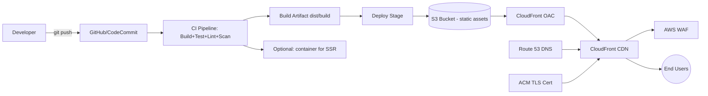

# React.js Frontend — End-to-End AWS Deployment with CI/CD (Architect Guide)

> Scope: Production-grade deployment architecture for a React SPA (CRA/Vite) or a React SSR app (Next.js), targeting AWS, with a full CI/CD pipeline and enterprise best practices (security, performance, observability, cost, DR).

---

## 1. Choose the Right Architecture First

| App Type | Best AWS Pattern | When to use |
|---|---|---|
| Pure SPA (CRA, Vite, static build) | **S3 + CloudFront + ACM + Route53** | No server-side rendering needed, fastest & cheapest, infinitely scalable |
| SSR / hybrid (Next.js) | **AWS Amplify Hosting** or **ECS Fargate/Lambda@Edge + CloudFront** | Needs SSR, ISR, API routes, dynamic meta tags (SEO) |
| Micro-frontend | S3+CloudFront per MFE + Module Federation host | Large orgs with independently deployable teams |
| Quick/managed | **AWS Amplify Hosting** (build+deploy+CDN managed) | Small teams, want less infra ops |

**Architect recommendation (default):** S3 + CloudFront for static SPA — lowest cost, no servers to patch, scales globally by default, and pairs cleanly with a CI/CD pipeline you fully control (vs. vendor lock-in with Amplify).



---

## 2. Target AWS Architecture (Static SPA)

```
Route 53 (DNS) 
   -> ACM (TLS cert, us-east-1 for CloudFront) 
   -> CloudFront (CDN, WAF attached, OAC to S3) 
        -> S3 (private bucket, versioned, static website assets)
   -> CloudWatch + CloudFront Logs + RUM (observability)
```

Key components:
- **S3 bucket** — private (block all public access), holds `build/`/`dist/` output, versioning enabled.
- **CloudFront** — CDN, uses **Origin Access Control (OAC)** (not legacy OAI) to fetch from private S3, enforces HTTPS, custom error pages for SPA routing (403/404 → `/index.html` 200).
- **ACM** — TLS certificate, must be requested in `us-east-1` for CloudFront regardless of app region.
- **Route 53** — DNS, alias record to CloudFront distribution.
- **AWS WAF** — attached to CloudFront: rate limiting, AWS Managed Rules (SQLi/XSS), geo-blocking if needed.
- **CloudFront Functions / Lambda@Edge** — security headers injection, URL rewrites, A/B testing, basic auth for staging.
- **CodePipeline/GitHub Actions** — CI/CD orchestration.
- **CloudWatch + S3 access logs + CloudFront logs** — observability.
- **AWS Budgets/Cost Explorer** — cost guardrails.

---

## 3. Infrastructure as Code (Mandatory for Architect-level setup)

Never click-ops production infra. Use **Terraform** or **AWS CDK** (TypeScript pairs naturally with a React team).

### 3.1 Recommended repo layout

```
infra/
  cdk/ (or terraform/)
    lib/
      hosting-stack.ts        # S3 + CloudFront + OAC + WAF
      dns-stack.ts            # Route53 + ACM
      pipeline-stack.ts       # CodePipeline (if using AWS-native CI/CD)
    environments/
      dev.json
      staging.json
      prod.json
  bin/
    app.ts
```

### 3.2 Example: AWS CDK (TypeScript) — S3 + CloudFront + OAC

```ts
import * as cdk from "aws-cdk-lib";
import * as s3 from "aws-cdk-lib/aws-s3";
import * as cf from "aws-cdk-lib/aws-cloudfront";
import * as origins from "aws-cdk-lib/aws-cloudfront-origins";
import * as acm from "aws-cdk-lib/aws-certificatemanager";
import * as route53 from "aws-cdk-lib/aws-route53";
import * as targets from "aws-cdk-lib/aws-route53-targets";
import * as wafv2 from "aws-cdk-lib/aws-wafv2";
import { Construct } from "constructs";

export class HostingStack extends cdk.Stack {
  constructor(scope: Construct, id: string, props: cdk.StackProps & { domainName: string }) {
    super(scope, id, props);

    const siteBucket = new s3.Bucket(this, "SiteBucket", {
      bucketName: `${props.domainName}-frontend`,
      blockPublicAccess: s3.BlockPublicAccess.BLOCK_ALL,
      encryption: s3.BucketEncryption.S3_MANAGED,
      versioned: true,
      removalPolicy: cdk.RemovalPolicy.RETAIN,
      enforceSSL: true,
    });

    const hostedZone = route53.HostedZone.fromLookup(this, "Zone", { domainName: props.domainName });

    const certificate = new acm.Certificate(this, "Cert", {
      domainName: props.domainName,
      validation: acm.CertificateValidation.fromDns(hostedZone),
    }); // Must be created in us-east-1 stack for CloudFront

    const webAcl = new wafv2.CfnWebACL(this, "WebAcl", {
      defaultAction: { allow: {} },
      scope: "CLOUDFRONT",
      visibilityConfig: { sampledRequestsEnabled: true, cloudWatchMetricsEnabled: true, metricName: "frontendWaf" },
      rules: [
        {
          name: "AWS-AWSManagedRulesCommonRuleSet",
          priority: 0,
          overrideAction: { none: {} },
          statement: { managedRuleGroupStatement: { vendorName: "AWS", name: "AWSManagedRulesCommonRuleSet" } },
          visibilityConfig: { sampledRequestsEnabled: true, cloudWatchMetricsEnabled: true, metricName: "commonRules" },
        },
        {
          name: "RateLimit",
          priority: 1,
          action: { block: {} },
          statement: { rateBasedStatement: { limit: 2000, aggregateKeyType: "IP" } },
          visibilityConfig: { sampledRequestsEnabled: true, cloudWatchMetricsEnabled: true, metricName: "rateLimit" },
        },
      ],
    });

    const distribution = new cf.Distribution(this, "Distribution", {
      defaultBehavior: {
        origin: origins.S3BucketOrigin.withOriginAccessControl(siteBucket),
        viewerProtocolPolicy: cf.ViewerProtocolPolicy.REDIRECT_TO_HTTPS,
        cachePolicy: cf.CachePolicy.CACHING_OPTIMIZED,
        responseHeadersPolicy: cf.ResponseHeadersPolicy.SECURITY_HEADERS,
        compress: true,
      },
      defaultRootObject: "index.html",
      domainNames: [props.domainName],
      certificate,
      webAclId: webAcl.attrArn,
      errorResponses: [
        { httpStatus: 403, responseHttpStatus: 200, responsePagePath: "/index.html", ttl: cdk.Duration.seconds(0) },
        { httpStatus: 404, responseHttpStatus: 200, responsePagePath: "/index.html", ttl: cdk.Duration.seconds(0) },
      ],
      priceClass: cf.PriceClass.PRICE_CLASS_100,
      minimumProtocolVersion: cf.SecurityPolicyProtocol.TLS_V1_2_2021,
    });

    new route53.ARecord(this, "AliasRecord", {
      zone: hostedZone,
      recordName: props.domainName,
      target: route53.RecordTarget.fromAlias(new targets.CloudFrontTarget(distribution)),
    });

    new cdk.CfnOutput(this, "BucketName", { value: siteBucket.bucketName });
    new cdk.CfnOutput(this, "DistributionId", { value: distribution.distributionId });
    new cdk.CfnOutput(this, "DistributionDomain", { value: distribution.distributionDomainName });
  }
}
```

> Terraform equivalent works the same way — module for S3 (private, versioned, SSE), `aws_cloudfront_origin_access_control`, `aws_cloudfront_distribution` with custom error responses for SPA routing, `aws_acm_certificate` in `us-east-1`, `aws_wafv2_web_acl`, `aws_route53_record` alias.

---

## 4. CI/CD Pipeline Design

### 4.1 Pipeline stages (any tool)

1. **Source** — trigger on push/PR to `main`/`develop`/feature branches.
2. **Install & Cache** — `npm ci` with lockfile, cache `node_modules`/`.next`/`~/.npm`.
3. **Lint & Format check** — ESLint, Prettier `--check`.
4. **Type check** — `tsc --noEmit`.
5. **Unit tests** — Jest/Vitest + coverage threshold gate (e.g., 80%).
6. **Security scans**:
   - `npm audit` / **Snyk** / **Trivy** (dependency vulnerabilities).
   - **SAST**: CodeQL / Semgrep.
   - Secret scanning (gitleaks) — block build if secrets detected.
7. **Build** — `npm run build` with environment-specific `.env` injected via CI secrets/SSM, not committed.
8. **E2E tests** (optional gate) — Cypress/Playwright against a preview deployment.
9. **Artifact upload** — build output as pipeline artifact (or Docker image to ECR for SSR).
10. **Deploy to environment** — S3 sync + CloudFront invalidation (or ECS/Amplify deploy).
11. **Post-deploy smoke test** — hit health/critical URLs, Lighthouse CI budget check.
12. **Manual approval gate** — required before prod for regulated/critical apps.
13. **Notify** — Slack/MS Teams on success/failure.

### 4.2 Branching & environment strategy

| Branch | Environment | Deploy trigger |
|---|---|---|
| `feature/*` | Ephemeral preview (S3 prefix or Amplify preview) | On PR open |
| `develop` | `dev` | Auto on merge |
| `release/*` | `staging` | Auto on merge, manual QA signoff |
| `main` | `prod` | Manual approval after staging soak |

Use **trunk-based development** with short-lived feature branches where possible; avoid long-lived branches to reduce merge conflicts.

### 4.3 GitHub Actions Example (S3 + CloudFront)

```yaml
name: Frontend CI/CD

on:
  push:
    branches: [main, develop]
  pull_request:
    branches: [main, develop]

permissions:
  id-token: write   # required for OIDC -> AWS role assumption
  contents: read

env:
  NODE_VERSION: "20"

jobs:
  build-test:
    runs-on: ubuntu-latest
    steps:
      - uses: actions/checkout@v4

      - uses: actions/setup-node@v4
        with:
          node-version: ${{ env.NODE_VERSION }}
          cache: "npm"

      - name: Install dependencies
        run: npm ci

      - name: Lint
        run: npm run lint

      - name: Type check
        run: npm run typecheck

      - name: Unit tests with coverage
        run: npm test -- --coverage --watchAll=false

      - name: Dependency vulnerability scan
        run: npm audit --audit-level=high

      - name: Secret scan
        uses: gitleaks/gitleaks-action@v2

      - name: Build
        run: npm run build
        env:
          CI: true
          REACT_APP_API_URL: ${{ vars.REACT_APP_API_URL }}

      - name: Lighthouse CI budget check
        run: npx @lhci/cli autorun
        continue-on-error: false

      - uses: actions/upload-artifact@v4
        with:
          name: build-output
          path: build/

  deploy:
    needs: build-test
    if: github.ref == 'refs/heads/main'
    runs-on: ubuntu-latest
    environment: production   # requires manual approval via GitHub Environments
    steps:
      - uses: actions/download-artifact@v4
        with:
          name: build-output
          path: build/

      - name: Configure AWS credentials (OIDC, no long-lived keys)
        uses: aws-actions/configure-aws-credentials@v4
        with:
          role-to-assume: arn:aws:iam::<ACCOUNT_ID>:role/github-actions-deploy-role
          aws-region: us-east-1

      - name: Sync to S3 (immutable assets long cache, index.html no-cache)
        run: |
          aws s3 sync build/ s3://my-app-frontend-prod \
            --delete \
            --cache-control "public,max-age=31536000,immutable" \
            --exclude "index.html" \
            --exclude "service-worker.js"
          aws s3 cp build/index.html s3://my-app-frontend-prod/index.html \
            --cache-control "no-cache,no-store,must-revalidate"

      - name: Invalidate CloudFront cache
        run: |
          aws cloudfront create-invalidation \
            --distribution-id ${{ secrets.CF_DISTRIBUTION_ID }} \
            --paths "/index.html" "/"

      - name: Smoke test
        run: curl -sSf https://app.example.com/ -o /dev/null

      - name: Notify Slack
        if: always()
        uses: slackapi/slack-github-action@v1
        with:
          payload: '{"text":"Deploy ${{ job.status }} for ${{ github.sha }}"}'
        env:
          SLACK_WEBHOOK_URL: ${{ secrets.SLACK_WEBHOOK }}
```

**Critical practice:** use **OIDC federation** (`aws-actions/configure-aws-credentials` with `role-to-assume`) — never store static `AWS_ACCESS_KEY_ID`/`SECRET` in GitHub secrets.

### 4.4 AWS-native alternative: CodePipeline + CodeBuild

Use if you want everything inside AWS (single-vendor auditing, private VPC builds):

```
CodePipeline:
  Source: CodeStar Connection to GitHub / CodeCommit
  Build: CodeBuild (buildspec.yml -> npm ci, test, build)
  Deploy: CodeBuild post-build -> aws s3 sync + cloudfront invalidation
          OR CodeDeploy for ECS/Amplify
Approval: Manual approval action before Prod stage
```

`buildspec.yml`:
```yaml
version: 0.2
phases:
  install:
    runtime-versions:
      nodejs: 20
  pre_build:
    commands:
      - npm ci
      - npm run lint
      - npm run typecheck
  build:
    commands:
      - npm test -- --coverage --watchAll=false
      - npm run build
  post_build:
    commands:
      - aws s3 sync build/ s3://$BUCKET_NAME --delete
      - aws cloudfront create-invalidation --distribution-id $CF_DIST_ID --paths "/*"
artifacts:
  files:
    - '**/*'
  base-directory: build
```

---

## 5. Deployment Strategy & Rollback

- **Immutable artifacts**: every build tagged with commit SHA; store previous N builds in S3 (e.g., `s3://bucket/releases/<sha>/`) to enable instant rollback.
- **Cache-control strategy** (SPA):
  - Hashed static assets (`main.[hash].js`) → `max-age=31536000, immutable`.
  - `index.html` → `no-cache` so new deploys are picked up immediately.
- **CloudFront invalidation** only for `index.html`/changed paths — avoid full `/*` invalidation (costs + latency) when only `index.html` changed.
- **Blue/Green for SSR (ECS/Lambda)**: use CodeDeploy traffic shifting (canary 10% → 100%) with CloudWatch alarms as auto-rollback triggers.
- **Rollback plan**: keep last-known-good S3 prefix; rollback = re-sync previous release + invalidate `index.html`. For ECS: redeploy previous task definition revision.
- **Feature flags** (LaunchDarkly/AWS AppConfig) to decouple deploy from release for risky features.

---

## 6. Security Best Practices (OWASP-aligned)

1. **S3 bucket**: block all public access; access only via CloudFront OAC; enable versioning + MFA delete on prod bucket.
2. **Transport security**: enforce HTTPS only (`ViewerProtocolPolicy.REDIRECT_TO_HTTPS`), TLS 1.2+ minimum.
3. **Security headers** via CloudFront Response Headers Policy or Lambda@Edge:
   - `Content-Security-Policy` (strict, no `unsafe-inline` where possible; use nonces/hashes for inline scripts).
   - `Strict-Transport-Security: max-age=63072000; includeSubDomains; preload`.
   - `X-Content-Type-Options: nosniff`.
   - `X-Frame-Options: DENY` (or CSP `frame-ancestors`).
   - `Referrer-Policy: strict-origin-when-cross-origin`.
   - `Permissions-Policy` to disable unused browser features (camera, geolocation, etc.).
4. **WAF**: AWS Managed Rules (Common, Known Bad Inputs, SQLi), rate-based rule to mitigate scraping/DoS, geo-restriction if app is region-specific.
5. **Secrets**: never bake secrets into the JS bundle. Use build-time env vars only for non-sensitive config (API base URLs). Real secrets stay server-side.
6. **Dependency hygiene**: Dependabot/Renovate for automated PRs, `npm audit`/Snyk in CI as a hard gate for high/critical CVEs.
7. **IAM least privilege**: CI/CD deploy role scoped only to the specific S3 bucket + CloudFront distribution (no `*` resources); use separate roles per environment/account.
8. **Multi-account strategy**: separate AWS accounts for dev/staging/prod (AWS Organizations + Control Tower) to blast-radius-limit mistakes and enforce SCPs.
9. **Supply chain**: pin dependency versions (`package-lock.json` committed), verify CI runner integrity, sign build artifacts if feasible, enable GitHub branch protection + required reviews for `main`.
10. **CORS/API security** handled at the backend/API Gateway layer — verify allowed origins are explicit, not `*`, in production.
11. **Secrets scanning + SCA** running on every PR, not just main.
12. **Audit logging**: CloudTrail enabled account-wide, S3 access logs + CloudFront logs shipped to a log archive account/bucket.

---

## 7. Performance Best Practices

- **CloudFront caching**: `CACHING_OPTIMIZED` policy, long TTL for hashed assets, brotli/gzip compression enabled (`compress: true`).
- **HTTP/2 & HTTP/3** enabled by default on CloudFront.
- **Code splitting** (React.lazy/dynamic import) + route-based chunking to reduce initial bundle size.
- **Image optimization**: serve via CloudFront + S3 with responsive `srcset`, WebP/AVIF, or Next/Image if SSR.
- **Preconnect/prefetch** critical origins (API, fonts) in `index.html`.
- **Bundle analysis** in CI (`source-map-explorer` / `webpack-bundle-analyzer`) with a size budget gate (fail build if bundle > threshold).
- **Lighthouse CI** budgets enforced in the pipeline (performance, accessibility, SEO scores).
- **Edge functions** (CloudFront Functions) for lightweight redirects/header injection instead of round-tripping to origin.
- **Price class** tuned to actual user geography (`PRICE_CLASS_100` if only NA/EU) to reduce cost without hurting target users.

---

## 8. Observability & Monitoring

- **CloudWatch dashboards**: CloudFront requests, error rate (4xx/5xx), cache hit ratio, origin latency.
- **CloudWatch Alarms** → SNS → Slack/PagerDuty for: high 5xx rate, WAF blocked spike, cache hit ratio drop, invalidation failures.
- **AWS RUM (Real User Monitoring)**: captures real Core Web Vitals (LCP, FID/INP, CLS) from actual browsers.
- **X-Ray / distributed tracing** if SSR/BFF layer exists.
- **Synthetic monitoring**: CloudWatch Synthetics canary hitting the homepage every 5 min from multiple regions.
- **Structured deploy annotations**: push a CloudWatch/Datadog annotation on every deploy so regressions can be correlated to a release.
- **Cost dashboards**: AWS Cost Explorer tagged by environment (`Environment=prod`, `App=frontend`) with AWS Budgets alerts.

---

## 9. Cost Optimization

- Static hosting (S3+CloudFront) is typically **cents to a few dollars/month** for small-to-medium traffic — no idle compute cost.
- Use **CloudFront price class** matching your actual user base region.
- Set **S3 lifecycle rules** to expire old versioned objects / old release prefixes after N days.
- Avoid full-path CloudFront invalidations (`/*`) — invalidate only changed paths; excess invalidations beyond free tier incur cost.
- Enable **S3 Intelligent-Tiering** only if storing large media assets, not needed for typical JS/CSS bundles.
- If using ECS/Fargate for SSR: use **Fargate Spot** for non-prod, right-size CPU/memory, enable auto-scaling to zero-ish for dev/staging.
- Tag every resource (`Environment`, `Project`, `Owner`, `CostCenter`) for chargeback visibility.

---

## 10. Multi-Region / DR (for high-availability requirements)

- CloudFront is already global-edge by default — true multi-region mainly matters for the **origin** (S3 is regional but highly durable; consider **S3 Cross-Region Replication** to a secondary region bucket).
- For SSR apps on ECS/Lambda: deploy to a second region with Route 53 failover routing policy + health checks.
- Define **RTO/RPO** targets explicitly; static frontend DR is usually near-instant (S3 CRR + Route53 failover), so this is rarely the bottleneck — backend/API DR usually dominates recovery time.

---

## 11. Checklist Summary (Architect Sign-off)

- [ ] IaC (CDK/Terraform) for all infra, no manual console changes in prod
- [ ] Separate AWS accounts per environment (dev/staging/prod)
- [ ] S3 bucket private, versioned, encrypted, OAC-only access
- [ ] CloudFront with WAF, custom error pages for SPA routing, TLS 1.2+
- [ ] ACM cert in us-east-1, Route53 alias record
- [ ] CI/CD: lint, typecheck, unit tests, SAST, dependency scan, secret scan, bundle size budget, Lighthouse CI
- [ ] OIDC-based AWS auth from CI (no static keys)
- [ ] Cache-control strategy: immutable hashed assets, no-cache index.html
- [ ] Manual approval gate before prod deploy
- [ ] Rollback strategy documented and tested
- [ ] Security headers (CSP, HSTS, X-Frame-Options, etc.)
- [ ] CloudWatch alarms + RUM + synthetic canary
- [ ] Cost tagging + budget alerts
- [ ] DR/failover plan documented with RTO/RPO

---

## 12. Reference Reading

- AWS Well-Architected Framework — https://aws.amazon.com/architecture/well-architected/
- CloudFront + S3 static hosting with OAC — AWS docs
- OWASP Secure Headers Project
- AWS CDK / Terraform AWS provider documentation
