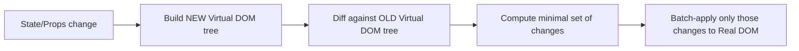
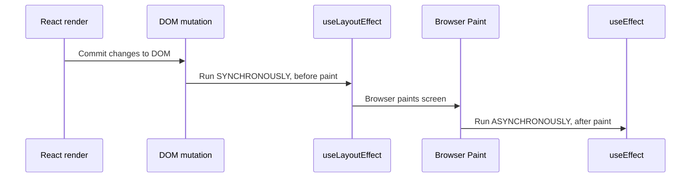
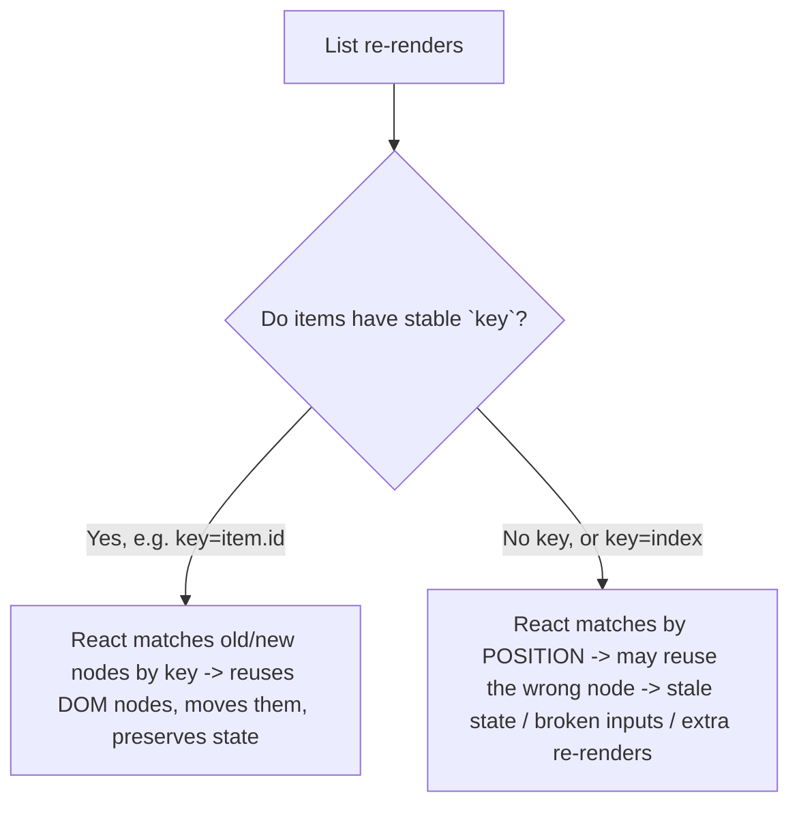

# React.js Interview Questions and Answers

> Deep-analyzed & updated: inaccuracies fixed, missing 2024/2025-relevant topics added, diagrams included. Use as your primary React interview revision doc.

## Table of Contents
1. [Core Concepts](#what-is-react) — What is React, Pros/Cons, Virtual DOM, JSX
2. [Components](#what-are-functional-components-and-props) — Functional/Class, Props/State, Smart/Dumb
3. [Lists, Keys & Rendering](#what-is-a-key-index-map) — Keys, Fragments, Conditional Rendering
4. [Hooks](#what-is-usestate-hook) — useState → useCallback, custom hooks
5. [Forms](#controlled-vs-uncontrolled-components) — Controlled vs Uncontrolled
6. [Component Communication & Patterns](#how-parent-child-communication-works-in-react) — Parent/Child, HOC, Portals
7. [Events & Errors](#synthetic-events) — Synthetic Events, Error Boundaries
8. [Optimization](#reactmemo---rendering-optimization) — memo, useMemo vs useCallback, PureComponent
9. [Reconciliation & Fiber](#reconciliation--diffing-algorithm-how-react-decides-what-to-update) — Diffing rules, Fiber
10. [State Management at Scale](#context-api-vs-redux--when-to-use-which) — Context vs Redux, prop drilling
11. [React 18+ Features](#react-18-concurrent-features-summary) — Concurrent rendering, transitions, RSC
12. [Routing, SSR, Data Fetching](#react-router) — Router, SSR, React Query
13. [Common Gotchas / Trick Questions](#common-gotchas--trick-interview-questions)

---

## What is React?
React is a free and open-source front-end JavaScript library developed by Facebook (Meta) for building user interfaces based on components. It's used for handling the view layer in web and mobile applications. React allows developers to create reusable UI components that manage their own state.

## Pros and Cons of React

### Pros:
- Virtual DOM for better performance
- Reusable components
- Unidirectional data flow (predictable state changes)
- Large ecosystem and community
- JSX makes code readable and maintainable
- Great developer tools (React DevTools)
- Can be made SEO-friendly **with SSR/SSG** (Next.js, Gatsby)

### Cons:
- Only handles UI layer, needs additional libraries for routing/state/data-fetching for a complete application
- JSX complexity for beginners
- Frequent updates and changes to best practices
- Documentation can be challenging due to rapid updates
- Complex initial learning curve (JSX, hooks, ecosystem choices)

> ⚠️ **Common misconception (interview trap):** "React is SEO friendly" is **wrong by default**. A plain Client-Side Rendered (CSR) React app ships an almost-empty `<div id="root">` — crawlers that don't execute JS see nothing. React only becomes SEO-friendly when paired with **Server-Side Rendering (SSR)** or **Static Site Generation (SSG)** via Next.js/Gatsby/Remix, which send fully-rendered HTML on the first request.

## How to create React application?
There are several ways to create a React application:

1. Using Create React App (CRA):
```bash
npx create-react-app my-app
cd my-app
npm start
```

2. Using Vite:
```bash
npm create vite@latest my-app -- --template react
cd my-app
npm install
npm run dev
```

3. Using Next.js:
```bash
npx create-next-app@latest my-app
cd my-app
npm run dev
```

## What is Virtual DOM?
Virtual DOM is a lightweight copy of the actual DOM in memory. React uses it to improve performance by:
1. Creating a virtual representation of UI
2. When state changes, React creates a new Virtual DOM tree
3. Compares it with the previous Virtual DOM tree (diffing)
4. Updates only the changed elements in the real DOM
5. This process is called Reconciliation



> ⚠️ **Interview trap:** Virtual DOM is not "faster than the DOM" in some magical absolute sense — direct, surgical DOM manipulation can beat it. The real win is that Virtual DOM diffing gives you **fast changes with simple, declarative code** — you just describe the desired UI, and React figures out the minimal real-DOM mutations, instead of you hand-writing imperative DOM-patching logic for every case.

## What is JSX?
JSX (JavaScript XML) is a syntax extension for JavaScript that allows you to write HTML-like code within JavaScript. Example:

```jsx
const element = (
  <div className="greeting">
    <h1>Hello, {name}!</h1>
  </div>
);
```

## Why do we use className and not class?
We use className instead of class in React because:
1. class is a reserved keyword in JavaScript
2. React uses camelCase naming convention for attributes
3. This helps avoid naming conflicts with JavaScript classes

## What are functional components and props?
Functional components are JavaScript functions that accept props and return React elements:

```jsx
function Welcome(props) {
  return <h1>Hello, {props.name}</h1>;
}

// Usage
<Welcome name="John" />
```

Props are read-only inputs to components that allow passing data from parent to child components.

## What are class components, props and state?
Class components are ES6 classes that extend React.Component:

```jsx
class Welcome extends React.Component {
  constructor(props) {
    super(props);
    this.state = { count: 0 }; // State initialization
  }

  render() {
    return <h1>Hello, {this.props.name}</h1>;
  }
}
```

- Props: External inputs passed to the component
- State: Internal data managed by the component

## What are dumb vs smart components?
### Dumb Components (Presentational):
- Focus on UI presentation
- Don't manage state (usually)
- Receive data via props
- Highly reusable
- Example: buttons, cards, input fields

### Smart Components (Container):
- Focus on functionality
- Manage state and data
- Pass data to dumb components
- Handle business logic
- Example: forms, data fetching components

## What is a key index map?
Keys help React identify which items have changed, been added, or been removed in lists:

```jsx
const items = ['apple', 'banana', 'orange'];
return (
  <ul>
    {items.map((item, index) => (
      <li key={index}>{item}</li>
    ))}
  </ul>
);
```

Note: Using index as key is not recommended if list items can change, as it may cause performance issues and bugs.

## What is React.Fragment?
React.Fragment lets you group multiple children without adding extra nodes to the DOM:

```jsx
return (
  <React.Fragment>
    <ChildA />
    <ChildB />
  </React.Fragment>
);

// Shorthand syntax
return (
  <>
    <ChildA />
    <ChildB />
  </>
);
```

## What is conditional rendering in React?
Conditional rendering allows you to show different content based on conditions:

```jsx
// Using ternary operator
return condition ? <ComponentA /> : <ComponentB />;

// Using && operator
return condition && <Component />;

// Using if statements
if (condition) {
  return <ComponentA />;
}
return <ComponentB />;
```

## How to apply styles in React?
There are multiple ways to style React components:

1. Inline Styles:
```jsx
<div style={{ color: 'blue', fontSize: '16px' }}>
```

2. CSS Classes:
```jsx
import './styles.css';
<div className="my-class">
```

3. CSS Modules:
```jsx
import styles from './Button.module.css';
<button className={styles.button}>
```

4. Styled Components:
```jsx
const StyledButton = styled.button`
  color: blue;
  padding: 10px;
`;
```

## How parent child communication works in React?
1. Parent to Child: Using props
```jsx
// Parent
const Parent = () => {
  return <Child message="Hello" />;
};

// Child
const Child = (props) => {
  return <div>{props.message}</div>;
};
```

2. Child to Parent: Using callback functions
```jsx
// Parent
const Parent = () => {
  const handleClick = (data) => {
    console.log(data);
  };
  return <Child onAction={handleClick} />;
};

// Child
const Child = (props) => {
  return <button onClick={() => props.onAction('Hello')}>Click</button>;
};
```

## What is useState hook?
useState is a Hook that lets you add state to functional components:

```jsx
import { useState } from 'react';

function Counter() {
  const [count, setCount] = useState(0);

  return (
    <div>
      <p>Count: {count}</p>
      <button onClick={() => setCount(count + 1)}>Increment</button>
    </div>
  );
}
```

## What is useEffect hook?
useEffect handles side effects (data fetching, subscriptions, manual DOM changes) in functional components. It runs **after the browser has painted**, not during render.

```jsx
import { useEffect, useState } from 'react';

function UserData() {
  const [data, setData] = useState(null);

  useEffect(() => {
    fetchData().then(result => setData(result));

    return () => {
      // Cleanup function — runs before the NEXT effect run, and on unmount
    };
  }, []); // Empty dependency array = run once, after initial mount only

  return <div>{/* render data */}</div>;
}
```

> ⚠️ **Fix / clarification:** the dependency array's exact value controls *when* the effect re-runs — this is one of the most commonly mixed-up facts in interviews:

| Dependency array | Behavior | Why |
|---|---|---|
| **Omitted entirely** (no 2nd argument) | Runs after **every** render | No condition to skip re-running |
| `[]` (empty array) | Runs **once**, after the first render only | Nothing in the array can ever change, so it never re-runs |
| `[a, b]` | Runs after first render, then again **whenever `a` or `b` changes** (shallow comparison) | React compares each dependency by reference/value between renders |

**Cleanup function timing:** for `[]`, cleanup runs once on unmount. For `[a, b]`, cleanup runs **before every re-run** (to undo the previous effect) **and** on final unmount — this is how you prevent stale subscriptions/listeners from piling up.

## What is useReducer hook?
useReducer manages complex state logic in components:

```jsx
import { useReducer } from 'react';

const reducer = (state, action) => {
  switch (action.type) {
    case 'INCREMENT':
      return { count: state.count + 1 };
    case 'DECREMENT':
      return { count: state.count - 1 };
    default:
      return state;
  }
};

function Counter() {
  const [state, dispatch] = useReducer(reducer, { count: 0 });

  return (
    <>
      Count: {state.count}
      <button onClick={() => dispatch({ type: 'INCREMENT' })}>+</button>
      <button onClick={() => dispatch({ type: 'DECREMENT' })}>-</button>
    </>
  );
}
```

## What is useContext hook?
useContext subscribes to React context without introducing nesting:

```jsx
const ThemeContext = React.createContext('light');

function App() {
  return (
    <ThemeContext.Provider value="dark">
      <ThemedButton />
    </ThemeContext.Provider>
  );
}

function ThemedButton() {
  const theme = useContext(ThemeContext);
  return <button className={theme}>Themed Button</button>;
}
```

## What is useRef hook?
useRef creates a mutable reference that persists across renders:

```jsx
function TextInputWithFocusButton() {
  const inputEl = useRef(null);

  const onButtonClick = () => {
    inputEl.current.focus();
  };

  return (
    <>
      <input ref={inputEl} type="text" />
      <button onClick={onButtonClick}>Focus the input</button>
    </>
  );
}
```

## What is useMemo hook?
useMemo memoizes expensive computations:

```jsx
const memoizedValue = useMemo(() => {
  return computeExpensiveValue(a, b);
}, [a, b]);
```

## What is useCallback hook?
useCallback memoizes callbacks to prevent unnecessary renders:

```jsx
const memoizedCallback = useCallback(
  () => {
    doSomething(a, b);
  },
  [a, b],
);
```

## Custom Hook: useFetch
```jsx
function useFetch(url) {
  const [data, setData] = useState(null);
  const [loading, setLoading] = useState(true);
  const [error, setError] = useState(null);

  useEffect(() => {
    const fetchData = async () => {
      try {
        const response = await fetch(url);
        const json = await response.json();
        setData(json);
        setLoading(false);
      } catch (error) {
        setError(error);
        setLoading(false);
      }
    };

    fetchData();
  }, [url]);

  return { data, loading, error };
}
```

## Custom Hook: useLocalStorage
```jsx
function useLocalStorage(key, initialValue) {
  const [storedValue, setStoredValue] = useState(() => {
    try {
      const item = window.localStorage.getItem(key);
      return item ? JSON.parse(item) : initialValue;
    } catch (error) {
      return initialValue;
    }
  });

  const setValue = value => {
    try {
      setStoredValue(value);
      window.localStorage.setItem(key, JSON.stringify(value));
    } catch (error) {
      console.error(error);
    }
  };

  return [storedValue, setValue];
}
```

## React.memo - Rendering Optimization
React.memo is a higher-order component that memoizes component renders — it **skips re-rendering** if props haven't changed (shallow comparison):

```jsx
const MyComponent = React.memo(function MyComponent(props) {
  /* render using props */
});

// Custom comparison (only needed when shallow compare isn't enough)
const MyComponent = React.memo(
  function MyComponent(props) { /* ... */ },
  (prevProps, nextProps) => prevProps.id === nextProps.id // return true = SKIP re-render
);
```

> ⚠️ **Common mistake:** `React.memo` does a **shallow** comparison of props. Passing a new inline object/array/function as a prop every render (`<MyComponent style={{color:'red'}} />` or `onClick={() => ...}`) creates a *new reference* each time, so `React.memo` sees "changed" and re-renders anyway — you must also memoize those props with `useMemo`/`useCallback` in the parent for `React.memo` to actually help.

**React.memo vs PureComponent vs shouldComponentUpdate:**

| Approach | Component type | Comparison |
|---|---|---|
| `React.memo` | Functional | Shallow prop comparison (or custom function) |
| `PureComponent` | Class | Shallow prop **and** state comparison |
| `shouldComponentUpdate` | Class | Fully custom logic you write yourself |

## Best React File Structure
```
src/
├── components/         # Reusable components
│   ├── Button/
│   │   ├── Button.jsx
│   │   ├── Button.test.js
│   │   └── Button.css
├── pages/             # Page components
├── hooks/             # Custom hooks
├── context/           # React context
├── services/          # API calls
├── utils/             # Helper functions
├── assets/            # Images, fonts
└── styles/            # Global styles
```

## React Router
```jsx
import { BrowserRouter, Routes, Route, Link } from 'react-router-dom';

function App() {
  return (
    <BrowserRouter>
      <nav>
        <Link to="/">Home</Link>
        <Link to="/about">About</Link>
      </nav>

      <Routes>
        <Route path="/" element={<Home />} />
        <Route path="/about" element={<About />} />
        <Route path="*" element={<NotFound />} />
      </Routes>
    </BrowserRouter>
  );
}
```

## React Portals
Portals render children into a DOM node that exists outside the parent component's hierarchy:

```jsx
import ReactDOM from 'react-dom';

function Modal({ children }) {
  return ReactDOM.createPortal(
    children,
    document.getElementById('modal-root')
  );
}
```

## React Lazy and Suspense
```jsx
import React, { Suspense, lazy } from 'react';

const OtherComponent = lazy(() => import('./OtherComponent'));

function MyComponent() {
  return (
    <Suspense fallback={<div>Loading...</div>}>
      <OtherComponent />
    </Suspense>
  );
}
```

## TypeScript in React
```tsx
interface Props {
  name: string;
  age: number;
  optional?: boolean;
}

const Person: React.FC<Props> = ({ name, age, optional = false }) => {
  return (
    <div>
      <h1>{name}</h1>
      <p>Age: {age}</p>
    </div>
  );
};
```

## Higher Order Components (HOC)
```jsx
function withLogging(WrappedComponent) {
  return function WithLoggingComponent(props) {
    useEffect(() => {
      console.log('Component mounted');
      return () => console.log('Component will unmount');
    }, []);

    return <WrappedComponent {...props} />;
  }
}

// Usage
const EnhancedComponent = withLogging(MyComponent);
```

## React Form Example
```jsx
function Form() {
  const [formData, setFormData] = useState({
    username: '',
    email: ''
  });

  const handleSubmit = (e) => {
    e.preventDefault();
    // Handle form submission
  };

  const handleChange = (e) => {
    setFormData({
      ...formData,
      [e.target.name]: e.target.value
    });
  };

  return (
    <form onSubmit={handleSubmit}>
      <input
        name="username"
        value={formData.username}
        onChange={handleChange}
      />
      <input
        name="email"
        value={formData.email}
        onChange={handleChange}
      />
      <button type="submit">Submit</button>
    </form>
  );
}
```

## Controlled vs Uncontrolled Components
The Form example above (`formData` + `onChange`) is a **controlled** component — React state is the single source of truth for the input's value.

```jsx
// Controlled — React state drives the input
function ControlledInput() {
  const [value, setValue] = useState('');
  return <input value={value} onChange={e => setValue(e.target.value)} />;
}

// Uncontrolled — the DOM itself holds the value, React reads it via ref when needed
function UncontrolledInput() {
  const inputRef = useRef(null);
  const handleSubmit = () => alert(inputRef.current.value);
  return <input ref={inputRef} defaultValue="hello" />;
}
```

| | Controlled | Uncontrolled |
|---|---|---|
| Source of truth | React state | The DOM |
| Value prop | `value` + `onChange` | `defaultValue` / `ref` |
| Validation on every keystroke | Easy | Harder (must read ref) |
| Performance (very large forms) | Every keystroke = re-render | No re-render per keystroke |
| Typical use | Most forms, especially with validation | File inputs (`<input type="file">` **must** be uncontrolled — its value can't be set programmatically), quick/simple forms, 3rd-party DOM libraries |

---

## Synthetic Events
React wraps native browser events in a **SyntheticEvent** — a cross-browser wrapper with a consistent API, regardless of the underlying browser's native event quirks.

```jsx
function Button() {
  const handleClick = (e) => {
    console.log(e.type);          // "click" — same API in every browser
    console.log(e.nativeEvent);   // escape hatch to the real browser event if needed
  };
  return <button onClick={handleClick}>Click</button>;
}
```
- **Why it exists:** normalizes event behavior across browsers so you don't write `if (isIE) {...}` branches.
- **React 17+ change (common interview fact):** events are attached to the **root DOM container** the app renders into (not `document` like React ≤16) — this makes multiple React versions coexist safely on one page and simplifies embedding React in non-React apps.
- **Old gotcha (pre-React 17, now fixed):** synthetic events used to be "pooled" and nulled out asynchronously — you had to call `e.persist()` to use the event async. This pooling was **removed in React 17+**; you can now safely read event properties asynchronously.

---

## Error Boundaries
A class component that **catches JavaScript errors in its child component tree** during rendering, in lifecycle methods, and in constructors — and shows a fallback UI instead of crashing the whole app.

```jsx
class ErrorBoundary extends React.Component {
  constructor(props) {
    super(props);
    this.state = { hasError: false };
  }

  static getDerivedStateFromError(error) {
    return { hasError: true }; // update state so next render shows fallback
  }

  componentDidCatch(error, info) {
    logErrorToService(error, info); // side effect: logging
  }

  render() {
    if (this.state.hasError) return <h1>Something went wrong.</h1>;
    return this.props.children;
  }
}

// Usage
<ErrorBoundary>
  <MyWidget />
</ErrorBoundary>
```
> ⚠️ **Interview trap:** Error Boundaries **cannot** be written as function components (no Hook equivalent exists as of React 18/19 — `getDerivedStateFromError`/`componentDidCatch` have no Hook version). They also do **NOT** catch errors in: event handlers, async code (`setTimeout`, promises), server-side rendering, or errors thrown in the boundary itself. Use `try/catch` for event handlers instead.

---

## useLayoutEffect vs useEffect
Both run side effects after render, but at **different times**:



| | `useEffect` | `useLayoutEffect` |
|---|---|---|
| Timing | After the browser paints | Before the browser paints (blocks paint) |
| Use for | Data fetching, subscriptions, logging | Reading/mutating DOM layout (measuring an element, then repositioning something) to avoid visual flicker |
| Performance | Non-blocking, preferred default | Blocking — overuse can make the UI feel janky |

**Rule of thumb:** always default to `useEffect`. Reach for `useLayoutEffect` **only** when you need to measure the DOM and synchronously adjust it before the user sees a flicker (e.g., a tooltip that repositions itself based on its own measured size).

---

## useMemo vs useCallback — the actual difference
Both take a function and a dependency array, and both skip recomputation when dependencies haven't changed — but they return **different things**:

```jsx
// useMemo returns the RESULT of calling the function
const memoizedValue = useMemo(() => computeExpensiveValue(a, b), [a, b]);

// useCallback returns the FUNCTION ITSELF, uncalled
const memoizedFn = useCallback(() => doSomething(a, b), [a, b]);

// useCallback(fn, deps) is literally equivalent to:
const memoizedFn2 = useMemo(() => fn, [a, b]);
```
- **`useMemo`**: "memoize this **value**" — use when a calculation is expensive (heavy loop, large array transform) and you don't want to redo it every render.
- **`useCallback`**: "memoize this **function reference**" — use when passing a callback to a memoized child (`React.memo`) or as a dependency of another hook, so the function's identity doesn't change every render and cause unnecessary re-renders/effect re-runs.
- **Common mistake:** using `useMemo`/`useCallback` on *everything* "just in case" — memoization itself has a cost (comparing dependencies every render). Only use it when you've identified an actual expensive computation or a genuine re-render problem (usually via React DevTools Profiler), not preemptively everywhere.

---

## Strict Mode Rendering Twice
React.StrictMode intentionally double-renders components in development to:
- Help find bugs caused by impure rendering
- Catch side effects in the render phase
- Identify potential issues with legacy lifecycle methods

This only happens in development mode, not in production.

## Class Components vs Hooks
You don't need to rewrite existing class components with hooks because:
- Class components are still supported
- Both can coexist in the same application
- Gradual migration is possible
- Some legacy libraries might still use class components

## Force Re-render Without setState
Several ways to force a re-render:
1. Using forceUpdate (class components):
```jsx
this.forceUpdate();
```

2. Changing the `key` prop:
```jsx
<Component key={Date.now()} />
```
> ⚠️ **Correction:** changing `key` does **not** cause a normal re-render — it makes React treat the element as a **brand new component instance**. React **unmounts the old one entirely (destroying its state) and mounts a fresh one**. Useful for "fully reset this component," but it's a heavier, different operation than a re-render — a very common interview trip-up.

3. Using useState with same value (the real "force update" pattern for function components):
```jsx
const [, setToggle] = useState(false);
const forceUpdate = () => setToggle(t => !t);
```
This works because calling a state setter with a **new** value (even just flipping a boolean) always triggers a re-render — it does not remount, state elsewhere in the component is preserved.

## Reconciliation & Diffing Algorithm — how React decides what to update
React's diffing algorithm is `O(n)` instead of the theoretical `O(n³)` for generic tree diffing, because it uses two heuristics:

1. **Different element types → tear down and rebuild** the whole subtree (don't try to find similarities).
   ```
   <div><Counter /></div>   →   <span><Counter /></span>
   Result: div AND Counter unmount completely, span + new Counter mount fresh (state is LOST)
   ```
2. **Same element type → keep the DOM node, just update changed attributes**, then recurse into children.
   ```
   <div className="a" />   →   <div className="b" />
   Result: same DOM node kept, only className attribute is patched
   ```

**Lists and `key`:**

This is *why* "don't use array index as key" matters: if you delete item #0, every remaining item's *index* shifts by one, so React thinks item #1's content changed (it didn't — the whole list just shifted), causing unnecessary re-renders or, worse, mismatched state (e.g., a checked checkbox appearing to "jump" to a different row).

## React Fiber
React Fiber is the reconciliation engine (rewrite) introduced in React 16, replacing the old synchronous "stack reconciler":
- Enables **incremental rendering** — work can be split into chunks instead of blocking the main thread in one go
- Assigns **priority levels** to updates (e.g., a text input keystroke > an off-screen data fetch result)
- Can **pause, abort, or resume** work — this is the foundation that makes Concurrent Rendering (React 18) possible
- Improves performance for complex UIs with many updates competing for the main thread
- Enables better error handling via Error Boundaries

> See `React Fiber.md` and `React reconciliation.md` in this folder for the deep, step-by-step internals (fiber tree structure, work loop, double buffering).

## Server Side Rendering (SSR)
SSR renders React components on the server:
- Better SEO
- Faster initial page load
- Better performance on low-end devices
- Common frameworks: Next.js, Gatsby

## Prop Drilling and How to Avoid It
**Prop drilling** = passing a prop through multiple intermediate components that don't need it themselves, just to get it to a deeply nested child.
```
App → Layout → Sidebar → NavList → NavItem (only NavItem actually uses `user`)
Every component in between must accept and forward `user` as a prop, even though they don't use it.
```
**Fixes:** `useContext` (for infrequently-changing, broadly-needed data like theme/auth/locale), component composition (pass components as `children`/props instead of data, so intermediate layers don't need to know about the data at all), or a state management library (Redux/Zustand) for complex, frequently-updated shared state.

## Context API vs Redux — when to use which
| | Context API | Redux (or Zustand/Jotai) |
|---|---|---|
| Built into React | Yes | No, external library |
| Best for | Low-frequency updates (theme, auth user, locale) | High-frequency updates, complex state logic, many interdependent slices |
| DevTools / time-travel debugging | No | Yes (Redux DevTools) |
| Performance at scale | Every consumer re-renders on **any** context value change (unless carefully split) | Optimized — components subscribe to just the state slice they need |
| Boilerplate | Minimal | More setup (reducers/actions), much less with Redux Toolkit |

> ⚠️ **Common mistake:** putting frequently-changing state (e.g., mouse position, form input on every keystroke) into a single large Context — every consumer re-renders on every update, since Context has no built-in selective-subscription mechanism like Redux's `useSelector`. Split contexts by concern, or reach for a proper state library once updates get frequent/complex.

## React 18+ Concurrent Features Summary
React 18 introduced **Concurrent Rendering** — React can prepare multiple versions of the UI, pause/interrupt low-priority rendering work, and keep the app responsive to urgent input (typing, clicking) even while a big update is in progress.

```jsx
import { useTransition, useDeferredValue, useId } from 'react';

// useTransition — mark a state update as LOW PRIORITY / non-urgent
function SearchPage() {
  const [isPending, startTransition] = useTransition();
  const [query, setQuery] = useState('');

  const handleChange = (e) => {
    setQuery(e.target.value);          // urgent — update input instantly
    startTransition(() => {
      setSearchResults(search(e.target.value)); // non-urgent — can be interrupted
    });
  };
  return <>{isPending && <Spinner />}<input onChange={handleChange} /></>;
}

// useDeferredValue — defer re-rendering an expensive part of the tree
function List({ query }) {
  const deferredQuery = useDeferredValue(query); // "lags behind" during rapid typing
  return <ExpensiveResults query={deferredQuery} />;
}

// useId — stable unique IDs, safe for SSR (no client/server mismatch)
function Field() {
  const id = useId();
  return <><label htmlFor={id}>Name</label><input id={id} /></>;
}
```

| Feature | Purpose |
|---|---|
| **Automatic Batching** | React 18 batches multiple `setState` calls into ONE re-render even inside promises/timeouts/native event handlers (React ≤17 only batched inside React event handlers) |
| **`useTransition`** | Mark an update as low-priority/interruptible so urgent input stays responsive |
| **`useDeferredValue`** | Get a "lagging" copy of a value for expensive downstream rendering |
| **`useId`** | Generate stable IDs matching between server-rendered and client-hydrated HTML |
| **`useSyncExternalStore`** | Safely subscribe to external (non-React) state stores in concurrent rendering |
| **Suspense for data fetching** | Show a fallback while a component's *data* (not just its code) is loading — see `suspense-for-datafetching.md` |
| **React Server Components (RSC)** | Components that render **only on the server**, sending zero JS to the client for that component — used by Next.js App Router |

> See `6.Concurrent Rendering and React Features.md` in this folder for full depth on each of these.

## React Query
```jsx
import { useQuery } from 'react-query';

function TodoList() {
  const { data, isLoading } = useQuery('todos', fetchTodos);

  if (isLoading) return 'Loading...';

  return (
    <ul>
      {data.map(todo => (
        <li key={todo.id}>{todo.title}</li>
      ))}
    </ul>
  );
}
```

## Redux in Plain JavaScript
```javascript
// Action Types
const INCREMENT = 'INCREMENT';
const DECREMENT = 'DECREMENT';

// Reducer
function counter(state = 0, action) {
  switch (action.type) {
    case INCREMENT:
      return state + 1;
    case DECREMENT:
      return state - 1;
    default:
      return state;
  }
}

// Store
const store = Redux.createStore(counter);
```

## Redux with React
```jsx
import { Provider, useSelector, useDispatch } from 'react-redux';

function Counter() {
  const count = useSelector(state => state.count);
  const dispatch = useDispatch();

  return (
    <div>
      <span>{count}</span>
      <button onClick={() => dispatch({ type: 'INCREMENT' })}>
        Increment
      </button>
    </div>
  );
}

function App() {
  return (
    <Provider store={store}>
      <Counter />
    </Provider>
  );
}
```

## Redux Toolkit
```jsx
import { createSlice, configureStore } from '@reduxjs/toolkit';

const counterSlice = createSlice({
  name: 'counter',
  initialState: { value: 0 },
  reducers: {
    increment: state => {
      state.value += 1;
    },
    decrement: state => {
      state.value -= 1;
    }
  }
});

const store = configureStore({
  reducer: {
    counter: counterSlice.reducer
  }
});

export const { increment, decrement } = counterSlice.actions;
```

---

## Common Gotchas / Trick Interview Questions

**Q: Why doesn't `console.log(count)` show the updated value right after calling `setCount(count + 1)`?**
State updates are **asynchronous and batched** — `count` inside that render's closure stays the old value until the *next* render. Use the functional updater `setCount(c => c + 1)` when the new state depends on the previous one, and read the updated value from the next render (or a `useEffect` watching `count`) if you need to react to it.

**Q: Why can calling `setCount(count + 1)` three times in a row only increment by 1, not 3?**
Because all three calls read the *same* stale `count` from the current closure (`count + 1` = same value three times) before React re-renders. Fix: use the functional form `setCount(c => c + 1)` three times — each call then receives the latest pending value.

**Q: Why shouldn't you mutate state directly (`state.push(x)` instead of `setState([...state, x])`)?**
React decides whether to re-render by comparing the **old and new object references** (`Object.is`) for state/props in many optimization paths (like `React.memo`/`PureComponent`), and its internal scheduling also assumes previous renders' data is untouched. Mutating in place keeps the reference identical, so React may not detect a change at all — you must create a **new** array/object reference.

**Q: What happens if you call a Hook inside a condition or loop?**
Violates the **Rules of Hooks** — React tracks hooks by **call order**, not by name, using an internal linked list per component instance. If a hook is conditionally skipped, every hook call after it shifts position between renders, and React reads the wrong state/effect for each slot — causing bizarre, hard-to-debug bugs. Always call Hooks at the top level, unconditionally, in the same order every render.

**Q: Why does a component re-render even though the state value didn't visibly change (e.g., `setState(obj)` with the same object contents)?**
If you pass a **new object/array reference** with identical contents, React still re-renders because it compares by reference, not deep equality, for most state. (Note: calling the exact same **primitive** value, e.g. `setCount(5)` when `count` is already `5`, IS bailed out/skipped by React — this is an exception specifically for primitives compared with `Object.is`.)

**Q: Two sibling components need to share state — where should that state live?**
"Lift state up" to their nearest common parent, then pass it down via props (and callbacks for updates). This is the default, Hook-free answer before reaching for Context/Redux — interviewers want to see you know the simplest solution first.

**Q: Why is `key={Math.random()}` almost always wrong?**
Since it changes every render, React thinks every list item is brand new every time — the entire list unmounts and remounts on every render, destroying all component state/DOM (losing focus, animation state, etc.) and tanking performance. Keys must be **stable across renders** (typically a unique, unchanging ID from your data).

---

## ✅ Revision Checklist
- [ ] Explain Virtual DOM diffing + why it's about developer ergonomics, not raw speed
- [ ] Correctly state all 3 `useEffect` dependency-array behaviors from memory
- [ ] Explain why `key={Date.now()}` remounts instead of re-rendering
- [ ] Explain `useMemo` vs `useCallback` — value vs function reference
- [ ] Explain the two reconciliation heuristics (type change = rebuild, same type = patch) and why keys matter for lists
- [ ] Know when Context is enough vs when you need Redux/Zustand
- [ ] Explain automatic batching and one concurrent feature (`useTransition` or `useDeferredValue`)
- [ ] Explain why direct state mutation breaks React's change detection

