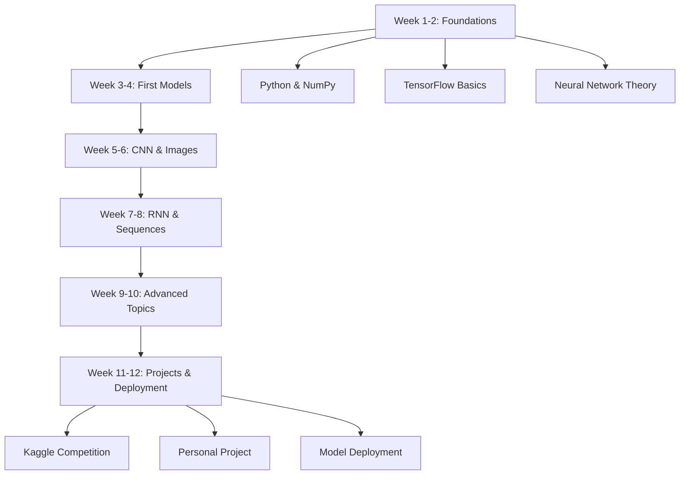

# Keras & TensorFlow Learning Roadmap for Beginners

## A 12-Week Structured Path to Master Deep Learning

### 🗺️ ROADMAP OVERVIEW



---

## 📅 WEEK-BY-WEEK LEARNING PLAN

### 🎯 **WEEK 1-2: FOUNDATION BUILDING**

#### **Week 1: Python & Environment Setup**

**Goal**: Set up development environment and refresh Python skills

**Daily Tasks**:

- **Day 1**: Install Python, TensorFlow, Jupyter Notebook
- **Day 2**: NumPy fundamentals (arrays, operations, broadcasting)
- **Day 3**: Pandas basics (DataFrames, data manipulation)
- **Day 4**: Matplotlib for visualization
- **Day 5**: Python functions, classes, and OOP review
- **Day 6**: Git basics and project setup
- **Day 7**: Review and practice exercises

**Memory Techniques**:

- Create cheat sheets for NumPy operations
- Use flashcards for Python syntax
- Build a small data processing script

#### **Week 2: TensorFlow & Keras Basics**

**Goal**: Understand TensorFlow ecosystem and create first neural network

**Daily Tasks**:

- **Day 1**: TensorFlow installation and verification
- **Day 2**: Tensors, operations, and basic computations
- **Day 3**: Keras Sequential API introduction
- **Day 4**: Building first neural network (MNIST)
- **Day 5**: Model compilation and training
- **Day 6**: Model evaluation and prediction
- **Day 7**: Complete end-to-end project

**Key Concepts to Remember**:

- Tensor = N-dimensional array
- Eager execution vs Graph execution
- Keras layers: Dense, Activation, Dropout
- Training loop: fit(), evaluate(), predict()

---

### 🚀 **WEEK 3-4: NEURAL NETWORK FUNDAMENTALS**

#### **Week 3: Deep Dive into Neural Networks**

**Goal**: Master neural network components and training process

**Daily Topics**:

1. **Activation Functions**: ReLU, Sigmoid, Tanh, Softmax
2. **Loss Functions**: MSE, Cross-entropy, Hinge loss
3. **Optimizers**: SGD, Adam, RMSprop
4. **Metrics**: Accuracy, Precision, Recall, F1-score
5. **Overfitting & Regularization**: Dropout, L1/L2, Early Stopping
6. **Hyperparameter Tuning**: Learning rate, batch size, epochs
7. **Project**: Binary classification problem

**Memory Framework**:

- Create comparison tables for activation functions
- Build decision tree for optimizer selection
- Practice explaining each concept in simple terms

#### **Week 4: Data Preparation & Preprocessing**

**Goal**: Learn to prepare data for neural networks

**Key Skills**:

- Data normalization/standardization
- Train/validation/test split
- Handling missing values
- Feature engineering basics
- Data augmentation (for images)
- Using TensorFlow Datasets API

**Practical Exercise**:

- Load and preprocess a real dataset (e.g., Titanic, Boston Housing)
- Create data pipelines
- Visualize data distributions
- Handle categorical variables

---

### 🖼️ **WEEK 5-6: CONVOLUTIONAL NEURAL NETWORKS (CNNs)**

#### **Week 5: CNN Fundamentals**

**Goal**: Understand CNN architecture for image processing

**Core Concepts**:

- Convolution operation
- Pooling layers (Max, Average)
- Stride and padding
- Feature maps and filters
- CNN architecture patterns

**Hands-on Projects**:

1. MNIST digit classification with CNN
2. CIFAR-10 image classification
3. Custom image dataset processing

**Memory Aids**:

- Visualize convolution operation with animations
- Create layer-by-layer visualization of CNN
- Build a CNN from scratch using only NumPy

#### **Week 6: Advanced CNN & Transfer Learning**

**Goal**: Learn advanced techniques and pre-trained models

**Topics**:

- Transfer learning with VGG16, ResNet, MobileNet
- Data augmentation techniques
- Batch normalization
- CNN visualization (feature maps, filters)
- Object detection basics

**Project**:

- Build an image classifier using transfer learning
- Fine-tune pre-trained models
- Deploy model as web application

---

### 📝 **WEEK 7-8: RECURRENT NEURAL NETWORKS (RNNs)**

#### **Week 7: RNN Fundamentals**

**Goal**: Understand sequence modeling with RNNs

**Core Concepts**:

- Sequence data characteristics
- Simple RNN architecture
- Backpropagation Through Time (BPTT)
- Vanishing/exploding gradient problem
- LSTM and GRU cells

**Applications**:

- Time series forecasting
- Text classification
- Sentiment analysis

**Memory Techniques**:

- Draw LSTM cell with gates
- Create timeline of sequence processing
- Compare RNN variants in table format

#### **Week 8: Natural Language Processing (NLP)**

**Goal**: Apply RNNs to text data

**Topics**:

- Text preprocessing (tokenization, padding)
- Word embeddings (Word2Vec, GloVe)
- Embedding layers in Keras
- Sequence-to-sequence models
- Attention mechanism basics

**Project**:

- Sentiment analysis on movie reviews
- Text generation with character-level RNN
- Named Entity Recognition (NER)

---

### ⚡ **WEEK 9-10: ADVANCED TOPICS**

#### **Week 9: Model Optimization & Deployment**

**Goal**: Learn to optimize and deploy models

**Topics**:

- Model saving and loading (HDF5, SavedModel)
- TensorFlow Serving
- TensorFlow Lite for mobile
- Model quantization
- Performance optimization
- TensorBoard for visualization

**Practical Skills**:

- Convert model to TensorFlow Lite
- Deploy model as REST API
- Monitor model performance
- A/B testing for models

#### **Week 10: Advanced Architectures**

**Goal**: Explore cutting-edge architectures

**Topics**:

- Autoencoders for dimensionality reduction
- Generative Adversarial Networks (GANs)
- Transformers and attention
- Reinforcement learning basics
- Custom layers and models in Keras

**Project**:

- Build a simple GAN for image generation
- Create custom layer in Keras
- Implement attention mechanism

---

### 🏆 **WEEK 11-12: PROJECTS & PORTFOLIO**

#### **Week 11: Capstone Project**

**Goal**: Build complete end-to-end project

**Project Options**:

1. **Image Classification System**: Multi-class image classifier with web interface
2. **Sentiment Analysis Dashboard**: Real-time sentiment analysis of social media
3. **Time Series Forecasting**: Stock price or weather prediction system
4. **Recommendation System**: Movie or product recommendations

**Requirements**:

- Clean, documented code
- Model training pipeline
- Evaluation metrics
- Deployment ready
- README with instructions

#### **Week 12: Portfolio & Next Steps**

**Goal**: Create portfolio and plan continued learning

**Tasks**:

1. Polish GitHub repository
2. Create project documentation
3. Write blog posts about learnings
4. Prepare for interviews (if applicable)
5. Plan next learning goals

**Portfolio Checklist**:

- [ ] 3-5 complete projects
- [ ] Clean, well-documented code
- [ ] README files for each project
- [ ] Demonstration of different architectures
- [ ] Deployment examples

---

## 🎯 LEARNING RESOURCES HIERARCHY

### Tier 1: Core Resources (Must Complete)

1. **TensorFlow Official Tutorials** (tensorflow.org/tutorials)
2. **Keras Documentation** (keras.io)
3. **DeepLearning.AI TensorFlow Specialization** (Coursera)
4. **Fast.ai Practical Deep Learning** (fast.ai)

### Tier 2: Practice Platforms

1. **Kaggle**: Competitions and datasets
2. **Google Colab**: Free GPU for practice
3. **Hugging Face**: Pre-trained models and datasets
4. **Papers With Code**: Latest research implementations

### Tier 3: Reference Materials

1. **Books**:
   - "Deep Learning with Python" by François Chollet
   - "Hands-On Machine Learning" by Aurélien Géron
2. **Research Papers**:
   - AlexNet, ResNet, BERT papers
   - Read with "3-pass method"

---

## 📊 PROGRESS TRACKING SYSTEM

### Weekly Checkpoints

**Template for Weekly Review**:

```
Week [X] Progress Report
=======================
Date: __________

✅ Completed:
1. _________________________
2. _________________________
3. _________________________

📚 Concepts Mastered:
1. _________________________
2. _________________________
3. _________________________

🤔 Challenges Faced:
1. _________________________
2. _________________________
3. _________________________

🎯 Next Week Goals:
1. _________________________
2. _________________________
3. _________________________

📈 Confidence Level (1-10): ___
```

### Skill Matrix Tracking

Create a spreadsheet to track proficiency:

| Skill              | Week 1 | Week 4 | Week 8   | Week 12    | Notes |
| ------------------ | ------ | ------ | -------- | ---------- | ----- |
| Python Basics      | ⭐     | ⭐⭐⭐ | ⭐⭐⭐⭐ | ⭐⭐⭐⭐⭐ |       |
| TensorFlow API     |        | ⭐     | ⭐⭐⭐   | ⭐⭐⭐⭐   |       |
| CNN Implementation |        |        | ⭐       | ⭐⭐⭐⭐   |       |
| RNN/LSTM           |        |        | ⭐       | ⭐⭐⭐     |       |
| Model Deployment   |        |        |          | ⭐⭐       |       |
| Transfer Learning  |        |        | ⭐       | ⭐⭐⭐     |       |

---

## 🧠 MEMORY RETENTION STRATEGIES

### Daily Practice Routine (30-60 minutes)

1. **Morning Review** (10 min): Review yesterday's concepts
2. **Coding Practice** (20 min): Implement without looking at references
3. **Concept Explanation** (10 min): Explain one concept out loud
4. **Flashcard Review** (10 min): Use Anki or physical cards

### Weekly Reinforcement

1. **Monday**: Learn new concepts
2. **Wednesday**: Practice implementation
3. **Friday**: Review and explain concepts
4. **Sunday**: Project work and application

### Spaced Repetition Schedule

- **Day 0**: Learn concept
- **Day 1**: First review (24 hours later)
- **Day 3**: Second review
- **Day 7**: Third review
- **Day 14**: Fourth review
- **Day 30**: Fifth review
- **Day 60**: Final review

---

## 🚨 COMMON PITFALLS & SOLUTIONS

### Pitfall 1: "I understand the theory but can't implement"

**Solution**:

- Start with copy-paste code from tutorials
- Gradually modify small parts
- Build the same model from scratch
- Use print() statements to understand data flow

### Pitfall 2: "I forget concepts quickly"

**Solution**:

- Create visual mind maps
- Build analogies for each concept
- Teach someone else (even if imaginary)
- Create "cheat sheets" for quick reference

### Pitfall 3: "Projects feel overwhelming"

**Solution**:

- Break projects into tiny steps
- Start with modified tutorial code
- Focus on one component at a time
- Celebrate small wins

### Pitfall 4: "I get stuck with errors"

**Solution**:

- Learn to read error messages
- Use Google/Stack Overflow effectively
- Create a debugging checklist
- Ask for help in communities

---

## 👥 COMMUNITY & SUPPORT

### Recommended Communities:

1. **TensorFlow Forum** (discuss.tensorflow.org)
2. **r/MachineLearning** and **r/deeplearning** on Reddit
3. **Kaggle Discussions**
4. **Fast.ai Forum**
5. **Local meetups and study groups**

### How to Get Help:

1. Search existing solutions first
2. Prepare minimal reproducible example
3. Clearly state what you tried
4. Share error messages and code snippets
5. Be specific about what help you need

---

## 🎖️ CERTIFICATION PATH

### Recommended Certifications:

1. **TensorFlow Developer Certificate** (Google)
   - Level: Intermediate
   - Focus: Practical implementation skills
   - Preparation: 2-3 months of dedicated study

2. **AWS Machine Learning Specialty**
   - Level: Advanced
   - Focus: Cloud deployment and scaling
   - Preparation: 3-4 months

3. **DeepLearning.AI Specializations** (Coursera)
   - Level: Beginner to Advanced
   - Focus: Comprehensive learning path
   - Preparation: Self-paced

---

## 📱 TOOLKIT & ENVIRONMENT

### Essential Tools:

1. **IDE**: VS Code with Python extension
2. **Notebooks**: Jupyter or Google Colab
3. **Version Control**: Git + GitHub
4. **Package Manager**: pip or conda
5. **Virtual Environment**: venv or conda env
6. **Model Tracking**: MLflow or Weights & Biases

### Development Setup:

```bash
# Recommended setup commands
python -m venv dl_env
source dl_env/bin/activate  # On Windows: dl_env\Scripts\activate
pip install tensorflow numpy pandas matplotlib jupyter
pip install scikit-learn seaborn plotly
```

---

## 🔮 BEYOND THE ROADMAP

### Next Steps After 12 Weeks:

1. **Specialize**: Choose a domain (CV, NLP, RL, etc.)
2. **Research**: Read recent papers in your area
3. **Contributions**: Contribute to open-source projects
4. **Production**: Learn MLOps and model serving
5. **Advanced Topics**:
   - Distributed training
   - Model compression
   - Federated learning
   - Explainable AI

### Long-term Learning Path:

```
Months 1-3: Foundations (this roadmap)
Months 4-6: Specialization (choose domain)
Months 7-9: Advanced techniques
Months 10-12: Production & deployment
Year 2: Research contributions or advanced applications
```

---

## 📝 FINAL ADVICE

### Success Mindset:

1. **Consistency > Intensity**: 30 minutes daily beats 8 hours weekly
2. **Projects > Tutorials**: Build your own projects as soon as possible
3. **Understanding > Memorization**: Focus on why things work
4. **Community > Isolation**: Learn with others
5. **Iteration > Perfection**: Your first model will be bad, and that's okay

### When You Feel Stuck:

1. Take a break and come back fresh
2. Explain the problem to someone (or a rubber duck)
3. Work on a different project for a day
4. Revisit fundamentals
5. Remember: Every expert was once a beginner

---

## 🎯 QUICK START CHECKLIST

**Before Starting**:

- [ ] Python installed (3.8+)
- [ ] TensorFlow installed and verified
- [ ] Jupyter Notebook/Colab set up
- [ ] Git configured
- [ ] Learning schedule created

**First Week Goals**:

- [ ] Complete TensorFlow "Hello World" tutorial
- [ ] Build first neural network (MNIST)
- [ ] Understand tensors and basic operations
- [ ] Create GitHub repository for projects

**Success Metrics**:

- [ ] Can explain neural networks in simple terms
- [ ] Can build and train a basic model
- [ ] Can preprocess data for neural networks
- [ ] Have completed at least one project

---

_Remember: This roadmap is a guide, not a rigid schedule. Adjust based on your pace, interests, and goals. The most important thing is consistent practice and building projects that excite you. Good luck on your Deep Learning journey!_
