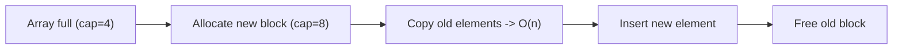

# Arrays — Revision Notes

**What:** Collection of elements stored in **contiguous memory**, accessed by index. Position of any element = `base_address + index × size` → math, not searching.

**Real-world:** A street of same-size houses numbered 0,1,2... — you walk straight to house #7, no need to pass 0-6.

## Memory Layout
```
Array: [10, 20, 30, 40, 50]      elementSize = 4 bytes, base = 1000

Address:  1000   1004   1008   1012   1016
         ┌──────┬──────┬──────┬──────┬──────┐
Value:   │  10  │  20  │  30  │  40  │  50  │
         └──────┴──────┴──────┴──────┴──────┘
Index:      0      1      2      3      4

arr[3] → address = 1000 + 3×4 = 1012 → O(1), direct jump
```

## Dynamic Array Growth (push when full)

Doubling capacity → resizes get rarer as array grows → **amortized O(1)** append.

## Insert / Delete in the Middle (why O(n))
```
Insert 99 at index 1:              Delete index 1:
[10, 20, 30, 40]                   [10, 20, 30, 40]
[10, 20, 30, 30, 40]  shift → →    [10, 30, 30, 40]  shift ← ←
[10, 20, 20, 30, 40]               [10, 30, 40, 40]
[10, 99, 20, 30, 40] done          [10, 30, 40]      done
```
Everything after the target index must shift — that's the `O(n)`.

## Complexity Table
| Operation | Best | Avg | Worst | Why |
|---|---|---|---|---|
| Access by index | O(1) | O(1) | O(1) | Direct address math |
| Search (unsorted) | O(1) | O(n) | O(n) | No order to skip on |
| Search (sorted, binary) | O(1) | O(log n) | O(log n) | Halves search space each step |
| Insert/Delete at end | O(1)* | O(1)* | O(1)* | Just write/decrement length (*amortized) |
| Insert/Delete at start/middle | O(n) | O(n) | O(n) | Must shift remaining elements |

Space: `O(n)`. Auxiliary space for most in-place ops: `O(1)`.

## When NOT to use
- Frequent insert/delete at the front/middle → use **Linked List**.
- Fast lookup by value (not index) → use **Hash Table**.
- Frequent min/max → use **Heap**.

## Common Mistakes
- Off-by-one: loop `i < length`, not `i <= length`.
- Assuming middle insert/delete is free — only the **end** is O(1).
- C/C++: returning a pointer to a local stack array (destroyed on return) or reading out of bounds (no auto bounds-check).

## Quick Code (JS)
```javascript
let arr = [10, 20, 30, 40];
arr.push(50);          // O(1) amortized
arr.splice(1, 0, 99);  // insert at index 1 → O(n)
arr.splice(0, 1);      // delete index 0  → O(n)
```

## Interview Favorites
Two Sum · Reverse Array · Rotate Array by k (O(1) space "reverse trick") · Kadane's Max Subarray · Move Zeroes · Merge Intervals · Product Except Self · Trapping Rain Water.

Always ask first: **sorted or not? duplicates? in-place required?**

## ✅ Revision Checklist
- [ ] Explain O(1) access via address arithmetic
- [ ] Explain amortized O(1) append (doubling diagram)
- [ ] Code binary search from memory
- [ ] Know why middle insert/delete is O(n)

---
See `1.arrayExample.md` for more worked JS examples (reverse, remove duplicates, find missing number, rotate array).
