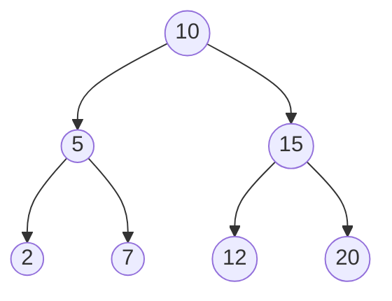

# Tree Data Structures

This document provides an overview of common tree data structures, their characteristics, and examples.

---

### 1. Binary Tree

A **Binary Tree** is a fundamental tree structure where each node has at most two children, referred to as the *left child* and the *right child*.

*   **Key Characteristic:** Each node can have 0, 1, or 2 children.
*   **Use Case:** It serves as the foundation for more complex trees like Binary Search Trees and is used in various parsing and evaluation algorithms.

**Example:**
A simple, unbalanced binary tree. Node `10` is the root.

```
      10
     /  \
    5    15
   /      \
  2        20
```

---

### 2. Binary Search Tree (BST)

A **Binary Search Tree** is a binary tree with a specific ordering rule that allows for fast searching, insertion, and deletion.

*   **Key Characteristic:** For any given node with value `N`:
    *   All values in its **left** subtree are **less than** `N`.
    *   All values in its **right** subtree are **greater than** `N`.
*   **Use Case:** Efficiently implementing dictionaries, symbol tables, or any data that requires fast lookups.

**Example:**
If you search for `12`, you go right from `10`, left from `15`, and find it.

```
      10
     /  \
    5    15
   / \   /  \
  2   7 12   20
```


Search for `12`: 10 → go right (12>10) → 15 → go left (12<15) → found. Each step halves the remaining nodes → **O(log n)** if balanced.

---

### 3. AVL Tree (Self-balancing BST)

An **AVL Tree** is a self-balancing Binary Search Tree. It automatically performs rotations to maintain a balanced height, ensuring that operations remain efficient even in the worst-case scenario.

*   **Key Characteristic:** The height difference (balance factor) between the left and right subtrees of any node is at most 1.
*   **Use Case:** Used in scenarios requiring guaranteed fast performance (O(log n)) for all search, insert, and delete operations, which is an improvement over a standard BST that can become unbalanced.

**Example:**
Inserting `3` into the BST below would unbalance it. An AVL tree would perform a "rotation" to rebalance itself.

*Before Insertion of `3`:*
```
      5
     / \
    4   8
```

*After Inserting `3` (unbalanced):*
```
      5
     / \
    4   8
   /
  3
```
*After AVL Rotation (re-balanced):*
```
      4
     / \
    3   5
         \
          8
```

---

### 4. B-Trees and B+ Trees

These are specialized trees optimized for systems that read and write large blocks of data, like databases and file systems. They are not binary trees.

*   **Key Characteristic:** Nodes can have many children (a high "branching factor"). This keeps the tree's height very low, minimizing slow disk accesses.
*   **B+ Tree Difference:** In a B+ Tree, all data is stored only in the leaf nodes, and these leaves are linked together, making sequential scans and range queries (e.g., "find all records between X and Y") very fast.
*   **Use Case:** The default choice for database indexing (e.g., in MySQL, PostgreSQL) and modern file systems (e.g., NTFS, HFS+).

**Example of a B-Tree node (Order 5):**
A single node can hold multiple keys and point to multiple children, reducing the need to traverse down the tree.

```
[ 10 | 20 | 30 | 40 ]
/   |    |    |   \
<10 10-20 20-30 30-40 >40  (Pointers to child nodes)
```

---

### 5. Trie (Prefix Tree)

A **Trie** is a tree structure used for storing a dynamic collection of strings, where nodes do not store keys but represent characters.

*   **Key Characteristic:** The path from the root to a node represents a common prefix. Each node has (at most) one child for each letter of the alphabet.
*   **Use Case:** Essential for implementing autocomplete features in search bars, IP routing tables, and spell checkers.

**Example:**
Storing the words "car", "cat", and "do":

```
      (root)
      /   \
     c     d
    /       \
   a         o
  / \
 r   t
(car) (cat) (do)
```

---

### 6. Segment Tree / Fenwick Tree

These are advanced data structures that allow for efficient range queries and updates on an array.

*   **Key Characteristic:** They can compute aggregate functions (like sum, min, or max) over a range of elements in logarithmic time (O(log n)). Updates to individual elements are also done in O(log n).
*   **Use Case:** Widely used in competitive programming and data analysis for problems involving frequent range queries and point updates.

**Example (Segment Tree for Range Sum):**
For an array `A = [2, 5, 1, 8, 4]`.

*   **Query:** What is the sum of the range from index 0 to 3 (`A[0...3]`)?
*   **Answer:** A Segment Tree can quickly compute this sum as `2 + 5 + 1 + 8 = 16` without iterating through each element.
*   **Update:** If you update `A[2]` from `1` to `6`, the tree structure is efficiently updated in O(log n) time.

---

### Complexity Cheat Sheet

| Tree Type | Search | Insert | Delete | Why |
|---|---|---|---|---|
| BST (balanced) | O(log n) | O(log n) | O(log n) | Each step halves remaining nodes |
| BST (unbalanced, worst case = a line) | O(n) | O(n) | O(n) | Degenerates into a linked list |
| AVL Tree | O(log n) | O(log n) | O(log n) | Rotations guarantee balance always |
| B-Tree | O(log n) | O(log n) | O(log n) | High branching factor keeps height tiny → fewer disk reads |
| Trie | O(k)* | O(k)* | O(k)* | *k = length of the word/key, not n |

> ⚠️ **Common mistake:** assuming a plain BST is always O(log n). Insert `1,2,3,4,5` in order into a BST with no balancing → it degenerates into a straight line (like a linked list) → O(n). This is exactly *why* AVL/Red-Black trees exist.

### Traversal Types (Binary Tree)
```
       1
      / \
     2   3
    / \
   4   5

Pre-order  (root,L,R): 1 2 4 5 3   → used to COPY/serialize a tree
In-order   (L,root,R): 4 2 5 1 3   → gives SORTED order for a BST
Post-order (L,R,root): 4 5 2 3 1   → used to DELETE a tree safely (children first)
Level-order (BFS):     1 2 3 4 5   → used for shortest-path-like / width problems
```

### ✅ Revision Checklist
- [ ] Draw a BST and show why in-order traversal = sorted output
- [ ] Explain why unbalanced BST degrades to O(n)
- [ ] Know when to reach for B-Tree (databases) vs Trie (prefix/autocomplete) vs Segment Tree (range queries)
