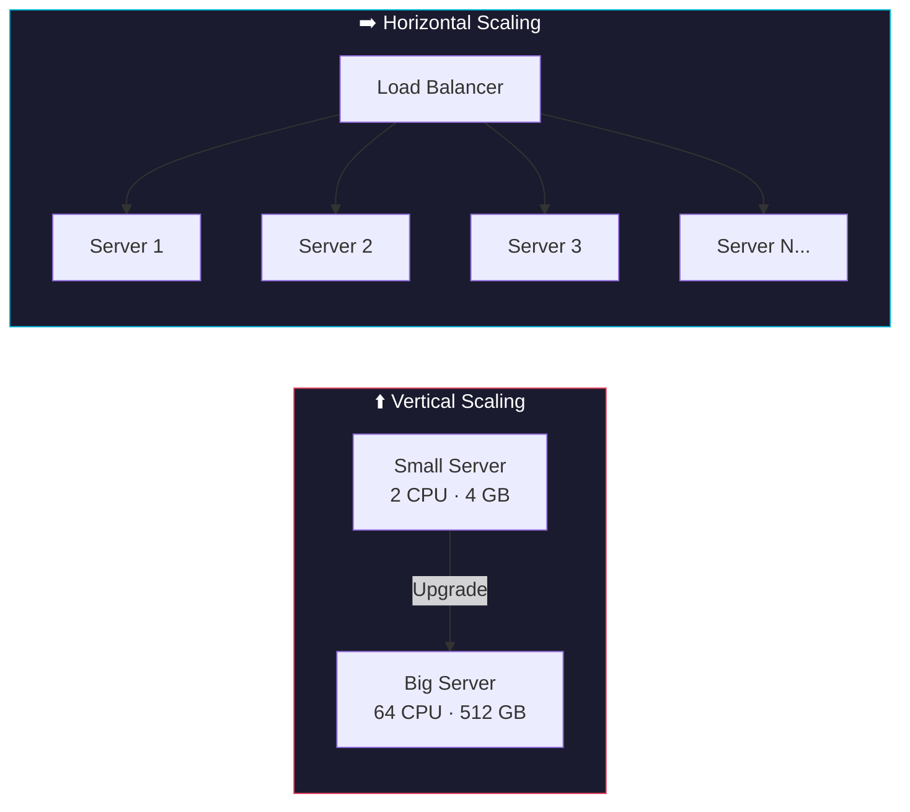
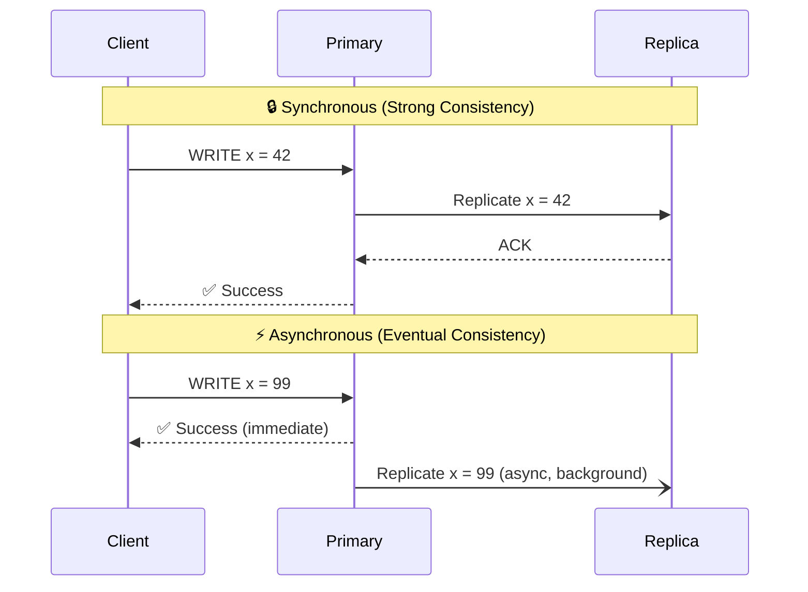
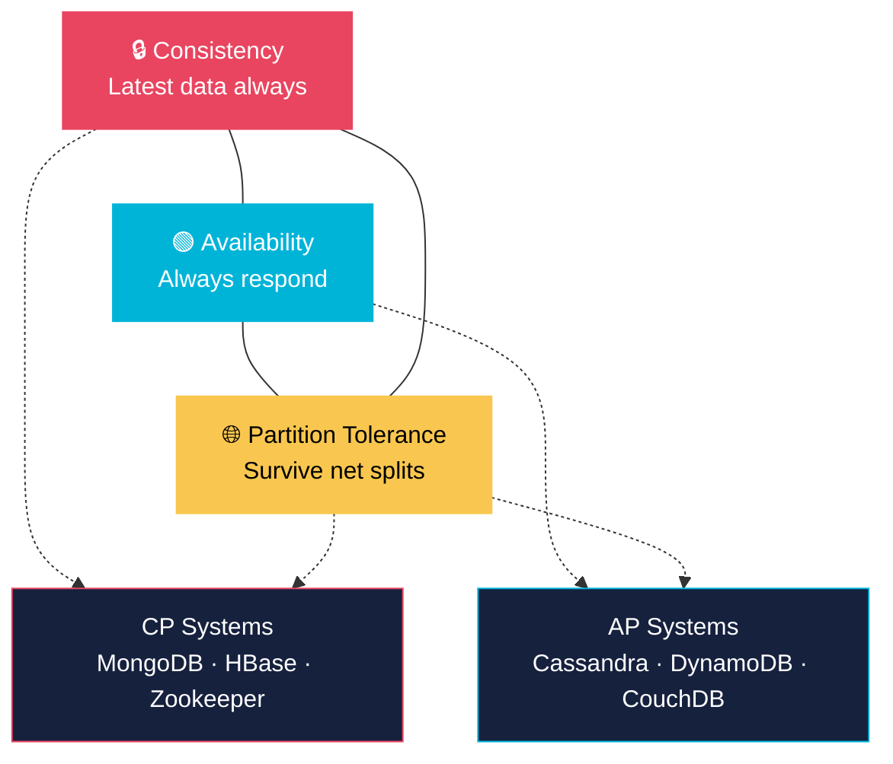

# 01 — System Design Fundamentals

> The bedrock concepts every system design answer is built on. Nail these and every follow-up answer becomes easier.

### What You'll Learn

- Scalability — vertical vs horizontal, when to pick each
- Latency vs Throughput — what they measure, how to improve each
- Availability — nines table, SPOF elimination
- Consistency — strong vs eventual, real-world trade-offs
- CAP Theorem — the unavoidable trade-off triangle
- Lamport Logical Clocks — ordering events in distributed systems

---

## 1. Scalability

**Definition:** The ability of a system to handle increased load by adding resources — either beefing up a single machine or adding more machines.

### Vertical vs Horizontal Scaling

| Dimension | Vertical (Scale Up) | Horizontal (Scale Out) |
|-----------|-------------------|----------------------|
| **Method** | Add CPU / RAM / disk to one machine | Add more machines to the pool |
| **Cost** | Expensive (high-end hardware) | Cheaper (commodity servers) |
| **Ceiling** | Hard hardware limit | Near-infinite (add more nodes) |
| **Downtime** | Often requires restart | Zero-downtime with rolling deploys |
| **Failure impact** | Single point of failure | One node fails, others continue |
| **Best for** | Simple apps, DBs with strong consistency | Stateless services, web tiers, microservices |

### Scaling Diagram



### Real Evolution Story

```
Day 1    → Launch on 1 server (app + DB on same box)
Month 3  → Traffic doubles → scale UP (more RAM, bigger CPU)
Month 6  → Black Friday: 100x traffic spike → single box melts
Month 7  → Switch to HORIZONTAL:
             ├─ Load Balancer in front
             ├─ Fleet of stateless app servers
             ├─ Redis for shared sessions
             └─ Read replicas for DB
```

### When to Choose Each

| Scenario | Pick |
|----------|------|
| Early-stage startup, low traffic | Vertical — simple, fast |
| Database with strict ACID needs | Vertical (initially) |
| Stateless API servers | Horizontal |
| Traffic is unpredictable / spiky | Horizontal + auto-scaling |
| You've maxed out the biggest machine | Horizontal (no choice) |

### Hybrid Scaling

In practice, most production systems use **both**: scale the DB vertically (bigger instance) while scaling the app tier horizontally (more containers). Cloud auto-scaling groups do this automatically.

> 💡 **Memory Aid:** *"Vertical = bigger engine. Horizontal = more cars, add lanes."*

---

## 2. Latency vs Throughput

**Latency:** The time it takes for a single request to travel from client to server and back — how fast?

**Throughput:** The number of requests the system can handle per unit of time — how much?

> 🛣️ **Highway Analogy:** Latency = how fast one car goes. Throughput = how many cars the highway carries per hour. A 6-lane highway (high throughput) doesn't mean each car is faster (low latency).

### The Latency Ladder

| Operation | Time | Relative Scale |
|-----------|------|----------------|
| L1 cache reference | **0.5 ns** | 1x |
| L2 cache reference | 7 ns | 14x |
| RAM access | **100 ns** | 200x |
| SSD random read | **16 µs** | 32,000x |
| HDD random read | 2 ms | 4,000,000x |
| Same data-center round trip | **0.5 ms** | 1,000,000x |
| Cross-continent round trip | **150 ms** | 300,000,000x |

### How to Reduce Latency

| Technique | How It Helps |
|-----------|-------------|
| **CDN** | Serve static assets from edge nodes closer to users |
| **Caching** | Avoid hitting the DB; serve from memory (Redis, Memcached) |
| **DB Indexing** | Turn O(n) table scans into O(log n) lookups |
| **Load Balancing** | Route to the least-loaded server; prevent hot spots |
| **Compression** | Smaller payloads = less transfer time (gzip, Brotli) |

### How to Improve Throughput

| Technique | How It Helps |
|-----------|-------------|
| **Horizontal Scaling** | More servers = more concurrent requests handled |
| **Caching** | Fewer expensive operations per request |
| **Async Processing** | Offload heavy work to background queues |
| **Batching** | Group multiple operations into one (bulk inserts) |
| **Connection Pooling** | Reuse DB/HTTP connections instead of creating new ones |

### CDN vs Caching

| Aspect | CDN | Caching (Redis / Memcached) |
|--------|-----|---------------------------|
| **What it stores** | Static assets (images, JS, CSS, video) | Dynamic data (query results, sessions, API responses) |
| **Where it lives** | Edge servers worldwide | In-memory, close to the app server |
| **Primary goal** | Reduce latency for end users globally | Reduce DB load and speed up reads |
| **Invalidation** | TTL, cache purge, versioned URLs | TTL, explicit delete, write-through |
| **Examples** | CloudFront, Cloudflare, Akamai | Redis, Memcached, Varnish |

> 💡 **Memory Aid:** *"Latency is the speed limit. Throughput is the number of lanes."*

---

## 3. Availability

**Definition:** The percentage of time a system is operational and serving requests correctly.

### Formula

```
Availability = Uptime / (Uptime + Downtime) × 100
```

### The Nines Table

| Availability | Common Name | Downtime / Year | Downtime / Month |
|-------------|-------------|----------------|-----------------|
| 99% | Two nines | **3.65 days** | 7.31 hours |
| 99.9% | Three nines | **8.77 hours** | 43.8 minutes |
| 99.99% | Four nines | **52.6 minutes** | 4.38 minutes |
| 99.999% | Five nines | **5.26 minutes** | 26.3 seconds |

> Most SLAs target 99.9%–99.99%. Five nines is reserved for critical infrastructure (payment systems, emergency services).

### How to Achieve High Availability

1. **Eliminate Single Points of Failure (SPOF):** Every component in the critical path must have a backup.
2. **Redundancy:** Deploy duplicate components (multiple servers, multi-AZ).
3. **Replication:** Keep copies of data in sync across nodes.
4. **Health checks & auto-restart:** Let the orchestrator replace unhealthy nodes automatically.
5. **Graceful degradation:** If one feature fails, the rest of the app stays up.

### Redundancy vs Replication

| Aspect | Redundancy | Replication |
|--------|-----------|-------------|
| **What** | Duplicate components (servers, LBs, networks) | Duplicate data across nodes |
| **Goal** | Eliminate SPOF for compute / network | Eliminate SPOF for data; enable read scaling |
| **Scope** | Infrastructure-level | Data-level |
| **Example** | 2 load balancers in active-passive | Primary DB → 3 read replicas |
| **Failover** | Standby takes over when active dies | Replica promotes to primary |

> 💡 **Memory Aid:** *"Redundancy = spare tire in the trunk. Replication = photocopying your only key."*

---

## 4. Consistency

**Definition:** A guarantee about when and whether all nodes in a distributed system reflect the same data after a write.

### Strong vs Eventual Consistency

| Aspect | Strong Consistency | Eventual Consistency |
|--------|-------------------|---------------------|
| **Guarantee** | Every read returns the most recent write | Reads *may* return stale data; all replicas converge eventually |
| **Latency** | Higher (must wait for all replicas to agree) | Lower (respond immediately from any replica) |
| **Availability** | Lower during partitions | Higher during partitions |
| **Use cases** | Banking, inventory, booking systems | Social media feeds, likes, analytics |
| **Examples** | PostgreSQL (single node), Google Spanner | Cassandra, DynamoDB, DNS |

### Sync vs Async Replication



> 💡 **Memory Aid:** *"Strong = everyone sees the same answer NOW. Eventual = everyone sees it SOON."*

---

## 5. CAP Theorem

**Definition:** In a distributed data store, you can guarantee at most **two** of three properties simultaneously:

- **C** — Consistency: Every read gets the latest write
- **A** — Availability: Every request gets a non-error response
- **P** — Partition Tolerance: The system works despite network splits

### The CAP Triangle



### CP vs AP Comparison

| Aspect | CP (Consistency + Partition Tolerance) | AP (Availability + Partition Tolerance) |
|--------|---------------------------------------|----------------------------------------|
| **During a partition** | Rejects requests to stay consistent | Serves requests (may return stale data) |
| **Read behavior** | Always returns latest write or error | Returns *some* value, maybe outdated |
| **Write behavior** | May block until quorum is reached | Accepts writes, resolves conflicts later |
| **Example DBs** | MongoDB, HBase, Zookeeper, etcd | Cassandra, DynamoDB, CouchDB, Riak |

### Real-World Choices

| System | CAP Choice | Why |
|--------|-----------|-----|
| Banking / Payment | **CP** | Incorrect balance is worse than brief unavailability |
| Social media feed | **AP** | Showing a slightly stale feed is better than an error page |
| Inventory / Booking | **CP** | Double-booking is unacceptable |
| DNS | **AP** | Stale record is better than no resolution |
| Shopping cart | **AP** | Cart can merge conflicts later; availability wins |

### Key Insight

> Network partitions **will** happen in any distributed system. Partition Tolerance is non-negotiable. So the real choice is always: **CP or AP**.

> 💡 **Memory Aid:** *"Partitions are guaranteed. Pick your poison: block (CP) or serve stale (AP)."*

---

## 6. Lamport Logical Clock

**Definition:** A logical counter mechanism that provides a partial ordering of events across distributed processes without relying on synchronized physical clocks.

### Algorithm Rules

1. **Before any event**, a process increments its own counter: `C = C + 1`
2. **When sending a message**, the process includes its current counter value with the message.
3. **When receiving a message**, the receiver sets: `C = max(C_local, C_message) + 1`
4. **If event A causally precedes event B**, then `C(A) < C(B)`. (But `C(A) < C(B)` does **not** guarantee A caused B — it's a partial order.)

### Use Cases

| Use Case | How Lamport Clocks Help |
|----------|------------------------|
| **Distributed databases** | Determine write order across replicas without synced clocks |
| **Version control (vector clocks)** | Detect conflicting updates; basis for vector clocks in Dynamo-style DBs |
| **Event ordering / logging** | Establish "happened-before" relationships for debugging and audit trails |

> 💡 **Memory Aid:** *"No wall clock needed — just count events and piggyback the counter on every message."*

---

## Quick Recall — Summary Table

| Concept | One-Sentence Definition |
|---------|------------------------|
| **Scalability** | The ability to handle more load by adding resources (up or out). |
| **Vertical Scaling** | Adding more power (CPU/RAM) to a single machine. |
| **Horizontal Scaling** | Adding more machines behind a load balancer. |
| **Latency** | Time for a single request to complete (how fast). |
| **Throughput** | Number of requests handled per second (how much). |
| **CDN** | Edge network caching static assets close to users globally. |
| **Availability** | Percentage of time the system is up and serving correctly. |
| **Redundancy** | Duplicate infrastructure components to eliminate SPOF. |
| **Replication** | Copying data across nodes for durability and read scaling. |
| **Strong Consistency** | Every read always returns the most recent write. |
| **Eventual Consistency** | Replicas converge to the same value over time, reads may be stale. |
| **CAP Theorem** | Pick 2 of 3: Consistency, Availability, Partition Tolerance (P is mandatory). |
| **CP System** | Sacrifices availability during partitions to stay consistent (MongoDB, HBase). |
| **AP System** | Sacrifices consistency during partitions to stay available (Cassandra, DynamoDB). |
| **Lamport Clock** | Logical counter providing causal event ordering without synchronized clocks. |

---

> **Next →** [02-architecture-styles.md](./02-architecture-styles.md) — Monolith, Microservices, N-Tier, SOA
