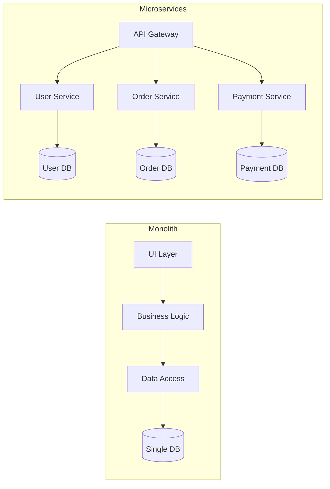
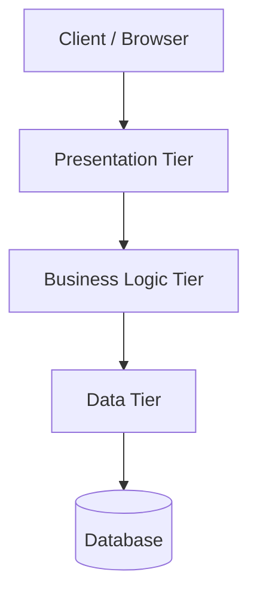
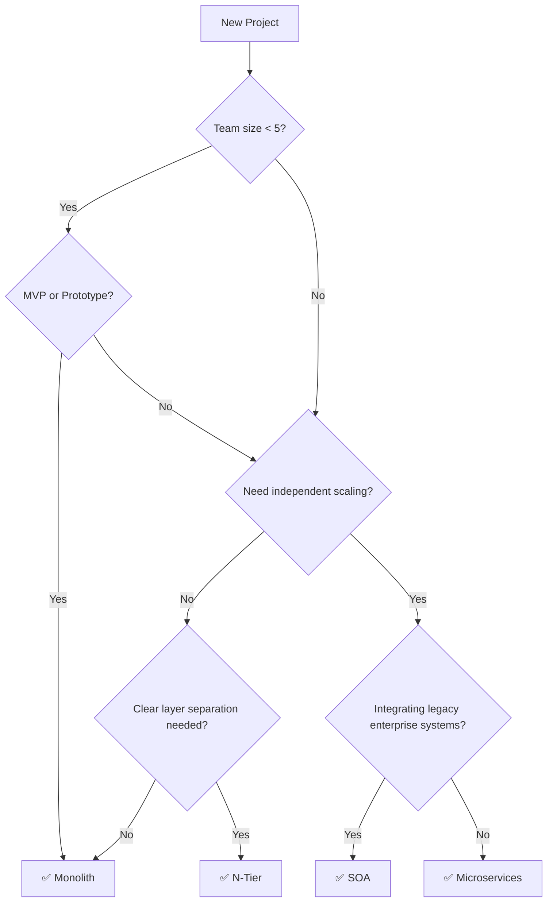

# Architecture Styles

## What You'll Learn

- Monolithic Architecture — when and why to use a single unified codebase
- Microservices Architecture — independent services, independent scaling
- Head-to-head comparison of Monolith vs Microservices
- N-Tier Architecture — layered separation of concerns
- SOA (Service-Oriented Architecture) — the enterprise ancestor of microservices
- Architecture Decision Guide — how to pick the right style

---

## 1. Monolithic Architecture

> **Definition:** A single, unified deployment unit where all functionality — UI, business logic, and data access — lives in one codebase and runs as one process.

### Characteristics

| Aspect | Detail |
|---|---|
| **Codebase** | Single shared codebase |
| **Deployment** | One deployable artifact (WAR, JAR, binary) |
| **Database** | Single shared database |
| **Coupling** | Tightly coupled — modules call each other directly in-process |

### Advantages

- **Simple development initially** — one repo, one IDE, one build
- **Simple testing** — end-to-end tests run against one process
- **Simple deployment** — deploy one artifact to one server
- **Low latency** — no network calls between modules (in-process function calls)

### Disadvantages

- **Difficult to scale** — must scale the entire application even if only one module is the bottleneck
- **Technology lock-in** — entire app uses one language/framework
- **Slower development as codebase grows** — long build times, merge conflicts, cognitive overload
- **Single point of failure** — one bug can bring the whole system down

### When to Use

- Small teams (< 5 developers)
- MVPs and prototypes — ship fast, validate the idea
- Applications with low complexity and predictable scale

> 💡 **Memory Aid:** *"Mono = One. One codebase, one deploy, one database, one failure domain."*

---

## 2. Microservices Architecture

> **Definition:** A collection of small, independently deployable services, each responsible for a single business capability and communicating over lightweight protocols (HTTP/gRPC/messaging).

### Each Service Has

| Owns | Why |
|---|---|
| **Own Database** | No shared state — loose coupling |
| **Own Deployment** | Deploy independently without affecting others |
| **Lightweight Communication** | REST, gRPC, or async messaging (Kafka, RabbitMQ) |

### Advantages

- **Independent scaling** — scale only the services that need it
- **Fault isolation** — one service fails, others keep running
- **Technology diversity** — each service can use the best language/framework for its job
- **Independent deployment** — ship features without redeploying everything

### Disadvantages

- **High operational complexity** — many services to monitor, deploy, and debug
- **Distributed system challenges** — network failures, data consistency, distributed tracing
- **Network latency** — inter-service calls add overhead vs in-process calls

### When to Use

- Large teams (multiple squads owning different services)
- Need independent scaling of specific components
- High availability requirements — no single point of failure

> 💡 **Memory Aid:** *"Micro = Many small things. Many repos, many deploys, many databases — but many headaches too."*

---

## 3. Monolith vs Microservices — Comparison

| Aspect | Monolith | Microservices |
|---|---|---|
| **Architecture** | Single unit | Distributed services |
| **Codebase** | One shared repo | One repo per service (or mono-repo with boundaries) |
| **Deployment** | Deploy everything at once | Deploy each service independently |
| **Scaling** | Scale entire app | Scale individual services |
| **Technology** | Single stack | Polyglot (mix of languages/frameworks) |
| **Database** | Single shared DB | Database per service |
| **Failure Impact** | One bug → whole system down | One bug → one service down |
| **Complexity** | Simple initially, painful at scale | Complex initially, manageable at scale |
| **Use When** | Small team, MVP, prototype | Large team, independent scaling, high availability |

### Architecture Diagram

---

## 4. N-Tier Architecture

> **Definition:** A layered architecture that separates an application into logical tiers, each responsible for a specific concern. The most common variant is **3-Tier**.

### The Three Tiers

| Tier | Responsibility | Example |
|---|---|---|
| **Presentation** | UI, user interaction | React, Angular, Mobile App |
| **Business Logic** | Rules, validation, workflows | Node.js, Spring Boot, .NET |
| **Data** | Storage, retrieval, persistence | PostgreSQL, MongoDB, Redis |

### Diagram

### When to Use

- Traditional web applications with clear separation of concerns
- Enterprise apps where teams own different layers
- When you want independent development of UI, logic, and data layers

> 💡 **Memory Aid:** *"N-Tier = Layer cake. Each layer talks only to the one below it."*

---

## 5. SOA (Service-Oriented Architecture)

> **Definition:** An architectural style where functionality is organized into discrete, reusable **services** that communicate through a centralized **Enterprise Service Bus (ESB)**.

### Key Characteristics

| Aspect | Detail |
|---|---|
| **Communication** | Via a centralized ESB (Enterprise Service Bus) |
| **Protocol** | Typically SOAP/XML (heavier than REST/JSON) |
| **Service Scope** | Coarse-grained — services are larger than microservices |
| **Governance** | Centralized governance and shared schemas |

### SOA vs Microservices

| Aspect | SOA | Microservices |
|---|---|---|
| **Communication** | Centralized ESB | Decentralized (direct HTTP/gRPC/messaging) |
| **Protocol** | SOAP/XML (heavy) | REST/JSON or gRPC (lightweight) |
| **Service Size** | Large, coarse-grained | Small, fine-grained |
| **Data** | Often shared databases | Database per service |
| **Governance** | Centralized | Decentralized |
| **Era** | 2000s enterprise | 2010s+ cloud-native |

> 💡 **Memory Aid:** *"SOA is the enterprise-y ancestor of microservices. Same idea (split into services), heavier execution (ESB + SOAP)."*

---

## 6. Architecture Decision Guide

### When to Pick What

| Factor | Monolith | Microservices | SOA | N-Tier |
|---|---|---|---|---|
| **Team size** | Small (< 5) | Large (multiple squads) | Large enterprise | Any |
| **Complexity** | Low | High | High | Medium |
| **Scaling need** | Uniform | Per-service | Per-service | Per-tier |
| **Deployment speed** | Fast initially | Fast per service | Slower (ESB coordination) | Moderate |
| **Best for** | MVP, prototype | Cloud-native, SaaS | Legacy enterprise integration | Traditional web apps |

### Decision Flowchart

---

## Quick Recall

| Style | One-Liner |
|---|---|
| **Monolith** | One codebase, one deploy, one DB — simple until it's not |
| **Microservices** | Many small services, each with own DB and deploy — complex but scalable |
| **N-Tier** | Layer cake: Presentation → Logic → Data |
| **SOA** | Enterprise ancestor of microservices — services + ESB + SOAP |

**Golden Rule:** *Start monolith, extract microservices when you outgrow it. Premature microservices = premature complexity.*
