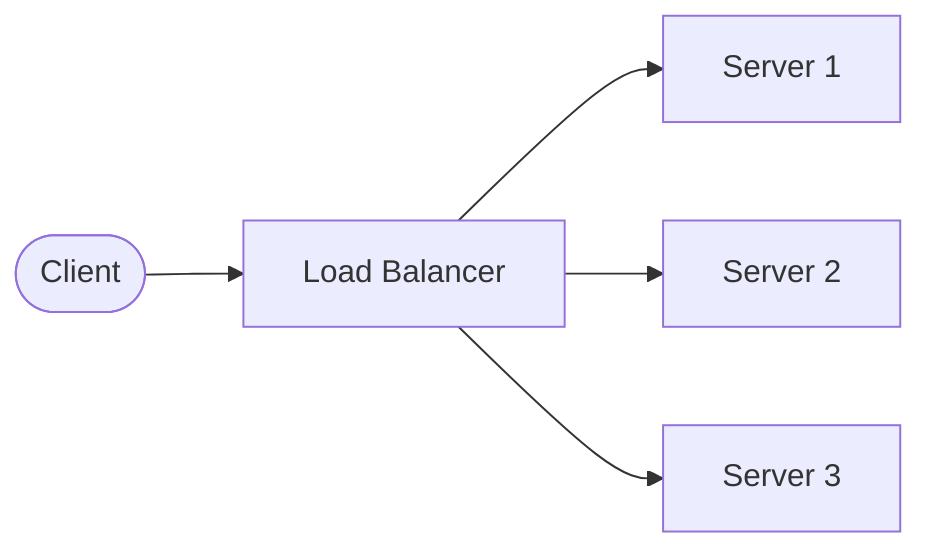
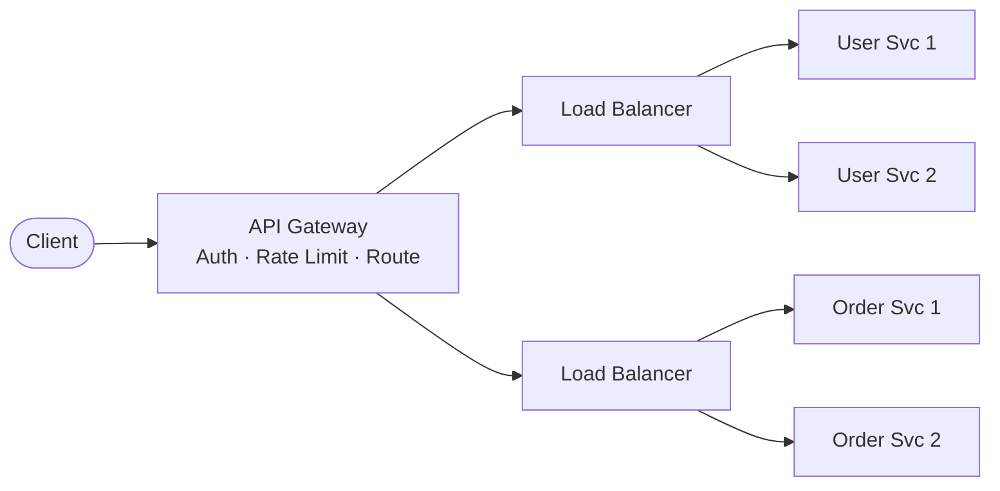
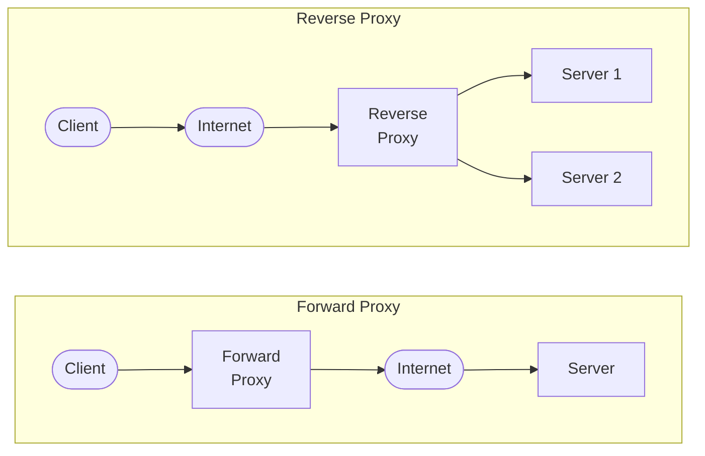

# Networking & Traffic Management

## What You'll Learn

- Load Balancer — algorithms, Layer 4 vs Layer 7
- API Gateway — the smart front-door and how it differs from a Load Balancer
- Forward Proxy vs Reverse Proxy — who hides whom
- Reverse Proxy Functions in detail
- Web Servers — what they do and popular options
- Communication Protocols — HTTP, WebSocket, gRPC, TCP, UDP
- REST API Basics — stateless, resource-based design

---

## 1. Load Balancer

> **Definition:** A component that distributes incoming network traffic across multiple backend servers to ensure no single server is overwhelmed.

### Why?

- **High availability** — if one server dies, traffic shifts to healthy ones
- **Horizontal scaling** — add more servers behind the LB
- **Better performance** — spread the load evenly

### Load Balancing Algorithms

| Algorithm | How It Works | Best For |
|---|---|---|
| **Round Robin** | Requests go to servers in rotation (1 → 2 → 3 → 1…) | Equal-capacity servers |
| **Weighted Round Robin** | Servers with higher weight get more requests | Mixed-capacity servers |
| **Least Connections** | Routes to the server with fewest active connections | Long-lived connections |
| **IP Hash** | Client IP determines which server handles it (sticky) | Session persistence |
| **Least Response Time** | Routes to the server responding fastest | Latency-sensitive apps |
| **Random** | Picks a server at random | Simple, stateless setups |

### Layer 4 vs Layer 7

| Aspect | Layer 4 (Transport) | Layer 7 (Application) |
|---|---|---|
| **Operates on** | TCP/UDP packets | HTTP headers, URLs, cookies |
| **Routing decision** | IP address + port | URL path, host header, content type |
| **Speed** | Faster (no content inspection) | Slower (inspects content) |
| **Intelligence** | Blind — doesn't read payload | Smart — can route `/api` to one pool, `/images` to another |
| **Example** | AWS NLB | AWS ALB, Nginx |

### Popular Load Balancers

- **Nginx** — open-source, high-performance (L7)
- **HAProxy** — battle-tested, TCP & HTTP (L4/L7)
- **AWS ELB Family** — ALB (L7), NLB (L4), CLB (legacy)

### Diagram

> 💡 **Memory Aid:** *"Load Balancer = traffic cop. It doesn't care what's in the package, just sends it to the least busy lane."*

---

## 2. API Gateway

> **Definition:** A smart front-door that sits between clients and backend services, handling cross-cutting concerns before requests reach your services.

### What It Does

| Function | Detail |
|---|---|
| **Authentication / Authorization** | Validates tokens (JWT, OAuth) before forwarding |
| **Rate Limiting** | Throttles abusive or excessive requests |
| **Routing** | Routes `/users` to User Service, `/orders` to Order Service |
| **Request/Response Transformation** | Modifies headers, body format |
| **Aggregation** | Combines responses from multiple services into one |
| **Caching** | Caches frequent responses to reduce backend load |
| **Logging & Monitoring** | Centralized request logging and metrics |

### Load Balancer vs API Gateway

| Aspect | Load Balancer | API Gateway |
|---|---|---|
| **Primary job** | Distribute traffic evenly | Smart routing + cross-cutting concerns |
| **Auth** | ❌ No | ✅ Yes |
| **Rate limiting** | ❌ No | ✅ Yes |
| **Request transformation** | ❌ No | ✅ Yes |
| **Content-based routing** | L7 only (basic) | ✅ Rich (path, header, method) |
| **Protocol translation** | ❌ No | ✅ Yes (REST → gRPC) |
| **Where it sits** | Between client and server pool | Between client and microservices |

### Diagram — Both Side by Side

> 💡 **One-Liner:** *"LB spreads traffic. API Gateway is a smart front-door: auth + rate limiting + routing + orchestration."*

---

## 3. Forward Proxy vs Reverse Proxy

### Forward Proxy

> Sits in front of **clients**. Hides the **client's** identity from the server.

- Client → **Forward Proxy** → Internet → Server
- Server sees the proxy's IP, not the client's
- **Use cases:** VPN, corporate proxy, content filtering, bypass geo-restrictions

### Reverse Proxy

> Sits in front of **servers**. Hides the **server's** identity from the client.

- Client → Internet → **Reverse Proxy** → Server
- Client sees the proxy's IP, not the server's
- **Use cases:** Load balancing, SSL termination, caching, compression, WAF

### Comparison

| Aspect | Forward Proxy | Reverse Proxy |
|---|---|---|
| **Sits in front of** | Client | Server |
| **Hides** | Client identity | Server identity |
| **Who configures it** | Client / IT admin | Server / DevOps team |
| **Examples** | Squid, corporate VPN | Nginx, HAProxy, AWS ALB |
| **Use cases** | Anonymity, content filtering | LB, SSL, caching, security |

### Diagram

> 💡 **One-Liner:** *"Forward hides the client; reverse hides the server."*

---

## 4. Reverse Proxy Functions — Detail

| Function | What It Does |
|---|---|
| **Load Balancing** | Distributes requests across backend servers |
| **SSL Termination** | Handles HTTPS encryption/decryption so backend servers deal with plain HTTP |
| **Caching** | Stores frequently requested content (static files, API responses) closer to the client |
| **Compression** | Compresses responses (gzip, Brotli) to reduce bandwidth |
| **Security / WAF** | Web Application Firewall — blocks SQL injection, XSS, DDoS at the edge |

### Popular Reverse Proxies

| Tool | Strengths |
|---|---|
| **Nginx** | High performance, most popular, great for static files |
| **HAProxy** | Battle-tested, excellent TCP/HTTP load balancing |
| **Traefik** | Cloud-native, auto-discovery with Docker/Kubernetes |
| **Envoy** | Service mesh sidecar proxy, used in Istio |

---

## 5. Web Servers

> **Definition:** Software that serves web content (HTML, CSS, JS, images) to clients over HTTP/HTTPS.

### Core Functions

| Function | Detail |
|---|---|
| **Serve static files** | HTML, CSS, JS, images directly from disk |
| **Reverse proxy** | Forward dynamic requests to application servers (Node.js, Python) |
| **Load balancing** | Distribute requests across app server instances |
| **SSL termination** | Handle HTTPS certificates |
| **Virtual hosting** | Serve multiple domains from one server |

### Popular Web Servers

| Server | Notes |
|---|---|
| **Nginx** | Event-driven, non-blocking — most popular for modern apps |
| **Apache HTTP** | Process/thread-based — long history, very configurable (.htaccess) |
| **IIS** | Microsoft's web server for Windows / .NET |
| **Caddy** | Auto HTTPS out of the box, simple config |

> 💡 **Memory Aid:** *"Web server = waiter. It takes the client's HTTP request and serves back the response."*

---

## 6. Communication Protocols

### By Network Layer

| Layer | Protocol | Purpose |
|---|---|---|
| **Application (L7)** | HTTP | Stateless request-response for web |
| | HTTPS | HTTP + TLS encryption |
| | WebSocket | Full-duplex, persistent connection |
| | gRPC | High-performance RPC with Protocol Buffers |
| **Transport (L4)** | TCP | Reliable, ordered delivery (connection-oriented) |
| | UDP | Fast, no guarantee (connectionless) |
| **Network (L3)** | IP | Addressing and routing packets |
| | ICMP | Diagnostics (ping, traceroute) |

### HTTP vs WebSocket vs gRPC

| Aspect | HTTP (REST) | WebSocket | gRPC |
|---|---|---|---|
| **Connection** | Short-lived (request-response) | Persistent, full-duplex | Persistent (HTTP/2 streams) |
| **Data format** | JSON (text) | Text or binary frames | Protocol Buffers (binary) |
| **Direction** | Client → Server | Bi-directional | Bi-directional streaming |
| **Use case** | CRUD APIs, web apps | Chat, live updates, gaming | Microservice-to-microservice |
| **Overhead** | Moderate (headers per request) | Low (after handshake) | Very low (binary, multiplexed) |
| **Browser support** | ✅ Full | ✅ Full | ⚠️ Via gRPC-Web proxy |

---

## 7. REST API Basics

> **Definition:** **RE**presentational **S**tate **T**ransfer — an architectural style for designing networked APIs around **resources**.

### Core Principles

| Principle | Detail |
|---|---|
| **Stateless** | Each request contains all info needed — server stores no session state |
| **Resource-based** | Everything is a resource identified by a URL (`/users/42`) |
| **HTTP Methods** | Standard verbs map to CRUD operations |
| **JSON** | Most common data format (lightweight, human-readable) |
| **Uniform Interface** | Consistent URL patterns and HTTP semantics |

### HTTP Methods → CRUD

| Method | Action | Example | Idempotent? |
|---|---|---|---|
| `GET` | **Read** | `GET /users/42` | ✅ Yes |
| `POST` | **Create** | `POST /users` | ❌ No |
| `PUT` | **Update (full)** | `PUT /users/42` | ✅ Yes |
| `PATCH` | **Update (partial)** | `PATCH /users/42` | ✅ Yes |
| `DELETE` | **Delete** | `DELETE /users/42` | ✅ Yes |

### Common HTTP Status Codes

| Code | Meaning |
|---|---|
| `200` | OK — success |
| `201` | Created — resource created |
| `204` | No Content — success, nothing to return |
| `400` | Bad Request — client error |
| `401` | Unauthorized — not authenticated |
| `403` | Forbidden — not authorized |
| `404` | Not Found — resource doesn't exist |
| `500` | Internal Server Error — server bug |

> 💡 **Memory Aid:** *"REST = Resources + HTTP verbs + JSON + Stateless. That's it."*

---

## Quick Recall

| Topic | One-Liner |
|---|---|
| **Load Balancer** | Traffic cop — distributes requests across servers using algorithms (Round Robin, Least Connections, etc.) |
| **API Gateway** | Smart front-door — auth + rate limiting + routing + orchestration before reaching services |
| **Forward Proxy** | Hides the **client** — sits in front of clients (VPN, corporate proxy) |
| **Reverse Proxy** | Hides the **server** — sits in front of servers (Nginx, LB, SSL, caching, WAF) |
| **Web Server** | Serves HTTP content — static files, reverse proxy, SSL (Nginx, Apache) |
| **HTTP vs WS vs gRPC** | Request-response vs persistent bi-directional vs high-perf binary RPC |
| **REST** | Stateless + Resources + HTTP verbs + JSON |
