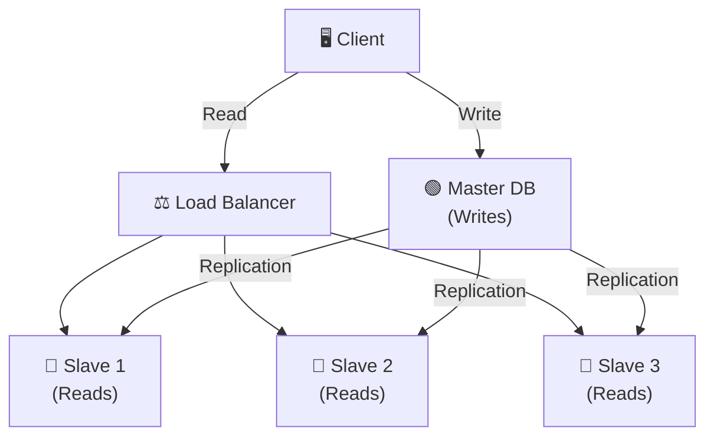
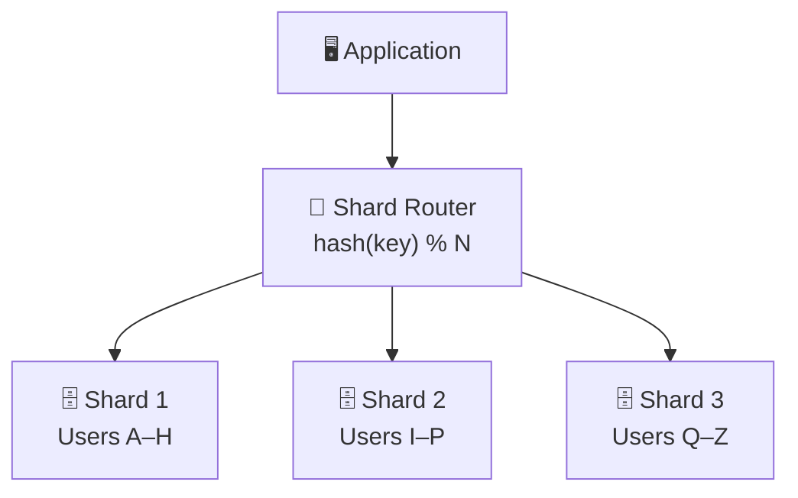
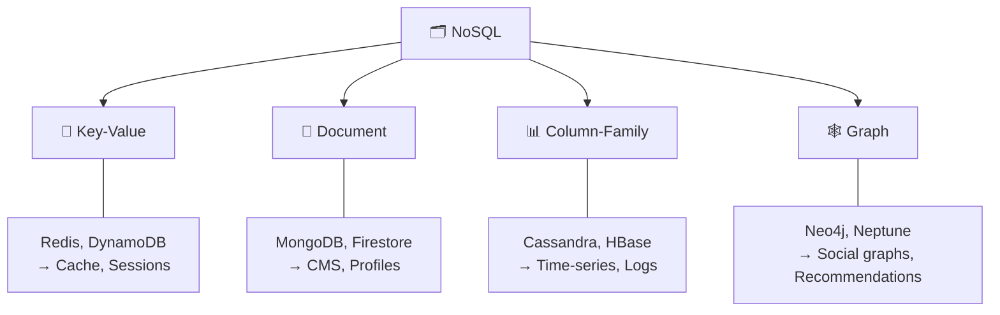

# 📦 Data Layer

> How data is stored, replicated, partitioned, indexed, and optimized at scale.

### What you'll learn

- Database replication patterns (Master-Slave, Master-Master)
- Sharding and horizontal partitioning
- SQL vs NoSQL family map
- Polyglot persistence strategy
- Indexing internals and SQL optimization
- Denormalization trade-offs
- File-based storage options

---

## 1. Database Replication (Master-Slave)

| Role | Responsibility |
|------|---------------|
| **Master** | Handles all **writes** (INSERT, UPDATE, DELETE) |
| **Slave(s)** | Handle all **reads** (SELECT) — replicated from master |

### Replication Modes

| Mode | Consistency | Latency | Risk |
|------|------------|---------|------|
| **Synchronous** | Strong (all replicas confirm) | Higher | No data loss |
| **Asynchronous** | Eventual (replicas lag behind) | Lower | Possible stale reads |

### Master-Master Replication

- **Both nodes accept writes** — useful for multi-region setups
- Requires **conflict resolution** (last-write-wins, vector clocks, CRDTs)
- More complex operationally than master-slave

### Architecture

---

## 2. Sharding (Horizontal Partitioning)

> Split data across multiple database servers so no single node holds everything.

- A **shard router** uses `hash(key) % N` to determine which shard stores a record
- Each shard holds a **subset** of the total data

### Why RDBMS Scaling is Hard

| Challenge | Why it hurts |
|-----------|-------------|
| **ACID across nodes** | 2-Phase Commit (2PC) is slow and fragile |
| **Cross-shard JOINs** | Must query multiple shards and merge — expensive |
| **FK constraints** | Cannot enforce across different shard servers |
| **Auto-increment IDs** | Collisions when multiple shards generate IDs independently |

### Solutions for Scaling Relational Data

| Approach | Tools / Examples |
|----------|-----------------|
| **Read replicas** | Native MySQL/PostgreSQL replication |
| **Application-level sharding** | Hash-based routing in app code |
| **Distributed SQL** | Vitess, CockroachDB, TiDB, Citus |

---

## 3. SQL vs NoSQL Family Map

### NoSQL Types

### SQL vs NoSQL Comparison

| Feature | SQL (Relational) | NoSQL |
|---------|------------------|-------|
| **Schema** | Fixed, predefined | Flexible, schema-less |
| **Scaling** | Vertical (scale up) | Horizontal (scale out) |
| **Joins** | Native, powerful | Limited or none |
| **ACID** | Full ACID support | Varies (often BASE) |
| **Use cases** | Transactions, complex queries | High throughput, flexible data |

---

## 4. Polyglot Persistence

> Use **different database technologies** for different data needs within the same application.

### E-Commerce Example

| Data | Best-fit DB | Why |
|------|------------|-----|
| **Sessions** | Redis | Fast in-memory key-value |
| **Product Catalog** | MongoDB | Flexible document schema |
| **Orders / Payments** | PostgreSQL | ACID transactions |
| **Search** | Elasticsearch | Full-text search, faceting |
| **Recommendations** | Neo4j | Graph traversals |

> **Key idea:** No single database is best at everything — pick the right tool for each job.

---

## 5. Indexing

### What is an Index?

A **data structure** (typically B-Tree) maintained alongside the table that speeds up data retrieval.

| Without Index | With Index (B-Tree) |
|--------------|-------------------|
| Full table scan — **O(n)** | Tree lookup — **O(log n)** |

### Index Types

| Type | Best for | Example |
|------|----------|---------|
| **B-Tree** | Range queries, sorting (default) | `WHERE age > 25` |
| **Hash** | Exact equality lookups | `WHERE id = 42` |
| **Composite** | Multi-column filters | `WHERE city = 'NYC' AND status = 'active'` |
| **Full-text** | Text search | `WHERE body MATCH 'database'` |

### SQL Optimization Tips

| Tip | Detail |
|-----|--------|
| Use `EXPLAIN ANALYZE` | See query execution plan and actual timings |
| Index `WHERE` / `JOIN` / `ORDER BY` columns | These are scanned most — indexes help here |
| Avoid `SELECT *` | Fetch only needed columns — reduces I/O |
| Paginate results | Use `LIMIT` / `OFFSET` or cursor-based pagination |
| Don't wrap indexed columns in functions | `WHERE YEAR(created_at) = 2024` **breaks** index; use range instead |

---

## 6. Denormalization

> **Add redundant data** to tables to reduce expensive JOINs at read time.

### Normalized vs Denormalized

| Aspect | Normalized | Denormalized |
|--------|-----------|-------------|
| **Storage** | Minimal (no duplication) | More (redundant data) |
| **Read Speed** | Slower (requires JOINs) | Faster (pre-joined) |
| **Write Speed** | Faster (single update) | Slower (update multiple copies) |
| **Consistency** | Easy to maintain | Harder (must sync copies) |

> **Trade-off:** Faster reads at the cost of slower/harder writes and more storage.

---

## 7. File-Based Storage

| Type | Examples | Use Case |
|------|----------|----------|
| **Local FS** | ext4, NTFS | Single-server file storage |
| **Network FS** | NFS, SMB | Shared access across servers |
| **Distributed FS** | HDFS, GlusterFS | Big data, fault-tolerant clusters |
| **Object Storage** | S3, Azure Blob, GCS | Large binary files, static assets, backups |

> **When to use file storage:** Large binary files (images, videos), logs, backups, static assets (served via CDN).

---

## Quick Recall

| Topic | Key Takeaway |
|-------|-------------|
| **Replication** | Master writes, slaves read; sync = strong consistency, async = low latency |
| **Sharding** | Split data by hash(key) across nodes; hard for RDBMS due to ACID/JOINs |
| **SQL vs NoSQL** | SQL = structured + ACID; NoSQL = flexible + horizontal scale |
| **Polyglot Persistence** | Right DB for each data type (Redis for cache, Postgres for transactions, etc.) |
| **Indexing** | B-Tree turns O(n) scan into O(log n) lookup; don't wrap indexed cols in functions |
| **Denormalization** | Duplicate data to avoid JOINs — faster reads, harder writes |
| **File Storage** | Object storage (S3) for blobs; distributed FS (HDFS) for big data |
