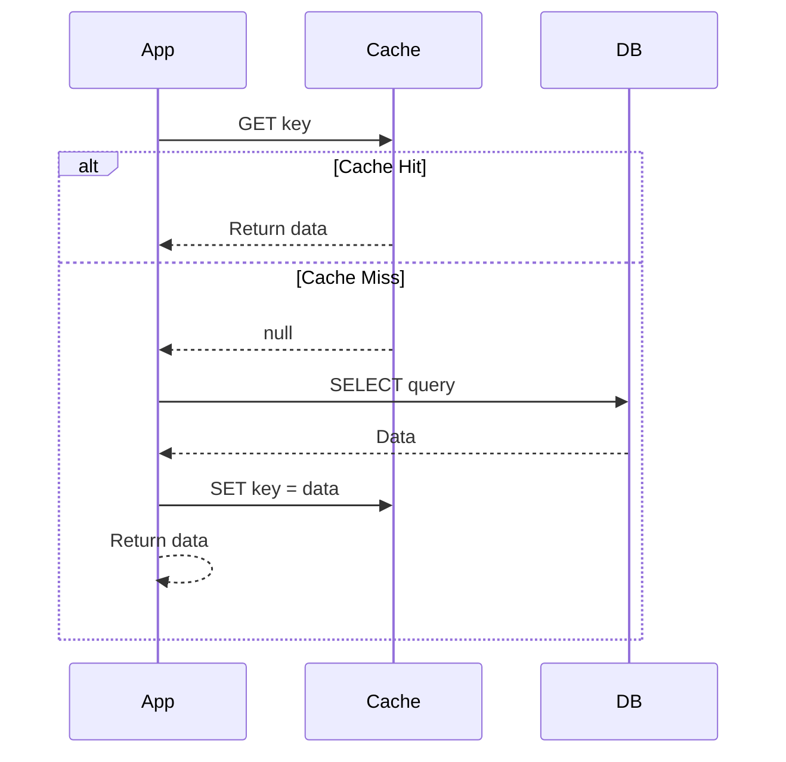
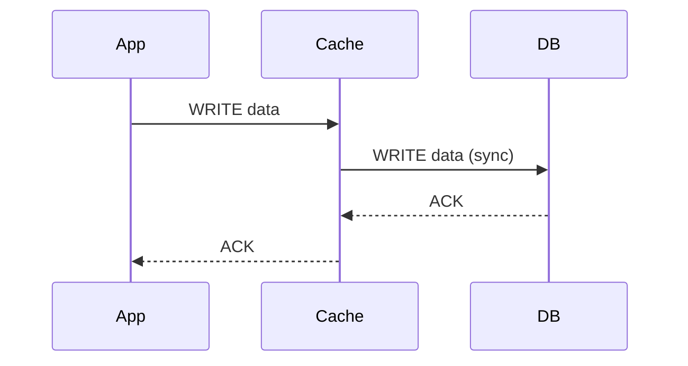
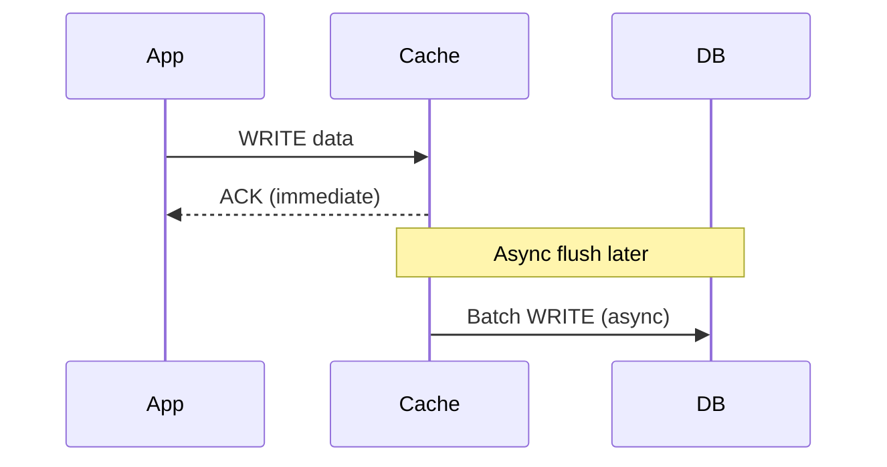

# ⚡ Caching

> Store frequently accessed data in fast storage to reduce latency and database load.

### What you'll learn

- What caching is and why it matters
- Caching strategies: Cache-Aside, Write-Through, Write-Behind
- Cache invalidation techniques (TTL, event-based)
- Cache eviction policies (LRU, LFU, FIFO, etc.)
- CDN vs Application Cache — when to use which

---

## 1. What is Caching?

> Keep a **copy of frequently accessed data** in a faster storage layer so subsequent requests are served without hitting the slower origin (DB, API, disk).

| Benefit | Detail |
|---------|--------|
| **Reduced latency** | Memory access ~100ns vs disk ~10ms |
| **Lower DB load** | Fewer queries hit the database |
| **Higher throughput** | Serve more requests with same infrastructure |

### Popular Tools

| Tool | Type |
|------|------|
| **Redis** | In-memory key-value store (most popular) |
| **Memcached** | In-memory key-value (simpler, multi-threaded) |
| **Varnish** | HTTP reverse-proxy cache |

---

## 2. Caching Strategies

### Cache-Aside (Lazy Loading) — MOST COMMON

> Application manages the cache explicitly. Data is loaded into cache **only on a miss**.

- **Read:** Check cache → miss → read DB → store in cache → return
- **Write:** Write to DB → invalidate (delete) cache entry

### Write-Through

> Every write goes to **cache first**, then cache **synchronously** writes to DB.

- **Consistent** — cache and DB always in sync
- **Slower writes** — every write waits for DB confirmation

### Write-Behind (Write-Back)

> Write goes to **cache only**; DB is updated **asynchronously** in the background.

- **Fastest writes** — app doesn't wait for DB
- **Risky** — data loss if cache crashes before DB sync

### Strategy Comparison

| Strategy | Read Speed | Write Speed | Consistency | Data Loss Risk |
|----------|-----------|-------------|-------------|---------------|
| **Cache-Aside** | Fast (after first miss) | Normal (DB direct) | Eventual (stale until invalidated) | Low |
| **Write-Through** | Fast | Slower (sync to DB) | Strong | None |
| **Write-Behind** | Fast | Fastest (async) | Eventual | High (if cache crashes) |

---

## 3. Cache Invalidation

> Stale data is the #1 problem with caching. Two main approaches to keep cache fresh:

| Method | How it works | Best for |
|--------|-------------|----------|
| **TTL (Time-To-Live)** | Data auto-expires after a set duration (e.g., 5 min) | Data that can tolerate short staleness |
| **Event-based** | Invalidate/update cache when the source data changes | Data that must stay fresh |

> **Common pattern:** Combine both — event-based invalidation as primary + TTL as a safety net.

---

## 4. Cache Eviction Policies

> When cache is **full**, which entry do we remove to make room?

| Policy | Full Name | Evicts | Best For |
|--------|-----------|--------|----------|
| **LRU** | Least Recently Used | Entry not accessed for the longest time | General purpose — **MOST COMMON** |
| **LFU** | Least Frequently Used | Entry accessed the fewest times | When frequency matters (popular items) |
| **MRU** | Most Recently Used | Entry accessed most recently | Scanning workloads (avoid re-caching scans) |
| **FIFO** | First In First Out | Oldest entry added | Simple queue-like patterns |
| **LIFO** | Last In First Out | Newest entry added | Stack-like access patterns |
| **RR** | Random Replacement | Random entry | Unpredictable access patterns |

---

## 5. CDN vs Application Cache

| Aspect | CDN | Application Cache |
|--------|-----|-------------------|
| **Where** | Edge servers distributed globally | On or near the app server (in-memory) |
| **Fixes** | Geographic latency (user ↔ server distance) | DB / computation load |
| **Content** | Static assets (JS, CSS, images, video) | Dynamic data (query results, sessions, computed values) |
| **Examples** | CloudFront, Cloudflare, Akamai | Redis, Memcached |
| **Invalidation** | Cache-busting (versioned URLs), purge API | TTL, event-based |

> **Use both together:** CDN for static assets at the edge + Redis/Memcached for dynamic data on the server.

---

## 6. Memory Aid

> **Strategies in one line:**
> - **Cache-Aside** = lazy load on miss
> - **Write-Through** = sync both (cache + DB)
> - **Write-Behind** = fire and forget (DB updated later)

> **Eviction shortcut:**
> - **LRU** for most cases — evict what hasn't been used lately
> - **LFU** when frequency matters — keep the popular items

---

## Quick Recall

| Topic | Key Takeaway |
|-------|-------------|
| **Caching** | Fast storage layer (Redis, Memcached) to reduce latency and DB load |
| **Cache-Aside** | App checks cache → miss → read DB → populate cache (most common) |
| **Write-Through** | Write to cache → cache syncs to DB immediately (consistent, slower) |
| **Write-Behind** | Write to cache → DB updated async (fast, risk of data loss) |
| **TTL** | Auto-expire cached data after a set time |
| **Event-based** | Invalidate cache on data change events |
| **LRU** | Evict least recently used — default choice for most systems |
| **CDN** | Edge cache for static assets; fixes geographic latency |
| **App Cache** | Server-side cache for dynamic data; fixes DB/computation load |
