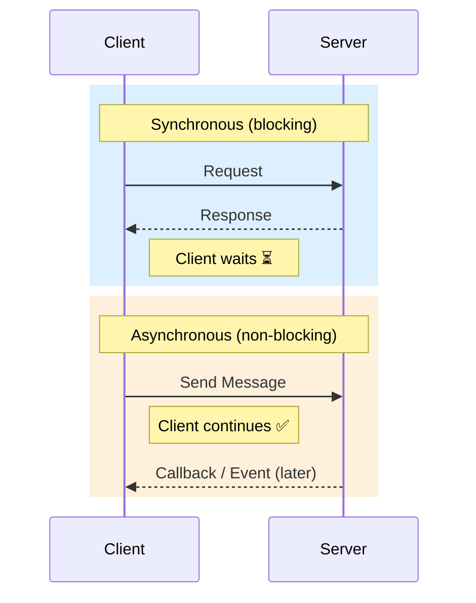
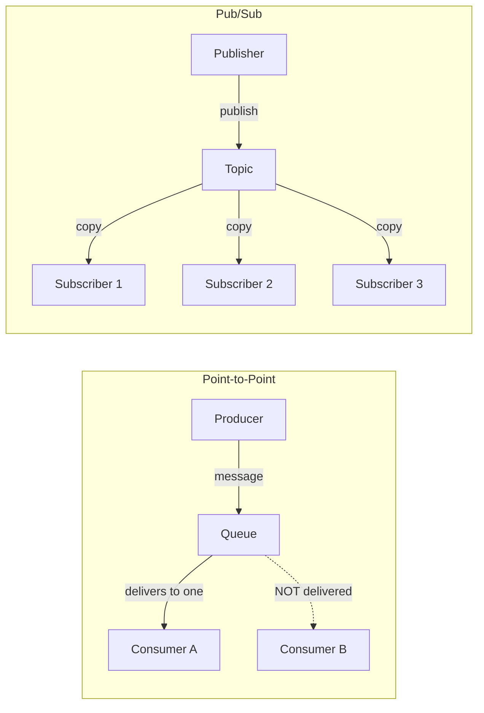

# Communication Patterns

## What You'll Learn

- Synchronous vs asynchronous communication trade-offs
- Message-based communication with brokers (Kafka, RabbitMQ, SQS)
- Message delivery semantics: at-most-once, at-least-once, exactly-once
- Event-driven architecture and event sourcing
- Protocol comparison: HTTP vs WebSocket vs gRPC

---

## 1. Synchronous vs Asynchronous Communication

### Synchronous

- Caller **waits** for the response before continuing
- **Blocking** — the thread/process is idle until a reply arrives
- **Tight coupling** — caller must know the callee's address and interface
- Example: HTTP request/response, gRPC unary call

### Asynchronous

- Caller **sends and moves on** — no waiting
- **Non-blocking** — the caller continues processing immediately
- **Loose coupling** — communication happens through an intermediary (queue/broker)
- Example: message queues (Kafka, RabbitMQ), WebSocket push, event bus

### Comparison

| Aspect | Synchronous | Asynchronous |
|---|---|---|
| **Blocking** | Yes — caller waits | No — caller continues |
| **Coupling** | Tight (direct dependency) | Loose (via broker/event) |
| **Latency** | Felt by caller (end-to-end) | Hidden from caller |
| **Complexity** | Simpler to reason about | Harder (retries, ordering, idempotency) |
| **Example** | REST API call | Kafka message, SQS queue |

### Diagram



---

## 2. Message-Based Communication

### Core Components

| Component | Role |
|---|---|
| **Producer** | Creates and sends messages |
| **Message Broker** | Receives, stores, and routes messages |
| **Consumer** | Reads and processes messages |

### Popular Brokers

| Broker | Model | Strength |
|---|---|---|
| **Kafka** | Distributed log | High throughput, replay, ordering |
| **RabbitMQ** | Traditional queue | Flexible routing, low latency |
| **SQS** | Managed queue (AWS) | Zero ops, auto-scaling |

### Patterns

#### Point-to-Point

- **One message → one consumer**
- Used for task distribution / work queues
- Multiple consumers possible, but each message is delivered to only one

#### Pub/Sub (Publish-Subscribe)

- **One message → multiple subscribers**
- Publisher sends to a topic; all subscribers receive a copy
- Used for broadcasting events (e.g., order placed → notify inventory, billing, shipping)

### Benefits

- **Decoupling** — producer and consumer don't know about each other
- **Scalability** — add more consumers to handle load
- **Fault tolerance** — broker persists messages if a consumer is down
- **Load leveling** — broker absorbs traffic spikes, consumers drain at their own pace

### Diagram



---

## 3. Message Delivery Semantics

### At-Most-Once

- **Commit offset before processing**
- If processing fails, message is **lost** (already marked as consumed)
- Fastest — no retries, no dedup
- Use when: occasional loss is acceptable (metrics, logs)

### At-Least-Once

- **Commit offset after processing**
- If commit fails after processing, message is **re-delivered** (duplicates)
- Consumer must be **idempotent** to handle duplicates safely
- Use when: data loss is unacceptable (payments, orders)

### Exactly-Once

- **Idempotent producer + transactional consumer**
- Guarantees each message is processed once and only once
- Complex to implement, some performance overhead
- Use when: financial transactions, billing

### Comparison

| Semantic | Offset Commit | Risk | Performance | Complexity |
|---|---|---|---|---|
| **At-most-once** | Before processing | Message loss | Fastest | Low |
| **At-least-once** | After processing | Duplicates | Medium | Medium |
| **Exactly-once** | Transactional | None | Slowest | High |

---

## 4. Event-Driven Architecture

- Services **react to events** rather than being called directly
- An event = "something happened" (e.g., `OrderPlaced`, `UserRegistered`)

### Benefits

| Benefit | Why |
|---|---|
| **Loose coupling** | Services don't call each other; they listen for events |
| **Scalability** | Add consumers independently |
| **Auditability** | Events create a natural audit trail |

### Event Sourcing

- Store **events as the source of truth** instead of current state
- Current state is derived by **replaying events**
- Enables full history, time-travel debugging, and rebuilding read models

```
OrderCreated → ItemAdded → ItemAdded → OrderPaid → OrderShipped
              ↓ replay all events ↓
         Current State: { status: "shipped", items: 2, paid: true }
```

---

## 5. Communication Protocol Comparison

| Aspect | HTTP (REST) | WebSocket | gRPC |
|---|---|---|---|
| **Pattern** | Request / Response | Real-time bidirectional | Service-to-service RPC |
| **Connection** | Short-lived (per request) | Persistent | Persistent (HTTP/2) |
| **Data Format** | JSON / XML (text) | Text or binary frames | Protobuf (binary) |
| **Performance** | Moderate | Good | Fast (binary + multiplexing) |
| **State** | Stateless | Stateful | Stateless per call |
| **Best For** | Public APIs, CRUD | Chat, notifications, live feeds | Microservice internals |

---

## Memory Aids

> **"Sync = phone call (wait for answer). Async = text message (send and move on)."**

> **"Point-to-Point = one letter, one recipient. Pub/Sub = newspaper to all subscribers."**

---

## Quick Recall

| Concept | One-Liner |
|---|---|
| **Sync** | Caller blocks and waits for response |
| **Async** | Caller sends and continues; broker mediates |
| **Point-to-Point** | One message → one consumer |
| **Pub/Sub** | One message → all subscribers |
| **At-most-once** | Commit first, risk loss |
| **At-least-once** | Process first, risk duplicates |
| **Exactly-once** | Idempotent + transactional, highest cost |
| **Event sourcing** | Events are the source of truth, replay to get state |
| **HTTP** | Stateless request/response, general purpose |
| **WebSocket** | Persistent bidirectional, real-time |
| **gRPC** | Binary RPC over HTTP/2, fast microservice comms |
