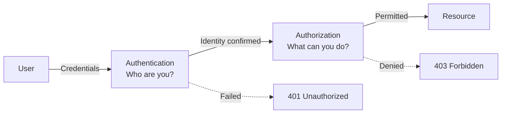
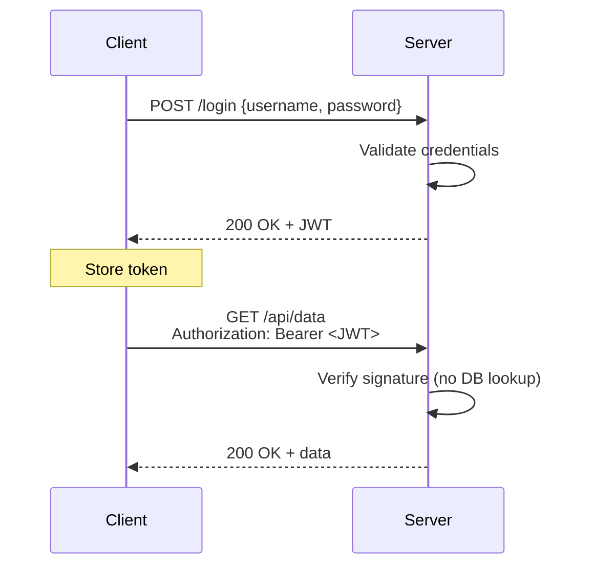
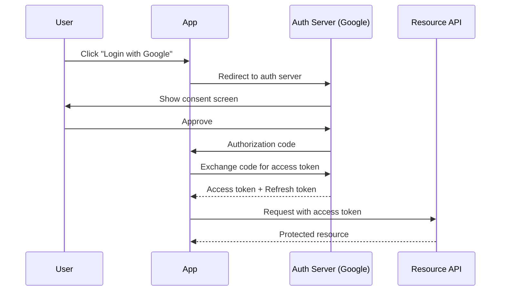
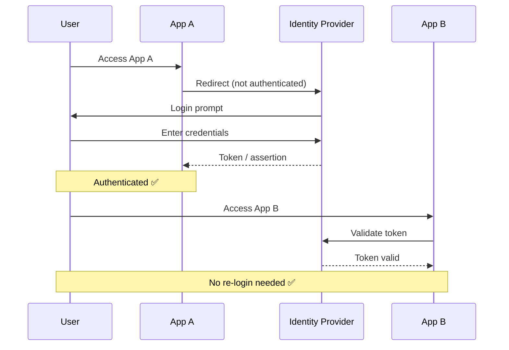
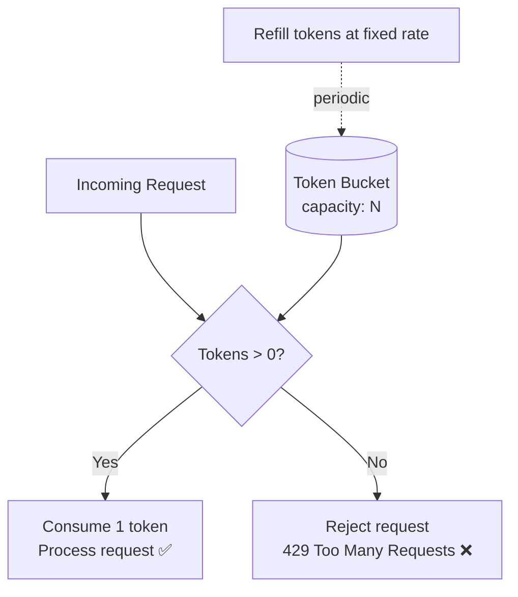

# Security & Authentication

## What You'll Learn

- Authentication vs Authorization — what each does and when it happens
- Basic Authentication and its limitations
- Token-based auth with JWT — structure, flow, and why it's stateless
- OAuth 2.0 — grant types and "Login with Google" flow
- SSO (Single Sign-On) — login once, access many apps
- JWT vs OAuth vs SAML — when to use what
- Rate limiting algorithms and response headers

---

## 1. Authentication vs Authorization

### Authentication (AuthN)

- **"Who are you?"** — verifies the user's **identity**
- Happens **first**
- Methods: password, biometrics, MFA, certificates

### Authorization (AuthZ)

- **"What can you do?"** — verifies the user's **permissions**
- Happens **after** authentication
- Methods: roles, policies, ACLs, scopes

### Comparison

| Aspect | Authentication (AuthN) | Authorization (AuthZ) |
|---|---|---|
| **What** | Identity verification | Permission verification |
| **Verifies** | Who the user is | What the user can access |
| **When** | First (before authZ) | Second (after authN) |
| **Example** | Login with username/password | Admin can delete, viewer can only read |

### Flow



---

## 2. Basic Authentication

- Credentials sent in the **HTTP Authorization header**, Base64 encoded
- Format: `Authorization: Basic base64(username:password)`
- Server decodes and validates against stored credentials on **every request**

### Drawbacks

| Issue | Why It Matters |
|---|---|
| Credentials sent every request | Increased exposure window |
| Base64 is encoding, not encryption | Anyone can decode it |
| **Requires HTTPS** | Without TLS, credentials are sent in plaintext |
| No token expiration | Credentials valid until password changes |

---

## 3. Token-Based Authentication (JWT)

### Flow

1. Client sends **login credentials**
2. Server validates and returns a **JWT**
3. Client **stores** the token (localStorage, cookie)
4. Client sends token in `Authorization: Bearer <token>` header with each request
5. Server **validates the signature** — no database lookup needed

### JWT Structure

```
Header.Payload.Signature

Header:    { "alg": "HS256", "typ": "JWT" }        → algorithm + type
Payload:   { "sub": "123", "role": "admin" }        → claims (user data)
Signature: HMACSHA256(base64(header) + "." + base64(payload), secret)
```

### Why Stateless

- The **signature** proves the token wasn't tampered with
- Server doesn't need to look up a session in a database
- Any server instance can validate the token independently → **horizontally scalable**

### Benefits

- **Stateless** — no server-side session storage
- **Scalable** — works across multiple servers without shared session store
- **Cross-domain** — can be used across different services/origins

### Sequence Diagram



---

## 4. OAuth 2.0 ("Login with Google")

### Flow

1. User clicks **"Login with Google"**
2. App redirects to **Google's auth server**
3. User **approves** access
4. Google redirects back with an **authorization code**
5. App server exchanges code for an **access token** (server-to-server)
6. App uses access token to call Google APIs on user's behalf

### Grant Types

| Grant Type | Use Case | Flow |
|---|---|---|
| **Authorization Code** | Web apps with a backend | Redirect → code → token exchange |
| **Client Credentials** | Server-to-server (no user) | App authenticates directly for a token |
| **Refresh Token** | Long-lived sessions | Exchange expired token for a new one |

### Sequence Diagram



---

## 5. SSO (Single Sign-On)

- **Login once**, access **multiple applications** without re-authenticating
- Uses **SAML** (XML-based, enterprise) or **JWT** tokens
- Central Identity Provider (IdP) manages authentication for all apps

### Flow

1. User accesses **App A**
2. App A redirects to **Identity Provider (IdP)**
3. User **authenticates once** at IdP
4. IdP returns a **token/assertion**
5. User accesses **App B** → presents same token → **no re-login needed**

### Sequence Diagram



---

## 6. JWT vs OAuth vs SAML Comparison

| Aspect | JWT | OAuth 2.0 | SAML |
|---|---|---|---|
| **What it is** | Token **format** | Authorization **framework** | XML-based auth/authz **standard** |
| **Used for** | Stateless authentication | Third-party limited access | Enterprise SSO |
| **Format** | JSON (compact) | N/A (uses JWT or opaque tokens) | XML (verbose) |
| **Best for** | APIs, microservices | "Login with Google", API access | Corporate identity federation |

> **Key distinction:** JWT is a token format. OAuth is a protocol that *can use* JWTs. SAML is a complete SSO protocol.

---

## 7. Rate Limiting

### Why Rate Limit?

- **Protect APIs** from abuse and excessive usage
- **DDoS mitigation** — limit damage from malicious traffic
- **Fair usage** — ensure all clients get equitable access

### Algorithms

#### Token Bucket

- Bucket holds tokens; tokens added at a **fixed rate**
- Each request **consumes one token**
- If bucket is empty → request **rejected**
- **Allows bursts** (up to bucket capacity)

#### Leaky Bucket

- Requests enter a queue; processed at a **fixed rate**
- If queue is full → request **rejected**
- **Smooths output** — constant drain rate regardless of input bursts
- Trade-off: adds latency due to queuing

#### Fixed Window Counter

- Count requests in a **fixed time window** (e.g., per minute)
- Reset counter at window boundary
- Simple but has **boundary burst problem** (2× limit at window edges)

#### Sliding Window Log

- Log **every request timestamp**
- Count requests in the last N seconds
- **Most accurate** but **memory heavy** (stores every timestamp)

#### Sliding Window Counter

- Approximate using **weighted counts from two adjacent windows**
- `count = (prev_window_count × overlap%) + current_window_count`
- **Best for distributed systems** — good accuracy with low memory

### Algorithm Comparison

| Algorithm | Burst Handling | Accuracy | Memory | Complexity |
|---|---|---|---|---|
| **Token Bucket** | Allows bursts | Good | Low (counter + timestamp) | Low |
| **Leaky Bucket** | Smooths output | Good | Low (queue size) | Low |
| **Fixed Window** | Boundary burst problem | Approximate | Low (counter) | Lowest |
| **Sliding Window Log** | Precise | Exact | High (all timestamps) | Medium |
| **Sliding Window Counter** | Good balance | Approximate | Low | Medium |

### Token Bucket Visualization



### Rate Limit Response Headers

| Header | Purpose | Example |
|---|---|---|
| `X-RateLimit-Limit` | Max requests allowed in window | `100` |
| `X-RateLimit-Remaining` | Requests left in current window | `47` |
| `X-RateLimit-Reset` | When the window resets (UTC epoch) | `1672531200` |
| `Retry-After` | Seconds to wait before retrying (on 429) | `30` |

---

## Memory Aids

> **"AuthN = passport check at airport. AuthZ = boarding pass check at gate."**

> **"JWT = self-contained passport (no database lookup). OAuth = valet key (limited access to your car)."**

> **"Token bucket allows bursts. Leaky bucket smooths output."**

---

## Quick Recall

| Concept | One-Liner |
|---|---|
| **AuthN** | Who are you? (identity) — happens first |
| **AuthZ** | What can you do? (permissions) — happens second |
| **Basic Auth** | Base64-encoded credentials in every request, needs HTTPS |
| **JWT** | Self-contained signed token: Header.Payload.Signature |
| **Why JWT is stateless** | Signature self-validates — no server session lookup |
| **OAuth 2.0** | Authorization framework for third-party limited access |
| **SSO** | Login once, access many apps via central IdP |
| **JWT vs OAuth** | JWT = token format; OAuth = framework that can use JWTs |
| **Token Bucket** | Tokens refill at fixed rate; allows bursts up to capacity |
| **Leaky Bucket** | Queue drains at fixed rate; smooths traffic |
| **Fixed Window** | Simple counter per time window; boundary burst issue |
| **Sliding Window** | Weighted average of two windows; best distributed trade-off |
| **429 Headers** | Limit, Remaining, Reset, Retry-After |
