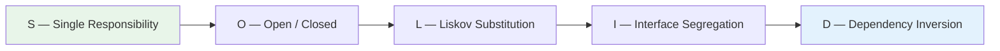
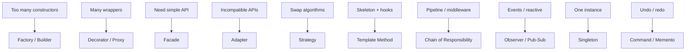

# Design Patterns (JavaScript Focus)

> Comprehensive, scannable reference to all 23 GoF patterns plus JS-native and async patterns.  
> Code examples in TypeScript/JavaScript. Optimised for interviews and quick recall.

---

## Table of Contents

1. [Why Design Patterns?](#why-design-patterns)
2. [How to Choose a Pattern](#how-to-choose-a-pattern)
3. [SOLID Principles & Friends](#solid-principles--friends)
4. [Pattern Overview](#pattern-overview)
5. [Creational Patterns (5)](#creational-patterns)
6. [Structural Patterns (7)](#structural-patterns)
7. [Behavioral Patterns (11)](#behavioral-patterns)
8. [JS-Native / Architectural Patterns](#js-native--architectural-patterns)
9. [Async & Concurrency Patterns in JS](#async--concurrency-patterns-in-js)
10. [Pattern Selection Cheatsheet](#pattern-selection-cheatsheet)
11. [Frontend vs Backend Mapping](#frontend-vs-backend-mapping)
12. [Anti-Patterns to Avoid](#anti-patterns-to-avoid)
13. [Quick Reference Table (All 23)](#quick-reference-table)

---

## Why Design Patterns?

| Benefit            | Detail                                                              |
| ------------------ | ------------------------------------------------------------------- |
| **Shared vocab**   | Name a solution and the whole team understands intent instantly      |
| **Maintainability**| Isolated concerns → smaller blast radius on change                  |
| **Testability**    | Patterns encourage interfaces & DI → easy mocking                   |
| **Extensibility**  | Open/Closed by design → add behaviour without rewriting             |

> Patterns are **tools, not goals**. Use them when complexity demands it, not preemptively.

---

## How to Choose a Pattern

1. **Identify the forces** — what varies: *creation*, *behaviour*, or *structure*?
2. **Prefer composition over inheritance.**
3. **Start simple** → refactor toward a pattern when duplication/complexity emerges.

> **Heuristic one-liner:**  
> `if/else` algorithms → **Strategy**.  
> Creation explosion → **Factory / Builder**.  
> Incompatible APIs → **Adapter**.  
> Cross-cutting at runtime → **Decorator / Proxy**.

---

## SOLID Principles & Friends

| Principle | Meaning |
| --------- | ------- |
| **S** — Single Responsibility | One class, one reason to change |
| **O** — Open / Closed | Open for extension, closed for modification |
| **L** — Liskov Substitution | Subtypes must be usable wherever their base type is expected |
| **I** — Interface Segregation | Many small, focused interfaces > one fat interface |
| **D** — Dependency Inversion | Depend on abstractions, not concretions |

**Also keep in mind:**

| Principle | Rule of Thumb |
| --------- | ------------- |
| **DRY**   | Don't Repeat Yourself — extract shared logic |
| **KISS**  | Keep It Simple, Stupid — avoid unnecessary complexity |
| **YAGNI** | You Aren't Gonna Need It — don't build features speculatively |
| **Law of Demeter** | Talk only to immediate friends (limit dot-chaining) |



---

## Pattern Overview

```mermaid
graph TD
    DP["Design Patterns"] --> Cr["Creational<br/>(object creation)"]
    DP --> St["Structural<br/>(object composition)"]
    DP --> Be["Behavioral<br/>(object interaction)"]
    Cr --> C1["Singleton"]
    Cr --> C2["Factory Method"]
    Cr --> C3["Abstract Factory"]
    Cr --> C4["Builder"]
    Cr --> C5["Prototype"]
    St --> S1["Adapter"]
    St --> S2["Bridge"]
    St --> S3["Composite"]
    St --> S4["Decorator"]
    St --> S5["Facade"]
    St --> S6["Flyweight"]
    St --> S7["Proxy"]
    Be --> B1["Chain of Resp."]
    Be --> B2["Command"]
    Be --> B3["Interpreter"]
    Be --> B4["Iterator"]
    Be --> B5["Mediator"]
    Be --> B6["Memento"]
    Be --> B7["Observer"]
    Be --> B8["State"]
    Be --> B9["Strategy"]
    Be --> B10["Template Method"]
    Be --> B11["Visitor"]
```



---

## Creational Patterns

> *Control **how** objects are created.*

### 1. Singleton

> Single instance with global access point. **Node modules are singletons by default** (module cache).

```js
// config.js — Node's require cache ensures one instance
class Config {
  constructor() {
    this.port = 3000;
    this.dbUrl = process.env.DB_URL || 'mongodb://localhost/app';
  }
}
module.exports = new Config();
```

**Use when:** shared config, connection pools, caches.  
**Trade-off:** hidden global state, complicates testing. Prefer DI in large systems.

---

### 2. Factory Method

> Defer instantiation to a function or subclass — caller doesn't know the concrete type.

```ts
interface Logger { log(msg: string): void; }

class ConsoleLogger implements Logger { log(m) { console.log(m); } }
class FileLogger    implements Logger { log(m) { /* write to file */ } }

function createLogger(env: 'dev' | 'prod'): Logger {
  return env === 'prod' ? new FileLogger() : new ConsoleLogger();
}
```

**Use when:** choose implementation at runtime; hide creation complexity.  
**Trade-off:** adds indirection; simple `new` may suffice for few variants.

---

### 3. Abstract Factory

> Create **families** of related objects without specifying concrete classes.

```ts
interface WidgetFactory {
  createButton(): Button;
  createCheckbox(): Checkbox;
}
class LightFactory implements WidgetFactory {
  createButton()   { return { render: () => '<button class="light">OK</button>' }; }
  createCheckbox() { return { render: () => '<input class="light" type="checkbox"/>' }; }
}
class DarkFactory implements WidgetFactory { /* dark variants */ }
```

**Use when:** multi-theme UI kits, database client families (Postgres vs MySQL).  
**Trade-off:** lots of small classes; overkill when only one product varies.

---

### 4. Builder

> Step-wise construction of complex objects with a fluent API.

```ts
class QueryBuilder {
  private _sel = '*'; private _tbl = ''; private _where: string[] = [];
  select(cols: string[]) { this._sel = cols.join(','); return this; }
  from(t: string)        { this._tbl = t; return this; }
  where(c: string)       { this._where.push(c); return this; }
  build() {
    return `SELECT ${this._sel} FROM ${this._tbl} WHERE ${this._where.join(' AND ')}`;
  }
}

const sql = new QueryBuilder()
  .select(['id', 'name']).from('users').where('active=1').build();
```

**Use when:** complex config/queries, HTTP request construction.  
**Trade-off:** verbose for simple objects; builder class is extra code to maintain.

---

### 5. Prototype

> Clone existing objects instead of constructing from scratch.

```js
const proto = { greet() { return `hi ${this.name}`; } };
const user = Object.assign(Object.create(proto), { name: 'Vikas' });
// user.greet() → "hi Vikas"
```

**Use when:** object cloning, avoiding expensive creation, `structuredClone()` for deep copies.  
**Trade-off:** deep vs shallow clone pitfalls; circular references need care.

---

## Structural Patterns

> *Control **how** objects are composed and related.*

### 1. Adapter

> Convert one interface to another that clients expect.

```ts
class LegacyPay { send(amount: number) { /* old API */ } }

class PaymentAdapter {
  constructor(private legacy: LegacyPay) {}
  pay(total: number) { this.legacy.send(total); } // new interface
}
```

**Use when:** integrating legacy libs, bridging browser vs server APIs.  
**Trade-off:** adds a wrapper layer; avoid when you can refactor the source.

---

### 2. Bridge

> Separate abstraction from implementation so both vary independently.

```ts
interface Renderer { drawCircle(x: number, y: number, r: number): void; }
class CanvasRenderer implements Renderer { drawCircle(x,y,r) { /* canvas */ } }
class SvgRenderer    implements Renderer { drawCircle(x,y,r) { /* SVG */ } }

class Circle {
  constructor(private renderer: Renderer, private x: number, private y: number, private r: number) {}
  draw() { this.renderer.drawCircle(this.x, this.y, this.r); }
}
```

**Use when:** rendering backends, DB drivers, cross-platform UIs.  
**Trade-off:** complexity increase for a decoupling that may not be needed early.

---

### 3. Composite

> Tree structures — treat individual objects and groups uniformly.

```ts
interface FsNode { size(): number; }
class File   implements FsNode { constructor(private bytes: number) {} size() { return this.bytes; } }
class Folder implements FsNode {
  constructor(private children: FsNode[] = []) {}
  size() { return this.children.reduce((a, c) => a + c.size(), 0); }
}
```

**Use when:** DOM, filesystem trees, React component trees, org charts.  
**Trade-off:** harder to restrict which types can be children.

---

### 4. Decorator

> Attach responsibilities dynamically without subclassing.

```ts
interface Service { handle(req: any): any; }

class BaseService implements Service {
  handle(r) { return { ok: true, data: r }; }
}
class LoggingDecorator implements Service {
  constructor(private inner: Service) {}
  handle(r) { console.time('svc'); const res = this.inner.handle(r); console.timeEnd('svc'); return res; }
}

const svc = new LoggingDecorator(new BaseService());
```

**Use when:** logging, caching, auth wrappers, React HOCs.  
**Trade-off:** many small wrappers can be hard to debug (onion peeling).

---

### 5. Facade

> Simple interface over a complex subsystem.

```ts
class VideoEncoderFacade {
  constructor(private ffmpeg: any) {}
  async encode(input: string) {
    return this.ffmpeg.run(['-i', input, '-preset', 'fast']); // hides 20 options
  }
}
```

**Use when:** simplify complex libs (FFmpeg, AWS SDK), provide team-friendly wrappers.  
**Trade-off:** can hide important configuration; may become a God Object over time.

---

### 6. Flyweight

> Share intrinsic state to support many fine-grained objects efficiently.

```js
class GlyphFactory {
  cache = new Map();
  get(ch) {
    if (!this.cache.has(ch)) this.cache.set(ch, { ch, /* font metrics */ });
    return this.cache.get(ch);
  }
}
```

**Use when:** rendering text, map markers, icon caches, game sprites.  
**Trade-off:** measure first — premature optimisation if object count is low.

---

### 7. Proxy

> Surrogate that controls access to another object.

```ts
class Api { async getUser(id: string) { return (await fetch(`/users/${id}`)).json(); } }

class CachingProxy {
  constructor(private api = new Api(), private cache = new Map<string, any>()) {}
  async getUser(id: string) {
    if (this.cache.has(id)) return this.cache.get(id);
    const data = await this.api.getUser(id);
    this.cache.set(id, data);
    return data;
  }
}
```

**Use when:** caching, lazy loading, rate limiting, access control.  
**Trade-off:** extra indirection; stale cache if TTL not managed.

---

## Behavioral Patterns

> *Control **how** objects communicate and distribute responsibility.*

### 1. Chain of Responsibility

> Pass a request along a chain of handlers; each decides to process or forward.

```ts
// Express middleware IS Chain of Responsibility
const auth     = (req, res, next) => { if (!req.headers.auth) return res.status(401).end(); next(); };
const validate = (req, res, next) => { if (!req.body)         return res.status(400).end(); next(); };
const handler  = (req, res)       => res.json({ ok: true });

app.post('/api', auth, validate, handler);
```

**Use when:** Express/Koa middleware, validation pipelines.  
**Trade-off:** request may fall through silently if no handler matches.

---

### 2. Command

> Encapsulate a request as an object — supports undo, redo, and queuing.

```ts
interface Command { execute(): void; undo(): void; }

class AddTodo implements Command {
  constructor(private store: string[], private text: string) {}
  execute() { this.store.push(this.text); }
  undo()    { this.store.pop(); }
}

class Invoker {
  private history: Command[] = [];
  run(c: Command)  { c.execute(); this.history.push(c); }
  undo()           { this.history.pop()?.undo(); }
}
```

**Use when:** undo/redo, job queues (BullMQ), macro recording.  
**Trade-off:** class-per-command can bloat; consider lambda commands for simple cases.

---

### 3. Interpreter

> Define a grammar and build an interpreter to evaluate sentences.

```ts
// Tiny filter: "status:open AND tag:bug"
// Tokenize → parse AST → evaluate(item)
// Real-world: search filters, rules engines, template engines
```

**Use when:** search query parsers, rules/policy engines, DSLs.  
**Trade-off:** complex grammars → use a proper parser generator instead.

---

### 4. Iterator

> Sequential access to elements without exposing internals.

```ts
async function* paginate(fetchPage: (cursor?: string) => Promise<{ items: any[]; next?: string }>) {
  let cursor: string | undefined;
  do {
    const page = await fetchPage(cursor);
    yield* page.items;
    cursor = page.next;
  } while (cursor);
}

for await (const user of paginate(fetchUsers)) { /* process one at a time */ }
```

**Use when:** generators, async pagination, lazy sequences.  
**Trade-off:** overhead of generator machinery for small collections.

---

### 5. Mediator

> Central object that encapsulates how a set of peers interact.

```ts
class ChatRoom {
  private users = new Set<{ name: string; receive(msg: string): void }>();
  join(user: typeof this.users extends Set<infer U> ? U : never) { this.users.add(user); }
  broadcast(from: string, msg: string) {
    for (const u of this.users) if (u.name !== from) u.receive(msg);
  }
}
```

**Use when:** chat rooms, CQRS event buses, complex form inter-field validation.  
**Trade-off:** mediator can become a God Object if responsibilities aren't bounded.

---

### 6. Memento

> Capture and restore an object's internal state without violating encapsulation.

```ts
class Editor {
  constructor(public text = '') {}
  save(): string        { return this.text; }        // memento = snapshot
  restore(snap: string) { this.text = snap; }
}

const editor = new Editor('hello');
const snap = editor.save();
editor.text = 'changed';
editor.restore(snap); // back to 'hello'
```

**Use when:** undo, form snapshots, time-travel debugging.  
**Trade-off:** memory cost of storing snapshots; use structural sharing for large state.

---

### 7. Observer

> One-to-many dependency: when one object changes, all dependents are notified.

```ts
class Observable<T> {
  private subs = new Set<(v: T) => void>();
  subscribe(fn: (v: T) => void) { this.subs.add(fn); return () => this.subs.delete(fn); }
  next(v: T) { this.subs.forEach(fn => fn(v)); }
}

const obs = new Observable<number>();
const unsub = obs.subscribe(v => console.log(v));
obs.next(42); // logs 42
unsub();
```

**Use when:** RxJS streams, `EventEmitter`, React/Angular state subscriptions.  
**Trade-off:** memory leaks if subscribers aren't cleaned up; ordering can surprise.

---

### 8. State

> Object's behaviour changes when its internal state changes — looks like the class changed.

```ts
type Status = 'created' | 'paid' | 'shipped' | 'delivered';
class Order {
  constructor(public status: Status = 'created') {}
  pay()     { if (this.status !== 'created') throw Error('Invalid'); this.status = 'paid'; }
  ship()    { if (this.status !== 'paid')    throw Error('Invalid'); this.status = 'shipped'; }
  deliver() { if (this.status !== 'shipped') throw Error('Invalid'); this.status = 'delivered'; }
}
```

**Use when:** order lifecycles, traffic lights, wizard/stepper UIs.  
**Trade-off:** many state classes for complex machines; consider a state-machine lib (XState).

---

### 9. Strategy

> Family of interchangeable algorithms selected at runtime.

```ts
const strategies = {
  quick:   (a: number[]) => [...a].sort(),
  numeric: (a: number[]) => [...a].sort((x, y) => x - y),
  reverse: (a: number[]) => [...a].sort((x, y) => y - x),
};

function sortArray(arr: number[], mode: keyof typeof strategies = 'quick') {
  return strategies[mode](arr);
}
```

**Use when:** pricing rules, sorting/filtering logic, validation strategies.  
**Trade-off:** client must know which strategy to pick; can combine with Factory.

---

### 10. Template Method

> Define the skeleton of an algorithm; subclasses fill in specific steps.

```ts
abstract class Job {
  async run() { await this.before(); await this.execute(); await this.after(); }
  protected async before() { /* default no-op hook */ }
  protected async after()  { /* default no-op hook */ }
  protected abstract execute(): Promise<void>;
}

class ImportJob extends Job {
  protected async execute() { /* read CSV → validate → upsert */ }
  protected async after()   { console.log('Import complete'); }
}
```

**Use when:** ETL pipelines, test frameworks (setup/teardown), build steps.  
**Trade-off:** inheritance-based; consider Strategy if you want runtime swapping.

---

### 11. Visitor

> Add new operations over an existing object structure without modifying the classes.

```ts
interface ASTNode { accept(v: Visitor): void; }
class NumNode implements ASTNode {
  constructor(public val: number) {}
  accept(v: Visitor) { v.visitNum(this); }
}
class StrNode implements ASTNode {
  constructor(public val: string) {}
  accept(v: Visitor) { v.visitStr(this); }
}
interface Visitor { visitNum(n: NumNode): void; visitStr(n: StrNode): void; }

class PrintVisitor implements Visitor {
  visitNum(n: NumNode) { console.log('Number:', n.val); }
  visitStr(n: StrNode) { console.log('String:', n.val); }
}
```

**Use when:** AST traversals, compilers, serialisers over complex structures.  
**Trade-off:** adding new node types forces changes to every visitor.

---

## JS-Native / Architectural Patterns

### Module & Revealing Module (IIFE)

```js
const cart = (function () {
  const items = [];                              // private
  function add(i) { items.push(i); }
  function total() { return items.reduce((a, c) => a + c.price, 0); }
  return { add, total };                         // reveal public API only
})();
```

> ES modules (`import/export`) have largely replaced IIFEs, but the *principle* (expose minimal API) still applies.

### Pub/Sub vs Observer

| Aspect | Observer | Pub/Sub |
| ------ | -------- | ------- |
| Coupling | Subject holds subscribers directly | Broker/bus mediates — publishers & subscribers decoupled |
| Example | `Observable.subscribe(fn)` | `EventEmitter.on('topic', fn)`, Kafka, NATS |
| Scale | In-process | Can span processes / services |

### MVC / MVP / MVVM

| Pattern | JS Example | Note |
| ------- | ---------- | ---- |
| **MVC** | Express (Controller → Service → View) | Classic server-side |
| **MVVM** | Angular (Component ↔ Template via bindings) | Two-way data binding |
| **MVP** | React (Presenter hooks feed dumb views) | Unidirectional data flow |

> **Rule:** keep controllers/presenters **thin** — push logic into services.

### Dependency Injection

- **Angular**: DI built-in (`@Injectable`, providers).
- **Node**: use **InversifyJS** or **TSyringe** containers.
- **Benefit**: swap implementations for testing without touching business logic.

### Middleware Pipeline

Express / Koa / Axios interceptors = **Chain of Responsibility** for cross-cutting concerns (auth, logging, rate-limits, error handling).

### Reactor / Event Loop

Node's **event loop + non-blocking I/O** is the Reactor pattern:
- Single thread dispatches events to handlers (callbacks / promises / async).
- Use **Streams** for backpressure when data arrives faster than you can process.

---

## Async & Concurrency Patterns in JS

| Pattern | Purpose |
| ------- | ------- |
| **Promises & async/await** | Structure async flows, avoid callback hell |
| **Promise.all** | Run independent tasks in parallel, fail-fast on first rejection |
| **Promise.allSettled** | Run all tasks, collect successes *and* failures |
| **Promise.race** | First to settle wins (timeouts, fallbacks) |
| **Queues / Workers** (BullMQ, RabbitMQ) | Offload heavy work → **Command** pattern as jobs |
| **Streams** | Backpressure-aware data processing (file I/O, HTTP bodies) |
| **Circuit Breaker** | Stop calling a failing service after threshold; auto-reset after cooldown |
| **Retry with Jitter** | Exponential back-off + random jitter to avoid thundering herd |
| **Bulkhead** | Isolate resources (thread pools, connection pools) to contain failures |
| **Timeout** | Abort if response exceeds deadline; combine with `AbortController` |

---

## Pattern Selection Cheatsheet

| Symptom | Pattern |
| ------- | ------- |
| Too many constructors / flag combos | **Factory** / **Builder** |
| Many wrappers adding features | **Decorator** / **Proxy** |
| Need a simplified API over complex subsystem | **Facade** |
| Incompatible interfaces | **Adapter** |
| Swap algorithms at runtime | **Strategy** |
| Fixed algorithm skeleton + customisable hooks | **Template Method** |
| Pipeline with early exit (middleware) | **Chain of Responsibility** |
| Reactive UI / events | **Observer** / **Pub-Sub** |
| One shared instance required | **Singleton** |
| Undo / redo capability | **Command** / **Memento** |



---

## Frontend vs Backend Mapping

### Frontend (React / Angular)

| Concern | Pattern |
| ------- | ------- |
| Sorting / filtering logic | **Strategy** |
| Reactive streams | **Observer** (RxJS, Signals) |
| Multi-step wizards | **State** |
| Cross-cutting (auth, logging) | **Decorator** (HOCs, middleware hooks) |
| Component trees | **Composite** (inherent in JSX/templates) |
| REST/GraphQL client wrappers | **Facade** |

### Backend (Node / Microservices)

| Concern | Pattern |
| ------- | ------- |
| Middleware (Express, Koa) | **Chain of Responsibility** |
| Caching / rate-limiting | **Proxy** |
| Resilience (retries, circuit breaking) | **Circuit Breaker** / **Retry** |
| Background jobs | **Command** (BullMQ queues) |
| Query construction | **Builder** |
| Swapping providers (S3/GCS, Stripe/Razorpay) | **Adapter** |

---

## Anti-Patterns to Avoid

| Anti-Pattern | Problem | Fix |
| ------------ | ------- | --- |
| **God Object / Manager** | One class does everything | Split by SRP → Facade + services |
| **Singleton Abuse** | Hidden coupling, untestable | Use DI; inject dependencies explicitly |
| **Primitive Obsession** | Strings/numbers for domain concepts | Use **Value Objects** / branded types |
| **Excessive Inheritance** | Deep hierarchies, fragile base class | Prefer **composition** (Decorator, Strategy) |
| **Shotgun Surgery** | One change ripples across many files | Improve cohesion → Facade / Builder / Strategy |

---

## Quick Reference Table

| Category | Pattern | When to Use |
| -------- | ------- | ----------- |
| Creational | **Singleton** | One shared instance — config, connection pool |
| Creational | **Factory Method** | Choose concrete class at runtime |
| Creational | **Abstract Factory** | Families of related objects (themes, DB clients) |
| Creational | **Builder** | Complex step-wise construction (queries, configs) |
| Creational | **Prototype** | Clone existing objects; expensive creation |
| Structural | **Adapter** | Incompatible interfaces; legacy integration |
| Structural | **Bridge** | Vary abstraction & implementation independently |
| Structural | **Composite** | Tree structures (DOM, filesystem, component trees) |
| Structural | **Decorator** | Add responsibilities at runtime without subclassing |
| Structural | **Facade** | Simplify complex subsystems behind one API |
| Structural | **Flyweight** | Large number of similar objects sharing state |
| Structural | **Proxy** | Controlled access — caching, auth, lazy loading |
| Behavioral | **Chain of Responsibility** | Pipeline processing / middleware |
| Behavioral | **Command** | Encapsulate requests; undo/redo; job queues |
| Behavioral | **Interpreter** | Parse mini-languages, filters, rules |
| Behavioral | **Iterator** | Traverse collections without exposing internals |
| Behavioral | **Mediator** | Centralise complex object interactions |
| Behavioral | **Memento** | Snapshots / undo / time-travel |
| Behavioral | **Observer** | Event-driven / reactive notification |
| Behavioral | **State** | Behaviour changes with internal state (lifecycles) |
| Behavioral | **Strategy** | Switchable algorithms at runtime |
| Behavioral | **Template Method** | Algorithm skeleton with overridable hooks |
| Behavioral | **Visitor** | New operations over existing structure without modifying it |

---

> **Remember:** Start simple. When change pressure appears in a specific area (creation / structure / behaviour), refactor *just that hotspot* toward the right pattern.
