# 09 — Case Studies & System Design Questions

> The most commonly asked system design interview questions for senior engineers (10+ years). Each case study is self-contained with architecture diagrams, key decision tables, and follow-up questions to prepare for. Use this as a revision & reference guide.

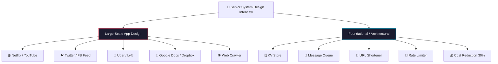
```mermaid
graph TD
    Q["🎯 Senior System Design Interview"] --> L["Large-Scale App Design"]
    Q --> F["Foundational / Architectural"]

    L --> L1["🎬 Netflix / YouTube"]
    L --> L2["🐦 Twitter / FB Feed"]
    L --> L3["🚗 Uber / Lyft"]
    L --> L4["📝 Google Docs / Dropbox"]
    L --> L5["🕷️ Web Crawler"]

    F --> F1["🗄️ KV Store"]
    F --> F2["📨 Message Queue"]
    F --> F3["🔗 URL Shortener"]
    F --> F4["🚦 Rate Limiter"]
    F --> F5["💰 Cost Reduction 30%"]

    style L fill:#1b1b2f,stroke:#e94560,color:#fff
    style F fill:#1b1b2f,stroke:#00b4d8,color:#fff
```

---

## Case Study 1 — URL Shortener (TinyURL / bit.ly)

### Requirements

**Functional:**
- Convert long URL → short URL (e.g., `bit.ly/aB3kX`)
- Redirect short → long URL (< 10ms p99)
- Support custom aliases
- Track click analytics

**Scale:** 100M URLs/day write · 10B reads/day · **100:1 read:write ratio**

### Architecture

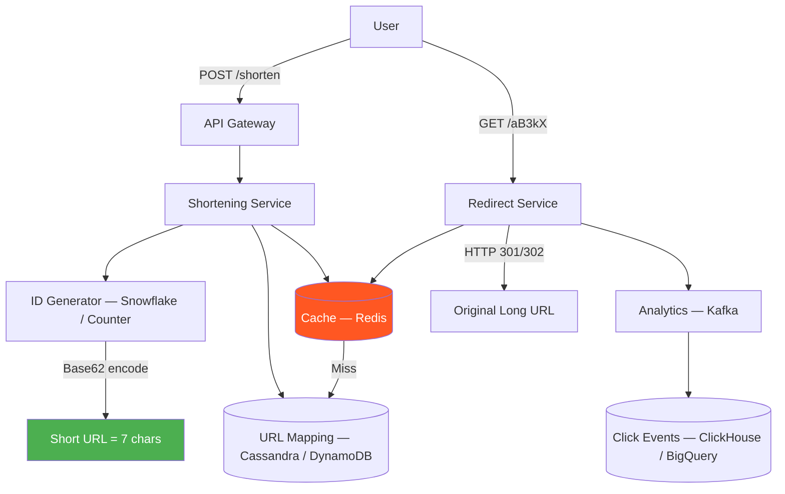
```mermaid
graph TD
    User -->|"POST /shorten"| API[API Gateway]
    API --> SS[Shortening Service]
    SS --> IDGen[ID Generator — Snowflake / Counter]
    IDGen -->|Base62 encode| ShortURL["Short URL = 7 chars"]
    SS --> DB[("URL Mapping — Cassandra / DynamoDB")]
    SS --> Cache[("Cache — Redis")]

    User -->|"GET /aB3kX"| Redirect[Redirect Service]
    Redirect --> Cache
    Cache -->|Miss| DB
    Redirect -->|"HTTP 301/302"| LongURL[Original Long URL]

    Redirect --> Analytics[Analytics — Kafka]
    Analytics --> ClickStore[("Click Events — ClickHouse / BigQuery")]

    style Cache fill:#FF5722,color:#fff
    style ShortURL fill:#4CAF50,color:#fff
```

### ID Generation

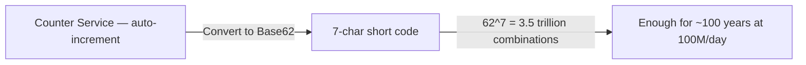
```mermaid
flowchart LR
    A[Counter Service — auto-increment] -->|Convert to Base62| B[7-char short code]
    B -->|"62^7 = 3.5 trillion combinations"| C["Enough for ~100 years at 100M/day"]
```

> **Base62** = a-z, A-Z, 0-9. 7 characters = 62⁷ ≈ **3.5 trillion** unique codes.

### 301 vs 302 Redirect

| Code | Type | Browser Behavior | Analytics | Server Load |
|------|------|------------------|-----------|-------------|
| **301** | Permanent | Caches redirect locally | Hard to track (bypasses server) | Lower |
| **302** ✅ | Temporary | Hits server every time | Accurate click tracking | Higher |

> Use **302** when analytics matter (most cases). Use **301** only for permanent, static mappings.

### Caching Strategy

- Cache **top 20%** most-accessed URLs (Pareto principle)
- TTL = 24 hours
- Redis with **LRU** eviction
- Cache-aside pattern: check cache → miss → read DB → populate cache

### Key Decisions

| Concern | Decision | Rationale |
|---------|----------|-----------|
| ID generation | Snowflake / Counter + Base62 | Globally unique, no coordination, compact |
| Database | Cassandra / DynamoDB | Write-heavy, horizontally scalable, simple KV access |
| Cache | Redis LRU, top 20% | 100:1 read-write → huge cache hit benefit |
| Redirect code | 302 Temporary | Enables accurate analytics |
| Analytics | Kafka → ClickHouse | Async ingestion, columnar OLAP for time-series queries |
| Custom aliases | Check uniqueness before insert | Use DB conditional write (IF NOT EXISTS) |

### Follow-up Questions

- How do you handle hash collisions?
- How do you expire / delete short URLs?
- How would you prevent abuse (spam URLs)?
- How do you scale the counter service across data centers?

---

## Case Study 2 — Video Streaming (Netflix / YouTube)

### Requirements

**Functional:**
- Upload, transcode, and store videos
- Stream with adaptive bitrate
- Search and recommendations
- Watch history

**Non-Functional:**
- 99.99% availability for playback
- < 2s video start time
- 200M+ global users

### Architecture

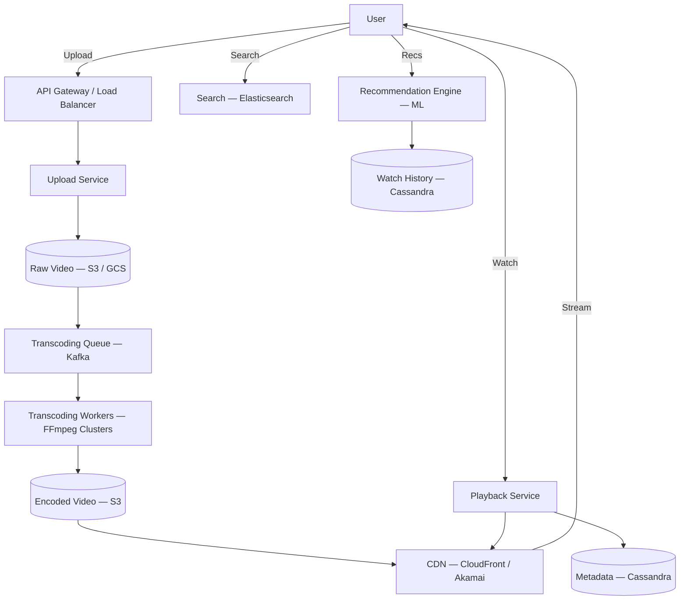
```mermaid
graph TD
    User -->|Upload| API_GW[API Gateway / Load Balancer]
    API_GW --> UService[Upload Service]
    UService --> RawStore[("Raw Video — S3 / GCS")]
    RawStore --> TQ[Transcoding Queue — Kafka]
    TQ --> Workers[Transcoding Workers — FFmpeg Clusters]
    Workers --> CDN_Store[("Encoded Video — S3")]
    CDN_Store --> CDN[CDN — CloudFront / Akamai]
    CDN -->|Stream| User

    User -->|Watch| Playback[Playback Service]
    Playback --> MetaDB[("Metadata — Cassandra")]
    Playback --> CDN

    User -->|Search| Search[Search — Elasticsearch]
    User -->|Recs| Rec[Recommendation Engine — ML]
    Rec --> WatchHistory[("Watch History — Cassandra")]
```

### Transcoding Pipeline

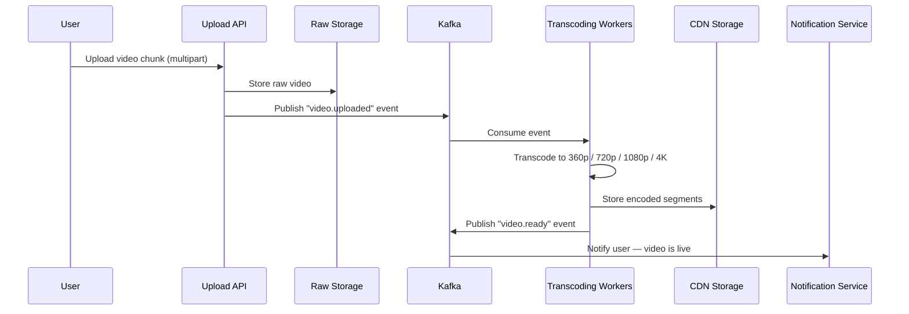
```mermaid
sequenceDiagram
    participant U as User
    participant API as Upload API
    participant S3 as Raw Storage
    participant K as Kafka
    participant W as Transcoding Workers
    participant CS as CDN Storage
    participant N as Notification Service

    U->>API: Upload video chunk (multipart)
    API->>S3: Store raw video
    API->>K: Publish "video.uploaded" event
    K->>W: Consume event
    W->>W: Transcode to 360p / 720p / 1080p / 4K
    W->>CS: Store encoded segments
    W->>K: Publish "video.ready" event
    K->>N: Notify user — video is live
```

### Key Decisions

| Concern | Decision | Rationale |
|---------|----------|-----------|
| Video storage | S3 / GCS | Cost-effective object storage, 11 nines durability |
| Transcoding | Async Kafka + worker pool | Decoupled, horizontally scalable, no blocking |
| Streaming | Adaptive Bitrate (HLS / DASH) | Adjusts quality to network conditions in real-time |
| Metadata DB | Cassandra | Write-heavy, wide-column, time-series friendly |
| Global delivery | CDN (multi-region) | Reduces latency, offloads origin servers |
| Recommendations | Spark + ML pipelines | Offline batch processing, models updated daily |

### Celebrity / Viral Video Problem

- **Pre-warm CDN cache** for trending or newly published content
- **Predictive caching** based on social signals (shares, pre-release hype)
- **Origin shield** — intermediate cache layer between CDN edge and origin to prevent thundering herd

### Follow-up Questions

- How do you handle live streaming vs on-demand?
- How do you manage DRM / content protection?
- How would you design the recommendation pipeline in detail?
- What happens when a CDN edge node goes down mid-stream?

---

## Case Study 3 — Twitter / Facebook News Feed

### Core Problem

When User A posts a tweet, how do all of A's followers see it in their feed?

### Three Approaches

| Strategy | How It Works | Pros | Cons |
|----------|-------------|------|------|
| **Fan-out on Write** (Push) | On post, write to all followers' feed caches | Fast reads — feed pre-built | Expensive writes for celebrities (50M followers) |
| **Fan-out on Read** (Pull) | On feed load, query all followees' timelines and merge | No write amplification | Slow reads, high DB load at read time |
| **Hybrid** ✅ | Push for normal users, pull for celebrities | Balanced performance | More complex routing logic |

### Architecture

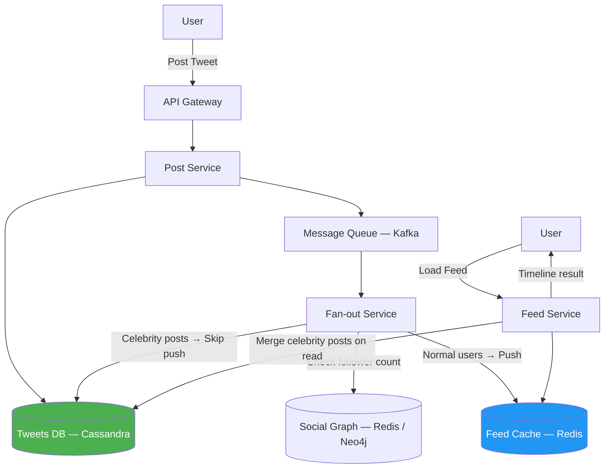
```mermaid
graph TD
    User -->|Post Tweet| API[API Gateway]
    API --> PS[Post Service]
    PS --> TDB[("Tweets DB — Cassandra")]
    PS --> MQ[Message Queue — Kafka]

    MQ --> FanOut[Fan-out Service]
    FanOut -->|Check follower count| UserGraph[("Social Graph — Redis / Neo4j")]
    FanOut -->|"Normal users → Push"| FeedCache[("Feed Cache — Redis")]
    FanOut -->|"Celebrity posts → Skip push"| TDB

    ReadUser[User] -->|Load Feed| FS[Feed Service]
    FS --> FeedCache
    FS -->|Merge celebrity posts on read| TDB
    FS -->|Timeline result| ReadUser

    style FeedCache fill:#2196F3,color:#fff
    style TDB fill:#4CAF50,color:#fff
```

### Celebrity Problem Solution

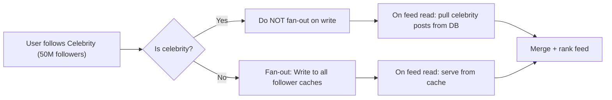
```mermaid
flowchart LR
    A["User follows Celebrity (50M followers)"] --> B{Is celebrity?}
    B -->|Yes| C[Do NOT fan-out on write]
    B -->|No| D[Fan-out: Write to all follower caches]
    C --> E[On feed read: pull celebrity posts from DB]
    D --> F[On feed read: serve from cache]
    E --> G[Merge + rank feed]
    F --> G
```

> **Threshold:** If follower count > ~10K, treat as celebrity → pull path.

### Feed Ranking

```
Score = relevance_score × recency_decay × engagement_score
```

- **relevance_score** — ML model based on user interests, interaction history
- **recency_decay** — exponential decay over time (newer = higher)
- **engagement_score** — likes, retweets, comments normalized
- Computed **offline** by ML pipelines, applied at **read time**

### Key Decisions

| Concern | Decision | Rationale |
|---------|----------|-----------|
| Fan-out | Hybrid (push + pull) | Balances write cost and read latency |
| Celebrity threshold | ~10K followers | Avoids write amplification for popular accounts |
| Feed storage | Redis sorted sets | O(log N) insert, O(K) range query for top-K feed |
| Social graph | Redis / Neo4j | Fast adjacency queries for follower lookup |
| Ranking | ML offline + apply at read | Keeps read path fast, models updated hourly |

### Follow-up Questions

- How do you handle feed pagination (infinite scroll)?
- How do you handle deletes / edits propagating to cached feeds?
- How would you add "trending topics"?
- How do you prevent spam / bot posts from flooding feeds?

---

## Case Study 4 — Ride-Sharing (Uber / Lyft)

### Key Challenges

1. Ingest location pings from **millions of drivers every 4–5 seconds**
2. Match rider to **nearest available driver** efficiently
3. **Surge pricing** based on supply/demand
4. **Reliability** — no lost rides

### Architecture

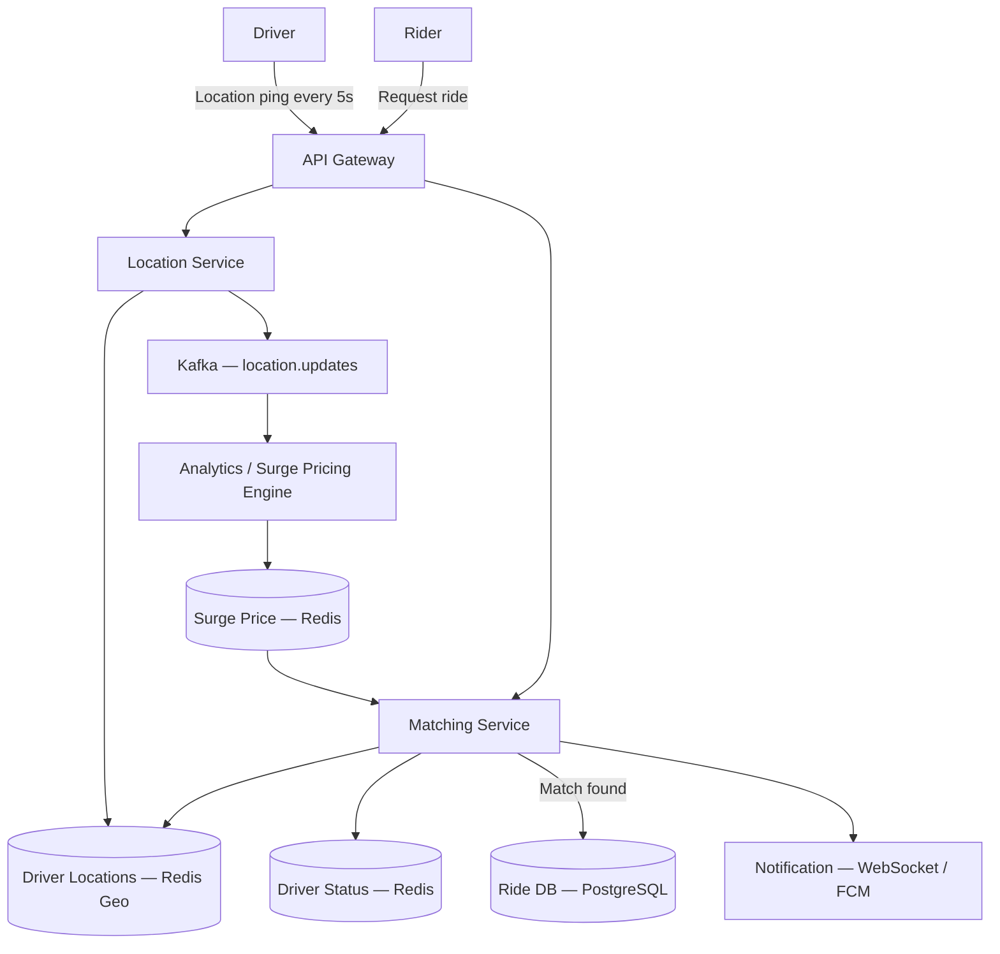
```mermaid
graph TD
    Driver -->|"Location ping every 5s"| API[API Gateway]
    Rider -->|Request ride| API

    API --> LS[Location Service]
    LS --> LocStore[("Driver Locations — Redis Geo")]
    LS --> KafkaLoc[Kafka — location.updates]

    API --> MS[Matching Service]
    MS --> LocStore
    MS --> DriverStatus[("Driver Status — Redis")]
    MS -->|Match found| RideDB[("Ride DB — PostgreSQL")]
    MS --> NotifSvc[Notification — WebSocket / FCM]

    KafkaLoc --> Analytics[Analytics / Surge Pricing Engine]
    Analytics --> PriceCache[("Surge Price — Redis")]
    PriceCache --> MS
```

### Location Indexing — Geohash

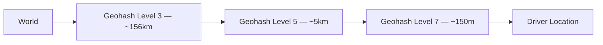
```mermaid
graph LR
    World --> Region["Geohash Level 3 — ~156km"]
    Region --> City["Geohash Level 5 — ~5km"]
    City --> Block["Geohash Level 7 — ~150m"]
    Block --> Driver[Driver Location]
```

> **Geohash** encodes lat/long into a short string. Nearby locations share a common prefix → enables **O(1) range queries**. Always query the target cell **+ 8 neighbors** to avoid boundary-edge misses.

| Level | Cell Size | Use Case |
|-------|-----------|----------|
| 3 | ~156 km | Country / region |
| 5 | ~5 km | City zone |
| 7 | ~150 m | City block |

### Matching Algorithm

```
1. Get rider's geohash cell
2. Query Redis GEO for drivers within radius (e.g., 2 km)
3. Filter by driver_status = available
4. Score by distance + driver rating
5. Lock selected driver (optimistic lock / Redis distributed lock)
6. Notify driver via WebSocket → accept/reject within 15s
7. On timeout → next best driver
```

### Surge Pricing

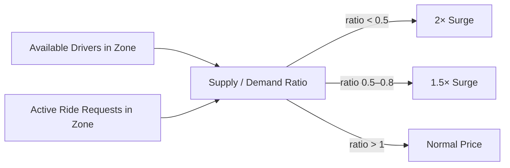
```mermaid
graph LR
    Supply[Available Drivers in Zone] --> Ratio[Supply / Demand Ratio]
    Demand[Active Ride Requests in Zone] --> Ratio
    Ratio -->|"ratio < 0.5"| Surge2x["2× Surge"]
    Ratio -->|"ratio 0.5–0.8"| Surge1_5x["1.5× Surge"]
    Ratio -->|"ratio > 1"| Normal[Normal Price]
```

### Key Decisions

| Concern | Decision | Rationale |
|---------|----------|-----------|
| Location storage | Redis Geo (GEOADD / GEORADIUS) | In-memory, sub-ms geo queries |
| Location ingestion | Kafka stream | Decouple ingestion from processing, replay-able |
| Matching | Geohash + radius search + scoring | Fast nearest-neighbor, tunable radius |
| Ride state | PostgreSQL with ACID | Financial transactions need strong consistency |
| Surge | Real-time supply/demand per zone | Adjusts every 1–2 minutes |
| Notifications | WebSocket + FCM fallback | Real-time push to driver/rider |

### Follow-up Questions

- How do you handle driver going offline mid-ride?
- How do you prevent double-dispatch (two riders get same driver)?
- How would you add ride pooling (shared rides)?
- How do you estimate ETA accurately?

---

## Case Study 5 — Google Docs / Dropbox

Two distinct sub-problems under the "collaborative document" umbrella.

---

### 5A — Google Docs (Real-Time Collaborative Editing)

**Core challenge:** Two users edit the same document simultaneously — merge changes without conflict or data loss.

#### Operational Transformation (OT)

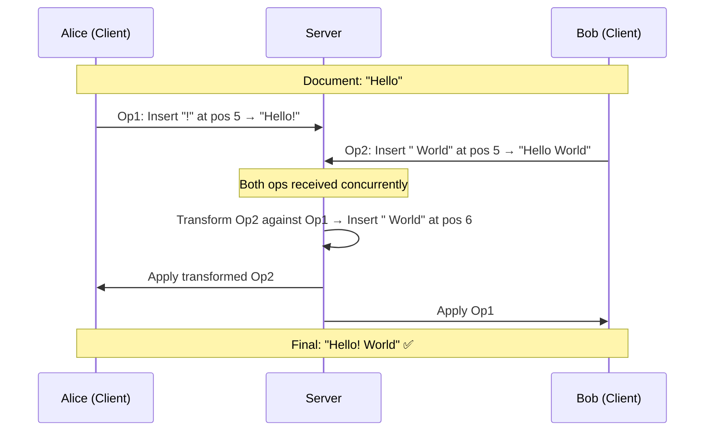
```mermaid
sequenceDiagram
    participant A as Alice (Client)
    participant S as Server
    participant B as Bob (Client)

    Note over A,B: Document: "Hello"
    A->>S: Op1: Insert "!" at pos 5 → "Hello!"
    B->>S: Op2: Insert " World" at pos 5 → "Hello World"
    Note over S: Both ops received concurrently
    S->>S: Transform Op2 against Op1 → Insert " World" at pos 6
    S->>A: Apply transformed Op2
    S->>B: Apply Op1
    Note over A,B: Final: "Hello! World" ✅
```

> **OT** transforms concurrent operations so the final document state is consistent across all clients regardless of operation arrival order.

#### Architecture

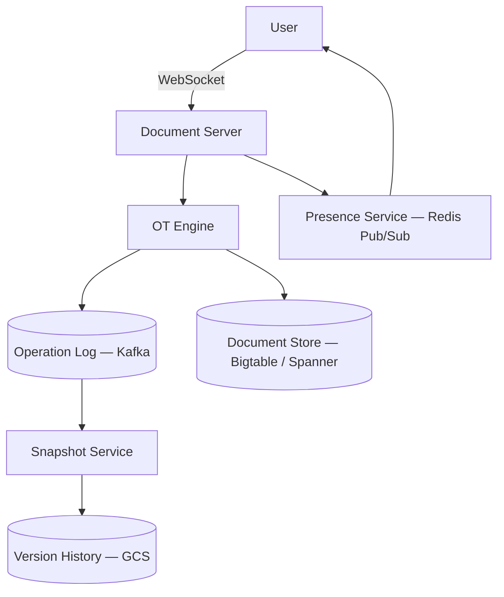
```mermaid
graph TD
    User -->|WebSocket| DocServer[Document Server]
    DocServer --> OT[OT Engine]
    OT --> OpLog[("Operation Log — Kafka")]
    OT --> DocStore[("Document Store — Bigtable / Spanner")]
    OpLog --> Snapshot[Snapshot Service]
    Snapshot --> VersionDB[("Version History — GCS")]
    DocServer --> PresenceSvc[Presence Service — Redis Pub/Sub]
    PresenceSvc --> User
```

#### Key Decisions

| Concern | Decision | Rationale |
|---------|----------|-----------|
| Conflict resolution | OT (Operational Transformation) | Industry-proven (Google Docs uses it), handles concurrent edits |
| Transport | WebSocket | Full-duplex, low-latency for real-time ops |
| Op persistence | Kafka append-only log | Durable, ordered, replay-able operation history |
| Document store | Bigtable / Spanner | Strongly consistent, handles large docs |
| Presence | Redis Pub/Sub | Low-latency cursor/selection broadcasting |
| Versioning | Periodic snapshots + op log | Efficient point-in-time recovery |

---

### 5B — Dropbox (File Sync)

#### Architecture

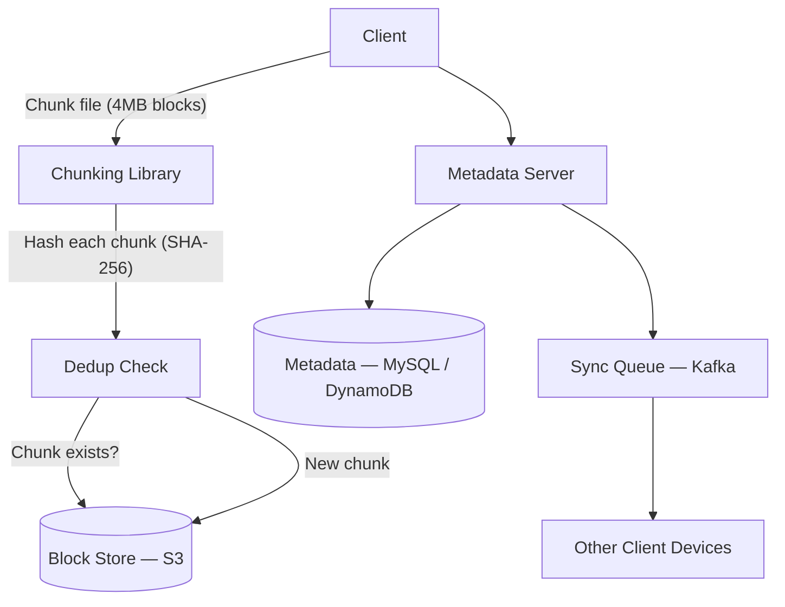
```mermaid
graph TD
    Client -->|"Chunk file (4MB blocks)"| Chunker[Chunking Library]
    Chunker -->|"Hash each chunk (SHA-256)"| Dedup[Dedup Check]
    Dedup -->|Chunk exists?| BlockStore[("Block Store — S3")]
    Dedup -->|New chunk| BlockStore
    Client --> MetaServer[Metadata Server]
    MetaServer --> MetaDB[("Metadata — MySQL / DynamoDB")]
    MetaServer --> SyncQueue[Sync Queue — Kafka]
    SyncQueue --> OtherDevices[Other Client Devices]
```

#### Chunking Strategy

- Split files into **4MB blocks** using **content-defined chunking** (Rabin fingerprinting)
- Store mapping: `block_hash → block_content`
- On edit, only upload **changed blocks** (delta sync)
- Result: **~70% bandwidth reduction** for typical edits

> **Rabin fingerprinting** finds natural split points based on content, so inserting a byte at the start doesn't re-chunk the entire file (unlike fixed-offset chunking).

#### DB Schema

```
users:    user_id | email | storage_quota | created_at
files:    file_id | user_id | file_name | file_path | version | size | updated_at
blocks:   block_id | file_id | block_order | block_hash | block_size
shares:   share_id | file_id | shared_with_user_id | permission | created_at
```

#### Key Decisions

| Concern | Decision | Rationale |
|---------|----------|-----------|
| Chunking | Content-defined (Rabin) at 4MB | Edit-resilient boundaries, dedup-friendly |
| Block storage | S3 | Cheap, durable (11 nines), scalable |
| Dedup | SHA-256 hash comparison | Eliminates duplicate block uploads across all users |
| Sync | Kafka event queue | Reliable delivery to all registered devices |
| Metadata | MySQL / DynamoDB | Transactional for file tree operations |
| Conflict | Last-writer-wins + conflict copy | Simple, predictable, user resolves manually |

### Follow-up Questions

- How do you handle offline edits that conflict on reconnect?
- How would you implement "undo" in Google Docs?
- How does Dropbox handle large files (10GB+)?
- How do you ensure consistency between metadata and block storage?

---

## Case Study 6 — Distributed Web Crawler

### Architecture

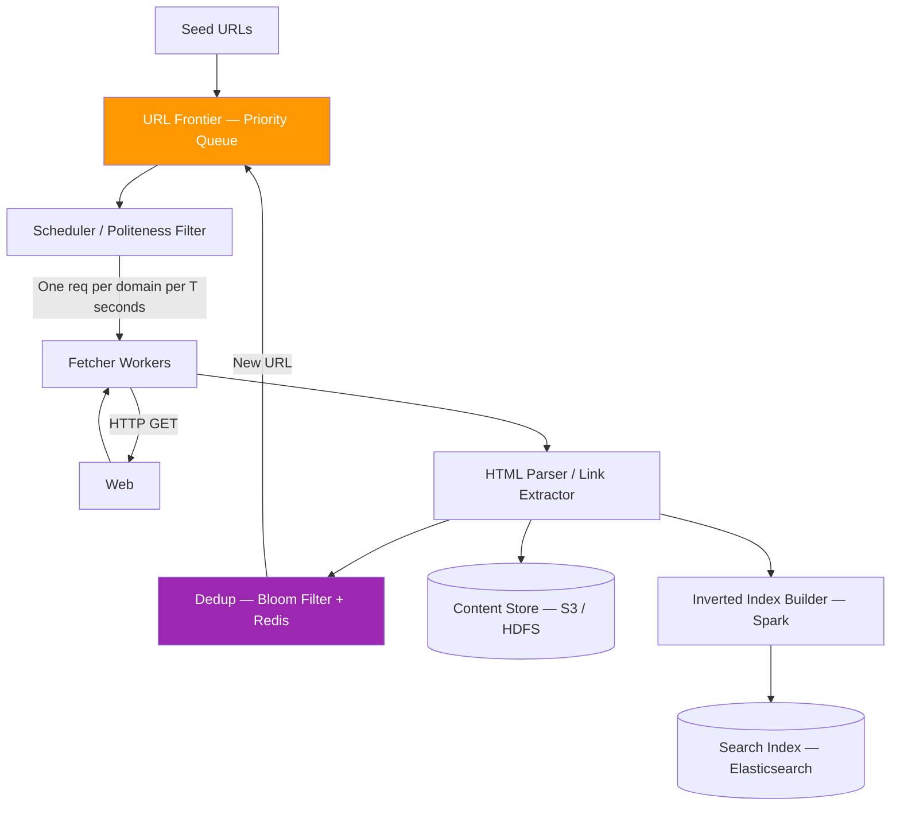
```mermaid
graph TD
    Seed[Seed URLs] --> URLFrontier[URL Frontier — Priority Queue]
    URLFrontier --> Scheduler[Scheduler / Politeness Filter]
    Scheduler -->|"One req per domain per T seconds"| Fetcher[Fetcher Workers]
    Fetcher -->|HTTP GET| Internet[Web]
    Internet --> Fetcher
    Fetcher --> Parser[HTML Parser / Link Extractor]
    Parser --> Dedup[Dedup — Bloom Filter + Redis]
    Dedup -->|New URL| URLFrontier
    Parser --> ContentStore[("Content Store — S3 / HDFS")]
    Parser --> IndexBuilder[Inverted Index Builder — Spark]
    IndexBuilder --> SearchIndex[("Search Index — Elasticsearch")]

    style URLFrontier fill:#FF9800,color:#fff
    style Dedup fill:#9C27B0,color:#fff
```

### Deduplication Strategy

| Layer | Tool | Purpose |
|-------|------|---------|
| **URL dedup** | Bloom Filter (in-memory) | O(1) "probably seen" / "definitely not seen" check |
| **Content dedup** | SimHash / MinHash | Detect near-duplicate content (mirrors, reposts) |
| **Exact dedup** | Redis SET + SHA-256 hash | Definitive URL-visited check (persistent) |

### Politeness Policy

- Respect `robots.txt` — parse and obey `Crawl-delay` directives
- **Per-domain queue** with configurable rate limits (default: 1 req per 2s per domain)
- **Exponential back-off** on 429 (Too Many Requests) / 503 (Service Unavailable)
- Separate DNS resolution cache to avoid repeated lookups

### Scale Estimation

```
Pages to crawl:    1 billion
Avg page size:     100 KB
Total raw storage: 1B × 100 KB = 100 TB

Workers:           1,000 fetcher workers
Throughput:        100 req/s per worker
Total:             100,000 pages/sec = 8.6 billion pages/day
```

### Key Decisions

| Concern | Decision | Rationale |
|---------|----------|-----------|
| URL frontier | Priority queue (Redis sorted set) | Prioritize important / fresh URLs |
| Dedup | Bloom filter + Redis | Memory-efficient probabilistic + exact fallback |
| Fetching | Distributed worker pool | Horizontally scalable, fault-tolerant |
| Content storage | S3 / HDFS | Cheap bulk storage for raw HTML |
| Indexing | Spark + Elasticsearch | Batch-build inverted index, fast full-text search |
| Politeness | Per-domain rate limiter | Avoid getting blocked, be a good citizen |

### Follow-up Questions

- How do you handle JavaScript-rendered pages (SPA)?
- How do you detect and handle crawler traps (infinite URLs)?
- How do you prioritize recrawling frequently updated pages?
- How would you make this fault-tolerant (worker crashes mid-crawl)?

---

## Case Study 7 — Distributed Key-Value Store (Redis / DynamoDB)

### Architecture

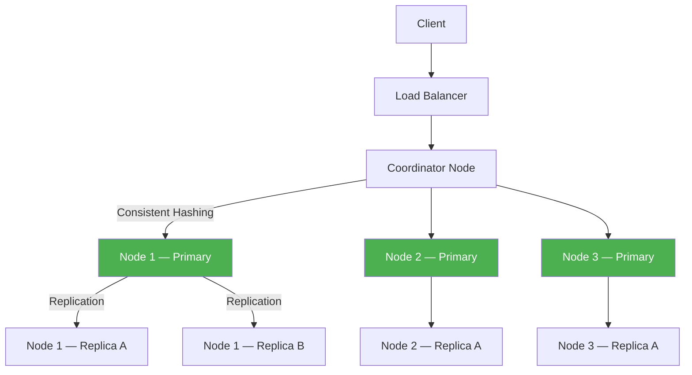
```mermaid
graph TD
    Client --> LB[Load Balancer]
    LB --> Coord[Coordinator Node]
    Coord -->|Consistent Hashing| N1["Node 1 — Primary"]
    Coord --> N2["Node 2 — Primary"]
    Coord --> N3["Node 3 — Primary"]
    N1 -->|Replication| N1R1["Node 1 — Replica A"]
    N1 -->|Replication| N1R2["Node 1 — Replica B"]
    N2 --> N2R1["Node 2 — Replica A"]
    N3 --> N3R1["Node 3 — Replica A"]

    style N1 fill:#4CAF50,color:#fff
    style N2 fill:#4CAF50,color:#fff
    style N3 fill:#4CAF50,color:#fff
```

### Consistent Hashing

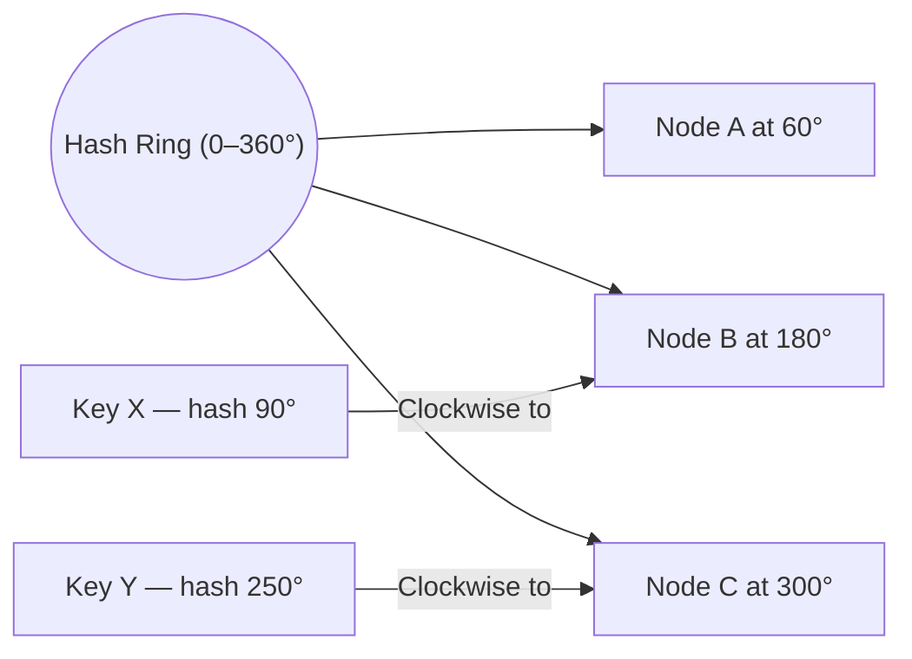
```mermaid
graph LR
    Ring(("Hash Ring (0–360°)"))
    Ring --> N1["Node A at 60°"]
    Ring --> N2["Node B at 180°"]
    Ring --> N3["Node C at 300°"]
    K1["Key X — hash 90°"] -->|Clockwise to| N2
    K2["Key Y — hash 250°"] -->|Clockwise to| N3
```

> **Virtual nodes (vnodes):** Each physical node owns ~150 virtual positions on the ring → solves uneven distribution. Adding/removing a node only remaps ~1/N of keys.

### Consistency Models (CAP Trade-offs)

| Model | W/R Quorum | Availability | Consistency | Use Case |
|-------|-----------|--------------|-------------|----------|
| **Strong** | W + R > N | Lower | Guaranteed | Banking, inventory |
| **Eventual** | W=1, R=1 | High | Stale reads possible | Shopping carts, DNS |
| **Read-your-writes** | W=1, R=quorum | Medium | Partial | Social profiles, settings |

> **N** = total replicas, **W** = write acknowledgments needed, **R** = read acknowledgments needed. Example: N=3, W=2, R=2 → strong consistency (W+R=4 > 3).

### Leader Election

- Use **Raft** or **Paxos** consensus
- On leader failure → remaining nodes hold election
- Candidate with highest log index wins
- **ZooKeeper / etcd** can manage this externally

### Failure Detection

- **Gossip protocol** — each node periodically shares health state with random peers
- Node marked **suspect** after missed heartbeats
- Marked **dead** after timeout → trigger data re-replication

### Key Decisions

| Concern | Decision | Rationale |
|---------|----------|-----------|
| Partitioning | Consistent hashing + vnodes | Even distribution, minimal remapping on scale |
| Replication | N=3, configurable W/R | Tunable consistency vs availability |
| Consensus | Raft / Paxos | Proven leader election, log replication |
| Failure detection | Gossip protocol | Decentralized, scales to thousands of nodes |
| Storage engine | LSM tree (write-optimized) | High write throughput, compaction in background |
| Conflict resolution | Vector clocks + last-writer-wins | Handles concurrent writes in eventual mode |

### Follow-up Questions

- How do you handle network partitions (split-brain)?
- How do you rebalance data when adding a new node?
- How would you implement range queries on a hash-partitioned store?
- What happens during a rolling upgrade?

---

## Case Study 8 — Distributed Message Queue (Kafka / RabbitMQ)

### Architecture

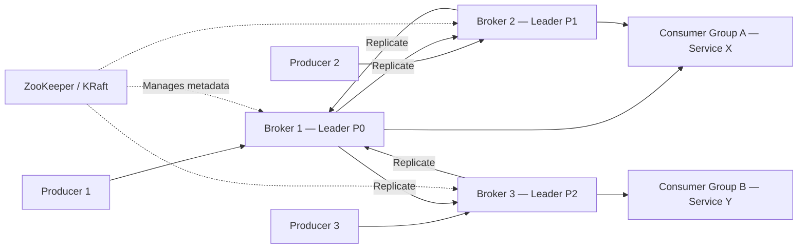
```mermaid
graph LR
    P1[Producer 1] --> Broker1["Broker 1 — Leader P0"]
    P2[Producer 2] --> Broker2["Broker 2 — Leader P1"]
    P3[Producer 3] --> Broker3["Broker 3 — Leader P2"]

    Broker1 -->|Replicate| Broker2
    Broker1 -->|Replicate| Broker3
    Broker2 -->|Replicate| Broker1
    Broker3 -->|Replicate| Broker1

    Broker1 --> CG1[Consumer Group A — Service X]
    Broker2 --> CG1
    Broker3 --> CG2[Consumer Group B — Service Y]

    ZK[ZooKeeper / KRaft] -.->|Manages metadata| Broker1
    ZK -.-> Broker2
    ZK -.-> Broker3
```

### Delivery Semantics

| Semantic | How Achieved | Risk | Use Case |
|----------|-------------|------|----------|
| **At-most-once** | Commit offset before processing | Message loss | Metrics, logging (lossy OK) |
| **At-least-once** | Commit offset after processing | Duplicates possible | Most applications + idempotent consumers |
| **Exactly-once** | Idempotent producer + transactional consumer | Complex, some perf cost | Financial transactions, billing |

### Exactly-Once in Kafka

```
1. Producer: enable.idempotence = true + transactional.id = "tx-producer-1"
2. Broker assigns producer a PID (Producer ID)
3. Each message gets a sequence number → broker deduplicates
4. Consumer: isolation.level = read_committed
5. Result: end-to-end exactly-once semantics
```

> **Key insight:** Idempotent producer handles producer-to-broker dedup. Transactional consumer handles broker-to-consumer dedup. Both together = exactly-once.

### Consumer Group — Partition Assignment

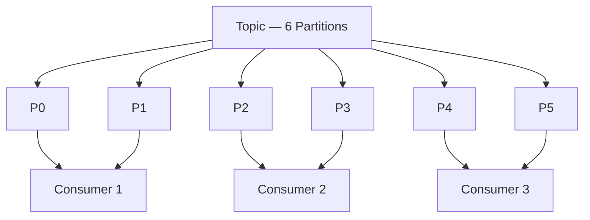
```mermaid
graph TD
    T["Topic — 6 Partitions"]
    T --> P0[P0] & P1[P1] & P2[P2] & P3[P3] & P4[P4] & P5[P5]
    P0 --> C1[Consumer 1]
    P1 --> C1
    P2 --> C2[Consumer 2]
    P3 --> C2
    P4 --> C3[Consumer 3]
    P5 --> C3
```

> **Rule:** One partition can only be consumed by **one consumer** in a group at a time. More consumers than partitions = idle consumers. Max parallelism = number of partitions.

### Key Decisions

| Concern | Decision | Rationale |
|---------|----------|-----------|
| Ordering | Per-partition ordering | Global ordering doesn't scale; partition key groups related messages |
| Retention | Time-based (7d default) + size-based | Consumers can replay; acts as durable buffer |
| Replication | ISR (In-Sync Replicas), min.insync.replicas=2 | Tolerates broker failure without data loss |
| Metadata | KRaft (replacing ZooKeeper) | Eliminates external dependency, simpler ops |
| Throughput | Batching + compression (lz4/snappy) | Amortizes network overhead, higher throughput |
| Backpressure | Consumer poll loop + max.poll.records | Consumer controls its own pace |

### Follow-up Questions

- How do you handle consumer lag (consumer falls behind)?
- How would you implement dead-letter queues?
- How do you reprocess messages after a bug fix?
- Kafka vs RabbitMQ — when would you pick each?

---

## Case Study 9 — Rate Limiter

### Distributed Rate Limiter Architecture

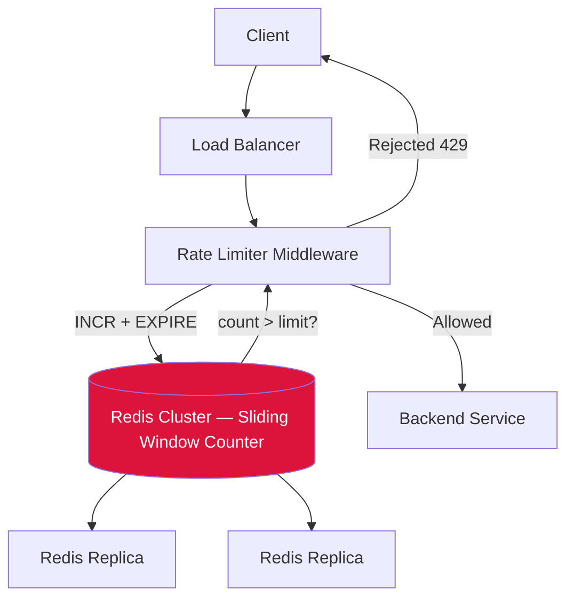
```mermaid
graph TD
    Client --> LB[Load Balancer]
    LB --> MW[Rate Limiter Middleware]
    MW -->|"INCR + EXPIRE"| Redis[("Redis Cluster — Sliding Window Counter")]
    Redis -->|"count > limit?"| MW
    MW -->|Allowed| Backend[Backend Service]
    MW -->|Rejected 429| Client

    Redis --> Replica1[Redis Replica]
    Redis --> Replica2[Redis Replica]

    style Redis fill:#DC143C,color:#fff
```

### Algorithm Comparison

| Algorithm | Mechanism | Pros | Cons |
|-----------|-----------|------|------|
| **Token Bucket** | Tokens refill at fixed rate; request consumes 1 | Handles bursts naturally | Per-user state |
| **Leaky Bucket** | Requests drain at fixed rate from queue | Smooth, predictable output | Adds queuing latency |
| **Fixed Window** | Count requests in fixed time window | Simple to implement | Boundary burst (2× at window edge) |
| **Sliding Window Log** | Log every request timestamp, count in window | Perfectly accurate | Memory-heavy (stores all timestamps) |
| **Sliding Window Counter** ✅ | Weighted average of current + previous window | Accurate + memory efficient | Best for distributed systems |

### Redis Sliding Window Counter — Lua Script

```lua
local key = KEYS[1]
local window = tonumber(ARGV[1])   -- e.g., 60 seconds
local limit  = tonumber(ARGV[2])   -- e.g., 100 requests
local now    = tonumber(ARGV[3])   -- current timestamp (ms)

-- Remove entries outside the window
redis.call('ZREMRANGEBYSCORE', key, 0, now - window * 1000)

-- Count remaining entries
local count = redis.call('ZCARD', key)

if count < limit then
    redis.call('ZADD', key, now, now .. math.random())
    redis.call('EXPIRE', key, window)
    return 1  -- ALLOWED
else
    return 0  -- REJECTED
end
```

### Response Headers

```
X-RateLimit-Limit:     100          -- max requests per window
X-RateLimit-Remaining: 42           -- remaining in current window
X-RateLimit-Reset:     1696141200   -- unix timestamp when window resets
Retry-After:           30           -- seconds to wait (on 429)
```

### Key Decisions

| Concern | Decision | Rationale |
|---------|----------|-----------|
| Algorithm | Sliding window counter | Accurate, memory-efficient, no boundary burst |
| Storage | Redis cluster | Sub-ms latency, atomic Lua scripts, built for counters |
| Granularity | Per user + per endpoint | Prevents abuse without penalizing other users |
| Lua script | Atomic check-and-increment | No race conditions between check and update |
| Failure mode | Fail-open (allow if Redis down) | Prefer availability over strictness in most APIs |
| Multi-region | Local Redis per region + async sync | Avoids cross-region latency on every request |

### Follow-up Questions

- How do you rate-limit across multiple API gateway instances?
- Fail-open vs fail-closed — which do you choose and why?
- How would you implement tiered rate limits (free vs paid)?
- How do you prevent distributed denial-of-service at the rate limiter level?

---

## Case Study 10 — Reduce Infrastructure Cost by 30%

### Process Framework

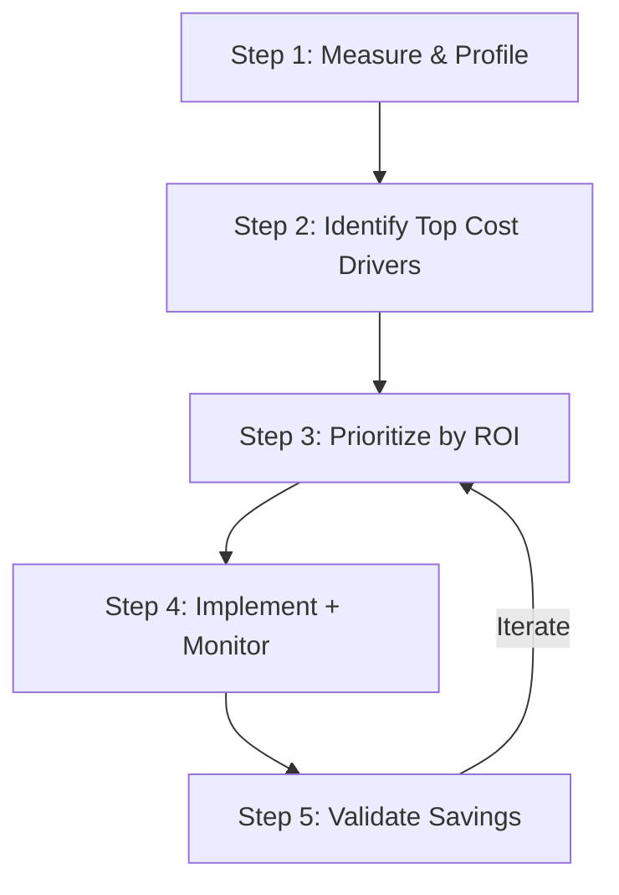
```mermaid
graph TD
    A["Step 1: Measure & Profile"] --> B["Step 2: Identify Top Cost Drivers"]
    B --> C["Step 3: Prioritize by ROI"]
    C --> D["Step 4: Implement + Monitor"]
    D --> E["Step 5: Validate Savings"]
    E -->|Iterate| C
```

### Phase 1 — Measure

```mermaid
graph LR
    Tools[Cost Analysis Tools] --> AWS["AWS Cost Explorer / GCP Billing"]
    Tools --> Infra["Infra Audit — Terraform State"]
    Tools --> APM["APM — Datadog / New Relic"]
    Tools --> DB["DB Query Profiler — pg_stat_statements"]
```

> **Rule:** Never optimize what you haven't measured. Start with the bill, not with assumptions.

### Phase 2 — Cost Levers

| Category | Optimization | Typical Saving |
|----------|-------------|----------------|
| **Compute** | Right-size underutilized instances | 20–40% |
| **Compute** | Reserved / Spot instances for stable workloads | 40–70% |
| **Compute** | Serverless for bursty workloads | 50–80% |
| **Storage** | S3 lifecycle policies (move to Glacier after 90d) | 60–80% on old data |
| **Storage** | Compress and deduplicate data | 30–50% |
| **Database** | Add caching layer (Redis) to reduce DB load | Reduces instance size |
| **Database** | Read replicas to offload analytics queries | Smaller primary needed |
| **Network** | Move cross-AZ traffic to same AZ | Up to 50% on data transfer |
| **Auto-scaling** | Scale down during off-peak hours | 30–50% on non-prod |

### Quick Wins vs Strategic Investments

| Quick Wins (Low Effort · High Saving) | Strategic (High Effort · High Saving) |
|---------------------------------------|---------------------------------------|
| Right-size instances | Serverless migration |
| Reserved instances (1yr or 3yr) | Microservice decomposition |
| S3 lifecycle policies | Multi-cloud / spot fleet orchestration |
| Turn off unused environments (dev/staging) | Re-architecture (monolith → services) |

### Phase 3 — Governance (Sustain Savings)

- **Tag all resources** (team, env, service) — enforce via IAM / SCP policy
- **Budget alerts** at 80% threshold → auto-notify team leads
- **Monthly FinOps review** with engineering leads
- **Infrastructure cost as a team KPI** — visible on dashboards
- **Automated cleanup** — Lambda/CronJob to terminate idle resources

### Follow-up Questions

- How do you balance cost reduction with performance / reliability?
- How do you prevent cost savings from regressing over time?
- How would you handle a sudden 10× traffic spike on a cost-optimized infra?
- How do you evaluate build-vs-buy for managed services (e.g., self-hosted Kafka vs Amazon MSK)?

---

## Follow-up Questions — Quick Reference

| System | Common Follow-ups to Prepare |
|--------|------------------------------|
| **URL Shortener** | Hash collisions, link expiry, abuse prevention, multi-DC counter |
| **Video Streaming** | Live vs VOD, DRM, CDN failover, recommendation pipeline |
| **News Feed** | Pagination, delete propagation, trending topics, spam filtering |
| **Ride-Sharing** | Driver offline mid-ride, double-dispatch, pooling, ETA estimation |
| **Google Docs** | Offline edits, undo/redo, cursor presence, OT vs CRDT trade-offs |
| **Dropbox** | Large file handling, conflict resolution, selective sync, sharing permissions |
| **Web Crawler** | JS rendering, crawler traps, recrawl prioritization, fault tolerance |
| **KV Store** | Split-brain, rebalancing, range queries, rolling upgrades |
| **Message Queue** | Consumer lag, dead-letter queues, message replay, Kafka vs RabbitMQ |
| **Rate Limiter** | Multi-instance sync, fail-open/closed, tiered limits, DDoS at limiter |
| **Cost Reduction** | Cost vs reliability trade-off, regression prevention, traffic spikes, build vs buy |

---

## Interviewer Evaluation Rubric

| Dimension | 1 — Junior | 3 — Mid | 5 — Senior (10+) |
|-----------|-----------|---------|-------------------|
| **Scoping** | Jumps straight to solution | Asks some clarifying questions | Defines scale, constraints, and NFRs first |
| **Trade-offs** | States one approach only | Mentions alternatives exist | Explicitly compares options and justifies choice |
| **Scalability** | Single-server thinking | Horizontal scaling awareness | Sharding, partitioning, CAP, consistent hashing |
| **Failure Handling** | Ignores failures entirely | Mentions retries | Designs for partial failure, circuit breakers, graceful degradation |
| **Data Modeling** | Generic SQL for everything | Appropriate DB choice | Justifies schema, indexing strategy, consistency model |
| **Communication** | Needs constant prompting | Mostly structured | Drives conversation, draws diagrams proactively |

### Scoring Guide

| Score | Verdict |
|-------|---------|
| **25–30** | Strong Hire — senior-level depth across all dimensions |
| **18–24** | Hire — solid with minor gaps |
| **12–17** | No Hire — significant gaps in trade-off or scalability thinking |
| **< 12** | Strong No Hire — junior-level responses for senior role |

> **Pro tip for candidates:** The strongest signal isn't having the "right" answer — it's explaining *why* you chose one approach over another, and *what breaks* when your system scales 10×.
