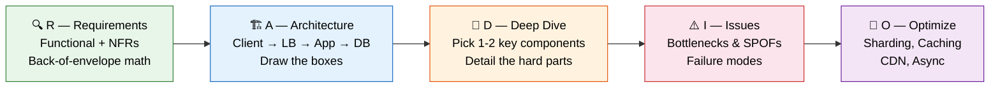
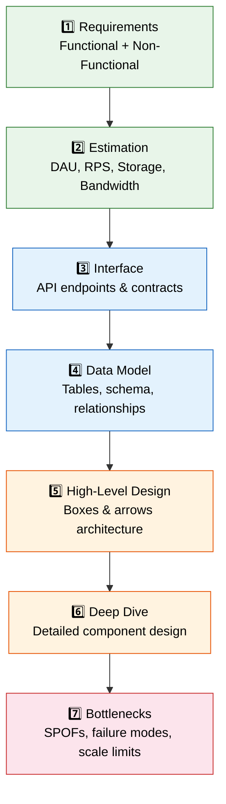
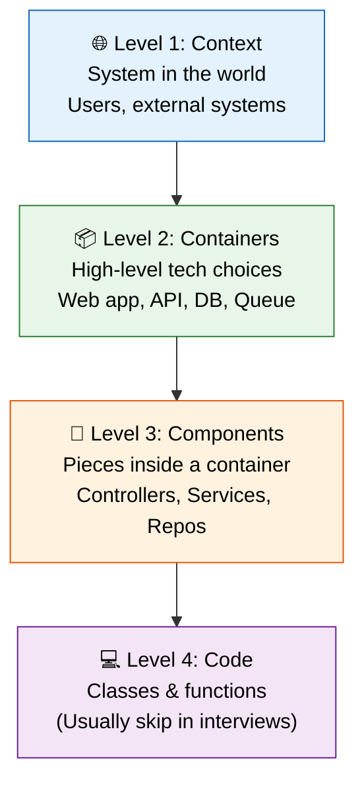
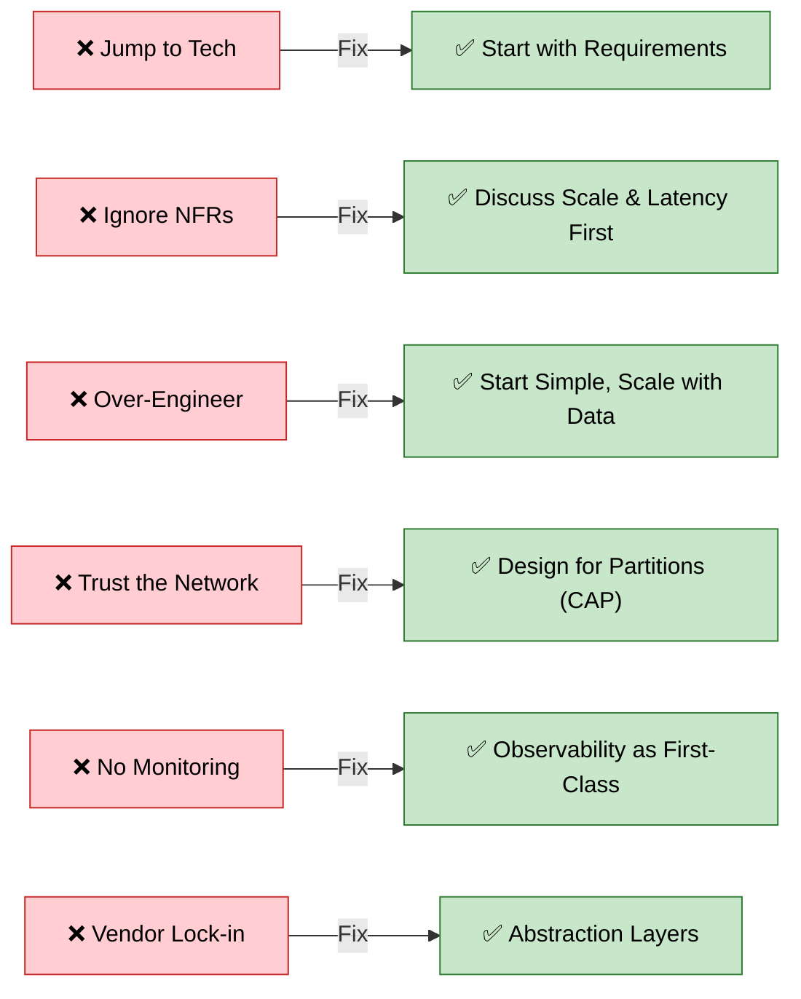

# 🎯 Interview Playbook

> **What you'll learn:** The tactical, step-by-step guide to crushing system design interviews — frameworks, estimation templates, flashcards, pitfall avoidance, and evaluation rubrics used by real interviewers.

---

## Table of Contents

1. [The RADIO Framework](#1-the-radio-framework)
2. [System Design Process Steps](#2-system-design-process-steps)
3. [C4 Model](#3-c4-model)
4. [Common Pitfalls & Fixes](#4-common-pitfalls--fixes)
5. [Quick-Fire Flashcards](#5-quick-fire-flashcards)
6. [Interview Questions by Level](#6-interview-questions-by-level)
7. [Senior-Level Open-Ended Prompts](#7-senior-level-open-ended-prompts)
8. [Interviewer Evaluation Rubric](#8-interviewer-evaluation-rubric)

---

## 1. The RADIO Framework

> **Say this out loud at the start of your interview.** It signals structure and maturity.

| Step | What It Stands For | What You Do |
|------|-------------------|-------------|
| **R** | **Requirements** | Functional + non-functional requirements. Back-of-envelope math (DAU, RPS, storage). |
| **A** | **Architecture** | Draw the boxes: `Client → LB → App Servers → Cache / DB / CDN` |
| **D** | **Deep Dive** | Pick 1–2 components the interviewer cares about (e.g., matching service, feed generation). |
| **I** | **Issues** | Identify bottlenecks, SPOFs, failure modes. |
| **O** | **Optimize** | Scale it — sharding, caching, CDN, async processing. |

### RADIO Flow



### How to Use RADIO in Practice

```
"Let me start by clarifying the requirements..."          → R (5 min)
"Here's the high-level architecture I'm thinking..."      → A (10 min)
"Let me dive deeper into [component]..."                  → D (15 min)
"Some issues I see with this design..."                   → I (5 min)
"To optimize, I'd add..."                                 → O (5 min)
```

---

## 2. System Design Process Steps

### Step-by-Step Breakdown

#### Step 1: Requirements Clarification

| Type | Questions to Ask |
|------|-----------------|
| **Functional** | What are the core features? Who are the users? What inputs/outputs? |
| **Non-Functional** | What scale? What latency? What availability? Read-heavy or write-heavy? |
| **Constraints** | Budget? Tech stack preferences? Compliance (GDPR, HIPAA)? |

#### Step 2: Back-of-Envelope Estimation

> **Always show your math.** Interviewers love seeing structured thinking.

| Metric | Formula | Example |
|--------|---------|---------|
| **RPS** | `DAU / 86400` | 10M / 86,400 ≈ **115 RPS** |
| **Peak RPS** | `RPS × 3` (rule of thumb) | 115 × 3 ≈ **345 RPS** |
| **Storage/day** | `DAU × avg_object_size` | 10M × 1 KB = **10 GB/day** |
| **Storage/year** | `Storage/day × 365` | 10 GB × 365 = **3.65 TB/year** |
| **Bandwidth** | `RPS × avg_response_size` | 115 × 10 KB = **1.15 MB/s** |

**Handy Powers of 2:**

| Power | Value | Approx |
|-------|-------|--------|
| 2^10 | 1,024 | ~1 Thousand |
| 2^20 | 1,048,576 | ~1 Million |
| 2^30 | 1,073,741,824 | ~1 Billion |
| 2^40 | ~1.1 Trillion | ~1 Trillion |

#### Step 3: System Interface Definition

```
POST   /api/v1/tweets          → createTweet(user_id, content, media_ids)
GET    /api/v1/feed/{user_id}  → getFeed(user_id, page_token, page_size)
POST   /api/v1/follow          → followUser(follower_id, followee_id)
DELETE /api/v1/follow          → unfollowUser(follower_id, followee_id)
```

#### Step 4: Data Model Definition

```sql
-- Example: Social Feed
Users    (user_id PK, username, email, created_at)
Tweets   (tweet_id PK, user_id FK, content, media_url, created_at)
Follows  (follower_id FK, followee_id FK, created_at, PRIMARY KEY(follower_id, followee_id))
Feed     (user_id FK, tweet_id FK, created_at)  -- Materialized feed
```

#### Step 5: High-Level Design

```
Client → CDN (static) → Load Balancer → API Gateway
  → Auth Service
  → Tweet Service   → Tweet DB (write-optimized)
  → Feed Service    → Feed Cache (Redis)
  → Media Service   → Object Storage (S3)
  → Notification Svc → Message Queue → Push/Email
```

#### Step 6: Detailed Component Design

Pick the 1–2 components that are hardest or most relevant (interviewer will guide you).

#### Step 7: Identifying Bottlenecks

Ask yourself: *"What breaks at 10× scale? What if this node dies?"*

### Process Flow



---

## 3. C4 Model

> A quick, structured way to present architecture at the right level of detail.



| Level | Interview Use | Example |
|-------|--------------|---------|
| **Context** | Start here — show the big picture | "Users interact via mobile/web, system talks to payment gateway & notification service" |
| **Containers** | Main diagram — show tech choices | "React SPA → Node API → PostgreSQL + Redis + Kafka" |
| **Components** | Deep dive — zoom into one container | "API has AuthController, FeedService, NotificationWorker" |
| **Code** | Rarely needed in interviews | Skip unless asked about specific algorithms |

**Pro tip:** In a 45-min interview, spend most time at **Containers** (Level 2) and **Components** (Level 3).

---

## 4. Common Pitfalls & Fixes

> **Calling out what you'd avoid signals seniority.** Say: *"A common mistake here would be X, so instead I'll..."*

| # | Pitfall | Fix |
|---|---------|-----|
| 1 | **Jumping to tech** before clarifying requirements | Start with requirements + back-of-envelope math |
| 2 | **Ignoring non-functional requirements** | Always discuss scale, latency, availability upfront |
| 3 | **Over-engineering** a simple problem | Start simple, scale when data justifies it |
| 4 | **Assuming network is reliable** | Design for partitions, apply CAP thinking |
| 5 | **No monitoring plan** | Logging / metrics / tracing as first-class design concerns |
| 6 | **Vendor lock-in** | Abstraction layers, portable design patterns |

### Pitfall → Fix Flow



### Prevention Checklist

- [ ] Ask clarifying questions before drawing anything
- [ ] Think in **trade-offs**, not "best" answers
- [ ] Start with an MVP design, evolve it
- [ ] Design for failure from day one
- [ ] State assumptions out loud
- [ ] Back decisions with numbers (RPS, storage, latency)

---

## 5. Quick-Fire Flashcards

> **Self-test:** Cover the answer column and quiz yourself. You should answer each in under 15 seconds.

| # | Question | Answer |
|---|----------|--------|
| 1 | **CAP theorem picks?** | **C**onsistency, **A**vailability, **P**artition tolerance — you can only guarantee **2 of 3**. In practice, P is non-negotiable, so you choose **CP** (consistency) or **AP** (availability). |
| 2 | **Load Balancer vs API Gateway?** | **LB** spreads traffic across servers (L4/L7). **API Gateway** is a smart entry point — handles auth, routing, rate-limiting, request transformation. Gateway often sits *behind* an LB. |
| 3 | **Sharding vs Replication?** | **Sharding** splits data across nodes → scales **writes**. **Replication** copies data across nodes → scales **reads** and improves **availability**. Use both together. |
| 4 | **Cache-aside vs Write-through?** | **Cache-aside:** App reads cache first, on miss reads DB & populates cache (lazy). **Write-through:** App writes to cache + DB simultaneously (consistent but slower writes). |
| 5 | **JWT stateless — why?** | The token's **signature self-validates** the payload. No server-side session lookup needed. The server just verifies the signature with the secret/public key. |
| 6 | **Strong vs Eventual consistency?** | **Strong:** Every read returns the latest write (sync, slower). **Eventual:** Reads may be stale temporarily but converge (async, faster). Choose based on domain needs. |
| 7 | **Fan-out problem?** | A celebrity with millions of followers makes **push-on-write** (fan-out-on-write) too expensive. Solution: Use **pull-on-read** (fan-out-on-read) for high-follower accounts, push for normal users (**hybrid approach**). |
| 8 | **Why is RDBMS hard to scale horizontally?** | **ACID** transactions across shards require 2PC. Cross-shard **JOINs** are expensive. **Foreign key** constraints don't span shards. **Auto-increment** IDs collide across nodes. |
| 9 | **Forward vs Reverse proxy?** | **Forward proxy** hides the **client** (e.g., corporate proxy, VPN). **Reverse proxy** hides the **server** (e.g., Nginx, Cloudflare). |
| 10 | **Token bucket vs Leaky bucket?** | **Token bucket** allows **bursts** (tokens accumulate, spend in bulk). **Leaky bucket** smooths traffic to a **constant rate** (queue drains at fixed speed). |

---

## 6. Interview Questions by Level

### Entry Level (L3–L4)

| Problem | Key Concepts Tested |
|---------|-------------------|
| URL Shortener | Hashing, base62 encoding, read-heavy DB, caching, TTL |
| Chat System | WebSockets, presence, message ordering, delivery guarantees |
| Web Crawler | BFS/DFS, URL frontier, politeness, deduplication, robots.txt |
| Notification System | Push vs pull, message queues, delivery channels, rate limiting |

### Mid Level (L5–L6)

| Problem | Key Concepts Tested |
|---------|-------------------|
| Instagram / Twitter | Feed generation, fan-out, media storage, CDN, caching layers |
| Uber / Lyft | Geo-indexing, real-time matching, ETA calculation, supply/demand |
| Netflix / YouTube | Video transcoding, adaptive streaming, CDN, recommendation engine |
| Search Engine | Inverted index, ranking, crawling, query parsing, autocomplete |
| Distributed Cache | Consistent hashing, eviction policies, replication, cache coherence |

### Senior Level (L6+)

| Problem | Key Concepts Tested |
|---------|-------------------|
| News Feed at Scale | Hybrid fan-out, ranking ML, real-time updates, cross-region consistency |
| Ad Serving System | Real-time bidding, auction logic, budget pacing, fraud detection, low latency |
| Global CDN | Edge caching, cache invalidation, origin shielding, multi-region, anycast |
| Distributed Database | Consensus (Raft/Paxos), replication, partitioning, linearizability |

---

## 7. Senior-Level Open-Ended Prompts

> These are the "10+ year bar" questions. There's no single right answer — the interviewer wants to see **depth, trade-off reasoning, and experience**.

### Prompt 1: Design a Distributed Key-Value Store

```
Partitioning     → Consistent hashing with virtual nodes
                   Why? Even distribution, minimal rebalancing on node add/remove

Replication      → Configurable replication factor (e.g., N=3)
                   Sloppy quorum: W + R > N for consistency guarantees

Consistency      → Tunable: strong (W=N, R=1) vs eventual (W=1, R=1)
                   Vector clocks or last-write-wins for conflict resolution

Leader Election  → Raft consensus for leader selection
& Failure          Gossip protocol for failure detection (φ accrual)
                   Hinted handoff for temporary failures
```

### Prompt 2: Design a Distributed Message Queue

```
Delivery         → At-most-once: fire and forget (fastest)
Guarantees         At-least-once: ack + retry (most common)
                   Exactly-once: idempotent consumers + dedup (hardest)

High Throughput  → Sequential disk writes (append-only log)
& Low Latency      Zero-copy transfer (sendfile syscall)
                   Batching + compression at producer level

Consumer Groups  → Topic partitioning for parallelism
& Partitioning     Consumer group protocol for partition assignment
                   Rebalancing on consumer join/leave
                   Offset management (committed vs latest)
```

### Prompt 3: Cut Infrastructure Cost by 30%

```
1. Profile First     → Identify top cost centers (compute, storage, network)
                       Use cloud cost explorer / billing tags

2. Find Bottlenecks  → Right-size instances (most are over-provisioned)
                       Identify idle resources

3. Reserved / Spot   → Reserved instances for steady-state workloads (40-60% savings)
                       Spot instances for fault-tolerant batch jobs (70-90% savings)

4. Serverless        → Move bursty workloads to Lambda/Cloud Functions
                       Pay-per-invocation vs always-on

5. Optimize DB       → Read replicas instead of scaling primary
                       Archive cold data to cheaper storage tiers
                       Query optimization, proper indexing

6. Auto-Scaling      → Scale down during off-peak (time-based + metric-based)
                       Use Karpenter/Cluster Autoscaler for K8s
```

---

## 8. Interviewer Evaluation Rubric

> This is how **you** are being scored. Understand the rubric to play the game.

| Dimension | 1 — Junior | 3 — Mid | 5 — Senior (10+ yr) |
|-----------|-----------|---------|---------------------|
| **Scoping** | Jumps straight to solution | Asks some clarifying questions | Defines scale, constraints, and NFRs first; drives the conversation |
| **Trade-offs** | States one approach, no alternatives | Mentions alternatives briefly | Explicitly compares options with pros/cons and justifies the choice |
| **Scalability** | Single-server thinking | Awareness of horizontal scaling | Sharding strategies, partitioning schemes, CAP reasoning |
| **Failure Handling** | Ignores failure scenarios | Mentions retries and timeouts | Designs for partial failure: circuit breakers, bulkheads, graceful degradation |
| **Data Modeling** | Generic "use SQL" | Appropriate DB choice for the use case | Justifies schema design, indexing strategy, consistency model |
| **Communication** | Needs constant prompting | Mostly structured, some rambling | Drives conversation, draws clear diagrams, explains trade-offs proactively |

### Scoring Guide

| Score Range | Decision |
|-------------|----------|
| **25–30** | **Strong Hire** — Senior-level thinking, exceptional communication |
| **18–24** | **Hire** — Solid understanding, good structure, some gaps |
| **12–17** | **No Hire** — Fundamental gaps in scalability or trade-off reasoning |
| **< 12** | **Strong No Hire** — Cannot structure a design or reason about scale |

### How to Self-Assess

After every practice session, score yourself honestly on each dimension. Track your progress over time:

```
Week 1:  Scoping: 2  Trade-offs: 2  Scalability: 1  Failure: 1  Data: 2  Comms: 2  = 10
Week 4:  Scoping: 3  Trade-offs: 3  Scalability: 3  Failure: 2  Data: 3  Comms: 3  = 17
Week 8:  Scoping: 4  Trade-offs: 4  Scalability: 4  Failure: 4  Data: 4  Comms: 4  = 24
Week 12: Scoping: 5  Trade-offs: 5  Scalability: 5  Failure: 5  Data: 5  Comms: 5  = 30
```

---

## Quick Reference: Interview Day Checklist

- [ ] Open with RADIO framework — state it explicitly
- [ ] Clarify requirements before touching the whiteboard
- [ ] Do back-of-envelope math (DAU → RPS → storage)
- [ ] Draw high-level architecture first, then zoom in
- [ ] Verbalize trade-offs: *"We could do X or Y; I'd pick X because..."*
- [ ] Address failure modes without being asked
- [ ] Mention monitoring/observability
- [ ] Keep to time — don't spend 20 min on requirements

---

*Part of the [System Design Interview Preparation Series](./README.md)*
