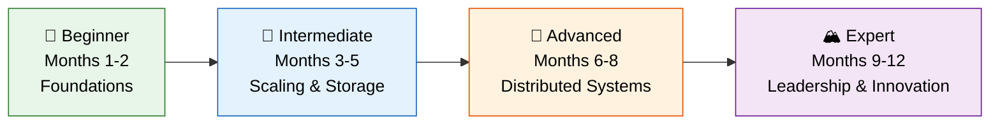

# 🗺️ Learning Roadmap

> **What you'll learn:** A structured 12-month study plan to go from system design beginner to expert — with weekly topics, hands-on projects, case studies, success criteria, and curated resources at every level.

---

## Table of Contents

1. [Progression Path Overview](#1-progression-path-overview)
2. [Beginner Level (Months 1–2)](#2-beginner-level-months-12-foundation-building)
3. [Intermediate Level (Months 3–5)](#3-intermediate-level-months-35-scaling-foundations)
4. [Advanced Level (Months 6–8)](#4-advanced-level-months-68-distributed-systems-mastery)
5. [Expert Level (Months 9–12)](#5-expert-level-months-912-innovation--leadership)
6. [Recommended Resources](#6-recommended-resources)
7. [Industry Examples](#7-industry-examples)

---

## 1. Progression Path Overview

```
Beginner (Month 1-2)  →  Intermediate (Month 3-5)  →  Advanced (Month 6-8)  →  Expert (Month 9-12)
   Foundations              Scaling & Storage          Distributed Systems       Cloud-Native & Leadership
```



| Detail | Value |
|--------|-------|
| **Time Investment** | 8–12 hours per week |
| **Total Duration** | 12 months |
| **Success Metric** | Design systems handling **100K+ concurrent users** with clear trade-off reasoning |
| **Practice Cadence** | 1 mock interview per week starting Month 3 |

---

## 2. Beginner Level (Months 1–2): Foundation Building

### Learning Objectives

- Understand core distributed system principles
- Learn basic design patterns and vocabulary
- Design simple, single-service systems
- Build fluency with system design terminology

### Weekly Breakdown

#### Weeks 1–2: System Design Fundamentals

| Topic | Key Concepts |
|-------|-------------|
| Monolithic vs Distributed | Single process vs multi-node, when to choose which |
| Client-Server Architecture | Request/response model, stateless vs stateful |
| REST & GraphQL Basics | HTTP methods, status codes, resource naming, query language |
| Basic Components | Web server, application server, database, load balancer |

#### Weeks 3–4: Scalability Basics

| Topic | Key Concepts |
|-------|-------------|
| Vertical vs Horizontal Scaling | Scale up (bigger box) vs scale out (more boxes) |
| Basic Load Balancing | Round-robin, least connections, health checks |
| Master-Slave Replication | Read replicas, replication lag, failover basics |
| Intro to Caching | What to cache, TTL, cache hit/miss, simple invalidation |

#### Weeks 5–6: Storage Fundamentals

| Topic | Key Concepts |
|-------|-------------|
| RDBMS + ACID | Transactions, isolation levels, when to use relational |
| NoSQL Types | Document (MongoDB), Key-Value (Redis), Wide-Column (Cassandra), Graph (Neo4j) |
| File vs Block vs Object Storage | When to use each, S3 basics |
| Data Modeling Basics | Normalization, primary/foreign keys, indexing intro |

#### Weeks 7–8: Communication Patterns

| Topic | Key Concepts |
|-------|-------------|
| Synchronous vs Asynchronous | Blocking vs non-blocking, when to use each |
| HTTP Basics | Request lifecycle, keep-alive, HTTP/2 multiplexing |
| Message Queues (Conceptual) | Producer/consumer, decoupling, buffering |
| Pub/Sub Pattern | Topic-based messaging, fan-out, event-driven thinking |

### Hands-On Projects

| Project | What You'll Practice |
|---------|---------------------|
| **Simple Blog System** | CRUD operations, relational data modeling, basic REST API, pagination |
| **URL Shortener** | Hashing, base62 encoding, read-heavy optimization, caching layer |
| **Chat Application** | WebSockets, real-time communication, message persistence, basic presence |

### Case Studies to Analyze

| System | Focus Areas |
|--------|------------|
| **WhatsApp** (early) | End-to-end messaging, delivery receipts, Erlang at scale |
| **Early Twitter** | Monolith → services transition, fail whale era, Ruby on Rails limits |
| **Reddit** | Simple voting system, comment threading, content ranking algorithm |

### Success Criteria

- [ ] Can explain vertical vs horizontal scaling with real examples
- [ ] Can design a basic 3-tier web application on a whiteboard
- [ ] Can choose between SQL and NoSQL for a given use case with reasoning
- [ ] Can estimate basic capacity requirements (RPS, storage)
- [ ] Can draw a simple architecture diagram with correct component relationships
- [ ] Comfortable with REST API design and HTTP fundamentals

---

## 3. Intermediate Level (Months 3–5): Scaling Foundations

### Month 3: Advanced Scalability

| Topic | Key Concepts |
|-------|-------------|
| Database Sharding | Range-based, hash-based, directory-based; resharding strategies |
| Consistent Hashing | Virtual nodes, minimal redistribution, ring topology |
| Caching Strategies | Cache-aside, write-through, write-behind, refresh-ahead |
| CDN Architecture | Push vs pull CDN, edge caching, cache invalidation, origin shielding |

### Month 4: Database Mastery

| Topic | Key Concepts |
|-------|-------------|
| Normalization vs Denormalization | When to denorm for reads, materialized views |
| Indexing Deep Dive | B-trees, hash indexes, composite indexes, covering indexes, index selectivity |
| NoSQL Deep Dive | LSM trees, SSTables, Memtables, compaction strategies |
| Data Partitioning | Horizontal vs vertical, partition keys, hot partitions, rebalancing |

### Month 5: Communication & Reliability

| Topic | Key Concepts |
|-------|-------------|
| Kafka & RabbitMQ | Log-based vs traditional queues, consumer groups, offset management |
| API Gateway Patterns | Authentication, rate limiting, request routing, circuit breaking, transformation |
| Monitoring & Observability | Metrics (Prometheus), logging (ELK), tracing (Jaeger), the three pillars |

### Hands-On Projects

| Project | What You'll Practice |
|---------|---------------------|
| **E-commerce Platform** | Product catalog, inventory management, shopping cart, order processing, payment integration |
| **Social Media Feed** | Fan-out strategies, ranking algorithms, infinite scroll, media handling |
| **Real-time Analytics Dashboard** | Stream processing, time-series data, aggregation, WebSocket updates |

### Case Studies

| System | Focus Areas |
|--------|------------|
| **Instagram** | Photo storage, CDN strategy, feed ranking, Cassandra for DMs |
| **Slack** | Real-time messaging at scale, channel model, search, WebSocket management |
| **Airbnb** | Search & matching, pricing, trust & safety, geo-based queries |
| **Netflix** | Content delivery, microservices architecture, Zuul gateway, Hystrix |

### Success Criteria

- [ ] Can design a sharding strategy for a given dataset
- [ ] Can implement and explain consistent hashing
- [ ] Can choose and justify caching strategies with invalidation approach
- [ ] Can design a system handling 10K+ RPS with appropriate scaling
- [ ] Can explain trade-offs between different database technologies
- [ ] Can design an event-driven architecture with message queues
- [ ] Can set up basic monitoring and explain the three pillars of observability

---

## 4. Advanced Level (Months 6–8): Distributed Systems Mastery

### Month 6: Distributed Systems Theory

| Topic | Key Concepts |
|-------|-------------|
| CAP Theorem Deep Dive | CP vs AP systems, PACELC extension, real-world examples |
| Consensus Algorithms | Raft (leader election, log replication), Paxos (single-decree, multi-Paxos), BFT (Byzantine fault tolerance) |
| Distributed Transactions | 2PC (blocking problem), 3PC, Saga pattern (choreography vs orchestration), Event Sourcing + CQRS |

### Month 7: Microservices Architecture

| Topic | Key Concepts |
|-------|-------------|
| Domain-Driven Design (DDD) | Bounded contexts, aggregates, ubiquitous language |
| Service Boundaries | Decomposition strategies, data ownership, shared nothing |
| Inter-Service Communication | Sync (gRPC, REST) vs async (events), choreography vs orchestration |
| Resilience Patterns | Circuit breakers, bulkheads, retries with backoff, timeouts, service discovery (Consul, Eureka) |

### Month 8: Performance & Reliability Engineering

| Topic | Key Concepts |
|-------|-------------|
| Latency vs Throughput | P50/P95/P99 latency, Little's Law, queuing theory basics |
| Connection Pooling | DB connection pools, HTTP connection reuse, pool sizing |
| Bulkhead Pattern | Resource isolation, thread pools, semaphore-based, fail-fast |
| Graceful Degradation | Feature flags, fallback strategies, static content fallback |
| Disaster Recovery | RPO/RTO, active-active vs active-passive, backup strategies, runbooks |

### Hands-On Projects

| Project | What You'll Practice |
|---------|---------------------|
| **Distributed Video Streaming** | Transcoding pipeline, adaptive bitrate, CDN strategy, recommendation engine |
| **Ride-Sharing Application** | Real-time matching, geo-indexing (Geohash/S2/H3), ETA prediction, surge pricing |
| **Distributed Search Engine** | Inverted index, distributed crawling, ranking (TF-IDF, PageRank), query parsing |

### Case Studies

| System | Focus Areas |
|--------|------------|
| **YouTube** | Video processing pipeline, adaptive streaming, recommendations |
| **Uber** | Dispatch system, geospatial indexing, real-time pricing, DISCO |
| **Amazon** | Dynamo, service-oriented architecture, two-pizza teams, blast radius |
| **Google Search** | MapReduce, Bigtable, distributed crawling, ranking at scale |
| **Facebook Messenger** | Real-time messaging, presence, delivery guarantees, TAO |

### Success Criteria

- [ ] Can explain and compare Raft vs Paxos with trade-offs
- [ ] Can design a Saga pattern for a distributed transaction
- [ ] Can decompose a monolith into microservices with clear boundaries
- [ ] Can design for partial failure with circuit breakers and bulkheads
- [ ] Can reason about consistency models and choose appropriately
- [ ] Can design a system for 100K+ concurrent users with multi-region support
- [ ] Can explain and apply CQRS and Event Sourcing patterns

---

## 5. Expert Level (Months 9–12): Innovation & Leadership

### Month 9: Cloud-Native & Serverless

| Topic | Key Concepts |
|-------|-------------|
| Kubernetes Advanced | Custom operators, HPA/VPA, pod disruption budgets, StatefulSets |
| Service Mesh | Istio/Linkerd, sidecar proxy, mTLS, traffic management, observability |
| GitOps | ArgoCD, Flux, declarative infrastructure, drift detection |
| Serverless Patterns | Event-driven functions, cold starts, fan-out/fan-in, step functions |
| Multi-Cloud Strategy | Cloud-agnostic design, Terraform, cost optimization, vendor diversification |

### Month 10: Advanced Data Systems

| Topic | Key Concepts |
|-------|-------------|
| Stream Processing | Apache Flink (event time, watermarks), Spark Streaming (micro-batch), Kafka Streams |
| ML System Design | Feature stores, model serving (batch vs real-time), A/B testing infrastructure |
| Data Pipeline Architecture | Lambda vs Kappa architecture, data lake, data warehouse, lakehouse |

### Month 11: Performance at Scale

| Topic | Key Concepts |
|-------|-------------|
| Multi-Region Architecture | Data replication strategies, conflict resolution, regional routing |
| Data Locality | Edge computing, write-local/read-global, CRDTs |
| Chaos Engineering | Principles of chaos, fault injection (Chaos Monkey, Litmus), game days |
| Performance Testing | Load testing (Gatling, k6), stress testing, soak testing, profiling |

### Month 12: Architecture Leadership

| Topic | Key Concepts |
|-------|-------------|
| Legacy Modernization | Assessment frameworks, migration strategies, risk management |
| Strangler Fig Pattern | Incremental migration, routing layer, feature parity verification |
| Architecture Decision Records (ADRs) | Template, lightweight process, team alignment |
| Tech Debt Management | Quantification, prioritization, refactoring strategies |
| Conway's Law | Org structure → system architecture, inverse Conway maneuver, team topologies |

### Research Papers to Read

| Paper | Authors / Year | Key Contribution |
|-------|---------------|-----------------|
| **Google File System (GFS)** | Ghemawat et al., 2003 | Distributed file system design for large-scale data |
| **MapReduce** | Dean & Ghemawat, 2004 | Simplified distributed data processing model |
| **Dynamo** | DeCandia et al., 2007 | Eventually consistent, highly available key-value store |
| **Spanner** | Corbett et al., 2012 | Globally distributed, strongly consistent database |
| **Monarch** | Adams et al., 2020 | Google's planet-scale monitoring infrastructure |
| **TAO** | Bronson et al., 2013 | Facebook's distributed data store for the social graph |
| **F1** | Shute et al., 2013 | Google's fault-tolerant distributed RDBMS |
| **MillWheel** | Akidau et al., 2013 | Fault-tolerant stream processing at Google |

### Conferences to Follow

| Conference | Focus |
|------------|-------|
| **SIGMOD** | Database systems, data management |
| **VLDB** | Very large databases, distributed data |
| **SOSP** | Operating systems principles, distributed systems |
| **OSDI** | Operating systems design and implementation |

### Success Criteria

- [ ] Can design multi-region architectures with clear consistency trade-offs
- [ ] Can evaluate and propose cloud-native migration strategies
- [ ] Can lead architecture reviews and write meaningful ADRs
- [ ] Can design ML system infrastructure (feature stores, model serving)
- [ ] Can articulate chaos engineering practices and implement them
- [ ] Can modernize legacy systems using strangler fig or similar patterns
- [ ] Can read and summarize distributed systems research papers

---

## 6. Recommended Resources

### Books by Level

#### Beginner

| Book | Author | Why Read It |
|------|--------|------------|
| *Designing Data-Intensive Applications* (Ch. 1–3) | Martin Kleppmann | The bible of distributed systems — start with foundations |
| *System Design Interview* Vol. 1 | Alex Xu | Step-by-step walkthroughs of 15+ common interview questions |
| *Building Scalable Web Sites* | Cal Henderson | Practical Flickr-era scaling wisdom, still relevant fundamentals |

#### Intermediate

| Book | Author | Why Read It |
|------|--------|------------|
| *Database Internals* | Alex Petrov | Deep dive into how databases actually work under the hood |
| *Kafka: The Definitive Guide* | Narkhede, Shapira, Palino | Event streaming and distributed messaging mastery |
| *Web Scalability for Startup Engineers* | Artur Ejsmont | Practical scaling patterns from startup to scale-up |

#### Advanced

| Book | Author | Why Read It |
|------|--------|------------|
| *Microservices Patterns* | Chris Richardson | Comprehensive patterns for microservice architectures |
| *Building Microservices* (2nd Ed.) | Sam Newman | Practical guide to designing, building, and operating microservices |
| *Distributed Systems for Fun and Profit* | Mikito Takada | Free online book — concise theory of distributed systems |

#### Design Patterns

| Book | Author | Why Read It |
|------|--------|------------|
| *Design Patterns* (GoF) | Gamma, Helm, Johnson, Vlissides | The classic 23 patterns — foundational OOP knowledge |
| *Head First Design Patterns* | Freeman & Robson | Beginner-friendly, visual approach to design patterns |
| *Refactoring* (2nd Ed.) | Martin Fowler | How to improve existing code without changing behavior |

### Online Courses

| Course | Platform | Level |
|--------|----------|-------|
| **Grokking System Design Interview** | Educative | Beginner–Intermediate |
| **MIT 6.824: Distributed Systems** | MIT OCW / YouTube | Advanced |
| **CMU 15-445: Database Systems** | CMU / YouTube | Intermediate–Advanced |
| **System Design Primer** | GitHub (donnemartin) | All levels — free |

### YouTube Channels

| Channel | Best For |
|---------|---------|
| **Gaurav Sen** | Visual system design explanations, interview prep |
| **Tech Dummies (Narendra L)** | Deep dives into specific technologies |
| **Hussein Nasser** | Backend engineering, networking, database internals |

### Tech Blogs

| Blog | Known For |
|------|----------|
| [Netflix Tech Blog](https://netflixtechblog.com/) | Microservices, resilience, streaming at scale |
| [Uber Engineering](https://eng.uber.com/) | Real-time systems, geo-distributed architecture |
| [AWS Architecture Center](https://aws.amazon.com/architecture/) | Reference architectures, well-architected framework |
| [Meta Engineering](https://engineering.fb.com/) | Social graph, TAO, distributed systems |
| [Google Cloud Blog](https://cloud.google.com/blog/) | Spanner, BigQuery, Kubernetes |

---

## 7. Industry Examples

> **Why these matter:** They prove that the concepts you're learning are used at the highest scale in the real world.

| Company | Scale | What They Solved |
|---------|-------|-----------------|
| **Netflix** | 230M+ subscribers, 99.99% uptime | Global content delivery, microservices resilience (Hystrix, Zuul), chaos engineering (Chaos Monkey) |
| **WhatsApp** | 100B+ messages daily | Extreme efficiency — 50 engineers serving 2B users, Erlang/BEAM concurrency model |
| **Uber** | Millions of real-time matches across 70+ countries | Geospatial indexing (H3), real-time dispatch, dynamic pricing at global scale |
| **Google Search** | 8.5B+ searches per day | Inverted indexes at planet scale, MapReduce → Spanner → Bigtable ecosystem |
| **Amazon** | 300M+ active users | Service-oriented architecture, Dynamo (eventual consistency), two-pizza team autonomy |

### Your North Star

```
Month 1:  "I can explain what a load balancer does."
Month 3:  "I can design a URL shortener with caching and replication."
Month 6:  "I can design Instagram's feed system with fan-out trade-offs."
Month 9:  "I can design a multi-region distributed database with consensus."
Month 12: "I can lead architecture reviews and design systems for millions of users."
```

---

## Study Schedule Template

| Day | Activity | Time |
|-----|----------|------|
| **Monday** | Read theory (book/article) | 1.5 hrs |
| **Tuesday** | Watch video content (YouTube/course) | 1 hr |
| **Wednesday** | Hands-on project work | 2 hrs |
| **Thursday** | Practice system design problem | 1.5 hrs |
| **Friday** | Read case study / tech blog post | 1 hr |
| **Saturday** | Mock interview or peer discussion | 1.5 hrs |
| **Sunday** | Review flashcards + rest | 30 min |
| | **Weekly Total** | **~9 hrs** |

---

*Part of the [System Design Interview Preparation Series](./README.md)*
