# 🎯 System Design — Master Revision Guide (Visual Edition)

> **Purpose:** Single-file, last-minute revision for Fullstack Developer interviews. Every concept in `design system/` compressed into diagrams + tables + one-liners so it sticks in memory. Diagrams use Mermaid (renders on GitHub, VS Code, Obsidian, Cursor).
>
> **Deep-dive files in this folder** (go here if you need full explanations):
> `someImportant-system-design.md` · `system-design.md` · `advanced-system-design-questions.md` · `Knowledge-Based-System-Design.md` · `scaling.md` · `scaling-real-time-example.md` · `design pattern.md`

---

## 🗺️ 0. The Whole Map (memorize this first)

```mermaid
graph TD
    A[System Design] --> B[Fundamentals]
    A --> C[Architecture Styles]
    A --> D[Networking Layer]
    A --> E[Data Layer]
    A --> F[Caching]
    A --> G[Communication]
    A --> H[Security]
    A --> I[Design Patterns]
    A --> J[Case Studies]

    B --> B1[Scalability]
    B --> B2[Latency vs Throughput]
    B --> B3[Availability]
    B --> B4[Consistency & CAP]

    C --> C1[Monolith]
    C --> C2[Microservices]
    C --> C3[N-Tier / SOA]

    D --> D1[Load Balancer]
    D --> D2[API Gateway]
    D --> D3[Forward/Reverse Proxy]

    E --> E1[SQL vs NoSQL]
    E --> E2[Sharding/Replication]
    E --> E3[Indexing]

    F --> F1[Strategies]
    F --> F2[Eviction Policies]

    G --> G1[Sync vs Async]
    G --> G2[Message Queues]

    H --> H1[AuthN vs AuthZ]
    H --> H2[JWT/OAuth/SSO]
    H --> H3[Rate Limiting]
```

**How to use in interview (RADIO method):**

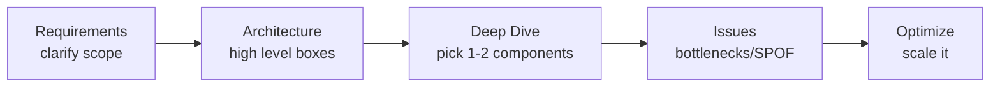

---

## 1️⃣ Fundamentals

### 1.1 Scalability — vertical vs horizontal

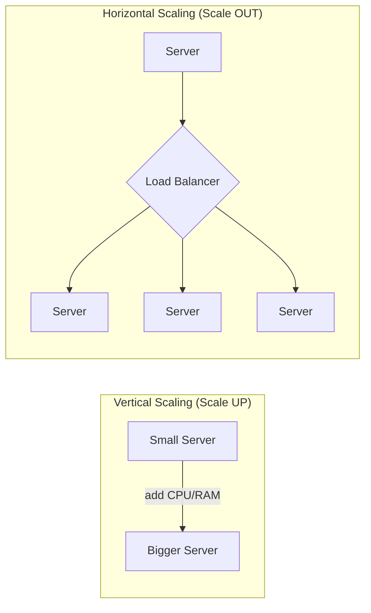

| | Vertical (Up) | Horizontal (Out) |
|---|---|---|
| Method | Upgrade one machine | Add more machines |
| Cost | Cheap → then expensive | Cost-effective at scale |
| Ceiling | Hardware limit | Near-limitless |
| Downtime | Usually required | Zero-downtime possible |
| Failure | Single point of failure | Fault tolerant |
| Best for | Legacy monoliths, predictable load | Distributed systems, variable load |

**One-liner:** *Vertical = bigger engine. Horizontal = more cars, add lanes (load balancer).*

Real evolution story (memorize the narrative, not just terms): launch on 1 server → traffic doubles → scale vertically (bigger box) → Black Friday 100x spike → single giant box = expensive + SPOF → switch to horizontal: LB + fleet of small servers + shared Redis session store + dedicated DB. Elastic: add/remove servers on demand.

---

### 1.2 Latency vs Throughput

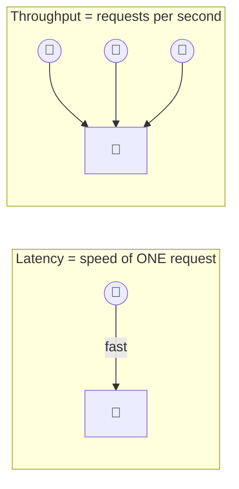

**Highway analogy:** Latency = speed of a car. Throughput = cars passing per hour.

Latency ladder (memorize order of magnitude, not exact numbers):
`L1 cache (0.5ns) → RAM (100ns) → SSD (16μs) → same-DC round trip (0.5ms) → cross-continent round trip (150ms)`

Reduce latency → CDN, caching, DB indexing, load balancing, compression.
Improve throughput → horizontal scaling, caching, async processing, batching, connection pooling.

| | CDN | Caching |
|---|---|---|
| Where | Edge servers (globally) | App-server / in-memory |
| Fixes | Geographic latency | DB/computation load |
| Content | Static (JS/CSS/images) | Dynamic data/queries |
| Example | CloudFront, Cloudflare | Redis, Memcached |

---

### 1.3 Availability

```
Availability % = Uptime / (Uptime + Downtime) × 100
```

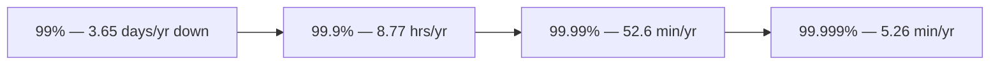

Achieve it: eliminate single points of failure → redundancy (standby backups) → replication (copy data across nodes).

| | Redundancy | Replication |
|---|---|---|
| What | Backup component | Copy of data |
| Goal | Failover | Data durability/availability |
| Example | Standby server, backup power | DB replicas |

---

### 1.4 Consistency & CAP Theorem

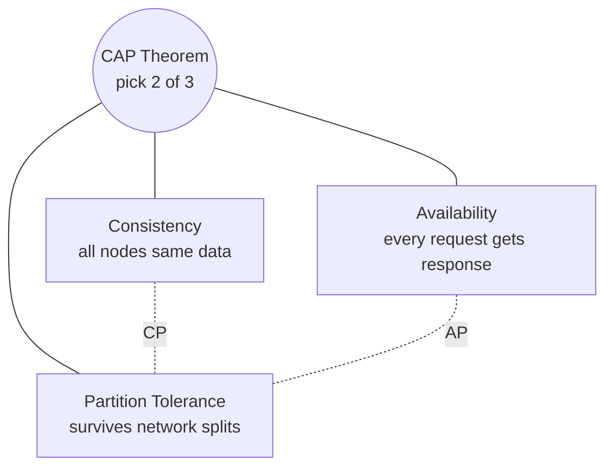

> In real distributed systems, **network partitions WILL happen** → you never truly get to pick "CA". Real choice is **CP vs AP**.

| Combo | Meaning | Examples |
|---|---|---|
| **CP** | Consistent + partition-tolerant, sacrifice availability | MongoDB, HBase, Redis (cluster) |
| **AP** | Available + partition-tolerant, sacrifice strict consistency | Cassandra, CouchDB, DynamoDB |
| **CA** | Only possible single-node | Traditional RDBMS (no partition) |

Strong vs Eventual consistency:

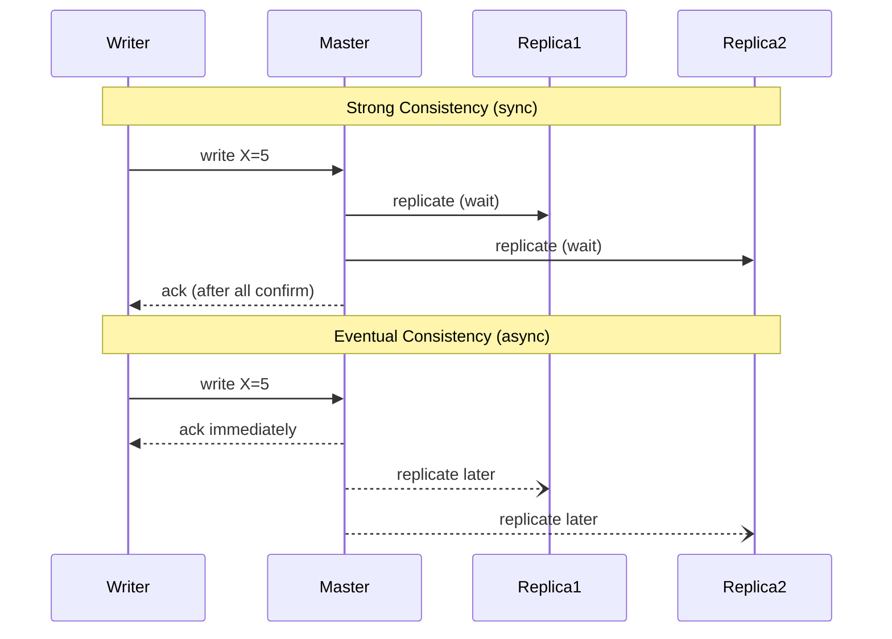

- **Strong:** banking, inventory, booking → correctness > speed.
- **Eventual:** social media, DNS, shopping cart → speed/availability > instant correctness.

---

## 2️⃣ Architecture Styles

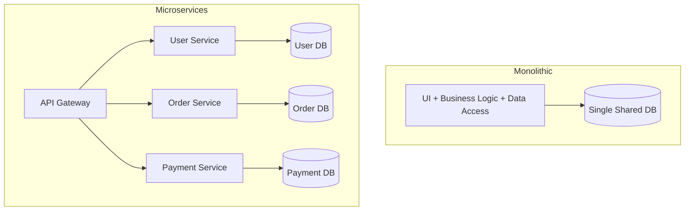

| Aspect | Monolithic | Microservices |
|---|---|---|
| Codebase | One repo | Many repos |
| Deploy | All-or-nothing | Independent per service |
| Scaling | Whole app | Individual services |
| DB | Shared | Database-per-service |
| Failure blast radius | Entire app | Just that service |
| Complexity | Low (early) | High (ops/orchestration) |
| Use when | Small team, MVP | Large team, need independent scale |

**N-Tier:** `Presentation Tier → Business Logic Tier → Data Tier`
**SOA:** services talk via an Enterprise Service Bus (ESB), often SOAP/XML — heavier, enterprise-y ancestor of microservices.

---

## 3️⃣ Networking Layer

### 3.1 Load Balancer vs API Gateway (commonly confused — nail this)

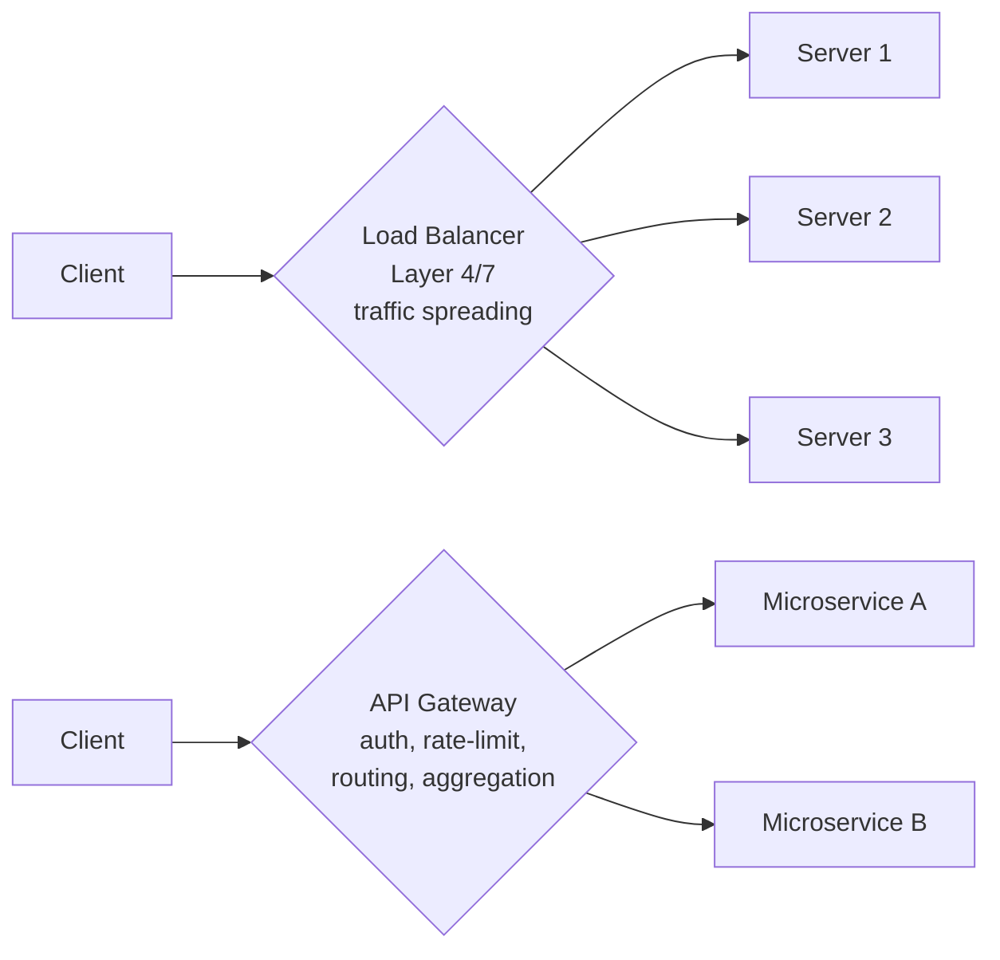

**One-liner:** *LB spreads traffic. API Gateway is a smart front-door: auth + rate limiting + routing + orchestration.*

### 3.2 Forward Proxy vs Reverse Proxy

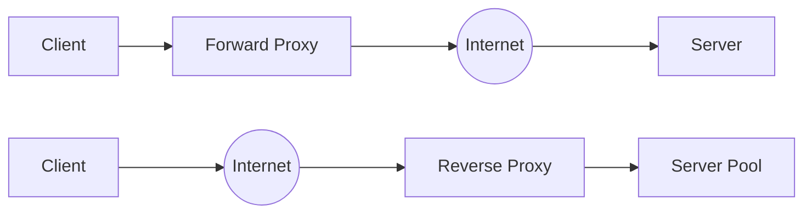

- **Forward proxy:** sits in front of the **client**, hides client identity (VPN, corporate proxy).
- **Reverse proxy:** sits in front of the **server**, hides server identity (Nginx, AWS ALB) → does LB, SSL termination, caching, compression, WAF.

### 3.3 Load balancing algorithms (quick fire)

`Round Robin → Weighted Round Robin → Least Connections → IP Hash → Least Response Time → Random`

Layer 4 (TCP/UDP, fast, blind) vs Layer 7 (HTTP-aware, content-based routing).

---

## 4️⃣ Data Layer

### 4.1 Replication (Master-Slave)

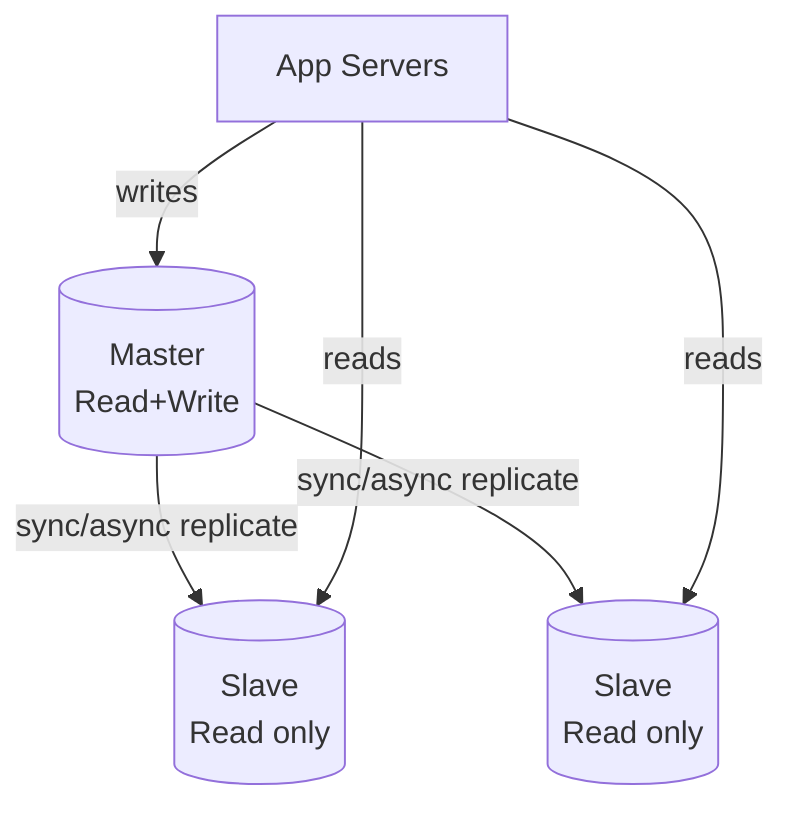

- **Sync replication** → strong consistency, higher latency (wait for replicas).
- **Async replication** → eventual consistency, lower latency (ack immediately).
- **Master-Master** → both accept writes, needs conflict resolution.

### 4.2 Sharding (horizontal partitioning)

```mermaid
graph LR
    Router{Shard Router\nhash(user_id)} --> Shard1[(Shard 1\nusers A-H)]
    Router --> Shard2[(Shard 2\nusers I-P)]
    Router --> Shard3[(Shard 3\nusers Q-Z)]
```

Why RDBMS scaling is hard: ACID across nodes needs 2-phase commit, JOINs across shards are expensive, foreign keys break, auto-increment IDs collide. Fixes: read replicas, sharding, or distributed SQL (Vitess, CockroachDB, TiDB, Citus).

### 4.3 SQL vs NoSQL family map

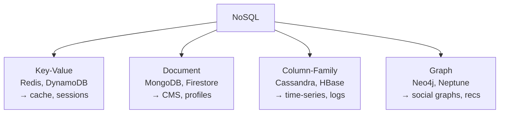

**Polyglot persistence** (use the right DB per job, e.g. e-commerce):
`Sessions→Redis · Products→MongoDB · Orders→PostgreSQL · Search→Elasticsearch · Recommendations→Neo4j`

### 4.4 Indexing

B-Tree index turns full table scan `O(n)` into lookup `O(log n)`. Types: B-Tree (range queries, default), Hash (equality), Composite (multi-column), Full-text (search).
Optimize queries: `EXPLAIN ANALYZE`, index WHERE/JOIN/ORDER BY columns, avoid `SELECT *`, paginate, don't wrap indexed columns in functions.

**Denormalization:** add redundant data to cut JOINs → faster reads, slower/harder writes, more storage.

---

## 5️⃣ Caching

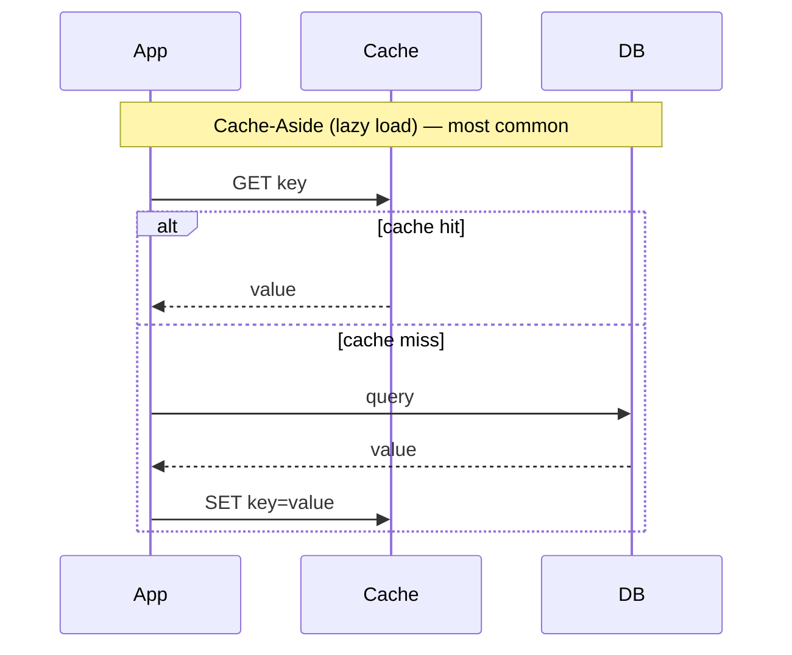

| Strategy | How it works |
|---|---|
| **Cache-Aside** | App checks cache first; on miss reads DB then fills cache |
| **Write-Through** | Write goes to cache, cache syncs to DB immediately |
| **Write-Behind** | Write goes to cache, DB updated async later (fast but riskier) |

**Eviction policies** — pick when cache is full:

| Policy | Evicts | Best for |
|---|---|---|
| LRU | Least Recently Used | General purpose (most common) |
| LFU | Least Frequently Used | Frequency-sensitive access |
| MRU | Most Recently Used | Scanning workloads |
| FIFO | Oldest inserted | Simple queues |
| LIFO | Newest inserted | Stack-like patterns |
| RR | Random | Unpredictable patterns |

Popular tools: Redis, Memcached, Varnish. Invalidate via TTL or event-based (on data change).

---

## 6️⃣ Communication Patterns

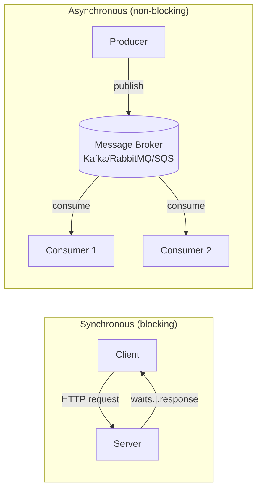

| | Synchronous | Asynchronous |
|---|---|---|
| Blocking | Yes | No |
| Coupling | Tight | Loose |
| Example | REST request/response | Queues, WebSockets, events |

Message patterns: **Point-to-Point** (1 consumer per message) vs **Pub/Sub** (many subscribers). Benefits: decoupling, scalability, fault tolerance, load leveling.

Protocol picks:

| Protocol | Use case | Style |
|---|---|---|
| HTTP | Request/response | Stateless |
| WebSocket | Real-time bidirectional | Persistent connection |
| gRPC | Service-to-service | Persistent, binary, fast |

---

## 7️⃣ Security

### 7.1 AuthN vs AuthZ

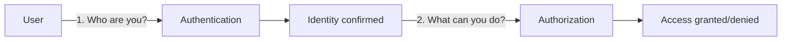

### 7.2 JWT flow

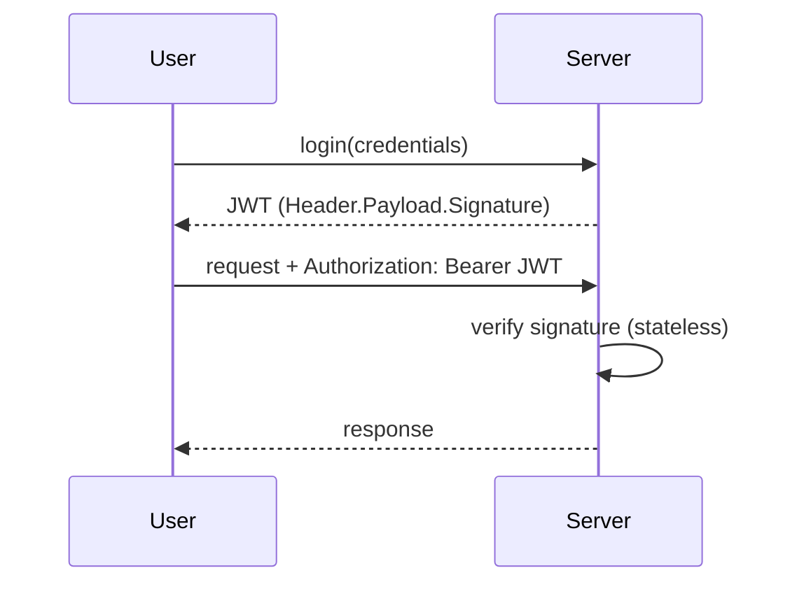

### 7.3 OAuth 2.0 flow ("Login with Google")

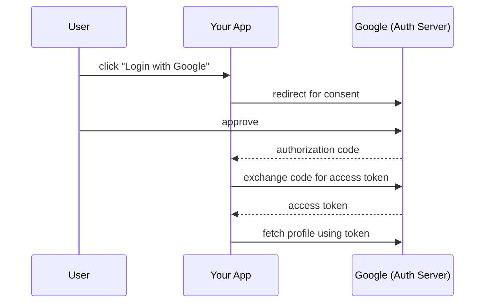

### 7.4 SSO flow

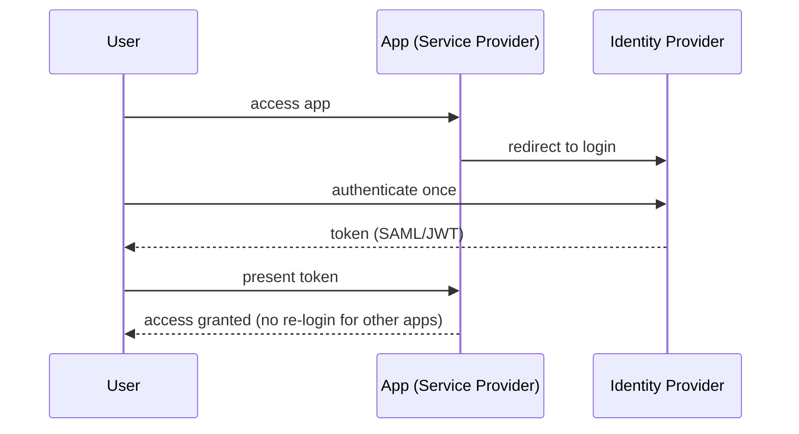

| | JWT | OAuth | SAML |
|---|---|---|---|
| What | Token format | Authorization framework | XML auth/authz standard |
| Used for | Stateless auth | 3rd-party limited access | Enterprise SSO |

### 7.5 Rate limiter algorithms

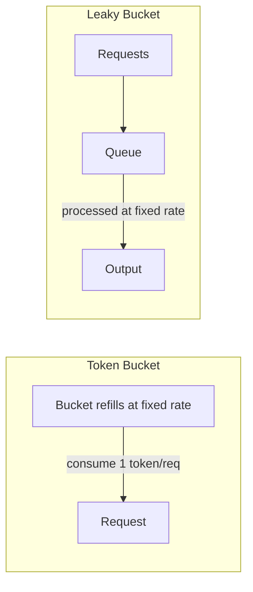

- **Token Bucket:** tokens added at fixed rate, request consumes a token, empty bucket = reject.
- **Leaky Bucket:** requests queue up, processed (leak out) at constant rate.
- **Fixed Window Counter:** count requests per time window, reject over threshold.

---

## 8️⃣ Design Patterns Cheat-Sheet (from `design pattern.md`)

### 8.0 SOLID + Friends (say these BEFORE naming a pattern — shows maturity)

```mermaid
graph LR
    S["S — Single Responsibility\none reason to change"] --> O["O — Open/Closed\nopen to extend, closed to modify"]
    O --> L["L — Liskov Substitution\nsubtypes must be swappable"]
    L --> I["I — Interface Segregation\nmany small interfaces > 1 fat one"]
    I --> D["D — Dependency Inversion\ndepend on abstractions"]
```

Plus: **DRY** (don't repeat yourself), **KISS** (keep it simple), **YAGNI** (you aren't gonna need it), **Law of Demeter** (talk only to immediate friends).

**Picking heuristic:** many `if/else` selecting behavior → Strategy · object-creation logic exploding → Factory/Builder · incompatible APIs → Adapter · need to bolt on cross-cutting feature (logging/cache) at runtime → Decorator/Proxy.

```mermaid
graph TD
    DP[Design Patterns] --> Cr[Creational]
    DP --> St[Structural]
    DP --> Be[Behavioral]
    Cr --> Cr1[Singleton, Factory, Abstract Factory, Builder, Prototype]
    St --> St1[Adapter, Bridge, Composite, Decorator, Facade, Flyweight, Proxy]
    Be --> Be1[Chain of Resp., Command, Iterator, Mediator, Memento, Observer, State, Strategy, Template, Visitor]
```

**Selection shortcuts (memorize the trigger word → pattern):**

| Symptom | Pattern |
|---|---|
| Too many constructors/flags | Factory / Builder |
| Many wrappers adding features | Decorator / Proxy |
| Need simplified API over complex subsystem | Facade |
| Incompatible interfaces | Adapter |
| Swap algorithms at runtime | Strategy |
| Steps with fixed skeleton + hooks | Template Method |
| Pipeline with early exit (middleware) | Chain of Responsibility |
| Reactive UI/events | Observer / Pub-Sub |
| One shared instance (config/logger) | Singleton |
| Undo/redo | Command / Memento |

**Anti-patterns to avoid:** God Object, Singleton abuse (hidden coupling), Primitive Obsession, Excessive Inheritance (prefer composition), Shotgun Surgery.

---

## 9️⃣ Case Studies (box diagrams — draw these fast on whiteboard)

### URL Shortener (TinyURL/bit.ly)

```mermaid
graph LR
    U1[User] -->|POST /shorten long_url| API[App Server]
    API -->|base62 encode| KV[(Key-Value Store\nRedis)]
    U2[User] -->|GET /abc123| API
    API -->|lookup| KV
    API -->|301 redirect| U2
```
Key idea: Base62 encoding (7 chars = 62^7 ≈ 3.5 trillion codes), KV store for O(1) lookups, cache hot URLs.

### Dropbox / Google Drive

```mermaid
graph TD
    Client -->|upload/sync| LB2{Load Balancer}
    LB2 --> API2[API Servers]
    API2 --> Meta[(Metadata DB\nfile info, versions)]
    API2 --> Block[Block Server\nchunk 4MB + dedupe]
    Block --> Obj[(Object Storage\nS3/Blob)]
    API2 -->|WebSocket notify| Client2[Other Devices]
```
Key ideas: chunking (only sync changed blocks), deduplication, delta sync, CDN for fast download.

### Twitter/Instagram feed (fan-out problem)

```mermaid
graph LR
    Post[User posts] --> FanOut{Fan-out}
    FanOut -->|push, normal users| F1[Follower 1 feed cache]
    FanOut -->|push| F2[Follower 2 feed cache]
    FanOut -.->|pull at read-time, celebrity users| F3[Celebrity's millions of followers]
```
Fan-out-on-write (push) for normal users; fan-out-on-read (pull) for celebrities to avoid write storms.

### Uber/Lyft — real-time matching

```mermaid
graph TD
    Driver[Driver app] -->|location ping every few sec| LocSvc[Location Service]
    LocSvc --> GeoIdx[(Geospatial Index\nQuadTree/Geohash)]
    Rider[Rider app] -->|request ride| Match[Matching Service]
    Match --> GeoIdx
    Match -->|assign nearest driver| Driver
```

### Netflix/YouTube — video delivery

```mermaid
graph LR
    Upload[Upload] --> Transcode[Transcoding Service\nmultiple resolutions]
    Transcode --> Store[(Object Storage)]
    Store --> CDN[CDN edge servers]
    CDN --> Viewer1[Viewer]
    CDN --> Viewer2[Viewer]
```

### Case study follow-up questions interviewers actually ask

| System | Follow-ups to be ready for |
|---|---|
| Netflix/YouTube | Video transcoding + CDN delivery? Recommendation engine? Handling massive storage? |
| Twitter/News Feed | Feed generation? Fan-out problem? "Celebrity" problem? Real-time delivery? |
| Uber/Lyft | Real-time rider-driver matching? Location updates at scale? Surge pricing? Reliability? |
| Google Docs/Dropbox | Real-time collaborative editing (OT/CRDT)? File sync across devices? Version history? |
| Web Crawler | Avoid re-crawling same page (URL frontier + Bloom filter)? Politeness (per-domain rate limit)? Parse/store pipeline? Scale to billions of pages? |

### Senior-level open-ended prompts (10+ yrs bar — practice the trade-off talk, not just the diagram)

- **Distributed key-value store (Redis/DynamoDB-style):** partitioning (consistent hashing) → replication → consistency model (strong vs eventual) → leader election & failure detection.
- **Distributed message queue (Kafka/RabbitMQ-style):** delivery guarantees (at-least-once vs exactly-once) → high throughput/low latency design → consumer groups & topic partitioning.
- **Cut infra cost by 30% on an existing system:** profile first → find bottlenecks → reserved instances → serverless where bursty → optimize DB (indexes, caching, right-sizing) → auto-scaling instead of over-provisioning.

---

## 🔟 Common Pitfalls (say what you'd avoid — this signals seniority)

```mermaid
graph TD
    P1["Jumping to tech before\nclarifying requirements"] --> Fix1["Start with requirements +\nback-of-envelope math"]
    P2["Ignoring non-functional\nrequirements"] --> Fix2["Always discuss scale,\nlatency, availability upfront"]
    P3["Over-engineering a\nsimple problem"] --> Fix3["Start simple, scale\nwhen data justifies it"]
    P4["Assuming network\nis reliable"] --> Fix4["Design for partitions,\napply CAP thinking"]
    P5["No monitoring plan"] --> Fix5["Logging/metrics/tracing\nas first-class design"]
    P6["Vendor lock-in"] --> Fix6["Abstraction layers,\nportable design"]
```

**Prevention checklist:** ask clarifying questions → think in trade-offs, not "best" answers → start with MVP then iterate → design for failure from day one → state assumptions out loud → back decisions with numbers (DAU, RPS, storage).

**C4 Model** (quick way to structure any architecture answer): `Context (system in the world) → Containers (high-level tech choices) → Components (pieces inside a container) → Code (classes, optional)`.

---

## 1️⃣1️⃣ Quick-Fire Flashcards (cover the answer, self-test)

1. **CAP theorem picks?** → Consistency, Availability, Partition tolerance — pick 2.
2. **LB vs API Gateway?** → LB spreads traffic; Gateway = smart entry (auth/routing/rate-limit).
3. **Sharding vs Replication?** → Sharding splits data (scale writes); Replication copies data (scale reads/availability).
4. **Cache-aside vs write-through?** → Cache-aside reads lazily on miss; write-through writes to cache+DB together.
5. **JWT stateless why?** → Signature self-validates, no server-side session lookup needed.
6. **Strong vs eventual consistency?** → Strong = sync + correctness; Eventual = async + speed.
7. **Fan-out problem?** → Celebrity with millions of followers makes push-on-write too expensive → pull-on-read instead.
8. **Why hard to scale RDBMS horizontally?** → ACID/2PC, cross-shard JOINs, FK constraints, auto-increment collisions.
9. **Forward vs reverse proxy?** → Forward hides the client; reverse hides the server.
10. **Token bucket vs leaky bucket?** → Token bucket allows bursts (has saved-up tokens); leaky bucket smooths to constant rate.

---

## 📋 RADIO Framework Recap (say this out loud in interview)

1. **R**equirements — functional + non-functional, back-of-envelope math (DAU, RPS, storage).
2. **A**rchitecture — draw boxes: client → LB → app servers → cache/DB/CDN.
3. **D**eep dive — pick 1-2 components interviewer cares about (e.g. matching service, feed generation).
4. **I**ssues — bottlenecks, SPOFs, failure modes.
5. **O**ptimize — scale it (sharding, caching, CDN, async).

**Interview questions by level:**
- Entry (L3-L4): URL shortener, chat system, web crawler, notification system.
- Mid (L5-L6): Instagram/Twitter, Uber/Lyft, Netflix/YouTube, search engine, distributed cache.
- Senior (L6+): News feed at scale, ad system, global CDN, distributed database.

---

*Keep the other files in this folder for deep-dive explanations and code snippets — this file is the fast-recall layer on top of them.*
