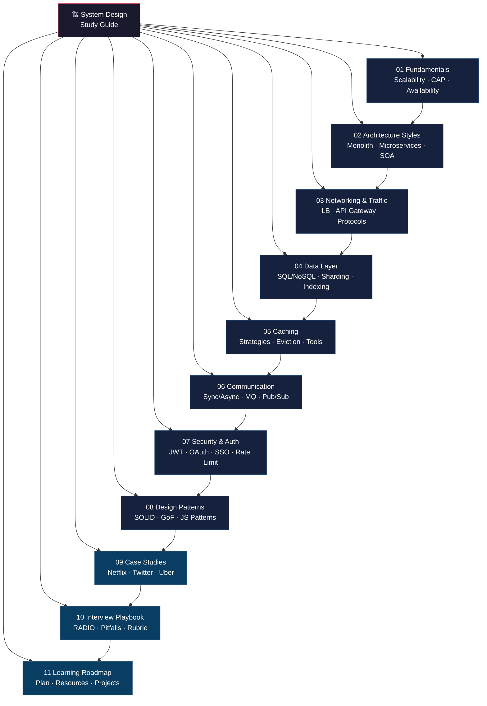

# 🏗️ System Design & Design Patterns — Interview Study Guide

> **Purpose:** A single-repo, last-minute navigation hub for system design and design pattern interview prep. Every topic you need — from fundamentals to real-world case studies — organized in 11 scannable files.

---

## 📍 Topic Map

---

## 📚 File Index

| #   | File                                                                         | Topic                                                                    | What You'll Learn                                        | Read Time |
| --- | ---------------------------------------------------------------------------- | ------------------------------------------------------------------------ | -------------------------------------------------------- | --------- |
| 01  | [01-fundamentals.md](./01-fundamentals.md)                                   | Scalability, Latency, Throughput, Availability, Consistency, CAP Theorem | Core building blocks every system design answer rests on | ~15 min   |
| 02  | [02-architecture-styles.md](./02-architecture-styles.md)                     | Monolith, Microservices, N-Tier, SOA                                     | When and why to pick each architecture style             | ~12 min   |
| 03  | [03-networking-and-traffic.md](./03-networking-and-traffic.md)               | Load Balancers, API Gateway, Proxies, Web Servers, Protocols             | How traffic moves from user to server and back           | ~14 min   |
| 04  | [04-data-layer.md](./04-data-layer.md)                                       | SQL/NoSQL, Sharding, Replication, Indexing, Denormalization              | Data storage decisions and trade-offs                    | ~16 min   |
| 05  | [05-caching.md](./05-caching.md)                                             | Strategies, Eviction Policies, Tools                                     | Speed up reads, reduce DB load                           | ~10 min   |
| 06  | [06-communication-patterns.md](./06-communication-patterns.md)               | Sync/Async, Message Queues, Pub/Sub                                      | How services talk to each other                          | ~10 min   |
| 07  | [07-security-and-auth.md](./07-security-and-auth.md)                         | AuthN/AuthZ, JWT, OAuth, SSO, Rate Limiting                              | Secure your system end-to-end                            | ~12 min   |
| 08  | [08-design-patterns.md](./08-design-patterns.md)                             | SOLID, GoF Patterns, JS Patterns, Anti-patterns                          | Code-level patterns that interviewers love               | ~18 min   |
| 09  | [09-case-studies.md](./09-case-studies.md)                                   | Netflix, Twitter, Uber, URL Shortener, etc.                              | Walk through real-world system designs                   | ~20 min   |
| 10  | [10-interview-playbook.md](./10-interview-playbook.md)                       | RADIO Framework, Pitfalls, Evaluation Rubric                             | How to structure your 45-min interview                   | ~8 min    |
| 11  | [11-learning-roadmap.md](./11-learning-roadmap.md)                           | Study Plan, Resources, Projects                                          | What to study, in what order, and how to practice        | ~6 min    |
| 12  | [12-must-know-interview-questions.md](./12-must-know-interview-questions.md) | 50 mandatory Q&A across all topics                                       | Test your recall — the questions you MUST answer clearly | ~25 min   |

---

## 🧭 How to Use This Guide

### The RADIO Framework (for every system design interview)

Use **RADIO** to structure your answer in any system design round:

| Step                               | What to Do                                                         | Time   |
| ---------------------------------- | ------------------------------------------------------------------ | ------ |
| **R** — Requirements               | Clarify functional & non-functional requirements. Ask questions.   | 5 min  |
| **A** — Architecture               | Draw a high-level block diagram (clients, services, DB, cache).    | 5 min  |
| **D** — Data Model                 | Define schemas, choose SQL vs NoSQL, plan access patterns.         | 5 min  |
| **I** — Interfaces (APIs)          | Define key API endpoints, contracts, and protocols.                | 5 min  |
| **O** — Optimizations & Trade-offs | Deep-dive: caching, sharding, CDN, rate limiting, fault tolerance. | 15 min |

> **Tip:** Interviewers evaluate your _thought process_, not a perfect answer. Narrate trade-offs as you go.

### Suggested Study Order

1. **Day 1–2:** Files 01–03 (Fundamentals → Architecture → Networking)
2. **Day 3–4:** Files 04–06 (Data → Caching → Communication)
3. **Day 5:** Files 07–08 (Security → Design Patterns)
4. **Day 6:** File 09 (Case Studies — practice RADIO on each)
5. **Day 7:** Files 10–11 (Playbook → Roadmap — mock interview yourself)

---

## ⚡ Quick-Fire Flashcards

Test yourself — click to reveal each answer.

<strong>1. What is the difference between vertical and horizontal scaling?</strong>

**Vertical** = add more power (CPU/RAM) to a single machine.
**Horizontal** = add more machines behind a load balancer.
Vertical has a hardware ceiling; horizontal scales virtually without limit.

<strong>2. What does the CAP theorem state?</strong>

A distributed system can guarantee at most **two** of three properties: **Consistency**, **Availability**, and **Partition Tolerance**. Since network partitions are inevitable, the real choice is between CP and AP.

<strong>3. When would you choose a message queue over a synchronous REST call?</strong>

When the downstream service is slow, unreliable, or the work can be deferred. Message queues decouple producers from consumers, provide retry/backpressure, and smooth out traffic spikes.

<strong>4. What is the difference between authentication and authorization?</strong>

**Authentication (AuthN):** "Who are you?" — verifying identity (login, JWT, biometrics).
**Authorization (AuthZ):** "What can you do?" — verifying permissions (roles, ACL, policies).

<strong>5. Name four cache eviction policies.</strong>

1. **LRU** — Least Recently Used
2. **LFU** — Least Frequently Used
3. **FIFO** — First In First Out
4. **TTL** — Time To Live (expiry-based)

<strong>6. What are the five SOLID principles?</strong>

- **S** — Single Responsibility
- **O** — Open/Closed
- **L** — Liskov Substitution
- **I** — Interface Segregation
- **D** — Dependency Inversion

<strong>7. What is the difference between SQL and NoSQL?</strong>

**SQL:** Structured, relational, ACID-compliant, fixed schema (PostgreSQL, MySQL).
**NoSQL:** Flexible schema, various models (document, key-value, graph, column), designed for horizontal scale (MongoDB, Cassandra, Redis).

<strong>8. What is a CDN and why is it useful?</strong>

A **Content Delivery Network** caches static assets at edge servers close to users, reducing latency and offloading traffic from origin servers. Example: CloudFront, Cloudflare.

<strong>9. Explain the Pub/Sub pattern in one sentence.</strong>

Publishers emit events to a topic without knowing who listens; subscribers independently consume events from topics they care about — full decoupling of producers and consumers.

<strong>10. What is database sharding?</strong>

Splitting a large database into smaller, independent partitions (**shards**), each holding a subset of data, distributed across multiple servers for horizontal scalability. A shard key determines which shard stores a given row.

---

> **Last updated:** 2026 · Built for quick revision, not a textbook. Keep iterating.
